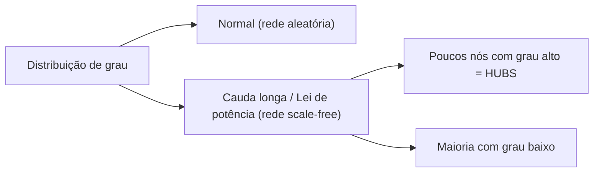
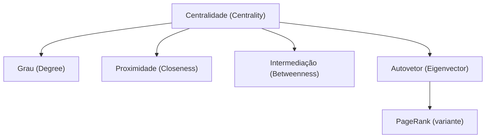
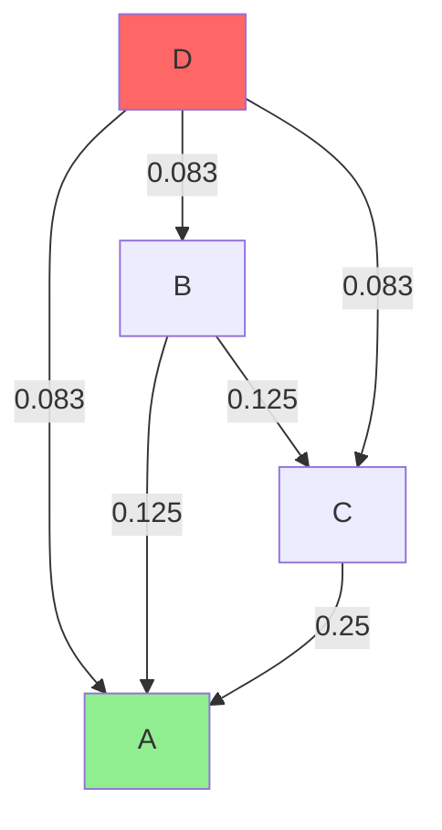
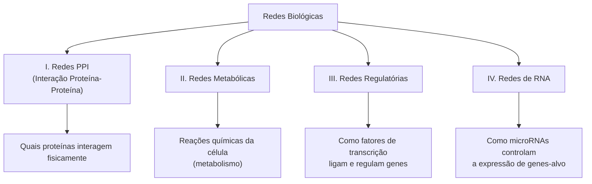
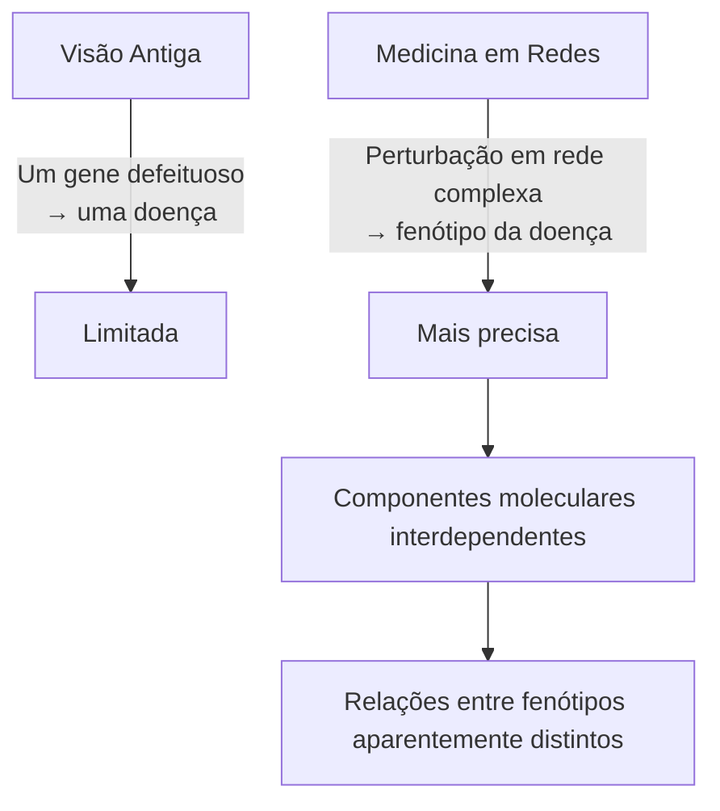
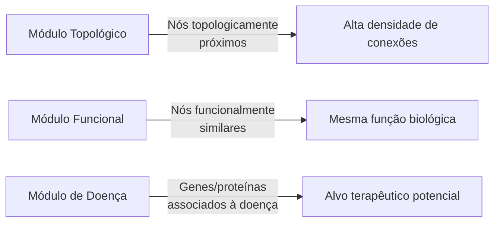
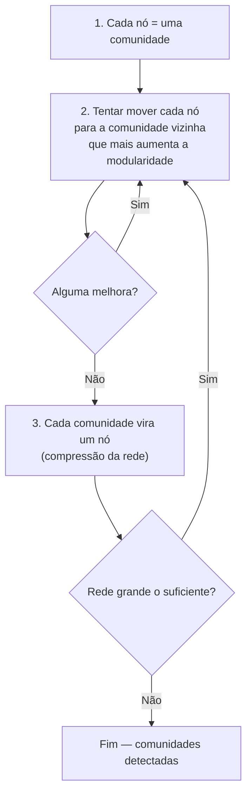
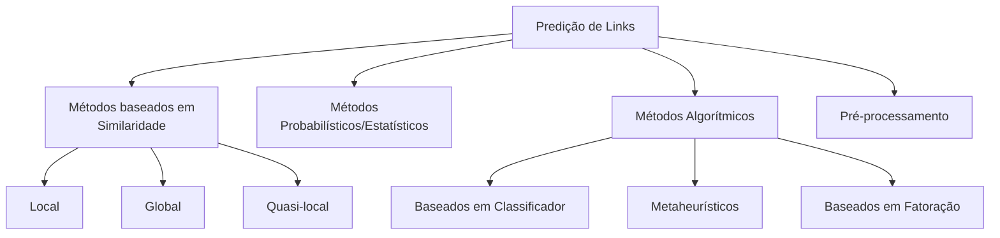

# Análise de Redes — Centralidade e Modularidade

[slides](slides.pdf)

Aula de André Santanchè (UNICAMP) — 6 de abril de 2026

> Esta aula aprofunda a análise quantitativa de redes complexas, com foco em métricas de centralidade, detecção de comunidades, medicina em redes e predição de links. Os fundamentos de redes complexas (scale-free, small-world, modelo BA) foram introduzidos na aula de [11/03](../2026-03-11%20-%20Complex%20Networks/README.md).

---

## Distribuição de Grau e Histograma

Antes de analisar a centralidade de cada nó individualmente, é útil olhar para a **distribuição de grau**[^GRAU] da rede como um todo — ou seja, quantos nós têm grau 1, quantos têm grau 2, etc. Isso pode ser visualizado como um histograma.

Nas redes **livre de escala** (scale-free), a distribuição de grau segue uma **lei de potência** com cauda longa:

- A maioria dos nós tem poucos links
- Um pequeno número de nós (os **hubs**[^HUB]) tem grau muito acima da média



---

## Métricas de Centralidade

**Centralidade**[^CENT] é o conjunto de métricas que medem o quão "importante" ou "central" é um nó na rede. Pense numa cidade: uma estação de metrô pela qual passam muitas linhas é mais "central" do que uma estação de ponta de linha.

A aula apresenta quatro tipos principais de centralidade:



### Centralidade de Grau (Degree Centrality)

A forma mais simples: quanto maior o número de conexões de um nó, maior sua centralidade de grau.

- **Analogia:** na sua lista de contatos no celular, a pessoa que mais conhece gente tem maior centralidade de grau.
- Um **hub** é um nó cujo grau ultrapassa muito a média da rede.

### Centralidade de Proximidade (Closeness Centrality)

Mede o quão próximo um nó está de todos os outros — considerando os **caminhos mínimos**[^CAMINHO] entre ele e cada outro nó.

```
C(v) = (N - 1) / Σ d(v, u)
```

- Um nó com closeness alta pode alcançar todos os outros com poucos passos intermediários.
- **Analogia:** numa empresa, a pessoa que consegue chegar rapidamente a qualquer colega (sem precisar passar por muitos intermediários) tem alta centralidade de proximidade.

### Centralidade de Intermediação (Betweenness Centrality)

Conta quantas vezes um nó aparece nos **caminhos mínimos** entre todos os outros pares de nós da rede.

```
B(v) = Σ (σ_st(v) / σ_st)
```

onde σ_st é o total de caminhos mínimos de s a t, e σ_st(v) é quantos desses caminhos passam por v.

- **Analogia:** uma ponte entre dois bairros. Se for bloqueada, os moradores de um lado ficam sem acesso ao outro. A ponte tem alta betweenness.
- Em redes biológicas, proteínas com alta betweenness muitas vezes controlam fluxo de sinais entre módulos.

### Centralidade de Autovetor (Eigenvector Centrality)

Vai além do grau simples: leva em conta a **importância dos vizinhos**. Estar conectado a nós importantes torna você mais importante.

- **Recursividade:** a importância de um nó depende da importância dos nós a que ele se conecta, que por sua vez dependem dos seus vizinhos... e assim por diante.
- **Analogia:** no mundo acadêmico, ser citado por um pesquisador muito famoso conta mais do que ser citado por alguém desconhecido.

### Comparação das Centralidades

| Métrica        | O que mede                                              | Analogia                             |
| -------------- | ------------------------------------------------------- | ------------------------------------ |
| Grau           | Quantas conexões diretas tem                            | Popularidade bruta                   |
| Closeness      | Quão perto está de todos os outros em média             | Eficiência de comunicação            |
| Betweenness    | Quantas vezes aparece no caminho entre outros pares     | Papel de "ponte" ou "intermediário"  |
| Eigenvector    | Importância ponderada pelos vizinhos importantes        | Influência por associação            |

---

## PageRank

**PageRank**[^PR] foi criado por Larry Page (co-fundador do Google) para rankear páginas da web. É uma variação da centralidade de autovetor com dois elementos extras:

1. **Normalização**: a "importância" transferida por um nó é dividida pelo número de seus links de saída
2. **Fator de amortecimento** (damping factor): modela a probabilidade de um "surfador aleatório" se cansar e pular para uma página qualquer em vez de seguir um link

> "d damping factor is the probability at each page the 'random surfer' will get bored and request another random page" (Brin & Page, 1998)

```
PR(A) = (1 - d) + d × Σ (PR(T_i) / C(T_i))
```

onde d ≈ 0.85, T_i são as páginas que apontam para A, e C(T_i) é o número de links de saída de T_i.

### Por que o damping factor importa?

Sem ele, se um nó não tem links de saída (como o nó D no exemplo dos slides), PR(D) = 0 e toda a importância dele "desaparece" da rede. O damping factor garante que todo nó tenha uma chance mínima de ser alcançado por um "salto aleatório".

### Exemplo Simplificado (A, B, C, D)

No exemplo dos slides, 4 nós com PageRanks iniciais iguais (0,25 cada). Após uma iteração:

- **A = 0,458** — recebe muitos links, torna-se o nó mais importante
- **C = 0,208** — recebe alguns links
- **B = 0,083** — recebe pouco
- **D = 0,0** — sem links de entrada diretos, PageRank cai a zero



---

## Tipos de Redes Biológicas

A aula apresenta quatro tipos principais de redes usadas em biologia (Barabási et al., 2011):



### I. Redes PPI (Interação Proteína-Proteína)[^PPI]

- **O que são**: mapas de quais proteínas[^PROT] se encaixam e trabalham juntas fisicamente.
- **Como são medidas**: técnicas como Yeast Two-Hybrid (Y2H) e espectrometria de massa (IP/MS).
- **Bancos de dados**: STRING, BioGRID, IntAct, MINT, BIND, DIP, HPRD.
- **Exemplo**: a rede PPI de levedura (fungo usado em pesquisa) tem 1.870 proteínas e 2.240 interações físicas (Jeong et al., 2001). Sua distribuição de grau segue lei de potência — é uma rede **livre de escala**.

### II. Redes Metabólicas

- **O que são**: redes de reações químicas que a célula realiza para obter energia e fabricar moléculas.
- **Analogia**: o diagrama de processos de uma fábrica — cada reação transforma um composto em outro.
- **Banco de dados**: KEGG, BIGG.

### III. Redes Regulatórias

- **O que são**: mapeiam como **fatores de transcrição**[^FT] (proteínas "interruptores") ligam e desligam genes.
- **Exemplo**: o fator de transcrição TF1 ativa o gene TG1. Se TF1 for inibido, TG1 não é expresso.

### IV. Redes de RNA

- **O que são**: redes de microRNAs[^MIRNA] que regulam a expressão de genes-alvo.
- **MicroRNAs** são pequenas moléculas de RNA que se ligam ao RNA mensageiro de um gene e impedem sua tradução em proteína.
- **Bancos de dados**: TargetScan, PicTar, miRBase, miRDB.

---

## Medicina em Redes (Network Medicine)

> "A disease phenotype is rarely a consequence of an abnormality in a single effector gene product, but reflects various pathobiological processes that interact in a complex network." (Barabási et al., 2011)

A **Medicina em Redes**[^MED] é um paradigma que abandona a visão de "uma doença, um gene" e trata doenças como **perturbações em redes moleculares complexas**.



### Genes de Doença vs. Genes Essenciais

O genoma humano tem ~25.000 genes[^GENE]. Desses:
- ~1.665 são **essenciais** (sem eles a célula morre)
- ~1.777 são **genes de doença** (quando mutados, causam doença)
- ~398 são ambos (essenciais E de doença)

Importante: a maioria dos genes de doença **não** é essencial — isso significa que a doença não mata a célula imediatamente, mas perturba o funcionamento da rede.

### Proteínas Hub e Genes Essenciais

**Hub proteins**[^HUBPROT] tendem a ser codificadas por genes essenciais. Evidências (Barabási et al., 2011):

- "Genes encoding hubs are older and evolve more slowly than genes encoding non-hub proteins"
- "The deletion of genes encoding hubs leads to a larger number of phenotypic outcomes"

**Analogia**: remover uma estação central de metrô (hub) afeta muito mais passageiros do que fechar uma estação periférica. Da mesma forma, inativar uma proteína hub perturba muitos processos biológicos ao mesmo tempo.

### Genes de Doença e Topologia

**Pergunta central**: genes de doença estão espalhados aleatoriamente pela rede, ou tendem a ocupar posições topológicas específicas?

A resposta é não-aleatória: genes de doença tendem a se agrupar em **módulos de doença** — regiões densamente conectadas da rede que correspondem a processos biológicos relacionados.

### Três Tipos de Módulos



---

## Detecção de Comunidades e Modularidade

**Comunidades** (ou **módulos**) são grupos de nós mais densamente conectados entre si do que com o resto da rede. Pense em turmas numa escola: dentro de uma turma os alunos se conhecem melhor do que com os de outras turmas.

### Modularidade (Modularity)

**Modularidade**[^MOD] é uma métrica que quantifica quão bem uma rede se divide em comunidades:

> "If the number of edges between groups is significantly less than we expect by chance, or equivalent if the number within groups is significantly more, then it is reasonable to conclude that something interesting is going on." (Newman, 2006)

- **Alta modularidade**: muitas conexões dentro dos grupos, poucas entre eles → estrutura de comunidades evidente
- **Baixa modularidade**: conexões distribuídas uniformemente → sem estrutura de comunidades clara

Não existe um único método ótimo para calcular modularidade em redes grandes. Opções:
- **Alta precisão**: método espectral de Newman
- **Alta velocidade**: algoritmos gulosos (greedy)

### Algoritmo de Louvain

O algoritmo de Louvain (Blondel et al., 2008) é um dos mais usados para detecção de comunidades em redes grandes. É iterativo:



---

## Motivos de Rede (Network Motifs)

**Motivos de rede**[^MOTIF] são subgrafos (pequenos padrões de conexão) que aparecem com frequência significativamente maior do que seria esperado em uma rede aleatória com as mesmas propriedades.

**Analogia**: no código-fonte de programas, certos padrões de design ("design patterns") aparecem repetidamente porque resolvem problemas comuns. Motivos de rede são os "design patterns" das redes biológicas.

Exemplos de motivos em redes biológicas:
- **Feed-forward loop**: A ativa B, A ativa C, B ativa C (garante resposta rápida e filtro de ruído)
- **Three-vertex feedback loop**: circuito de retroalimentação entre 3 nós (controle e oscilação)
- **Bi-fan**: dois reguladores controlam os mesmos dois alvos

---

## Distância Média e Vulnerabilidade

### Distância Média e Eficiência Global

A distância média entre todos os nós é:

```
ℓ = 1 / [N(N-1)] × Σ d_ij
```

A **eficiência global** da rede é inversamente proporcional às distâncias:

```
E = 1 / [N(N-1)] × Σ (1/d_ij)
```

### Vulnerabilidade

**Vulnerabilidade** de um nó v é o impacto na eficiência global quando esse nó é removido. Um nó com alta vulnerabilidade é crítico para manter a rede funcional — sua remoção aumenta muito as distâncias médias.

---

## Predição de Links (Link Prediction)

**Predição de links**[^LP] responde à pergunta: dada a estrutura atual da rede, qual será a próxima conexão mais provável?

Contexto biológico: a maioria das interações moleculares nas células humanas ainda é desconhecida. Predição de links pode sugerir interações proteína-proteína que ainda não foram medidas experimentalmente.



### Hipótese de Base: Homofilia

> "Similarity begets friendship" — similaridade gera conexão. Quanto mais dois nós se parecem, maior a probabilidade de estarem conectados.

### Métodos de Similaridade Local

Analisam apenas a vizinhança imediata dos nós. Mais rápidos, mas menos precisos.

**1. Vizinhos Comuns (Common Neighbors)**

```
s(x, y) = |Γ_x ∩ Γ_y|
```

Conta quantos vizinhos x e y têm em comum. Se dois zumbis têm muitos amigos em comum, provavelmente vão se encontrar em breve.

**2. Índice de Jaccard**

```
s(x, y) = |Γ_x ∩ Γ_y| / |Γ_x ∪ Γ_y|
```

Normaliza os vizinhos comuns pelo total de vizinhos dos dois nós (evita favorecer nós com grau muito alto).

**3. Índice de Preferential Attachment**

```
s(x, y) = |Γ_x| × |Γ_y|
```

Baseado no modelo de Barabási-Albert: nós com mais conexões têm maior probabilidade de ganhar ainda mais conexões ("os ricos ficam mais ricos").

### Método de Similaridade Global

**Índice Katz (KI)**

```
s(x, y) = Σ β^l × |paths^l_{x,y}|
```

Soma todos os caminhos entre x e y, ponderados exponencialmente pelo comprimento (β é um fator de amortecimento, 0 < β < 1). Caminhos longos contribuem menos.

### Aplicação em Biologia: Drug Repositioning

A predição de links pode ser usada para identificar **novos alvos terapêuticos** para medicamentos já existentes (drug repositioning/repurposing). Ao modelar uma rede bipartida de drogas e alvos proteicos, é possível prever novas interações droga-proteína que não foram testadas experimentalmente (Cheng et al., 2012).

---

## Redes Tróficas (Food Webs)

**Redes tróficas**[^TROFICO] modelam as relações predador-presa em um ecossistema. Cada nó é uma espécie; cada aresta direcionada indica "quem come quem".

- **Hub numa teia alimentar**: espécies com muitas conexões (predadores ou presas de muitas espécies) são cruciais para a estabilidade do ecossistema.
- **Modelos tróficos**: representam diferentes padrões de interação (competição, predação, mutualismo) como motivos de rede.

---

## Referências Principais

- Barabási, A.-L., Gulbahce, N., & Loscalzo, J. (2011). **Network medicine: a network-based approach to human disease**. _Nature Reviews Genetics_, 12(1), 56–68.
- Blondel, V. D. et al. (2008). **Fast unfolding of communities in large networks**. _Journal of Statistical Mechanics_, 2008(10).
- Newman, M. E. J. (2006). **Modularity and community structure in networks**. _PNAS_, 103(23), 8577–8582.
- Jeong, H. et al. (2001). **Lethality and centrality in protein networks**. _Nature_, 411, 41–42.
- Martínez, V., Berzal, F., & Cubero, J. C. (2016). **A survey of link prediction in complex networks**. _ACM Computing Surveys_, 49(4), 1–33.
- Linyuan, L. L., & Zhou, T. (2011). **Link prediction in complex networks: A survey**. _Physica A_, 390(6), 1150–1170.
- Cheng, F. et al. (2012). **Prediction of Drug-Target Interactions and Drug Repositioning via Network-Based Inference**. _PLoS Computational Biology_, 8(5), e1002503.
- Brin, S., & Page, L. (1998). **The anatomy of a large-scale hypertextual web search engine**. _Computer Networks_, 30(1-7), 107–117.

---

[^GRAU]: **Grau** de um nó: número de conexões (arestas) que ele possui com outros nós.
[^HUB]: **Hub**: nó cuja quantidade de conexões ultrapassa muito a média da rede. Como uma estação central de metrô ou um aeroporto de grande escala.
[^CENT]: **Centralidade**: família de métricas que quantificam a "importância" de um nó na rede. Cada métrica captura um aspecto diferente do que significa ser central.
[^CAMINHO]: **Caminho mínimo** (geodesic path): o caminho mais curto entre dois nós, contando o menor número possível de arestas a percorrer.
[^PR]: **PageRank**: algoritmo criado por Larry Page e Sergey Brin (1998) para classificar páginas da web por importância. Hoje usado em muitos outros domínios além de buscas.
[^PPI]: **PPI** (Protein-Protein Interaction): rede que mapeia quais proteínas se ligam fisicamente umas às outras para realizar funções biológicas.
[^PROT]: **Proteína**: molécula fabricada a partir da informação de um gene. Executa a maior parte dos trabalhos dentro das células — como catalisar reações, transmitir sinais ou construir estruturas.
[^FT]: **Fator de transcrição**: proteína que se liga ao DNA e controla se um gene será "lido" ou não pela célula. É como um interruptor molecular.
[^MIRNA]: **MicroRNA** (miRNA): pequena molécula de RNA (não codifica proteína) que regula a expressão de outros genes, normalmente inibindo a tradução do RNA mensageiro alvo.
[^MED]: **Medicina em Redes** (Network Medicine): abordagem que usa modelos de rede para entender como doenças surgem de perturbações em sistemas moleculares complexos, em vez de focar em genes ou proteínas individuais.
[^GENE]: **Gene**: trecho de DNA que contém a "receita" para fabricar uma proteína (ou um RNA funcional). O genoma humano tem ~25.000 genes que codificam proteínas.
[^HUBPROT]: **Hub protein**: proteína que interage com muitas outras proteínas na rede PPI. Tende a ser codificada por um gene essencial e a evoluir mais lentamente que proteínas periféricas.
[^MOD]: **Modularidade**: métrica que quantifica o grau em que uma rede pode ser dividida em grupos (módulos/comunidades) com mais conexões internas do que externas.
[^MOTIF]: **Motivo de rede** (network motif): padrão de subgrafo que aparece significativamente mais vezes em uma rede real do que seria esperado ao acaso em redes aleatórias com as mesmas características.
[^LP]: **Predição de links** (Link Prediction): tarefa de inferir quais arestas ainda não existentes na rede provavelmente existirão (ou são verdadeiras mas não foram observadas).
[^TROFICO]: **Rede trófica** (food web): grafo que representa as relações alimentares (quem come quem) em um ecossistema. Cada nó é uma espécie; cada aresta indica fluxo de energia/matéria.
