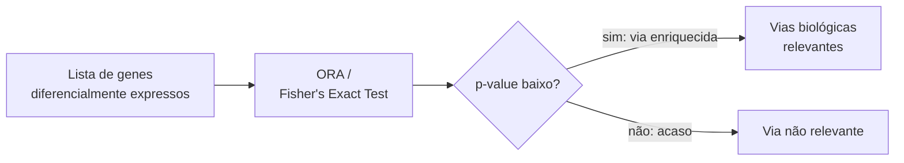
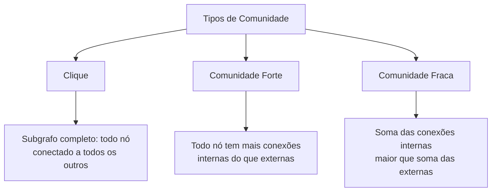
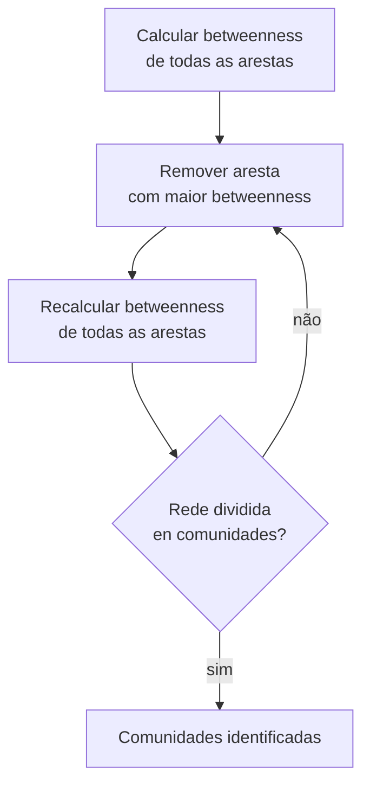
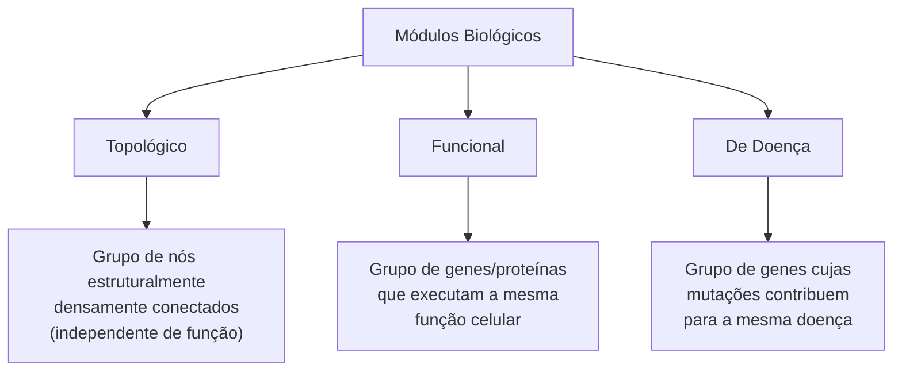
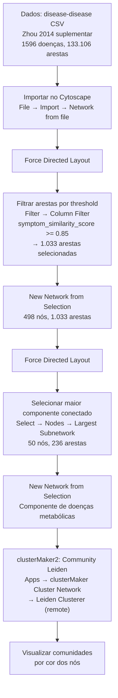

# Enriquecimento Funcional e Comunidades em Redes

[slides: Enrichment e Câncer de Mama](slides-enrichment.pdf) | [slides: Comunidades e Módulos](slides-communities.pdf)

Aula de André Santanchè (UNICAMP) — 8 de abril de 2026

---

## Parte 1 — Enriquecimento Funcional

### O que é Enriquecimento?

Imagine que você terminou uma análise de expressão gênica[^EXPRESSAO] e obteve uma lista de 100 genes[^GENE] que estão mais ativos num tumor. A pergunta seguinte é: **o que esses genes têm em comum?** Será que estão todos envolvidos no mesmo processo biológico? Participam da mesma via metabólica[^VIA]?

A **análise de enriquecimento** (ou *Over-Representation Analysis* — ORA[^ORA]) responde exatamente isso: ela verifica se alguma via biológica conhecida aparece na sua lista mais do que seria esperado por acaso.

### Teste de Fisher (Fisher's Exact Test)

A análise de enriquecimento usa um teste estatístico chamado **Teste Exato de Fisher**[^FET] para calcular a probabilidade de o resultado ser coincidência.

Exemplo concreto dos slides:

| | Total |
|---|---|
| Genes no genoma humano | ~20.000 |
| Genes em determinada via metabólica | 200 (= 1% do genoma) |
| Genes na sua lista analisada | 100 |
| Genes da via encontrados na lista | **10** |

Se a via representa 1% dos genes, em uma lista de 100 genes escolhidos ao acaso, você esperaria encontrar ~1 gene da via. Mas você encontrou 10 — **10 vezes o esperado**. O Teste de Fisher calcula a probabilidade de isso acontecer por acaso: se for muito baixa (p < 0.05), a via está **enriquecida** na sua lista.



### DAVID — Ferramenta de Anotação Funcional

O **DAVID**[^DAVID] (Database for Annotation, Visualization and Integrated Discovery) é uma ferramenta gratuita do NIH[^NIH] que automatiza a análise de enriquecimento para listas de genes humanos.

**Fluxo de uso:**

1. Acessar `davidbioinformatics.nih.gov`
2. Carregar a lista de genes (IDs Entrez[^ENTREZ])
3. Selecionar espécie: *Homo sapiens*
4. Clicar em **Functional Annotation Chart**

**Bancos de dados consultados pelo DAVID:**

| Banco | Cobertura | O que representa |
|---|---|---|
| KEGG[^KEGG] | ~51% dos genes | Vias metabólicas e de sinalização |
| Reactome[^REACTOME] | ~67% dos genes | Vias detalhadas com diagrama interativo |
| WikiPathways | ~60% dos genes | Vias anotadas colaborativamente |

**Exemplo de saída** (câncer de mama, genes do STRING[^STRING]):
- Estrogen signaling pathway (12 genes, p=0.046)
- TGF-beta signaling pathway
- PPAR signaling pathway
- Matrix extracelular organization (Reactome)
- Collagen formation (Reactome)

### Reactome

O **Reactome** (`reactome.org`) é um banco de dados de vias biológicas que fornece diagramas interativos mostrando como as moléculas interagem. Funciona como um "mapa de metrô" das reações moleculares dentro da célula, com cada estação sendo uma molécula e cada linha sendo uma reação.

---

## Parte 2 — Comunidades e Módulos em Redes

### O que é uma Comunidade?

Não existe uma definição única aceita por todos. A ideia intuitiva é: um **grupo de nós mais densamente conectados entre si do que com o resto da rede** — como bairros de uma cidade onde as pessoas de um bairro se conhecem mais do que conhecem pessoas de outro bairro.

Três hipóteses que caracterizam comunidades (Barabási, 2016):

1. **A estrutura está codificada na fiação**: a existência de comunidades é consequência direta de como os nós se conectam
2. **Subgrafo localmente denso**: uma comunidade é uma parte da rede onde as conexões internas são muito mais densas do que as externas
3. **Redes aleatórias não têm comunidades**: se você aleatorizar as conexões, as comunidades desaparecem — isso prova que elas são resultado de organização real

### Tipos de Comunidade



| Tipo | Definição | Analogia |
|---|---|---|
| **Clique** | Subgrafo completo — todos conectados a todos | Mesa de amigos onde todos se conhecem diretamente |
| **Comunidade Forte** | Cada membro tem mais vizinhos dentro do grupo do que fora | Equipe de trabalho onde todos interagem mais entre si |
| **Comunidade Fraca** | O grupo todo tem mais conexões internas somadas do que externas somadas | Bairro onde a soma das relações internas supera as externas |

### Modularidade

A **modularidade**[^MODULARIDADE] é a métrica que avalia a qualidade de uma divisão em comunidades. É o número que responde: "essa divisão em grupos é boa ou ruim?"

> "Modularity is, in short, the fraction of the edges that fall within the given groups minus the expected fraction if edges were distributed at random."
> — Newman, 2006

Em outras palavras: uma modularidade alta significa que há muito mais conexões dentro dos grupos do que você esperaria por acaso.

**Distinção importante:**

| Conceito | O que é | Pergunta que responde |
|---|---|---|
| **Comunidade** | Entidade estrutural — um grupo de nós | "Quais nós pertencem juntos?" |
| **Modularidade** | Métrica matemática — uma pontuação | "Essa divisão em grupos é boa?" |

**Métodos para maximizar modularidade:**

- **Espectral** (Newman, 2006): usa álgebra linear (decomposição espectral da matriz de adjacência). Alta precisão, mas computacionalmente caro.
- **Guloso/Greedy**: iterativamente une pares de comunidades que mais aumentam a modularidade. Mais rápido para redes grandes.

### Algoritmo Edge Betweenness Community (Girvan & Newman, 2002)

Este algoritmo detecta comunidades pelo caminho oposto: em vez de encontrar onde os laços são fortes, ele **remove as pontes** entre comunidades.

A ideia central: arestas que conectam comunidades distintas são "pontes" — passam por elas muitos caminhos mais curtos. Se você medir a **centralidade de intermediação**[^BETWEENNESS] de cada aresta e remover as que têm valor mais alto, a rede se divide em comunidades naturalmente.



**Quatro passos do algoritmo:**
1. Calcular a centralidade de intermediação de todas as arestas
2. Remover a aresta com maior betweenness
3. Recalcular betweenness para as arestas restantes
4. Repetir até a rede se fragmentar em componentes

### Louvain

O algoritmo de **Louvain** (Blondel et al., 2008) é o método mais utilizado na prática. Funciona em duas fases iterativas:

**Fase 1 — Otimização local:** cada nó verifica se ele "melhora de módulo". Para cada vizinho, calcula o ganho de modularidade se o nó se mover para a comunidade do vizinho. Se houver ganho, o nó muda.

**Fase 2 — Agregação:** cada comunidade é colapsada num único nó, criando uma rede menor. Repete a fase 1 nessa rede menor.

O processo continua até não haver mais ganho de modularidade.

### Community Leiden (CPM e Modularity)

O **Leiden** é uma evolução do Louvain, disponível no Cytoscape via `clusterMaker2`. Suporta duas funções objetivo:

- **CPM** (Constant Potts Model): busca comunidades com base em densidade interna — controla a granularidade pelo parâmetro de resolução
- **Modularity**: maximiza a modularidade clássica de Newman

---

## Parte 3 — Módulos em Saúde

### Tipos de Módulos Biológicos (Barabási, 2011)

Em redes biológicas, identificamos três tipos de módulos (Barabási, Gulbahce & Loscalzo, 2011):



> "Cellular functions, such as signal transmission, are carried out by **modules** made up of many species of interacting molecules."
> — Hartwell et al., 1999

---

## Parte 4 — Estudos de Caso

### Câncer de Mama: Dois Estudos Complementares

A aula apresentou dois artigos fundamentais que usam PPI[^PPI] + expressão gênica para estudar câncer de mama, com abordagens distintas:

| Aspecto | Chuang et al. (2007) | Taylor et al. (2009) |
|---|---|---|
| **Nós** | Proteínas (da rede PPI) | Proteínas (da rede PPI) |
| **Atributo dos nós** | Valores de expressão de RNA | Valores de expressão de RNA |
| **Significado das arestas** | Interação física (estática) | Interação física + correlação de co-expressão |
| **Foco da análise** | Atividade de sub-redes (média da expressão diferencial) | Mudanças de modularidade (rewiring das arestas) |
| **Uso da expressão diferencial** | Calcular score de atividade das sub-redes | Avaliar padrões de correlação nas arestas |
| **Saída** | Assinaturas de sub-redes prevendo metástase | Métricas de modularidade prevendo desfecho |

**Chuang et al. (2007) — Lógica:**
- Combina PPI com perfis de expressão gênica
- Para cada sub-rede M_k, calcula um score de atividade (a_kj = soma da expressão normalizada / √n)
- Usa Mutual Information ou t-score como potencial discriminativo S(M_k)
- Resultado: sub-redes diferencialmente expressas que distinguem metástase de não-metástase

**Taylor et al. (2009) — Lógica:**
- Olha para *como as correlações entre proteínas mudam* entre bom e mau prognóstico
- Pacientes com bom prognóstico: BRCA2 e MRE11 têm alta correlação (arestas fortes)
- Pacientes com mau prognóstico: essas mesmas correlações somem ou se invertem
- Descoberta: a **perda de modularidade** (rewiring) é mais preditiva do que a expressão individual dos genes

### Rede Sintoma-Doença Humana

#### Diseasome (Goh et al., 2007)

O **Diseasome** é um mapa de quais doenças compartilham genes. Foi construído de duas formas complementares:

```
HDN (Human Disease Network): doenças conectadas por genes em comum
DGN (Disease Gene Network):  genes conectados pelas doenças que causam
```

**Estrutura do Diseasome:**
- **Fenoma das doenças** (esquerda): nós = doenças, arestas = genes compartilhados
- **Genoma das doenças** (direita): nós = genes, arestas = doenças compartilhadas

Descoberta principal: doenças da mesma categoria (câncer, metabólica, neurológica) tendem a se agrupar em módulos — confirmando que a medicina em redes captura biologia real.

#### Rede Sintoma-Doença (Zhou et al., 2014)

Expansão do Diseasome: em vez de apenas genes, conecta doenças por **sintomas compartilhados** (extraídos de co-ocorrências bibliográficas).

Pipeline prático da aula (Threshold and Module Discovery Study):



**Resultado:** o maior componente conectado com threshold ≥ 0.85 revelou um **módulo de doenças metabólicas**: Diabetes Mellitus Tipo 1 e 2, Hipertensão, Hiperlipidemia, Gota, Síndrome Metabólica, Hipertrofia Ventricular Esquerda — todas conectadas por sintomas compartilhados.

---

## Parte 5 — Ferramentas Práticas no Cytoscape

### CytoNCA — Calculando Centralidade

Plugin `apps.cytoscape.org/apps/CytoNCA`. Calcula múltiplas métricas de centralidade para redes pesadas e não pesadas:

```
Apps → CytoNCA
```

Resultados aparecem nas colunas da tabela de nós. Permite identificar hubs[^HUB] com base em grau, betweenness, closeness e centralidade de autovetor.

### Network Randomizer — Criando Rede Aleatória de Comparação

Plugin `apps.cytoscape.org/apps/networkrandomizer`. Cria versões aleatorizadas da rede atual para comparação.

```
Apps → Network Randomizer
```

Dois modos:
- **Simple Randomization**: embaralha as conexões mantendo (ou não) a distribuição de grau
- **Parametric Randomization**: Erdos-Renyi G(n,p), G(n,M) ou Watts-Strogatz

**Por que randomizar?** Para confirmar que a rede real tem propriedades não-triviais. O histograma de grau da rede randomizada mostra curva em sino (distribuição normal/binomial), enquanto a rede PPI real mostra cauda longa (lei de potência). Isso confirma que a rede real é **scale-free**[^SCALEFREE] e não aleatória.

**Exemplo da aula (Luminal-A breast cancer, STRING):**

| | Rede PPI real | Rede aleatorizada |
|---|---|---|
| Nós | 610 | 610 |
| Arestas | 3.632 | 3.632 |
| Clustering coefficient | **0,310** | 0,019 |
| Characteristic path length | 3,260 | 2,846 |
| Heterogeneidade | **1,143** | 0,285 |
| Histograma de grau | Lei de potência ↘ | Curva em sino ∧ |

A rede real tem clustering coefficient muito maior (indica comunidades) e maior heterogeneidade (indica hubs) — assinatura de rede scale-free e small-world.

### clusterMaker2 — Encontrando Módulos

Plugin `apps.cytoscape.org/apps/clusterMaker2`. Multi-algoritmo de clustering para Cytoscape.

```
Apps → clusterMaker2 Cluster Network → Leiden Clusterer (remote)
```

Configurações para Leiden:
- **Objective function**: CPM (controla densidade) ou Modularity (maximiza modularidade)
- **Resolution parameter**: granularidade das comunidades (valores maiores = mais comunidades)
- **Beta value / Iterations**: parâmetros de refinamento

Após rodar, colorir os nós pelo cluster detectado:
```
Style → Fill Color → Column: LeidenCluster → Continuous Mapping
```

---

## Exercício

O arquivo de exercício está em [`exercicios/`](exercicios/). O exercício prático usa dados da Rede Sintoma-Doença Humana (Zhou et al., 2014) disponíveis no repositório do professor em `github.com/datasci4health/datasci4health.github.io/tree/master/networks/symptom-disease/cluster-module-selected`.

---

[^EXPRESSAO]: **Expressão gênica**: o nível de atividade de um gene — o quanto ele está sendo "lido" e transformado em proteína num dado momento. Um gene muito expresso está muito ativo.
[^GENE]: **Gene**: trecho do DNA que contém a receita para fabricar uma proteína específica. O genoma humano tem ~20.000 genes.
[^VIA]: **Via metabólica (ou via de sinalização)**: sequência coordenada de reações químicas ou sinais dentro da célula. Como uma linha de montagem — cada proteína faz um passo e passa o produto para a próxima.
[^ORA]: **ORA** — *Over-Representation Analysis*, análise de sobre-representação. Testa se genes de uma via aparecem na lista mais do que o esperado por acaso.
[^FET]: **Teste Exato de Fisher**: teste estatístico que calcula a probabilidade de uma sobreposição entre dois conjuntos ser aleatória. Usado extensivamente em bioinformática para enriquecimento.
[^DAVID]: **DAVID** — *Database for Annotation, Visualization and Integrated Discovery*. Ferramenta gratuita do NIH para anotação funcional de listas de genes. Acesso: davidbioinformatics.nih.gov
[^NIH]: **NIH** — *National Institutes of Health*, principal agência de pesquisa biomédica dos EUA.
[^ENTREZ]: **Entrez ID**: identificador numérico único de cada gene no banco de dados do NCBI. Ex.: o gene TP53 tem Entrez ID 7157.
[^KEGG]: **KEGG** — *Kyoto Encyclopedia of Genes and Genomes*. Banco de dados de vias metabólicas e de sinalização. Acesso: genome.jp/kegg
[^REACTOME]: **Reactome**: banco de dados de vias biológicas com diagramas interativos. Acesso: reactome.org
[^STRING]: **STRING**: banco de dados de interações proteína-proteína, incluindo interações físicas, funcionais e preditas. Acesso: string-db.org
[^MODULARIDADE]: **Modularidade**: métrica que mede o quanto uma divisão em grupos é melhor do que uma divisão aleatória. Varia de -1 a 1; valores acima de 0,3 indicam estrutura de comunidade significativa.
[^BETWEENNESS]: **Centralidade de intermediação (betweenness centrality)**: proporção de caminhos mais curtos entre pares de nós que passam por um dado nó ou aresta. Alta betweenness = nó/aresta é "ponte" crítica na rede.
[^PPI]: **PPI** — *Protein-Protein Interaction*, interação proteína-proteína. Mapa de quais proteínas trabalham juntas ou se encaixam fisicamente dentro da célula.
[^HUB]: **Hub**: nó com número de conexões muito superior à média da rede. Em redes biológicas, hubs são proteínas ou genes centrais para muitas funções — sua remoção frequentemente é letal.
[^SCALEFREE]: **Scale-free (livre de escala)**: tipo de rede cuja distribuição de grau segue uma lei de potência P(k) ~ k^(-γ). Caracterizada por poucos hubs com muitas conexões e muitos nós com poucas conexões.
