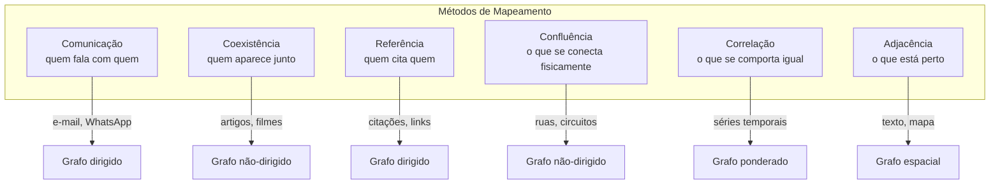
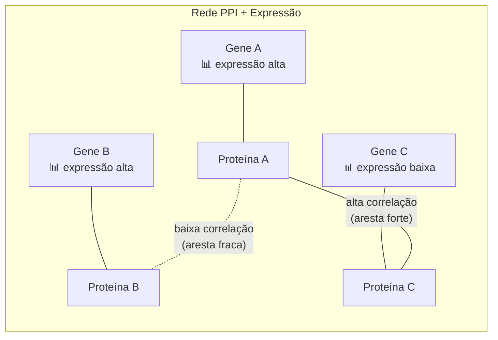
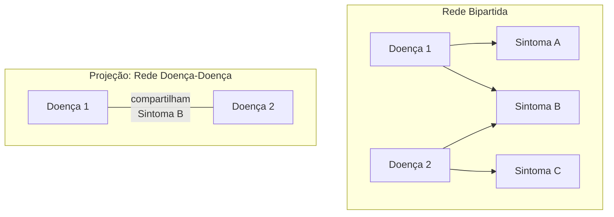
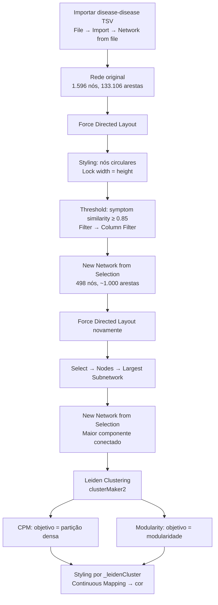
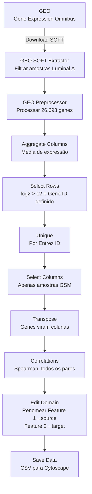

# Mapeamento e Transformação de Redes + Rede de Correlação em Câncer de Mama

[slides: Correlação](slides-correlation.pdf) | [slides: Mapeamento](slides-mapping.pdf)

Aula de André Santanchè, Luiz Celso Gomes-Jr e Thiago H. Silva (UNICAMP) — 13 de abril de 2026

Aula dupla cobrindo dois grandes temas: (1) como **mapear** fenômenos do mundo real para redes (grafos), incluindo seis métodos de mapeamento e três operações de transformação; e (2) prática completa de construção de uma **rede de correlação de expressão gênica** em câncer de mama usando Orange Data Mining e Cytoscape, com o dataset GSE45827. Sem gravação.

---

## Parte 1 — Mapeamento: do Mundo Real para Redes

A primeira pergunta ao trabalhar com redes é: **como transformar dados reais em nós e arestas?** A escolha do método de mapeamento define completamente a rede resultante — os mesmos dados podem gerar redes totalmente diferentes dependendo do critério usado para conectar os nós.

### Representação Adequada

Um exemplo ilustrativo: em uma escola, se conectarmos alunos que tiveram um relacionamento romântico, obtemos uma **rede sexual** (Bearman et al., Columbia). Mas se conectarmos alunos que compartilham o mesmo primeiro nome, obtemos uma rede completamente diferente — ainda é uma rede, mas não captura nenhuma informação sobre relacionamentos sociais.

A lição: **a forma como definimos as arestas determina o significado da rede**.

### Seis Métodos de Mapeamento

Costa et al. (2011) classificam os métodos de construção de redes em seis categorias:

| Método | O que conecta os nós | Exemplos |
|--------|----------------------|----------|
| **Comunicação** | Troca de mensagens entre entidades | E-mail, telefone, redes sociais, vigilância |
| **Coexistência** | Pertencer ao mesmo "container" | Co-autoria (artigos), co-atuação (filmes), domínios |
| **Referência** | Um objeto cita/referencia outro | Citações acadêmicas, WWW (hiperlinks), e-mails |
| **Confluência** | Conexão física entre pontos | Ruas, rodovias, metrô, rede elétrica, canais ósseos |
| **Correlação** | Séries temporais similares | Clima, mercado financeiro, fMRI[^fMRI], co-expressão gênica[^coexp] |
| **Adjacência** | Proximidade no espaço ou no tempo | Terremotos, paisagem, palavras adjacentes em textos |

### Exemplos de Mapeamento

**Notícia → Grafo**: a frase "Moro investiga Lula na operação Lava-Jato" gera um triângulo com arestas Moro–Lula, Moro–Lava-Jato, Lula–Lava-Jato. Acrescentando "Lula se reúne com Dilma", o grafo cresce conectando Lula a Dilma.

**Homofilia por Tópicos** (Cardoso, 2014; Cardoso et al., 2019): usuários de redes sociais são conectados por hashtags compartilhadas. As hashtags são agrupadas em tópicos por co-ocorrência, e cada usuário recebe um vetor de tópicos — permitindo medir similaridade entre usuários.

**Grafo de Transição Urbana** (Thiago H. Silva): check-ins em locais (Foursquare) são transformados em grafos onde nós são categorias de locais (Food, Nightlife, Office...) e arestas representam transições entre categorias ao longo do dia. Revela padrões como "Food → Nightlife" ou "Home → Office".

**Internet**: roteadores como nós e conexões físicas como arestas — um exemplo clássico de rede de confluência com estrutura scale-free[^sf].

---

## Parte 2 — Correlação em Genes e Proteínas

### PPI com Expressão Gênica

Em uma rede PPI[^PPI], os nós são proteínas[^prot] e as arestas representam interações físicas entre elas. Cada proteína é fabricada a partir de um gene[^gene], e cada gene tem um perfil de expressão[^exp] — o quanto está sendo "lido" pela célula em cada amostra.

Quando sobrepomos dados de expressão gênica à rede PPI, podemos calcular a **correlação** entre os perfis de expressão dos genes conectados:

- **Alta correlação**: os dois genes "sobem e descem juntos" nas amostras → aresta forte
- **Baixa correlação**: os perfis são independentes → aresta fraca ou removida

### Correlação de Expressão vs. Expressão Diferencial

Existem dois tipos de redes de correlação:

1. **Correlação de expressão**: compara os níveis absolutos de atividade dos genes entre amostras — genes com padrões de atividade similares são conectados
2. **Correlação de expressão diferencial**: compara as *diferenças* de atividade entre condições (ex: tumor vs. saudável) — genes que mudam juntos na doença são conectados

### Estudos de Caso

**Chuang et al. (2007)** — *Network-based classification of breast cancer metastasis*: combinaram rede PPI com perfis de expressão gênica para identificar sub-redes discriminantes entre pacientes com e sem metástase[^met]. A "atividade" de cada sub-rede é calculada como a média normalizada da expressão dos genes que a compõem, e sub-redes com alto poder discriminativo são usadas como features para classificação.

**Taylor et al. (2009)** — *Dynamic modularity in protein interaction networks predicts breast cancer outcome*: mostraram que mudanças na correlação entre hubs[^hub] e seus vizinhos na rede PPI predizem prognóstico em câncer de mama. Hubs que perdem correlação com vizinhos em pacientes de mau prognóstico indicam "desestruturação" da rede.

---

## Parte 3 — Redes Biológicas

### Cadeias Alimentares (Food Webs)

Redes tróficas são exemplos clássicos de redes biológicas: nós = espécies, arestas = relação "quem come quem". Exemplos apresentados incluem a Chesapeake Bay Waterbird Food Web e a rede de água doce de Little Rock Lake (Neo Martinez & Richard Williams).

### Redes de Interação Fármaco-Alvo

Cheng et al. (2012) construíram redes onde **fármacos** e **proteínas-alvo** são nós, e as interações conhecidas são arestas. Usando inferência baseada em rede (similaridade entre fármacos e entre alvos), é possível **prever novas interações** e realizar **reposicionamento de fármacos** — encontrar novos usos para medicamentos existentes.

### Rede PPI de Levedura

Jeong et al. (2001) mapearam 1.870 proteínas e 2.240 interações físicas em levedura (*Saccharomyces cerevisiae*[^lev]), demonstrando que a rede PPI segue uma distribuição de lei de potência[^pow] (scale-free) e que proteínas com muitas conexões (hubs) tendem a ser essenciais — remover um hub é frequentemente letal para o organismo.

---

## Parte 4 — Transformação de Redes

Depois de construída, uma rede frequentemente precisa ser **transformada** antes da análise. Três operações fundamentais:

### 4.1 Junção (Joining)

Combinar duas ou mais redes que compartilham nós. Se o nó "d" aparece na rede 1 e na rede 2, as redes são fundidas mantendo todas as arestas de ambas.

**Exemplo — Flavor Network** (Ahn et al., 2011): a rede de sabores combina dados de receitas (de sites como allrecipes.com) com dados de compostos químicos (de bancos de análise química). Ingredientes que compartilham muitos compostos de sabor são conectados — revelando que a culinária ocidental favorece ingredientes com compostos compartilhados.

### 4.2 Projeção (Projecting)

Transformar uma rede **bipartida**[^bip] (com dois tipos de nós) em uma rede **monopartida** (com um só tipo). Dois nós do mesmo tipo são conectados se compartilham um vizinho do outro tipo.

**Exemplo**: se temos uma rede bipartida Doença–Sintoma, podemos projetá-la em:
- **Rede Doença-Doença**: duas doenças conectadas se compartilham sintomas
- **Rede Sintoma-Sintoma**: dois sintomas conectados se co-ocorrem na mesma doença

**Elements Pairing no Orange**: o widget *Elements Pairing* automatiza a projeção — recebe uma tabela source→target→weight e gera pares de sources que compartilham targets, calculando a média dos pesos como peso da nova aresta.

**Exemplo clínico** (Gomes Jr. et al., 2013): rede tripartida Caso–Sintoma–Diagnóstico projetada em rede monopartida de Sintomas, onde a espessura da aresta reflete a frequência de co-ocorrência.

### 4.3 Limiarização (Thresholding)

Redes de correlação ou similaridade frequentemente são **completas** (todos conectados a todos), com pesos variados. A limiarização remove arestas abaixo de um valor mínimo, revelando a estrutura essencial da rede.

**Processo**: grafo completo ponderado → aplicar threshold → grafo esparso com apenas as conexões mais fortes.

---

## Parte 5 — Estudo de Caso: Rede Sintoma-Doença Humana

### Fundamentação

Dois artigos-chave:

- **Goh et al. (2007)** — *The Human Disease Network*: construíram o **Diseasome**, uma rede bipartida Doença–Gene projetada em duas redes: a **HDN** (Human Disease Network, onde doenças são conectadas por genes compartilhados) e a **DGN** (Disease Gene Network, onde genes são conectados por doenças compartilhadas). Revelou que doenças de mesma classe tendem a compartilhar genes.

- **Zhou et al. (2014)** — *Human symptoms–disease network*: extraíram relações doença-sintoma da literatura médica (co-ocorrência bibliográfica usando TF-IDF[^tfidf]) e construíram redes onde doenças são conectadas por similaridade de sintomas. Mostraram que doenças com perfis de sintomas parecidos tendem a compartilhar genes e interações PPI, ligando o **fenoma** (sintomas observáveis) ao **genoma** (mecanismos moleculares).

### Dados Disponíveis

O repositório datasci4health.github.io disponibiliza os dados em formato TSV/CSV:

| Arquivo | Colunas |
|---------|---------|
| **Symptoms** | MeSH Symptom Term |
| **Diseases** | MeSH Disease ID, MeSH Disease Term, OMIM Disease ID |
| **Genes** | Gene Entrez ID, Gene Symbol |
| **Disease-Symptom** | MeSH Disease ID, MeSH Symptom Term, TF-IDF score |
| **Disease-Gene** | MeSH Disease ID, Gene Entrez ID |

Para importar no Cytoscape, os dados são transformados em tabelas de **Nodes** (Node ID, Node Description, Node Type) e **Edges** (Source, Target, Weight, Edge Type).

### Redes de Sintomas-Doenças com Peso (Rotmensch et al., 2017)

Uma abordagem alternativa: extrair relações doença-sintoma de **prontuários médicos eletrônicos** usando NLP (extração de conceitos), e então gerar pesos com diferentes modelos:

| Modelo | Abordagem |
|--------|-----------|
| **Naive Bayes** | Probabilidade condicional P(Sintoma\|Doença) |
| **Regressão Logística** | Coeficientes de um modelo log-linear |
| **Noisy Or** | Modelo probabilístico causal |

Cada modelo gera um Knowledge Graph diferente, pois o threshold muda.

### Prática no Cytoscape

O workflow completo da aula prática:

**Etapa 1 — Importação**: carregar o arquivo `disease-disease` do repositório (Goh/Zhou), mapeando colunas como source e target.

**Etapa 2 — Layout e Estilo**: aplicar Prefuse Force Directed Layout, mudar nós para formato circular, travar largura=altura.

**Etapa 3 — Threshold**: usando Filter → Column Filter em "symptom similarity score", selecionar arestas com score ≥ 0.85. Criar nova sub-rede a partir da seleção.

**Etapa 4 — Maior Componente**: Select → Nodes → Largest Subnetwork para isolar o maior componente conectado[^gcc].

**Etapa 5 — Detecção de Comunidades com Leiden**: Apps → clusterMaker → Leiden Clusterer (remote), testando duas funções objetivo:
- **CPM** (Constant Potts Model): busca sub-grafos densos; resolution=1, beta=0.01
- **Modularity**: maximiza modularidade de Newman; mesmos parâmetros

Os clusters são visualizados com mapeamento contínuo de cor na coluna `_leidenCluster`. O resultado revela regiões de doenças da mesma categoria (metabólicas, urogenitais, oculares, etc.) agrupadas, confirmando que **doenças com sintomas similares compartilham mecanismos moleculares**.

---

## Parte 6 — Prática: Rede de Correlação em Câncer de Mama

### O Artigo Base

Gruosso et al. (2016) — *Chronic oxidative stress promotes H2AX protein degradation and enhances chemosensitivity in breast cancer patients* (EMBO Molecular Medicine). O dataset **GSE45827** contém dados de expressão gênica[^microarray] de 155 amostras de câncer de mama: 41 Triple-Negative (TN), 30 HER2, 29 Luminal A, 30 Luminal B, 11 normais e 14 linhagens celulares.

### Workflow no Orange Data Mining

### Passo a Passo

**1. Buscar no GEO**: acessar https://www.ncbi.nlm.nih.gov/geo/, buscar GSE45827. O dataset tem 155 amostras na plataforma GPL570 (Affymetrix HG-U133 Plus 2.0).

**2. GEO SOFT Extractor** (plugin BioSci do Orange): carregar o arquivo `.soft`, filtrar amostras pelo subtipo desejado (ex: "Luminal A") e extrair a tabela de expressão.

**3. GEO Preprocessor**: processa os dados brutos — resolve genes com múltiplos identificadores (seleciona o primeiro), remove linhas sem Gene Symbol, e separa os ~26.000 genes com seus Entrez IDs.

**4. As "Três Irmãs"** — três operações fundamentais no Orange:

| Operação | Widget | Função |
|----------|--------|--------|
| **Projeção** | Select Columns | Escolher quais colunas manter (quais amostras/variáveis) |
| **Seleção** | Select Rows | Filtrar linhas por critério (ex: expressão > threshold) |
| **Junção** | Merge Data | Combinar tabelas por coluna-chave |

**5. Aggregate Columns**: calcular a média de expressão de cada gene entre todas as amostras selecionadas.

**6. Select Rows**: filtrar genes com expressão média log2 > 12 e com Gene ID definido — mantém apenas os genes mais expressos (diferencialmente ativos).

**7. Unique**: garantir que cada Entrez ID apareça apenas uma vez (remove duplicatas).

**8. Select Columns (Projeção)**: mover `expression_mean`, `genes` e `Gene Symbol` para "Ignored", mantendo apenas as colunas de expressão por amostra (GSM...) como features, e Entrez ID como meta.

**9. Transpose**: "girar" a tabela — genes viram colunas e amostras viram linhas. Necessário porque correlação é calculada entre colunas.

**10. Correlations**: calcular correlação de Spearman[^spearman] entre todos os pares de genes. O resultado mostra 29 amostras × 2 features (par de genes) × ~104k pares com seus coeficientes.

**11. Edit Domain**: renomear "Feature 1" → "source" e "Feature 2" → "target" para compatibilidade com Cytoscape.

**12. Save Data**: exportar como CSV, desabilitando "Add type annotations to header" para gerar um CSV limpo.

### Resultado no Cytoscape

O CSV exportado é importado no Cytoscape como uma rede:
- **Arestas**: File → Import → Network from file (colunas source, target, correlation como peso)
- **Nós**: File → Import → Table from file (tabela de genes com Gene Symbol como atributo)

O resultado é uma rede de correlação de expressão gênica onde genes com perfis de expressão similares em amostras de câncer de mama Luminal A estão fortemente conectados.

---

## Notas

[^fMRI]: **fMRI** — Ressonância magnética funcional. Técnica de imageamento cerebral que mede mudanças no fluxo sanguíneo para detectar áreas ativas do cérebro. Os dados de fMRI são séries temporais que podem ser correlacionadas para construir redes cerebrais.

[^coexp]: **Co-expressão gênica** — Quando dois ou mais genes apresentam padrões de atividade similares (sobem e descem juntos) em diferentes amostras ou condições. Genes co-expressos frequentemente participam da mesma função biológica.

[^sf]: **Scale-free (livre de escala)** — Tipo de rede onde a maioria dos nós tem poucas conexões, mas alguns poucos (hubs) têm muitíssimas. A distribuição de graus segue uma lei de potência. A internet e redes PPI são exemplos.

[^PPI]: **PPI** — Protein-Protein Interaction. Rede que mapeia quais proteínas interagem fisicamente umas com as outras dentro da célula — como um organograma mostrando quem trabalha com quem.

[^prot]: **Proteína** — Molécula fabricada a partir da "receita" contida em um gene. Proteínas fazem o trabalho real da célula: catalisam reações, transportam substâncias, formam estruturas, etc.

[^gene]: **Gene** — Trecho do DNA que contém a receita para fabricar uma proteína (ou RNA funcional). Cada célula humana tem ~20.000 genes.

[^exp]: **Expressão gênica** — O quanto um gene está sendo "lido" e traduzido em proteína. Um gene muito expresso está muito ativo; um gene silenciado não está produzindo proteína. Mede-se com microarray ou RNA-seq.

[^met]: **Metástase** — Quando células cancerosas se espalham do tumor original para outros órgãos, formando novos tumores. É o principal fator de gravidade do câncer.

[^hub]: **Hub** — Gene ou proteína com muitas conexões na rede — como uma estação central de metrô. Hubs tendem a ser essenciais para o funcionamento do organismo.

[^bip]: **Rede bipartida** — Rede com dois tipos de nós onde arestas só existem *entre* tipos diferentes (nunca dentro do mesmo tipo). Exemplo: rede Doença-Gene, onde doenças se conectam a genes mas não a outras doenças diretamente.

[^tfidf]: **TF-IDF** — Term Frequency–Inverse Document Frequency. Medida estatística que avalia a importância de uma palavra em um documento dentro de uma coleção. Usada aqui para quantificar a força da associação entre doença e sintoma na literatura médica.

[^gcc]: **Maior componente conectado** — O maior subconjunto de nós onde existe um caminho entre qualquer par. Em redes fragmentadas (muitos pedaços isolados), analisar apenas o maior componente foca na estrutura principal.

[^microarray]: **Microarray** — Tecnologia que mede simultaneamente a expressão de milhares de genes. Um chip com milhares de "sondas" que brilham conforme o nível de atividade de cada gene. GSE45827 usa a plataforma Affymetrix GPL570.

[^spearman]: **Correlação de Spearman** — Medida de correlação que avalia a relação monotônica (não necessariamente linear) entre duas variáveis. Usa os rankings (posições ordenadas) em vez dos valores absolutos. Mais robusta que Pearson para dados biológicos com outliers.

[^lev]: **Levedura (*Saccharomyces cerevisiae*)** — Fungo unicelular usado na fabricação de pão e cerveja. É o organismo-modelo mais estudado em biologia molecular por ser simples mas ter muitos genes homólogos aos humanos.

[^pow]: **Lei de potência** — Distribuição estatística onde P(k) ~ k^(-γ). Na prática, significa que poucos nós têm muitas conexões e a maioria tem poucas. Redes com essa propriedade são chamadas "scale-free".
