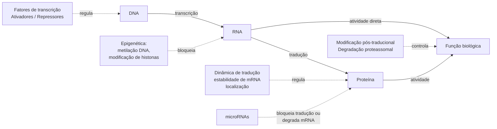
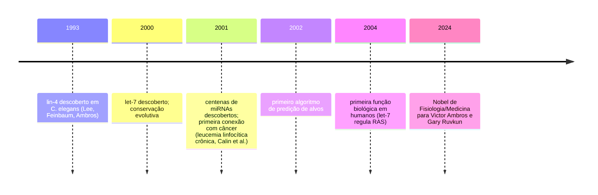
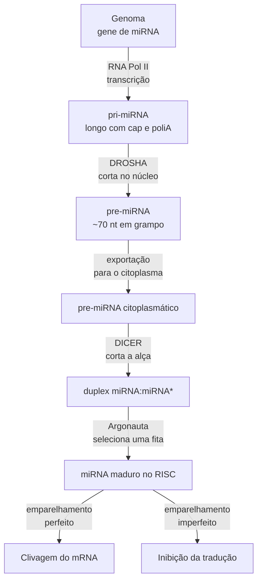
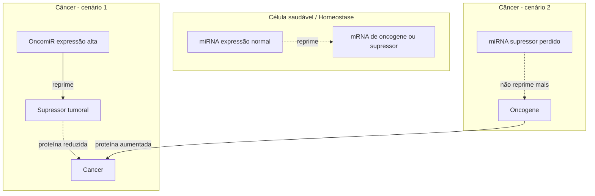
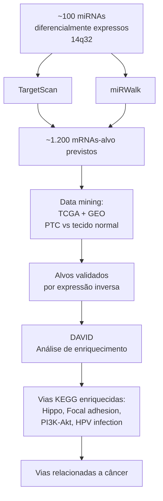
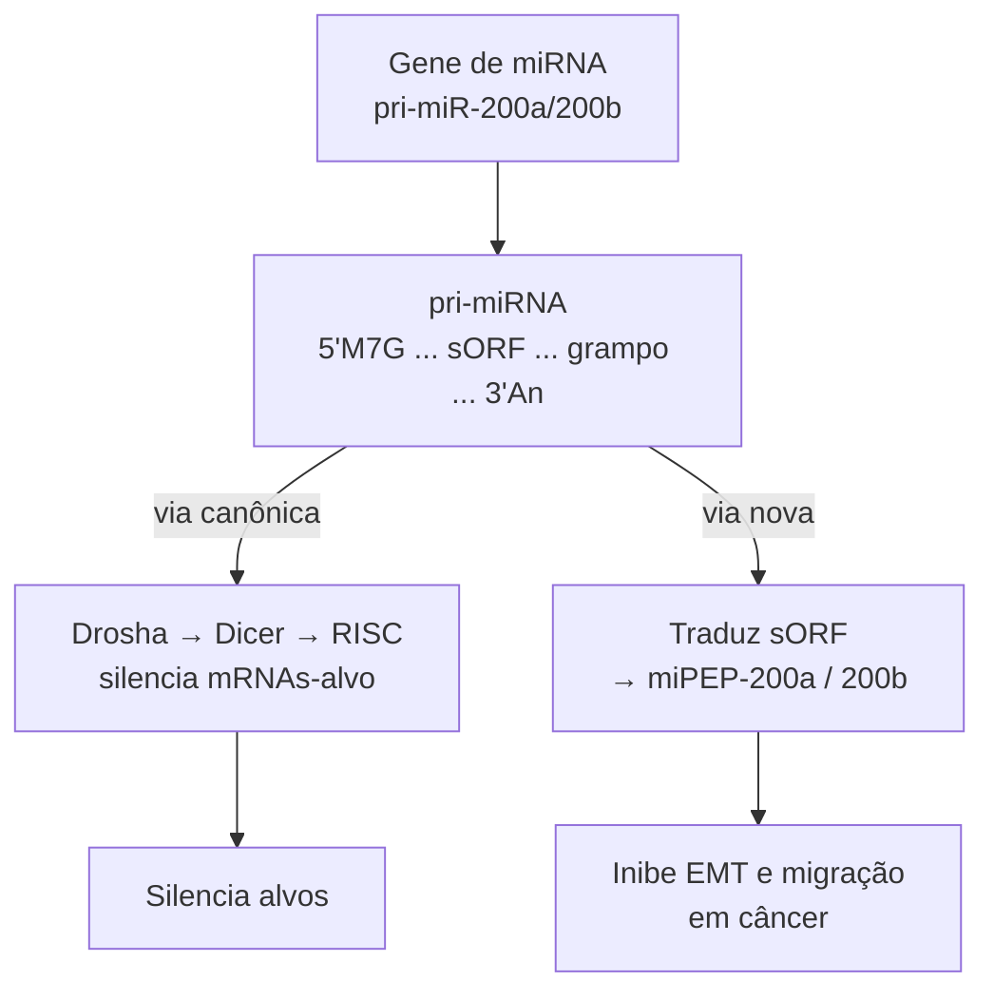

# microRNAs: História e Conceitos Gerais

[slides](slides.pdf)

Aula de Murilo Vieira Geraldo (RNA Biology Lab, Dep. de Biologia Estrutural e Funcional, Instituto de Biologia — UNICAMP) — 15 de abril de 2026

Aula-convidada cobrindo a biologia dos **microRNAs** (miRNAs)[^miRNA] em três blocos: conceitos gerais e história da descoberta; regulação pós-transcricional e o sistema Drosha/Dicer/Argonauta; e análise funcional em larga escala com estudo de caso em **câncer de tireoide** envolvendo o locus imprinted DLK1-DIO3 (cromossomo 14q32) e o miR-485-5p regulando a molécula de adesão ICAM1[^ICAM1]. Sem gravação.

---

## Parte 1 — Conceitos Gerais

### Onde cabem os miRNAs na expressão gênica

O **dogma central** simples diz: DNA → RNA → Proteína → Função. Mas na prática a célula controla esse fluxo em várias camadas, e microRNAs atuam em **uma delas especificamente**.



O ponto-chave: **miRNAs agem depois que o gene já foi lido do DNA**. O mRNA[^mRNA] já existe, mas o miRNA impede que ele seja traduzido em proteína — é uma forma de silenciar um gene sem alterar a "receita" do DNA.

### Por que RNAs não-codificantes importam tanto?

Uma observação que virou famosa: quanto mais complexo o organismo, **maior a fração do genoma que não codifica proteínas**. Em procariotos (bactérias) ~84% do RNA é codificante; em humanos, **apenas 2%**.

| Organismo | % RNA codificante | % RNA não-codificante |
|-----------|------------------:|----------------------:|
| *E. coli*           | 84 | 16 |
| *S. cerevisiae*     | 71 | 29 |
| *C. elegans*        | 27 | 73 |
| *D. melanogaster*   | 13 | 87 |
| ***H. sapiens***    | **2**  | **98** |

Por muito tempo achou-se que essa parte "não-codificante" era **DNA lixo**. Hoje sabe-se que é onde mora boa parte da regulação — incluindo os miRNAs.

### As várias classes de RNAs não-codificantes (e seus tamanhos em nucleotídeos[^nt])

| Classe | Tamanho (nt) | Função resumida |
| --- | --- | --- |
| **microRNAs (miRNAs)** | **19–22** | Silenciam mRNAs pós-transcricionalmente |
| tRNAs (*transfer RNAs*) | 76–90 | Trazem aminoácidos para o ribossomo |
| rRNAs (*ribosomal RNAs*) | 121–5070 | Formam o ribossomo |
| snRNAs (*small nuclear RNAs*) | ~150 | Splicing |
| snoRNAs (*small nucleolar RNAs*) | 20–24 | Modificação de RNA |
| piRNAs (*Piwi-interacting RNAs*) | 21–36 | Silenciam transposons em células germinativas |
| 7SL RNA | 300 | Transporte de proteínas |
| Vault RNAs | 86–141 | Complexos ribonucleoproteicos |
| lncRNAs (*long non-coding*) | >200 | Vários papéis regulatórios |

---

## Parte 2 — História e Descobrimento

### 1993: O primeiro miRNA (lin-4) em *C. elegans*[^celegans]

Dois artigos simultâneos na *Cell* (Lee, Feinbaum & Ambros; Wightman, Ha & Ruvkun) mostraram que o gene **lin-4** de *C. elegans* não produzia proteína — produzia **um RNA pequeno** que emparelhava com a região 3'UTR[^UTR] do mRNA *lin-14*, reprimindo a produção da proteína LIN-14.

```
mRNA:  5'UTR —————[ lin-14 ORF ]————— 3'UTR–AAAAA
                                        ↑
                                     lin-4 (pequeno RNA)
                                     grampo antisenso
```

Na época chamaram esses RNAs de **stRNA** (*small temporal RNA*) porque controlavam o tempo de desenvolvimento da larva (transição L1→L2). Ninguém previa que isso valeria Nobel 30 anos depois.

### 2000: let-7 — o miRNA conservado em humanos

Reinhart et al. (*Nature*, 2000) descobriram o **let-7** (de *lethal-7*) controlando a transição L4→adulto em *C. elegans*. O salto: esse miRNA era **conservado** entre verme, mosca, peixe e mamífero — portanto **não era curiosidade de um verme**, era um mecanismo universal.

Alvos do let-7 incluem **lin-14, lin-28, lin-41, lin-42, daf-12** e, em humanos, a família **RAS** (oncogenes[^oncogene]). Este é o gancho para câncer.

### Linha do tempo



Hoje há **>188.000 artigos** no PubMed com a palavra "miRNA". O campo explodiu.

### miRBase — o catálogo oficial

[**miRBase**](https://mirbase.org) é o banco de dados central de sequências e anotações de miRNAs, cobrindo dezenas de espécies (humano, camundongo, galinha, cão, gorila, *Drosophila*, *C. elegans*, *Arabidopsis*…). Cada miRNA recebe um nome padronizado como `hsa-miR-485-5p` (hsa = *Homo sapiens*).

---

## Parte 3 — Características Gerais dos miRNAs

Quatro marcas registradas:

- **Endógenos** — produzidos pela própria célula.
- **Não-codificantes** — não viram proteína.
- **Pequenos** — 19-25 nucleotídeos.
- **Precursor em grampo (hairpin)** — a estrutura secundária do RNA precursor forma uma alça como um grampo de cabelo.

```
Precursor (pre-miRNA):

    alça
     UU
    U  U
   A    A
   |    |
   G---C
   C---G   ← miRNA maduro (uma das fitas)
   U---A
   A---U
   C---G
   5'   3'
```

---

## Parte 4 — Biogênese dos miRNAs



Três enzimas-chave, com papéis bem definidos:

| Enzima | Local | Função |
| --- | --- | --- |
| **DROSHA** | Núcleo | Corta o pri-miRNA longo em pre-miRNA em grampo |
| **DICER** | Citoplasma | Remove a alça do grampo, gerando um duplex |
| **Argonauta (Ago)** | Citoplasma | Carrega uma das fitas e procura o mRNA-alvo |

O complexo Argonauta+miRNA se chama **RISC** (*RNA-Induced Silencing Complex*) e é quem efetivamente silencia o mRNA alvo.

**Diferença animais vs. plantas:** em plantas o emparelhamento miRNA↔mRNA é quase perfeito e leva a **clivagem** direta do mRNA (experimento clássico: mutar 1 nt em *PHABULOSA* em *Arabidopsis* basta para bagunçar o desenvolvimento da folha). Em animais, o emparelhamento é **imperfeito** (só a *seed region* — 6-8 nt — casa exatamente), e o efeito principal é **inibir a tradução** sem destruir o mRNA.

### miRNA Binding — anatomia do encontro com o alvo

```
            seed (6-8 nt)          3' pairing
miRNA  5' ■■■■■■■■    bulge    ■■■■   3'
         ||||||||              ||||
mRNA   3' ——————————MRE—————————————   5'
                    ↑
              3'UTR do mRNA-alvo
```

- **Seed** (5' do miRNA, nt 2-8) — região que **obrigatoriamente** casa perfeitamente com o alvo.
- **MRE** (*miRNA Response Element*) — sítio no 3'UTR do mRNA-alvo.
- **Bulges** (abaulamentos) — regiões sem pareamento no meio.

**Uma molécula, muitos alvos:** um único miRNA pode regular centenas de mRNAs diferentes, pois a *seed* de 6-7 nt aparece em muitos 3'UTRs. E um mesmo mRNA pode ser alvo de vários miRNAs. Daí a analogia de **rede regulatória**: miRNAs são **hubs reguladores** na rede.

---

## Parte 5 — miRNAs como Oncogenes e Supressores Tumorais

A descoberta em 2002 (Calin et al.) de que **miR-15 e miR-16 estão deletados em leucemia linfocítica crônica** abriu uma nova área: miRNAs podem agir tanto como **oncogenes** quanto como **supressores tumorais**.



- **OncomiR** — miRNA cuja super-expressão *promove* câncer (silenciando supressores tumorais).
- **miRNA supressor tumoral** — miRNA cuja perda libera oncogenes. *let-7* é o exemplo clássico: deleção ou baixa expressão de *let-7* permite que **RAS** seja traduzido em excesso.

---

## Parte 6 — miRNAs Circulantes (aplicação clínica)

miRNAs não ficam só dentro da célula — eles aparecem no plasma, saliva e urina, **protegidos** de degradação de quatro formas:

- Ligados a proteínas (Argonauta livre).
- Dentro de **microvesículas/exossomos**.
- Acoplados a **HDL** (colesterol "bom").
- Presos em **corpos apoptóticos** (restos de células mortas).

Isso torna miRNAs candidatos a **biomarcadores** em **biópsia líquida** — um exame de sangue em vez de biópsia invasiva.

---

## Parte 7 — Análise em Larga Escala

### Expressão diferencial

Sequenciamento pequeno-RNA (*small RNA-Seq*) mede quantos *reads* caem em cada locus de miRNA. Comparando amostras A e B:

```
Amostra A (sadio):  miRNA-A (muitos reads) | miRNA-B (poucos)
Amostra B (tumor):  miRNA-A (poucos reads)  | miRNA-B (muitos)
```

Isso gera uma matriz de expressão que pode ser visualizada como *heatmap* e analisada como qualquer perfil transcriptômico.

### Classificação de câncer por miRNAs

Lu et al. (*Nature* 2005) pegaram **334 amostras de câncer humano**, mediram **217 miRNAs** e **16.000 mRNAs**, e mostraram que o perfil de miRNAs **classifica tumores melhor que o de mRNAs** — indicando tecido de origem quando a histologia falha.

### Predição de alvos: TargetScan, miRWalk

Dado um miRNA, quais mRNAs ele regula? Duas ferramentas principais:

- [**TargetScan**](https://www.targetscan.org/) — usa a seed e conservação evolutiva; entrada: miRNA ou gene; saída: lista de alvos previstos com *context score*. Exemplo ilustrado na aula: let-7 tem **819 alvos conservados** incluindo HMGA2, LIN28B, IGF2BP1.
- [**miRWalk**](http://mirwalk.umm.uni-heidelberg.de/) — combina 12 algoritmos de predição.

### Atividade espacial de miRNAs

Avanço recente (Herbst et al., *Communications Biology* 2025): a ferramenta **miTEA-HiRes** infere **atividade de miRNAs em nível de célula única ou de *spot* espacial** a partir de dados de transcriptômica Visium, sobrepondo o mapa à histologia H&E. Abre a possibilidade de estudar miRNAs sem precisar sequenciá-los diretamente.

---

## Parte 8 — Estudo de Caso: miRNAs do locus DLK1-DIO3 no Câncer de Tireoide

### Câncer de tireoide — contexto

**Câncer de tireoide**[^tireoide] é a neoplasia endócrina mais prevalente (~1% de todos os cânceres; 8º tipo mais comum em mulheres). Nos EUA (Siegel et al. 2025): 44.020 novos casos estimados, 2.290 mortes. A maior parte é **bem diferenciada e curável**, mas existe uma fração **pouco diferenciada** ou **anaplásica (ATC)** altamente agressiva.

### Modelo *in vivo*: camundongo FVB Tg-BRAF

Para estudar tumorigênese[^tumorigenese], usa-se um camundongo transgênico expressando a mutação oncogênica **BRAF^V600E** especificamente na tireoide (promotor tireoglobulina). Timeline:

- **0 semana**: animal nasce com o transgene.
- **5 semanas**: câncer bem diferenciado.
- **12 semanas**: em transição.
- **30 semanas**: pouco diferenciado / invasivo.

A cada ponto mede-se o perfil de miRNAs (microarray Agilent). Resultado marcante: **dezenas de miRNAs do braço cromossômico 14q32 mudam dramaticamente** — a maioria aumenta entre 1-5 semanas e depois cai.

### O locus DLK1-DIO3 (14q32.31)

Região **imprintada**[^imprinting] com ~50 genes de miRNA agrupados — um dos maiores *clusters* de miRNAs do genoma humano. Arquitetura:

```
Cromossomo 14q32.31 (materno ativo / paterno silenciado)
  ┌─ DLK1 ─ IG-DMR ─ Gtl2/MEG3 ─ antiRtl1 & miRNAs ─ snoRNAs C/D ─ miRNAs & Mirg ─ Dio3 ─┐
  └────────────────────────────── ~1 Mb ────────────────────────────────────────────────┘
```

- **DLK1, RTL1, DIO3**: expressos no alelo **paterno**.
- **MEG3, antiRTL1, miRNAs, snoRNAs**: expressos no alelo **materno**.
- **IG-DMR**: região de metilação diferencial intergênica que controla o imprinting.

Dados do **TCGA** (The Cancer Genome Atlas) em 57 PTCs[^PTC] vs. tireoide normal pareada: **grande parte desses miRNAs cai dramaticamente no tumor** — o *cluster* inteiro é desligado em carcinomas papilares agressivos.

### Pipeline bioinformático usado



Enriquecimento funcional (GO + KEGG) dos **alvos dos 12 miRNAs mais expressos** do locus cobriu **>67% dos processos** envolvidos em câncer: organização da matriz extracelular, adesão celular, migração, angiogênese, fibril colágeno, proliferação, apoptose.

### miR-485-5p e ICAM1: do *in silico* ao *in vitro*

Entre os candidatos do locus, o **miR-485-5p** foi escolhido para validação experimental. Etapas:

1. **Clonagem no vetor pMSCVpuro** (retrovírus com promotor PGK e gene de resistência à puromicina) — permite expressão estável em células.
2. **Transfecção em linhagens de PTC**: TPC-1 e BCPAP. Três clones testados para cada → superexpressão do miR-485-5p confirmada por RT-qPCR.
3. **Ensaio de migração e invasão** (Transwell): células com miR-485-5p **migram e invadem menos** que controle, especialmente em BCPAP.

**Conclusão experimental:** miR-485-5p ⊣ migração celular.

### O alvo: ICAM1

Cruzando miRNA-seq + RNA-seq + predição: o **ICAM1** (*Intercellular Adhesion Molecule 1*) — uma proteína de superfície celular — apareceu como candidato forte. Evidências externas já conectavam ICAM1 a câncer de tireoide agressivo (Rabi et al., 2024; estudos de CAR-T e anticorpos anti-ICAM1 em PTC/ATC).

Validação:

- RT-qPCR: em células com miR-485-5p superexpresso, **ICAM1 cai**.
- Ensaio *rescue*: co-transfectar miR-485-5p + plasmídeo de ICAM1 **resgata** a migração celular → confirma que o efeito do miRNA passa **via ICAM1**.

**Eixo molecular final:**

```
miR-485-5p  ⊣  ICAM1  →  migração celular
```

---

## Parte 9 — Fronteira: miPEPs (peptídeos codificados por pri-miRNAs)

Descoberta recente (Fang et al., *J. Pharm. Sci. Pharmacol.* 2017): alguns **pri-miRNAs** contêm **pequenas ORFs** (sORFs) que codificam peptídeos curtos — os **miPEPs**. Ou seja, um único locus de miRNA pode produzir **dois produtos distintos**:



Esta descoberta redefine a ideia de "RNA não-codificante" — mesmo o que considerávamos puramente regulatório pode codificar peptídeos funcionais.

---

## Take-Home Messages

- miRNAs são **supressores tumorais promissores** — reintroduzi-los em células cancerosas pode reverter invasão/migração.
- A biologia de miRNAs pede **integração de abordagens**: *in silico* (TargetScan, miRWalk, TCGA, GEO) + *in vitro* (clonagem, qPCR, ensaios em linhagem) + *in vivo* (camundongos transgênicos).
- O locus **DLK1-DIO3** (14q32) é um dos *hot spots* de miRNAs supressores tumorais no genoma humano e está desligado em cânceres agressivos.
- Expressão pouco codificante ≠ "DNA lixo" — a complexidade regulatória cresce com a fração não-codificante, e ainda tem camadas (como miPEPs) sendo descobertas.

---

## Contato do professor

Murilo Vieira Geraldo — murilovg@unicamp.br · RNA Biology Lab / IB — UNICAMP

---

## Notas

[^miRNA]: **microRNA (miRNA)** — RNA pequeno (19-25 nucleotídeos) produzido pela célula que controla genes "apagando" mensagens antes que virem proteína. Analogia: se o gene é uma receita e o mRNA é a cópia impressa que vai para o fogão, o miRNA é um post-it que diz "não cozinhe isto".
[^mRNA]: **mRNA (RNA mensageiro)** — cópia "portátil" de uma receita (gene) que sai do núcleo e é lida pelos ribossomos para fabricar proteína.
[^UTR]: **UTR (*Untranslated Region*)** — regiões do mRNA que não viram proteína, mas contêm sinais regulatórios. A **3'UTR** fica depois do trecho que codifica a proteína e é o principal ponto de ligação dos miRNAs em animais.
[^nt]: **nt (nucleotídeo)** — unidade básica do DNA/RNA (A, C, G, U/T). Um miRNA com 22 nt é equivalente a uma "palavra" muito curta.
[^celegans]: ***Caenorhabditis elegans*** — verme transparente de ~1 mm usado como organismo-modelo em genética. Cada adulto tem exatamente 959 células — o que permite mapear todo o desenvolvimento célula por célula.
[^oncogene]: **Oncogene** — gene cuja ativação excessiva contribui para câncer (acelerador travado). **Supressor tumoral** é o oposto: um gene cuja perda facilita câncer (freio quebrado).
[^ICAM1]: **ICAM1 (*Intercellular Adhesion Molecule 1*)** — proteína na superfície das células que ajuda na adesão célula-célula e na migração de leucócitos. Alta em cânceres agressivos de tireoide.
[^imprinting]: **Imprinting genômico** — fenômeno em que um gene é expresso *apenas* do alelo materno OU *apenas* do paterno (o outro é silenciado epigeneticamente por metilação). DLK1-DIO3 é um dos casos clássicos em humanos.
[^PTC]: **PTC (*Papillary Thyroid Carcinoma*)** — carcinoma papilar de tireoide. Tipo mais comum e geralmente curável. **ATC** (*Anaplastic Thyroid Carcinoma*) é o tipo raro e letal.
[^tumorigenese]: **Tumorigênese** — processo pelo qual uma célula normal se transforma em tumoral, adquirindo capacidade de proliferar sem controle, invadir tecidos e metastatizar.
