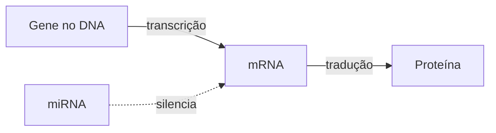
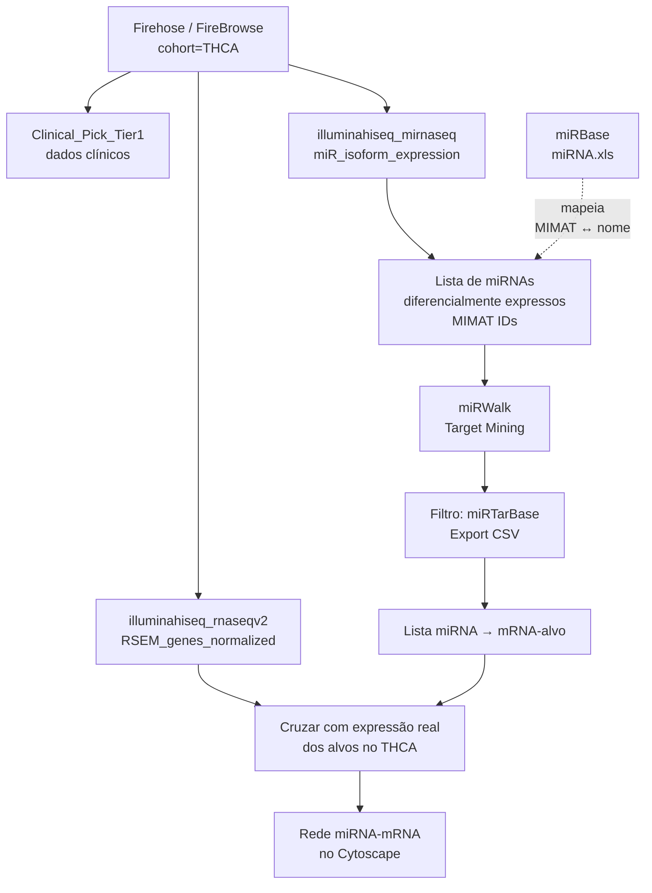
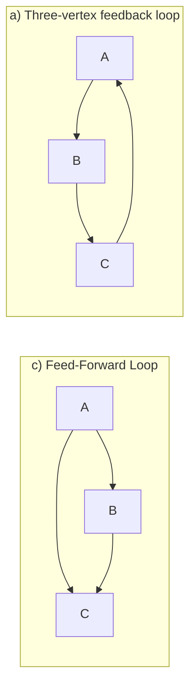
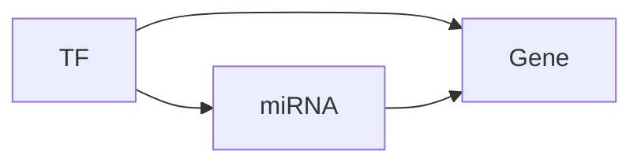

# miRNA-mRNA Network — Carcinoma de Tireoide (THCA)

[slides](slides.pdf)

Aula de André Santanchè (Laboratory of Information Systems — LIS, IC/UNICAMP) — 29 de abril de 2026

> Sem gravação.

---

## Em uma frase

Como, na prática, baixar dados de **miRNA**[^mirna] e **mRNA**[^mrna] de pacientes com **carcinoma de tireoide**[^thca] (TCGA-THCA) no portal **Firehose**, prever os alvos dos miRNAs no **miRWalk** e montar uma rede miRNA-gene — depois revisitar a teoria de **network motifs** (incluindo o motivo TF-miRNA-gene) que dá sentido a essa rede.

---

## Pano de fundo: miRNAs e mRNAs

A aula anterior (15/04) explicou o que são miRNAs e como eles silenciam genes. Esta aula é o **passo de mãos sujas**: como obter os dados e construir a rede que liga **um miRNA a seus mRNAs-alvo** num conjunto real de pacientes.

- **mRNA** (RNA mensageiro) = a "fotocópia de uma receita" do DNA que sai do núcleo e vai à fábrica de proteínas.
- **miRNA** (microRNA) = um **RNA pequeno** (19-25 letras) que **bloqueia ou destrói** essa fotocópia antes que ela vire proteína. É um "inspetor" que rasga receitas em circulação.
- **Rede miRNA-mRNA** = grafo direcionado em que arestas vão de **miRNAs** para **mRNAs** que eles regulam (na prática, normalmente reprimem).

---

## Carcinoma de Tireoide (THCA)

A **tireoide** é uma glândula em forma de borboleta no pescoço; produz hormônios (T3, T4) que controlam metabolismo. **Carcinoma** é um tipo de câncer originado em células epiteliais. **THCA** = *Thyroid Carcinoma* — código da coorte do TCGA[^tcga] para esse câncer.

- A coorte THCA do TCGA tem **503 pacientes** com dados clínicos, miRNA-seq, mRNA-seq, mutações, metilação etc.
- É a doença **estudo de caso** desta aula — a mesma usada na aula de 15/04 quando se discutiu o locus DLK1-DIO3.

---

## Pipeline da aula

---

## 1. Onde estão os dados: Firehose e FireBrowse

**Firehose** é uma plataforma do **Broad Institute** que arquiva e versiona os dados do TCGA — é o "atacadão congelado" do TCGA, pronto para download em massa.

- **URL:** https://gdac.broadinstitute.org/
- A página lista todas as coortes do TCGA (ACC, BLCA, BRCA, ..., THCA, ..., UVM) com colunas **Cases**, **Analyses**, **Data**.
- A coluna **Browse** abre o **FireBrowse** — interface web para explorar uma coorte específica.

**FireBrowse:**

- **URL:** http://firebrowse.org/?cohort=THCA
- Mostra a versão dos dados (`TCGA data version 2016_01_28 for THCA`) e gráfico de barras com a **contagem de alíquotas** por tipo de análise:
  - Clinical: 503
  - SNP6 CopyNum: 499
  - Methylation: 503
  - **miRSeq: 502**
  - **mRNASeq: 501**
  - Mutation Annotation File: 402
  - Reverse Phase Protein Array: 222

> "Alíquotas" são amostras pequenas separadas para cada tipo de exame.

---

## 2. Downloading Clinical Data

Da barra **Clinical**, abrir **THCA Clinical Archives** → aba *Primary* → escolher:

- **`Clinical_Pick_Tier1` (MD5)** — versão curada, com os campos clínicos mais confiáveis.
- (Alternativa: `Merge_Clinical` — versão completa com todos os campos brutos.)

Esse arquivo traz idade, sexo, estágio do tumor, sobrevida etc. — os **rótulos** que vão acompanhar cada amostra na análise.

---

## 3. Downloading miRNA Expression

Da barra **miRSeq**, abrir **THCA miRSeq Archives** → escolher:

- **`illuminahiseq_mirnaseq-miR_isoform_expression`** — matriz com a expressão de cada **isoforma de miRNA** medida na plataforma Illumina HiSeq.

> **Isoforma** de um miRNA = pequena variação na sequência madura (1-2 nucleotídeos a mais ou a menos numa das pontas). Várias isoformas podem coexistir e ter alvos sutilmente diferentes.

Outras opções na mesma página:

- `illuminahiseq_mirnaseq-miR_gene_expression` — agregada por miRNA "canônico" (sem isoformas).
- `miRseq_Mature_Preprocess` — formato pré-processado das maduras.
- `miRseq_Preprocess` — formato pré-processado bruto.

---

## 4. miRWalk: do miRNA aos mRNAs-alvo

Já apresentada na aula de 15/04, mas usada aqui de fato.

- **URL:** http://mirwalk.umm.uni-heidelberg.de/
- Aba **Target Mining** → botão **miRNAs** (em vez de Genes/Pathways/Diseases).

### Copy/paste dos miRNAs

A aula mostra dois arquivos de entrada (são listas de **MIMAT IDs**[^mimat] dos miRNAs diferencialmente expressos no THCA):

- `microRNA-diff-expressed_lima.csv` — 15 IDs (Lima é provavelmente o autor do filtro estatístico).
- `microRNA-diff-expressed.csv` — outro recorte, 16 IDs.

Esses MIMAT IDs são colados na caixa **IDs:** com:

- **species:** human
- **Type of IDs:** MIMATIDs

Botão **Submit** (passo 1) → botão **Proceed** (passo 2) → tabela de resultados.

### Exporting

Tabela de resultados com colunas: `Mirna`, `Refseqid`, `Genesymbol`, `Duplex`, `Score`, `Position`, `Binding Site`, `Au`, `Me`, `N Pairings`, `Targetscan`, `Mirdb`, `Mirtarbase`.

Para focar nas predições com **evidência experimental**:

1. Filtrar por **`miRTarBase`** (banco de pares miRNA-alvo **validados experimentalmente**).
2. Clicar **set filter**.
3. **Export CSV**.

> **miRTarBase** é diferente do TargetScan: este último prediz por sequência; miRTarBase só guarda interações com **evidência de bancada** (luciferase, Western blot, microarray, qPCR, etc.). Filtrar por miRTarBase = "ficar só com o que alguém realmente testou no laboratório."

---

## 5. Downloading Gene Expression (mRNA)

Da barra **mRNASeq**, abrir **THCA mRNASeq Archives** → escolher:

- **`illuminahiseq_rnaseqv2-RSEM_genes_normalized`** — matriz de expressão de mRNA por gene, **normalizada por RSEM**[^rsem].

Outras opções na mesma página: `RSEM_genes` (não-normalizada), `RSEM_isoforms`, `exon_expression`, `splice_junction_expression`, `junction_quantification` etc. Para análise de redes, a versão **`RSEM_genes_normalized`** é o ponto de partida padrão.

---

## 6. miRBase: traduzir MIMAT em nome de miRNA

- **URL:** https://www.mirbase.org/
- Aba **Downloads** → "Go to the FTP site" → diretório `/CURRENT` (release 22.1).
- Arquivo **`miRNA.xls`** (link curiosamente rotulado como `miRNA.csv` na página, mas o arquivo é XLS).
- É a **tabela de De-Para**: para cada miRNA da espécie escolhida, lista MIMAT ID maduro, nome canônico (`hsa-miR-...`), MI ID do hairpin, posição genômica, sequência.

> Essa tabela é o que conecta **MIMAT0000076** (saída do FireBrowse/miRWalk) ↔ **hsa-miR-21-5p** (nome legível).

---

## 7. Network Motifs (segunda metade da aula)

> "Network motifs are subgraphs that appear **more frequently in a real network than could be statistically expected**."

A ideia: numa rede grande, certos pequenos **padrões locais** (3-4 nós) aparecem **muito mais** do que em redes aleatórias com mesmo número de nós/arestas. Esses padrões repetidos são "tijolos funcionais" do circuito — peças com função estereotipada.

### Motivos canônicos (figura clássica)

A aula lista nove tipos de motivo de 3-4 nós:

| Letra | Nome                         |
| ----- | ---------------------------- |
| (a)   | three-vertex feedback loop   |
| (b)   | three chain                  |
| (c)   | feed-forward loop (**FFL**)  |
| (d)   | bi-parallel                  |
| (e)   | four-vertex feedback loop    |
| (f)   | bi-fan                       |
| (g)   | feedback with two mutual dyads |
| (h)   | fully connected triad        |
| (i)   | uplinked mutual dyad         |

### Combinatória explode rápido

Slide da aula do Renato Vicentini (2024) mostra a contagem de padrões topologicamente distintos em **redes direcionadas conectadas**:

- **4 nós:** 199 padrões possíveis
- **5 nós:** > 9.000
- **7 nós:** milhões

Ou seja: já em redes pequenas a busca por motivos é um problema computacional sério.

---

## 8. Exemplos ecológicos (analogia)

A aula traz dois slides de **redes tróficas**[^trofica] como ilustração de motifs em sistemas naturais — porque a ideia de "padrões repetidos pequenos" não é exclusiva da biologia molecular.

### Trophic Levels (Venzon et al., 2001)

Cadeia de uma estufa de pepino na Holanda: planta de pepino (*C. sativus*), pragas (tripes *F. occidentalis*, ácaro *T. urticae*) e seus inimigos naturais (ácaros predadores *N. cucumeris*, *P. persimilis*, *N. californicus*; percevejo predador *O. laevigatus*). As setas indicam predação/herbivoria entre níveis tróficos.

### Trophic Model (Kovach-Orr & Fussmann, 2012)

Galeria de **dez topologias** alternativas para uma teia trófica de 3-4 espécies, mostrando como pequenas mudanças (adicionar uma espécie generalista, transformar uma seta em ligação simbiótica) geram modelos distintos. É a versão "ecológica" da galeria de motifs (a-i) anterior.

> **Por que está aqui?** Porque a noção de motivo se aplica igualmente a redes ecológicas, sociais, neurais e moleculares. O passo seguinte da aula — mineração de motivos — é geral.

---

## 9. Mineração e Aprendizagem em redes: GERM

**Graph Evolution Rule Miner (GERM)** — Bringmann et al. (2010).

- Algoritmo que **descobre regras de evolução** em grafos com **timestamps** nas arestas.
- A regra tem o formato `Body → Head`: um subgrafo "atual" (Body) é estendido com novas arestas no futuro (Head).
- Saída do exemplo do slide:
  - **GER1**: dado um caminho de duas arestas, frequentemente surge a aresta de fechamento do triângulo (transitividade).
  - **GER2**: dado um nó com vizinho, frequentemente surge mais um vizinho (preferential attachment).

> Conexão com o resto da aula: motivos são **estados estáticos**; GERM descreve **como a rede chega àqueles estados ao longo do tempo**. É uma ponte entre análise de motifs e mineração de padrões temporais.

---

## 10. Transcription Factors e Motifs Regulatórios

### Transcription Factor (TF)

**Fator de transcrição** = **proteína** que se liga ao DNA para **controlar a taxa de transcrição** de um gene — i.e., quanto mRNA é produzido por unidade de tempo.

> Analogia: se o gene é uma receita, a polimerase é o cozinheiro e o TF é o **gerente do restaurante** — decide quais receitas o cozinheiro vai preparar agora e em que volume.

Componentes mostrados no diagrama (eucariotos):

- **Promotor** — região do DNA imediatamente antes do gene; "endereço" onde a polimerase encaixa.
- **Enhancers** — pedaços de DNA que podem estar a milhares de bases de distância. Ativadores se ligam a eles e o DNA dobra para aproximá-los do promotor.
- **Activator proteins** + **other TFs** — formam complexo proteico junto ao promotor; isso facilita a polimerase começar a transcrever.
- **Insulator** — bloqueia o efeito do enhancer. Liga a proteína **CTCF** (CCCTC-binding factor).
- **Methylation** (grupos metila no nucleotídeo C) — quando metila o sítio do CTCF, **desliga** o insulador → enhancer volta a poder ativar o promotor.

### Transcription Regulation Networks

Uma rede em que **nós são genes** e **arestas direcionadas vão de TF para gene-alvo**.

> Citação de Alon (2007): "as redes de regulação transcricional de microrganismos bem-estudados parecem ser feitas de um pequeno conjunto de padrões regulatórios recorrentes — chamados *network motifs*."

Referências citadas:

- **Alon, U. (2007).** *Network motifs: theory and experimental approaches*. Nature Reviews Genetics 8(6): 450-461. https://doi.org/10.1038/nrg2102
- **Stone, L., Simberloff, D., & Artzy-Randrup, Y. (2019).** *Network motifs and their origins*. PLOS Computational Biology 15(4): e1006749. https://doi.org/10.1371/journal.pcbi.1006749

### TF-microRNA-gene Motifs

Cruzando os dois mundos da aula: redes **regulatórias** (TFs ligando genes) e redes **miRNA-mRNA** (miRNAs silenciando mRNAs). O motivo de 3 nós envolve **TF + miRNA + gene**.

Tipologia (Zhang et al., 2015):

#### (a) FFL types — Feed-Forward Loops

| Subtipo            | Quem regula quem                                 |
| ------------------ | ------------------------------------------------ |
| **TF-FFL**         | TF → miRNA, TF → gene, miRNA → gene              |
| **miRNA-FFL**      | miRNA → TF, miRNA → gene, TF → gene              |
| **composite FFL**  | TF ↔ miRNA, ambos → gene                         |

#### (b) Coherent FFLs

Os dois caminhos (direto TF→gene e indireto TF→miRNA→gene) **convergem no mesmo sinal** — ambos ativam ou ambos reprimem o gene.

#### (c) Incoherent FFLs

Os dois caminhos **conflitam** — um ativa, outro reprime. Resultado: o gene tem expressão **transitória** (sobe rápido, depois é desligado pelo caminho mais lento). Útil para gerar pulsos.

#### (d) FBL types — Feedback Loops

| Subtipo            | Estrutura                                        |
| ------------------ | ------------------------------------------------ |
| **signal negative** | TF → miRNA → TF (uma das setas é repressão)     |
| **double negative** | TF ⊣ miRNA ⊣ TF (ambas repressões — biestável) |

> O **double-negative feedback loop** é especialmente importante: produz um **toggle switch** com dois estados estáveis. É o tipo de circuito por trás de **decisões celulares irreversíveis** (diferenciação, transição epitélio-mesênquima, transição maligna).

Referência: **Zhang, H. M., Kuang, S., Xiong, X., Gao, T., Liu, C., & Guo, A. Y. (2015).** *Transcription factor and microRNA co-regulatory loops: important regulatory motifs in biological processes and diseases*. Briefings in Bioinformatics, 16(1): 45-58. https://doi.org/10.1093/bib/bbt085

---

## Encerramento

A aula termina com:

- Slide de **agradecimentos** (figura de TFs eucariotas, CC BY 3.0, Wikimedia / Kelvin13).
- Página do palestrante: **André Santanchè** — https://www.ic.unicamp.br/~santanche/

---

## Por que esta aula importa para o projeto de câncer de pele

1. **Fluxo de obtenção de dados é exatamente o mesmo** que vamos usar para TCGA-SKCM (Skin Cutaneous Melanoma) na parte do projeto com GAT — basta trocar a coorte em `firebrowse.org/?cohort=SKCM`.
2. **miRWalk + miRTarBase** dão a ponte miRNA→gene que vamos precisar se quisermos uma camada **regulatória pós-transcricional** sobre a rede PPI já construída.
3. Os **motivos TF-miRNA-gene** (Zhang 2015) são candidatos a **biomarcadores topológicos** — podem aparecer no melanoma e estar ausentes na pele saudável (ou vice-versa). É um ângulo possível para a análise diferencial das três redes do projeto.
4. **Motivos** em geral (Alon 2007, Stone 2019) reforçam o ponto da aula 06/04: **a topologia local** (não só os hubs globais) carrega informação biológica.

---

## Notas

[^mirna]: **miRNA (microRNA)** — RNA pequeno (19-25 nucleotídeos) que **silencia mRNAs** ligando-se a regiões 3' UTR. Não codifica proteína; ele *regula* a produção de outras.
[^mrna]: **mRNA (RNA mensageiro)** — RNA que carrega a "receita" de um gene do núcleo até os ribossomos, onde ela vira proteína.
[^thca]: **THCA** — *Thyroid Carcinoma*. Código da coorte do TCGA para câncer de tireoide. 503 pacientes, com majoritariamente carcinoma papilífero (PTC).
[^tcga]: **TCGA** — *The Cancer Genome Atlas*. Programa do NCI/NIH com perfis multi-ômicos de mais de 33 tipos de tumor.
[^mimat]: **MIMAT ID** — identificador estável do miRBase para um miRNA **maduro** (a forma de 22 nt que silencia mRNAs). Diferente do **MI ID** (que designa o **hairpin** precursor).
[^rsem]: **RSEM** — *RNA-Seq by Expectation-Maximization*. Método de quantificação de mRNA-seq que estima quantos reads pertencem a cada transcrito (mesmo quando reads alinham em mais de um). A versão **normalizada** ajusta por *library size* para permitir comparação entre amostras.
[^trofica]: **Rede trófica** — *food web*. Grafo direcionado em que arestas indicam "quem come quem". Níveis tróficos: produtores (planta) → herbívoros → predadores → predadores de topo.
