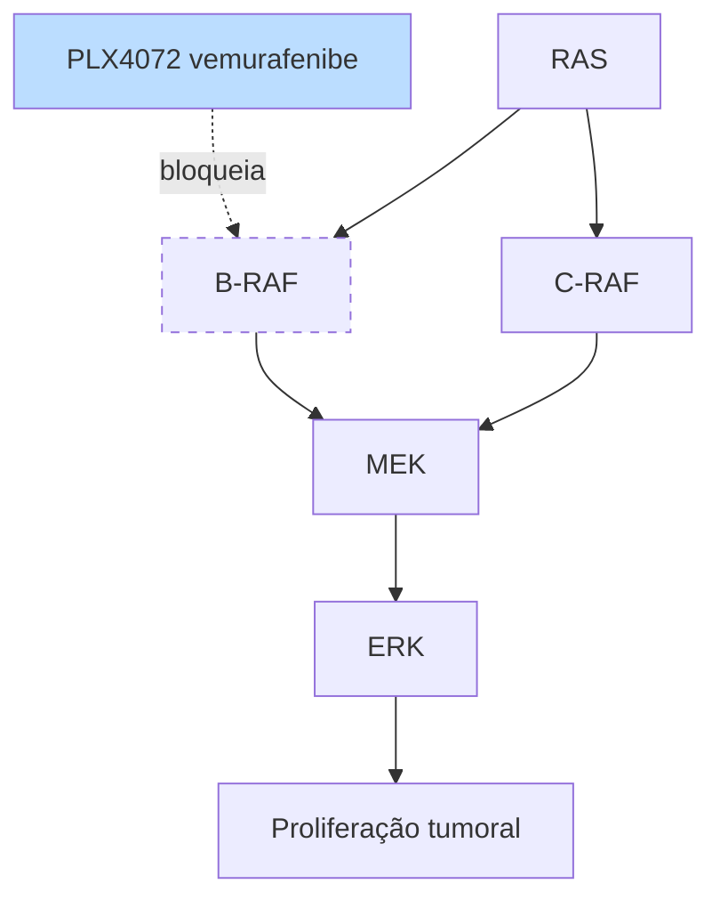
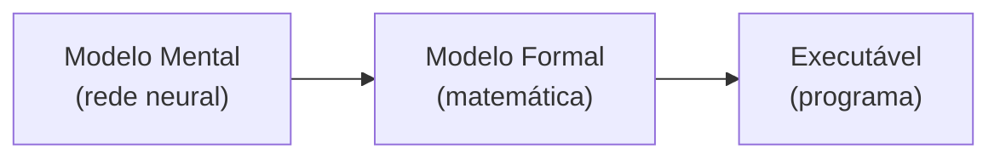
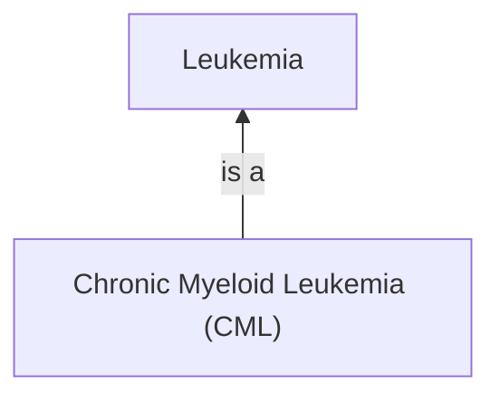
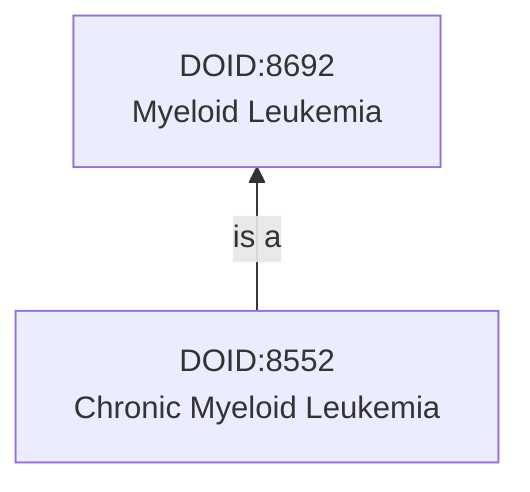
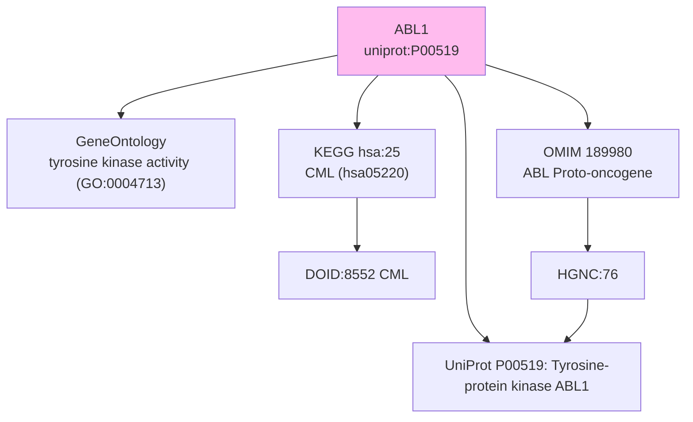
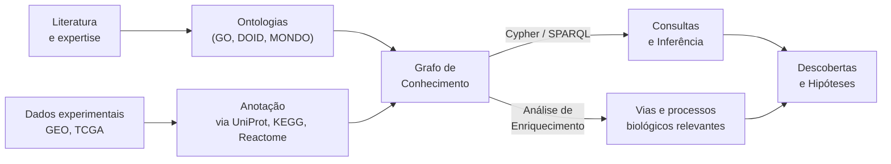

# Representação de Conhecimento, Ontologia e Grafos de Conhecimento

[slides](slides.pdf)

Aula de André Santanchè (Laboratory of Information Systems — LIS, IC/UNICAMP) — 11 de maio de 2026

> Sem gravação.

---

## Em uma frase

Como representar conhecimento biológico (genes, proteínas, doenças, vias) de forma que **humanos** consigam entender, debater e comunicar **E** que **máquinas** consigam interpretar e raciocinar sobre — passando por **ontologias**[^ONTO], **grafos de conhecimento**[^KG], **URIs**[^URI] e o ecossistema de bases biomédicas (GO, UniProt, KEGG, Reactome, DOID[^DOID], OMIM[^OMIM]).

---

## Motivação: o caso do Melanoma

A aula abre com o estudo de caso de **Wagle et al. (2011, JCO)** — paciente com melanoma metastático tratado com **PLX4072** (vemurafenibe), inibidor de **B-RAF**[^BRAF]. O remédio funcionou inicialmente, mas o tumor desenvolveu resistência ativando uma rota paralela: **RAS → C-RAF → MEK → ERK**.

A pergunta da aula: *como representar esse conhecimento sobre vias de sinalização de modo que possamos integrar dados de múltiplas fontes (GO, UniProt, KEGG, Reactome) e fazer descobertas sobre resistência terapêutica?*



---

## Bases Biomédicas em Cascata

A aula apresenta um **ecossistema** de bases biomédicas e mostra como elas se interconectam para descrever um único gene (B-RAF / ABL1) sob ângulos diferentes.

### Gene Ontology (GO)

> "The Gene Ontology (GO) project is a major bioinformatics initiative to develop a computational representation of our evolving knowledge of how genes encode biological functions at the molecular, cellular and tissue system levels."

GO[^GO_ABBR] organiza o conhecimento sobre genes em **três eixos** (também chamados de "sub-ontologias"):

| Eixo | O que descreve | Exemplo |
| --- | --- | --- |
| **Molecular Function** | atividades moleculares (binding, catálise) | `MAP kinase kinase kinase activity` (GO:0004709) |
| **Cellular Component** | onde a função acontece | `nucleus` (GO:0005634), `cytoplasm` |
| **Biological Process** | sequência de eventos | `cell adhesion` (GO:0007155), `cell morphogenesis` |

Cada termo GO tem um **ID** estável (ex.: `GO:0004709`), e os termos formam uma **DAG** (grafo acíclico dirigido) com arestas tipadas: *is a*, *part of*, *regulates*, *positively regulates*, *negatively regulates*, *occurs in*, *capable of*, *capable of part of*.

**Ferramentas para navegar:**
- **AmiGO** — https://amigo.geneontology.org/
- **QuickGO** — https://www.ebi.ac.uk/QuickGO/

### UniProt

Base de referência para **proteínas** (sequência, função, domínios, localização subcelular). Cada proteína tem um **UniProt ID** (ex.: B-RAF = `P15056`; ABL1 = `P00519`). UniProt aponta para GO (anotações funcionais), para PDB (estrutura) e expõe um endpoint SPARQL.

### Reactome

Base de **pathways biológicos humanos** — cada via é um diagrama interativo com IDs estáveis (`R-HSA-...`). Exemplo da aula: **MAPK1/MAPK3 signaling** (R-HSA-5684996).

### KEGG (Kyoto Encyclopedia of Genes and Genomes)

Enciclopédia de vias **metabólicas e de sinalização**. Cada via tem um ID (ex.: `hsa04010` = MAPK signaling; `hsa05220` = Chronic Myeloid Leukemia). KEGG conecta genes a doenças e a drogas.

Estudo de caso da aula: **CML em KEGG (hsa05220)** mostra o gene de fusão **BCR-ABL**[^BCRABL] como nó central, fosforilando CRKL/CBL/CRK → PI3K → sobrevivência celular descontrolada.

### DBpedia

Versão estruturada da Wikipedia. Cada artigo vira um nó em um grafo (ex.: `dbpedia.org/page/BRAF_(gene)`), com propriedades como `dbo:description`, `dbo:wikiPageExternalLink`, ligando-se a outras entidades.

---

## Modelos, do Mental ao Executável

Analogia: a **Lei de Gravitação Universal de Newton** parte de um *modelo mental* (rede neuronal no cérebro do Newton), vira *modelo formal* em linguagem matemática (`F = G·m₁·m₂/r²`) — simples, reproduzível, verificável — e finalmente *executável* em uma linguagem de programação para controlar um foguete.



O que **ontologias** e **grafos de conhecimento** fazem para biologia é análogo: tirar o conhecimento da cabeça do especialista, escrevê-lo em uma forma **explícita, formal e compartilhável**, capaz de ser interpretado por máquinas.

---

## MYCIN — o ancestral dos sistemas baseados em conhecimento

**MYCIN** foi um **sistema especialista** desenvolvido em Stanford no início dos anos 1970 para identificar bactérias causadoras de infecções graves e recomendar antibióticos.

**Como funcionava:**
1. Faz perguntas ao médico (paciente, sintomas, culturas, sítio da infecção).
2. Aplica **regras de produção** (IF-THEN) sobre os fatos coletados.
3. Conclui com **certeza ponderada** (ex.: 0.6 = evidência sugestiva).
4. Recomenda antibiótico e dose; consegue **explicar** o raciocínio.

**Exemplo de regra (van Melle, 1979):**

```
RULE N
IF
  1) Site of the culture is BLOOD
  2) Gram stain is NEGATIVE
  3) Morphology is ROD
  4) Portal of entry is URINE
  5) Genito-urinary manipulative procedure NO
  6) Cystitis treatment NO
THEN
  suggestive evidence (60%) → E. COLI
```

**Por que MYCIN importa hoje?** Foi um dos primeiros sistemas a separar **conhecimento** (regras escritas pelos médicos) de **inferência** (motor de regras). É a raiz conceitual de tudo que veio depois — bases de conhecimento, grafos semânticos, e até dos LLMs que tentam recapturar essa explicitude.

---

## Grafo de Conhecimento

> Um **grafo de conhecimento** representa fatos como **(conceito, relação, conceito)**.

### Bloco mínimo



**Conceito** (nó): "Chronic Myeloid Leukemia" — uma entidade do mundo.

**Relação** (aresta tipada): `is a` — informa que CML é um tipo de Leucemia.

### Exemplo maior — Einstein (Ji et al., 2022)

A aula mostra como uma lista de tuplas `(sujeito, predicado, objeto)` ...

```
(Albert Einstein, BornIn, German Empire)
(Albert Einstein, SonOf, Hermann Einstein)
(Albert Einstein, WinnerOf, Nobel Prize in Physics)
(The theory of relativity, ProposedBy, Albert Einstein)
...
```

...vira um grafo onde Einstein é hub conectado a sua família, alma mater, prêmios e teorias. Esse é o **formato canônico** de um grafo de conhecimento.

### Phenomena Graph vs. Knowledge Graph

A aula distingue dois tipos de grafos:

- **Phenomena Graph** ("grafo do fenômeno") — descreve *como* algo acontece no mundo: a cascata RAS→RAF→MEK→ERK é um *Phenomena Graph*. Serve para **descoberta** (encontrar novos hubs, motifs).
- **Knowledge Graph** — descreve *o que sabemos* sobre os conceitos: GO:0044331 *is a* GO:0098609. Serve para **inferência** (deduzir que CDH1 participa de "cell-cell adhesion" porque está anotado em GO:0044331, que é subclasse de GO:0098609).

Os dois se complementam — o desafio é integrar.

---

## Identidade: por que precisamos de Surrogates

### O problema das chaves naturais

Em bancos relacionais tradicionais, uma chave (CPF, código do produto) identifica uma tupla. Mas em biologia isso falha:

- Espécies **mudam de nome** com revisão taxonômica.
- Espécies se **fundem ou separam**.
- A mesma proteína tem **várias denominações**: Chronic Myeloid Leukemia ≡ Chronic Myelogenous Leukemia ≡ Leucemia Mieloide Crônica ≡ 慢性骨髓性白血病.

### Surrogates (Khoshafian, 1986)

> "A mais poderosa técnica para dar suporte à identidade."

Surrogates são **identificadores opacos**:
- gerados pelo sistema
- globalmente únicos
- independentes de localização física
- **estáveis ao longo do tempo** mesmo que o nome mude

**Exemplo:** `DOID:8552` é o ID surrogate da CML no Disease Ontology[^DOID]. Independe do idioma, da sigla ou da revisão da nomenclatura.



### URIs — surrogates universais

Para que **qualquer pessoa no mundo** possa referenciar o mesmo conceito, usamos **URIs** (URLs estáveis):

- `https://disease-ontology.org/?id=DOID:8552` → CML
- `https://www.uniprot.org/uniprotkb/P15056/` → B-RAF
- `https://amigo.geneontology.org/amigo/term/GO:0004709` → MAP kinase kinase kinase activity

Diferentes bases (GO, UniProt, OMIM, KEGG) **convergem para o mesmo URI** quando falam do mesmo conceito — esse é o princípio do **Linked Data**[^LINKED].

### OMIM ancorando genes a doenças

**OMIM** (Online Mendelian Inheritance in Man) — catálogo de genes humanos e fenótipos genéticos. Ex.: `OMIM:608232` = LEUKEMIA, CHRONIC MYELOID, com a tabela Phenotype-Gene Relationships indicando que **ABL1** (locus 9q34.12, MIM 189980) é o gene associado, ligando-se via HGNC ao UniProt P00519.

---

## Ontologia: definição

> *"An ontology is a formal, explicit specification of a shared conceptualisation."* (Studer et al., 1998)

**Decompondo:**
- **Conceitualização** — o entendimento informal sobre os conceitos do domínio.
- **Compartilhada** — acordo entre uma comunidade (genes, doenças, fenótipos).
- **Explícita** — escrita; não é tácita.
- **Formal** — em linguagem que a máquina pode interpretar (OWL, RDF, Cypher).

Uma **ontologia** organiza um vocabulário com hierarquia (`is a`) e relações tipadas (`part of`, `regulates` …); um **grafo de conhecimento** **instancia** essa ontologia com fatos sobre o mundo.

---

## Conectando os pontos — ABL1 across the ecosystem

A aula encerra mostrando como **um único gene (ABL1)** é descrito por **múltiplas bases ancoradas por URIs**:



Cada base tem seu papel:
- **UniProt** descreve a proteína (sequência, função).
- **GO** descreve o que ela faz e onde.
- **KEGG** descreve em que vias ela atua.
- **OMIM/DOID** descrevem doenças associadas.
- **HGNC** padroniza o símbolo do gene.

---

## Como construir um Grafo de Conhecimento — exemplo: Bactérias

A aula traz um exercício prático com bactérias[^BACT]. A partir de uma tabela `source/target` ligando espécies a categorias morfológicas:

```
S. aureus       → Staphylococcus
Staphylococcus  → Gram-Positive Cocci
Gram-Positive Cocci → Gram-Positive Bacteria
Gram-Positive Bacteria → Bacteria
E. coli         → Escherichia
Escherichia     → Gram-Negative Bacilli
...
```

Constrói-se a **Characteristics Tree** — uma árvore taxonômica navegável. Em seguida, separando em **Nodes** (com tipo: `taxonomy`, `stain`, `shape`) e **Edges** (com property: `is-a`, `gram-stain`, `cell-shape`), o resultado é um grafo de conhecimento rico, capaz de responder consultas como "qual a relação entre *V. cholerae* e a forma celular *rod*?".

**Exemplo de fonte de dados real:** **BacDive** (https://beta.bacdive.dsmz.de/) — 99 mil cepas bacterianas com taxonomia, morfologia, fisiologia, ambiente de isolamento.

### Knowledge Graphs e LLMs

A aula faz um ponto crítico: LLMs **completam** grafos a partir de descrições, mas **inventam erros sutis**. Ex.: classificar `Bacillales` como `is-a Bacillota` ao invés de `Bacillales is-a Bacilli` (que é parte de Bacillota). A construção curada — humano + ontologias — continua imprescindível.

---

## Cypher e SPARQL — linguagens de consulta

### Cypher (Neo4j)

```cypher
CREATE (cml:Disease {
  id: "DOID:8552",
  name: "Chronic Myeloid Leukemia",
  uri: "https://disease-ontology.org/?id=DOID:8552"
})
```

### SPARQL (UniProt endpoint)

Exemplo da aula — **encontrar paralogs de B-RAF** consultando o endpoint público do UniProt:

```sparql
PREFIX up:        <http://purl.uniprot.org/core/>
PREFIX uniprotkb: <http://purl.uniprot.org/uniprot/>
PREFIX rdfs:      <http://www.w3.org/2000/01/rdf-schema#>

SELECT DISTINCT ?paralog ?name ?organism
WHERE {
  # Anchor on B-RAF
  uniprotkb:P15056 rdfs:seeAlso ?orthoGroup .
  ?orthoGroup up:database <http://purl.uniprot.org/database/OrthoDB> .

  # All proteins sharing the same OrthoDB group
  ?paralog rdfs:seeAlso ?orthoGroup ;
           up:organism ?organism ;
           up:reviewed true .

  FILTER(?paralog != uniprotkb:P15056)
  OPTIONAL { ?paralog up:recommendedName/up:fullName ?name }
}
ORDER BY ?organism
```

O retorno traz **Kinase suppressor of Ras 1/2** (KSR1, KSR2), **A-RAF**, **C-RAF** em humano e camundongo — exatamente os genes da via paralela que o tumor do paciente do início da aula ativou.

**Endpoint SPARQL do Gene Ontology:** https://geneontology.org/sparql

---

## Voltando ao L1 — How Wolves Change Rivers

A aula revisita o exercício de Yellowstone (lobos reintroduzidos em 1995) usando o **arcabouço ontológico** para fazer **predição**:

- Lobos (+) predam coiotes (−)
- Coiotes (−) predam coelhos e ratos → essas populações sobem (+)

Pergunta: *"posso predizer outras populações que devem subir se lobos predarem outros animais-coiote-like?"*

A resposta vem de **taxonomia**: subir a hierarquia para **Canidae** (lobos, raposas, coiotes) e descer para os predadores de roedores **Glires** (lagomorfa + rodentia).

**Encyclopedia of Life** (EOL — https://eol.org/) traz por espécie:
- Trophic Web — predadores, presas, competidores
- Dados quantitativos (massa corporal, dieta, ciclo reprodutivo)
- **Data Search** — query estruturada do tipo "*Canis* que predam roedores com massa entre 50–1000 g".

Esse é o uso prático de uma ontologia bem montada: **predição estruturada a partir de relações conhecidas**, mais robusta que padrões estatísticos em um único dataset.

---

## Estudo de caso final — Enriquecimento em CML

A aula fecha com **Telliam et al. (2023, *Cancers*)** que faz **enriquecimento de expressão** em iPSCs[^IPSC] derivadas de pacientes CML vs. medula óssea normal (NBM), em dois estados: STEM (célula-tronco) e PROG (progenitora).

Resultado: os termos GO mais enriquecidos em CML incluem **cell-cell adhesion** (GO:0044331), **glucose metabolism**, **adherens junction**, **regulation of NF-κB** — tudo **vias relevantes para a biologia tumoral**, encontradas usando o grafo GO como espinha dorsal.

O ciclo se fecha: **dados de expressão → análise de enriquecimento sobre Gene Ontology → biológicamente interpretável → testável experimentalmente**.

---

## Pipeline completo



---

## Notas

[^ONTO]: **Ontologia** — em ciência da computação, uma especificação formal e compartilhada dos conceitos de um domínio e suas relações. Não confundir com a *ontologia filosófica* (estudo do ser). Analogia: é o "dicionário oficial + organograma" de uma área.
[^KG]: **Grafo de Conhecimento (*Knowledge Graph*)** — representação de fatos como tuplas (sujeito, predicado, objeto), formando um grafo navegável. Exemplos famosos: **Wikidata**, **DBpedia**, **Google Knowledge Graph**, **PrimeKG** (medicina de precisão).
[^URI]: **URI** (*Uniform Resource Identifier*) — identificador único e padronizado para qualquer recurso da Web. URLs (`https://...`) são URIs. Em grafos de conhecimento, URIs garantem que duas bases que se referem ao mesmo conceito **convirjam** para o mesmo identificador (princípio do *Linked Data*).
[^DOID]: **Disease Ontology (DOID)** — ontologia que organiza doenças humanas em hierarquia de subclasses, com IDs estáveis (`DOID:8552` = CML). Integra códigos ICD, OMIM, MeSH, EFO. URL: https://disease-ontology.org/
[^OMIM]: **OMIM** (*Online Mendelian Inheritance in Man*) — catálogo curado de genes humanos e doenças genéticas, mantido pela Johns Hopkins. URL: https://www.omim.org/
[^BRAF]: **B-RAF** — proteína quinase que faz parte da cascata RAS→RAF→MEK→ERK, fundamental para crescimento celular. Mutações ativadoras em B-RAF (especialmente V600E) ocorrem em ~50% dos melanomas e dirigem proliferação descontrolada. O **PLX4072** (vemurafenibe) é um inibidor seletivo dessa forma mutada.
[^GO_ABBR]: **GO** (*Gene Ontology*) — ontologia de processos biológicos, funções moleculares e componentes celulares, usada para anotar genes de qualquer organismo. URL: https://geneontology.org/
[^BCRABL]: **BCR-ABL** — gene de fusão criado pela translocação cromossômica `t(9;22)` (cromossomo Philadelphia). Pega o gene **ABL1** (quinase do cromossomo 9) e cola num pedaço do **BCR** (cromossomo 22), gerando uma quinase constitutivamente ativa que dirige a proliferação descontrolada das células sanguíneas em CML. Analogia: o gene fica como um "interruptor de luz quebrado, sempre ligado".
[^LINKED]: **Linked Data** — princípio (Tim Berners-Lee) de que recursos na Web devem ser identificados por URIs estáveis, descritos em RDF e ligados entre si. Permite que uma máquina navegue pelo conhecimento como um humano navega por hyperlinks.
[^BACT]: **Bactérias e Gram** — a coloração de Gram divide bactérias em Gram-positivas (parede grossa, retêm corante violeta) e Gram-negativas (parede fina, perdem corante). Outra dimensão é a **morfologia**: cocos (esféricos), bacilos (em bastão), espirilos. Essas duas dimensões geram a árvore taxonômica usada no exercício (`Gram-Positive Cocci`, `Gram-Negative Bacilli` etc.).
[^IPSC]: **iPSC** (*induced Pluripotent Stem Cell*) — célula adulta (geralmente fibroblasto) **reprogramada** em laboratório para um estado pluripotente (capaz de virar qualquer tipo celular). Permite estudar uma doença em "células-tronco do próprio paciente" sem precisar coletar embriões.
