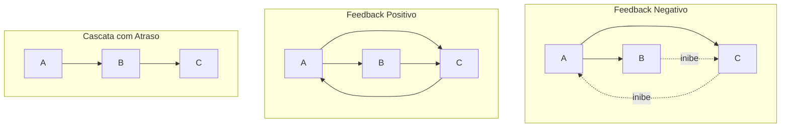
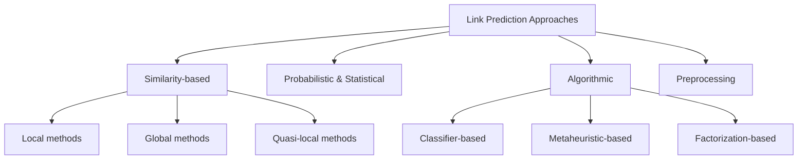
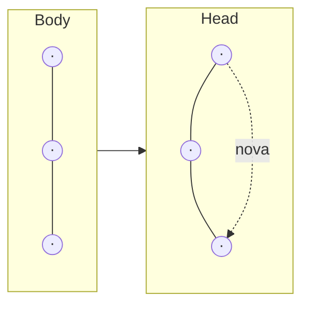
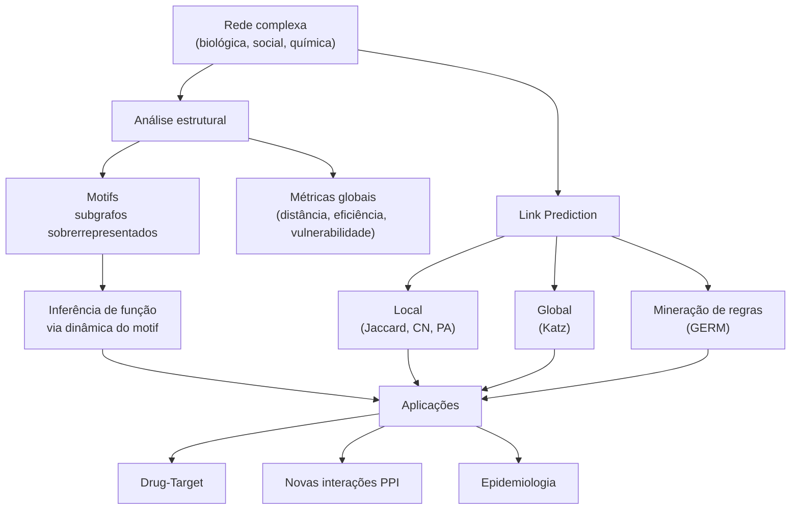

# Motifs e Link Prediction

[slides](slides.pdf)

Aula de André Santanchè (Laboratory of Information Systems — LIS, IC/UNICAMP) — 13 de maio de 2026

> Sem gravação.

---

## Em uma frase

Duas grandes idéias para analisar redes complexas: **motifs**[^MOTIF] — subgrafos pequenos que aparecem **mais frequentemente do que o esperado** e codificam funções biológicas (feedback negativo, FFL, oscilação); e **link prediction** — métodos para inferir **arestas faltantes ou futuras** no grafo (drogas-alvos, interações proteína-proteína, contaminação por COVID) usando similaridade, propriedades estruturais ou aprendizado.

---

## Parte I — Network Motifs

### Definição

> "Network motifs are subgraphs that appear more frequently in a real network than could be statistically expected."

**Em uma analogia:** se a rede inteira é um texto, motifs são as **palavras curtas mais usadas** — combinações de letras que aparecem muito mais que o esperado por acaso. Comparar a rede real com uma randomização preservando o grau de cada nó revela quais subgrafos têm **significância estatística**.

### Nove motivos canônicos (3-4 vértices)

A galeria clássica (Alon 2007, Stone 2019), agora revisada na aula:

| Tipo | Nome | Quando aparece |
| --- | --- | --- |
| (a) | three-vertex feedback loop | regulação cíclica |
| (b) | three chain | cascata simples |
| (c) | **feed-forward loop (FFL)** | filtro de ruído, atraso programável |
| (d) | bi-parallel | redundância |
| (e) | four-vertex feedback loop | oscilação |
| (f) | bi-fan | distribuição de sinal |
| (g) | feedback with two mutual dyads | controle robusto |
| (h) | fully connected triad | rede densa |
| (i) | uplinked mutual dyad | dominância |

### Motifs e Comportamento Dinâmico (Cloutier & Wang, 2011)

A virada conceitual: o mesmo motif sob diferentes dinâmicas produz **comportamentos qualitativamente diferentes**.



| Mecanismo | Efeito dinâmico | Exemplo biológico |
| --- | --- | --- |
| **Feedback negativo** | reduz variabilidade, produz resposta adaptada | redes de regulação gênica, quimiosensoring |
| **Feedforward (FFL)** | sensoriamento robusto, filtro de ruído | regulação por TF + miRNA |
| **Feedback positivo** | aumenta variabilidade, induz **biestabilidade** (toggle switch) | ciclo celular, diferenciação |
| **Cascata simples** | retarda a transmissão do sinal | glicólise, expressão gênica |
| **Cascata com feedback negativo** | gera **oscilações** | ritmos circadianos, p53-Mdm2 |

### Motifs em Cadeias Tróficas[^TROPHIC]

Saindo da biologia molecular para a ecologia, Venzon (2001) descreve uma **food web em estufa de pepino**: a planta sustenta dois insetos-pragas (*F. occidentalis*, *T. urticae*), que são predados por inimigos naturais usados em controle biológico (*N. cucumeris*, *P. persimilis*, *N. californicus*) e um generalista (*O. laevigatus*).

Kovach-Orr & Fussmann (2012) generalizam — **dez topologias de cadeias tróficas** com 3-4 espécies, mostrando que mesmo nesse pequeno conjunto, propriedades emergentes (resiliência, oscilação) dependem da **topologia exata** dos motivos.

### Métricas: Average Distance e Vulnerability

Antes de prosseguir para link prediction, dois conceitos adicionais sobre redes inteiras:

- **Distância média** (`ℓ`) — média das distâncias geodésicas entre todos os pares de vértices: `ℓ = (1/(N(N-1))) · Σ_{i≠j} d_ij`.
- **Eficiência global** (`E`) — soma dos recíprocos das distâncias: `E = (1/(N(N-1))) · Σ_{i≠j} (1/d_ij)`. Resiste bem a desconexões (caminhos infinitos contribuem com 0).
- **Vulnerabilidade** de um nó — impacto na **eficiência** quando o nó é removido. Análogo: "qual o estrago se eu fechar essa estação central de metrô?". Hubs com alta vulnerabilidade são pontos críticos.

---

## Parte II — Link Prediction

### O problema

> "A maioria das interações moleculares das células humanas ainda é desconhecida."

Duas variantes:
- **Predição da próxima relação a ser feita** — em que par de proteínas é mais provável existir uma interação ainda não descoberta?
- **Predição de escolha** — dado um conjunto de candidatos, quem é o mais provável?

Aplicação direta em medicina: **Modules in Health** (Barabási 2011) — se sabemos que uma doença ativa um módulo de proteínas, podemos predizer que **outras proteínas vizinhas no módulo** também estão envolvidas, mesmo que ainda não tenham sido associadas experimentalmente.

### Taxonomia dos métodos (Martínez et al., 2016)



### A Hipótese Central — Homofilia[^HOMO]

> "Quanto mais semelhantes, maior a probabilidade de estabelecerem um link."

A homofilia tem duas direções (Cardoso 2014):
- *"Choice homophily"* — semelhança gera amizade (você escolhe quem é parecido com você).
- *"Friendship begets similarity"* — amizade gera semelhança (você muda para se parecer com seus amigos).

A pergunta operacional: **como medir semelhança entre dois nós?**

### Métodos Baseados em Similaridade Local

Notação: Γ(x) é o conjunto de **vizinhos** do nó *x*.

#### Vizinhos comuns (Common Neighbors)

```
s(x, y) = |Γ(x) ∩ Γ(y)|
```

Quantos amigos os dois nós têm em comum. Análogo: na rede social, dois desconhecidos com 10 amigos em comum têm mais chance de virarem amigos do que dois sem nenhum.

#### Índice de Jaccard

```
              |Γ(x) ∩ Γ(y)|
s(x, y) = ─────────────────
              |Γ(x) ∪ Γ(y)|
```

Normaliza o número de vizinhos comuns pelo tamanho da união — corrige o viés de nós com muitos vizinhos.

#### Índice de Preferential Attachment

```
s(x, y) = |Γ(x)| · |Γ(y)|
```

Baseado na **propriedade scale-free**[^SCALEFREE] das redes complexas: a probabilidade de um novo nó se ligar a *X* é proporcional ao **grau** de *X*. Em outras palavras: **"rich get richer"** — hubs atraem novas conexões.

### Métodos Baseados em Similaridade Global

#### Índice de Katz

```
       ∞
s(x, y) = Σ β^ℓ · |paths^ℓ_{x,y}|
       ℓ=1
```

Soma sobre **todos os caminhos** entre *x* e *y*, com peso decrescente (`β < 1`) pelo comprimento. Caminhos curtos contam mais. Captura informação **estrutural global**, não só vizinhança imediata.

### Mineração e Aprendizagem — GERM (Bringmann, 2010)

**Graph Evolution Rule Miner** — extrai padrões da forma `Body → Head`: dada uma sub-estrutura **Body** que aparece no grafo, com que frequência ela evolui para o padrão **Head** (com uma nova aresta)? GERM minera essas regras com suporte estatístico, permitindo predizer futuras conexões.



### Aplicações em Saúde e Química

#### Predição Drug-Target (Cheng et al., 2012)

Rede bipartida droga ↔ alvo (ATC class) com milhares de nós. Inferência baseada em rede: se a droga **A** trata uma doença e tem alvo *T*, e a droga **B** compartilha alvos com **A**, **B** pode tratar a mesma doença — **drug repositioning**.

#### O 'wired world' of Organic Chemistry (Grzybowski et al., 2009)

Cada **reação química** é um nó; **moléculas** são outros nós; arestas conectam molécula → reação que a consome ou produz. Visualizando essa rede em 1835, 1840, 1845 vê-se a química orgânica crescer como uma rede livre de escala, com surgimento de hubs (substâncias-chave).

#### Predição Epidemiológica — COVID em Salvador (2020)

A aula termina com um exemplo aplicado: **qual a chance de eu ser contaminado pelo Coronavírus?**

- Tipo de problema: **predição**.
- Como? Construir um **modelo**.
- Variáveis a correlacionar: **densidade populacional × incidência** (Li et al., 2018, baseado em gripe espanhola).
- Dados: mapa de **casos por bairro de Salvador em 03/2020** (Rios et al., 2020).
- Resultado: bairros mais densos têm correlação positiva com taxa de mortalidade respiratória.
- Limites do modelo: outras variáveis (IDH, mobilidade) podem ter papel relevante; o modelo pode não ser generalizável; escolha das variáveis, número de variáveis e dimensão temporal são fontes de viés.

### Validação visual: Yeast Gene Interaction Network

Para fechar a aula, comparação visual entre uma **rede real** (yeast gene interactions) e sua **versão randomizada** preservando contagens:

| | Rede real | Rede randomizada |
| --- | --- | --- |
| **Layout** | hubs visíveis, comunidades | nuvem homogênea |
| **Distribuição de grau** | **power law** (cauda longa: poucos nós com grau alto) | **gaussiana** (concentrada na média) |

A diferença é a assinatura de redes biológicas: **scale-free, com hubs, com motifs estatisticamente significativos**, justamente as propriedades que tornam link prediction tratável.

---

## Pipeline conceitual da aula



---

## Notas

[^MOTIF]: **Motif de rede** — subgrafo pequeno (geralmente 3-4 nós) que ocorre em uma rede real com frequência **estatisticamente maior** que em redes aleatórias com mesma distribuição de graus. Cada motif tende a estar associado a uma função (filtro, atraso, oscilador). Análogo: na linguagem, motifs são as palavras curtas mais frequentes — "de", "que", "a" — que aparecem muito mais que o esperado por acaso.
[^TROPHIC]: **Cadeia trófica** — sequência de quem-come-quem em um ecossistema. Cada nível trófico é uma "camada" (planta → herbívoro → predador → predador-top). Modelar como rede permite estudar estabilidade e propagação de perturbações.
[^HOMO]: **Homofilia** — tendência observada em redes sociais (e biológicas) de que nós **semelhantes** tendem a se conectar entre si. Em redes de coautoria, autores da mesma área publicam juntos. Em PPI, proteínas com função similar interagem mais. É a base intuitiva de praticamente todos os métodos de link prediction.
[^SCALEFREE]: **Rede livre de escala (scale-free)** — rede cuja distribuição de graus segue uma **lei de potência** `P(k) ~ k^(-γ)`: muitos nós com poucas conexões e poucos nós (hubs) com muitas. É o oposto de uma rede aleatória "uniforme", onde quase todos têm grau próximo da média. Redes biológicas, sociais e a Web são tipicamente scale-free.
