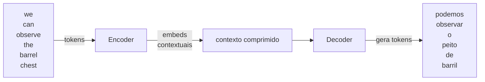
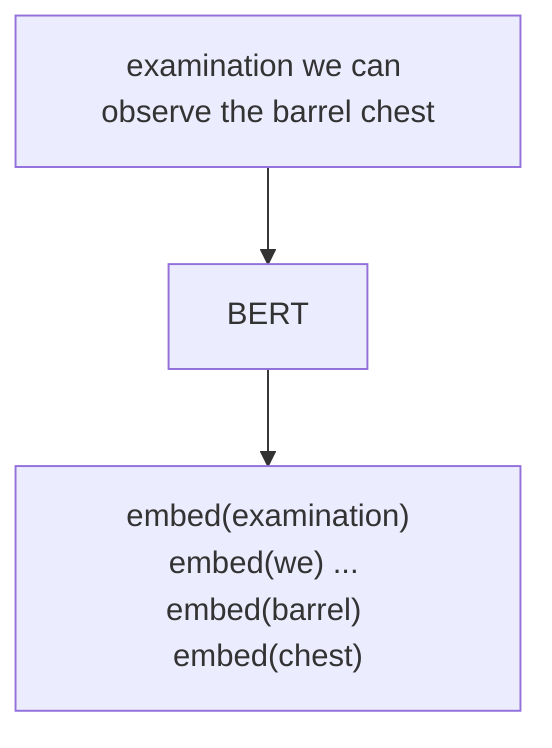
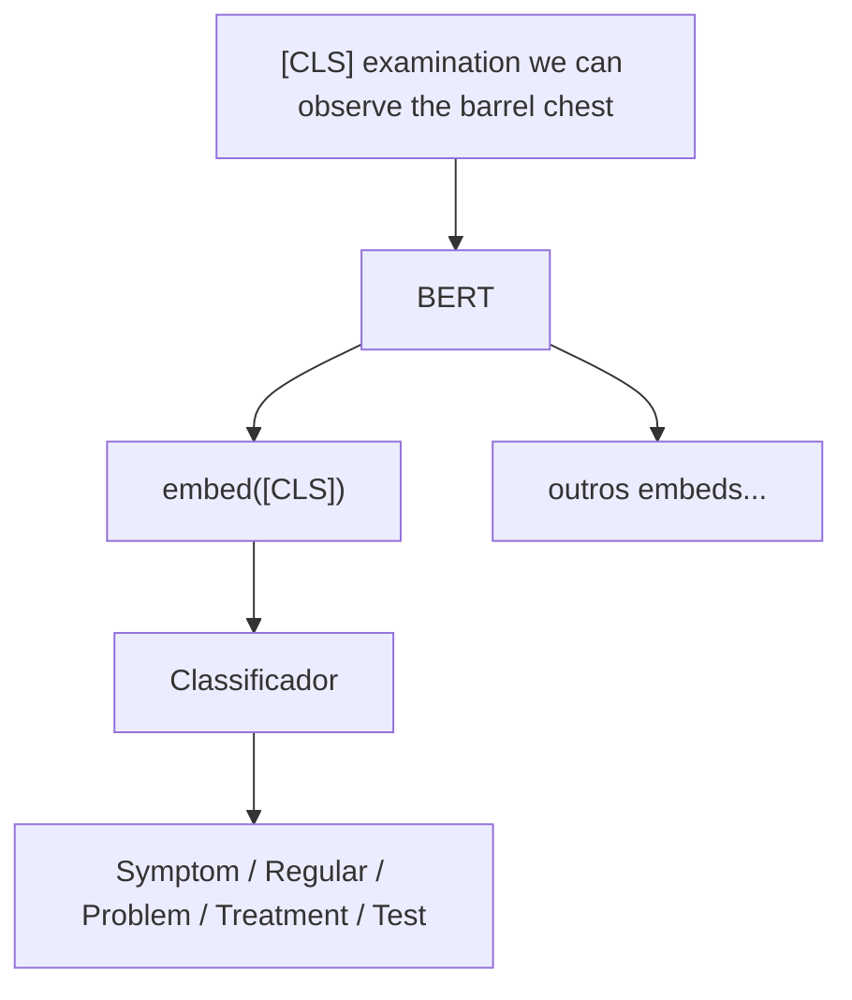
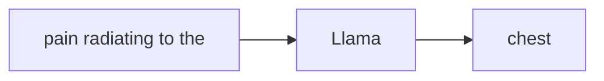
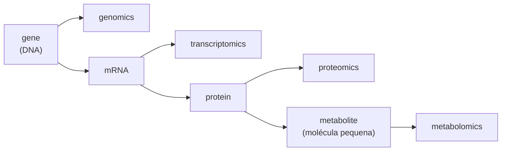
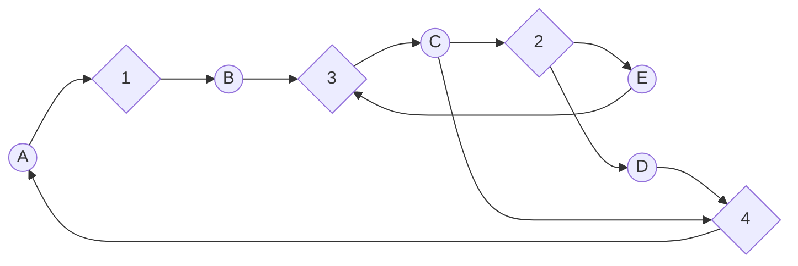
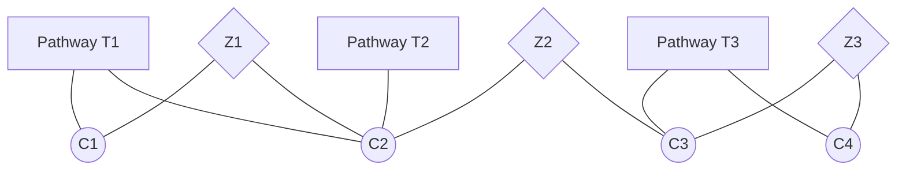
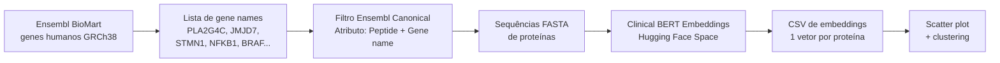
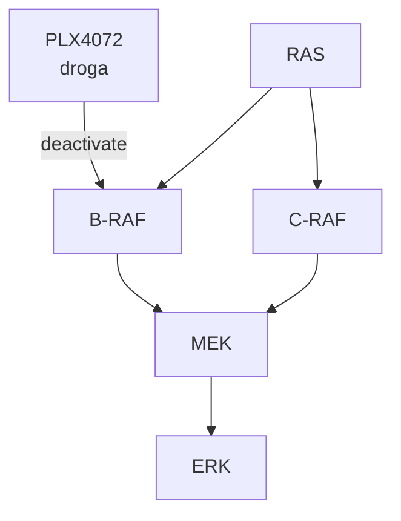

# Omics and Language Models

[slides: Omics e LMs](slides-omics.pdf) | [slides: Fundamentos de LMs](slides-llm.pdf)

Aula de André Santanchè (Laboratory of Information Systems — LIS, IC/UNICAMP) — 20 de maio de 2026

> Sem gravação. Aula dupla: a primeira metade (`slides-llm.pdf`) revisita do zero **o que é um modelo de linguagem** (semântica, vetores, embeddings, distância, BERT, Llama); a segunda metade (`slides-omics.pdf`) aplica esse maquinário a problemas **ômicos** — reações químicas, metabolômica, proteínas, vias e melanoma.

> **Exercícios:** a pasta [`exercicios/`](exercicios/README.md) traz o pipeline completo aplicado à via **MAPK signaling** (KEGG hsa04010 + Reactome R-HSA-5684996) — duas trilhas: `pathway-mir-mrna/` com o passo Ensembl BioMart → ProteinBERT → embeddings (FASTA + CSV de 11 MB), e `mapk/` com a construção do **knowledge graph** completo no Cytoscape integrando KEGG (KGML), Reactome (OWL/BioPAX), miRWalk, miRBase, Ensembl e a camada de clusters de language model. Inclui workflows Orange (`mapk-to-kg.ows`, `mapk-to-kg-mir.ows`, `mapk-to-kg-mir-lm.ows`) e sessão Cytoscape (`mapk-kg-aggregated.cys`).

---

## Em uma frase

Um **modelo de linguagem** aprende a representar palavras como **vetores num espaço**[^EMBED] de forma que palavras com **contextos parecidos** terminem **próximas** — e a mesma ideia funciona se trocarmos "palavras" por **sequências de DNA**, **proteínas**, **reações químicas** (SMILES[^SMILES]) ou **nós de uma via metabólica**, permitindo classificar células de câncer, prever produtos de reações, gerar proteínas funcionais e responder perguntas sobre grafos biológicos.

---

## Parte I — Fundamentos de Modelos de Linguagem

A primeira parte (slides `slides-llm.pdf`) é uma reconstrução cuidadosa de **toda a torre conceitual** que sustenta um LLM, começando com "o que é o significado de uma palavra" e terminando em BERT e Llama. É a parte da aula que estabelece o vocabulário usado depois nas aplicações ômicas.

### 1. Semântica e ambiguidade

A pergunta inicial é deliberadamente filosófica: **o que é o significado de uma palavra?** O exemplo do slide é a palavra `cell`:

- *"**Cell** of Saint Teresa de Ávila in the Convent of Saint Joseph"* — aqui `cell` = cela monástica.
- *"... is the process by which a **cell** uses its plasma membrane to engulf a large particle"* — aqui `cell` = célula biológica.

A mesma string `cell` significa coisas diferentes; só o **contexto** desambigua. Esta é a observação que motivará a próxima etapa: **representar palavras de forma que a representação capture o contexto**.

### 2. Modelo de linguagem como tarefa estatística

A definição operacional adotada na aula segue Jurafsky & Martin (2025):

> Um modelo de linguagem é uma distribuição de probabilidade sobre sequências. Concretamente, ele estima `p(próxima palavra | palavras anteriores)`.

Frases médicas como *"pain radiating to the abdomen"*, *"chest pain was central, radiating to the left arm and crushing in nature"* mostram que o modelo aprende **regularidades** — depois de `radiating to the` a palavra mais provável muda dependendo do que veio antes (`pain` → `abdomen`/`back`/`arm`).

Aprender essas distribuições com **redes neurais** sobre **corpora gigantes** é o que torna os LLMs viáveis.

### 3. Semântica vetorial — analogia dos zumbis

Para entender o que significa "representar uma palavra como vetor", a aula usa uma analogia muito boa: **zumbis com altura e peso**. A tabela dos slides é:

| Zumbi | Altura (m) | Peso (kg) |
| --- | --- | --- |
| Doriana | 1,87 | 60 |
| Quincas | 1,81 | 110 |
| Asdrúbal | 1,74 | 74 |
| Lucinda | 1,49 | 46 |
| Dulcinéia | 1,65 | 64 |

Cada zumbi vira um **ponto** no plano (altura, peso). Dá pra:
- **Comparar** zumbis pela posição.
- **Classificar** (zumbis fêmeas concentram-se à esquerda e baixo; machos à direita e alto).
- **Calcular distância** entre dois zumbis.

Pula-se então para o **dataset Breast Cancer Wisconsin** (Wolberg, Street & Mangasarian) — cada **núcleo de célula** é vetorizado por **radius**, **fractal_dimension**, **smoothness**, **concavity**, **symmetry** etc. (extraídos de imagens de citologia por agulha fina). Plotados num scatter `radius × fractal_dimension`, núcleos **benignos** (B, azul) ficam num canto, **malignos** (M, vermelho) no outro:

```
fractal_dim
  ^
  |  ● B          ● B
  |       ● B  ● B
  |              ● M
  |                 ● M
  +---------------------> radius
```

A lógica é a mesma: **transformar entidades em vetores num espaço, e o espaço revela classes**.

### 4. King − Man + Woman = Queen

Com vetores, podemos fazer **aritmética**. A tabela canônica:

| | female | royalty |
| --- | --- | --- |
| Queen | 1 | 1 |
| King  | 0 | 1 |
| Maid  | 1 | 0 |
| Servant | 0 | 0 |

Operações:
- `Male + Royalty = King`  (0,0) + (0,1) = (0,1) = King ✓
- `King − Male + Female = Queen` (0,1) − (0,0) + (1,0) = (1,1) = Queen ✓

Esta propriedade — descoberta por **Mikolov, Yih & Zweig (2013)** com Word2Vec — é o resultado clássico que mostra que o espaço aprendido captura **regularidades linguísticas e semânticas** (gênero, plural, capital de país etc.).

### 5. Distância (matemática)

Para comparar vetores, a aula define formalmente a **distância euclidiana**:

- **2D:** `d(p, q) = √((q₁−p₁)² + (q₂−p₂)²)`
- **3D:** `d(p, q) = √((q₁−p₁)² + (q₂−p₂)² + (q₃−p₃)²)`
- **n-D:** generalização imediata (soma dos quadrados das diferenças em cada dimensão).

Aplicada aos núcleos de câncer de mama, distâncias pequenas no espaço `(radius, fractal_dimension)` correspondem a perfis morfológicos parecidos. É a mesma distância usada por algoritmos como **k-means**, **k-NN** e medidas de similaridade entre embeddings de palavras.

### 6. Hipótese distribucional

Frase central de Jurafsky & Martin (2025), citada na aula:

> *"Words that occur in similar contexts tend to have similar meanings."*

Exemplo dos slides:
- *"The **queen** breastfed her son."*
- *"The **maid** breastfed her son."*

`queen` e `maid` aparecem no mesmo contexto → terão vetores parecidos na dimensão **feminina**. Mas:

- *"The **king** led his army into battle."*
- *"The **queen** breastfed the prince."*

`king` e `queen` aparecem em contextos com `royalty` (army, prince) → ambos serão altos na dimensão **realeza**, mas separados em **gênero**.

A construção da matriz no slide final dá quatro perfis canônicos: `king` (0,1, 0,7), `servant` (0,1, 0,3), `queen` (1,0, 0,5), `maid` (1,0, 0,2) — exatamente o que produziria um modelo distribucional treinado sobre os textos.

### 7. Aprendendo as dimensões — animais como exemplo

Antes era necessário **dizer** ao modelo as colunas (`female`, `royalty`). E se o modelo descobrir as colunas sozinho? Os slides apresentam cinco animais — **pterodáctilo** (a), **pato** (b), **águia** (c), **ornitorrinco** (d), **castor** (e) — e cinco frases:

1. *"The ___ flew over the hills."* → (a)(b)(c) [voadores]
2. *"A ___ egg hatched in the morning."* → (a)(b)(c)(d) [ovíparos]
3. *"The ___ fur protects against the cold."* → (d)(e) [peludos]
4. *"___ feathers are waterproof."* → (b)(c) [com penas]
5. *"The ___ produces milk."* → (d)(e) [mamíferos]

Cada frase divide os animais em duas classes. Cinco frases dão **5 dimensões** — `fly`, `eggs`, `feathers`, `fur`, `milk` — e cada animal vira um vetor binário. Vetores próximos indicam animais parecidos, e o espaço **descobre por si só** que pato e águia são "tipo pássaro", ornitorrinco e castor são "tipo mamífero" (e o ornitorrinco fica num lugar curioso entre os dois, exatamente como na biologia).

A virada conceitual: **os contextos onde uma palavra aparece** funcionam como as dimensões. Treinar Word2Vec é, no fundo, fazer isto em escala industrial sobre bilhões de palavras.

### 8. Embeds no espaço — classificação e clustering

Uma vez que cada palavra (ou frase, ou documento) é um vetor, podemos:

- **Classificar** — desenhar fronteiras de decisão (mammal vs bird vs reptile, ou negative/neutral/positive sentiment, ou problem/test/treatment em um prontuário).
- **Clusterizar** — usar **k-means** para descobrir grupos sem rótulos. O slide mostra um exemplo real de clustering de **respostas de estudantes** em 5 grupos (C1–C5) via embeddings + k-means.

Exemplo biomédico de fechamento: **Jia et al. (2023)** — *The high-dimensional space of human diseases built from diagnosis records and mapped to genetic loci* (Nature Computational Science). Cada doença vira um ponto num espaço de embeddings, e doenças mecanisticamente relacionadas (demências, infecções bacterianas, cânceres respiratórios) formam **bairros**.

### 9. Modelos de linguagem — tamanhos e gerações

Gráfico de **He et al. (2025)** mostrando a explosão de tamanho dos modelos entre 2017 e 2025:

| Era | Exemplos | Tamanho |
| --- | --- | --- |
| PLM (até 2020) | ELMo (0.009B), BERT (0.34B), GPT-2 (1.5B), T5 (11B), Turing-NLG (17B) | < 20 B parâmetros |
| LLM (2021–) | GPT-3 (175B), OPT, BLOOM, Galactica (120B), Chinchilla (70B), LLaMA, LLaMA-2/3, PaLM/PaLM-2 (340B), QWen (110B), Megatron-Turing (530B), PaLM (540B) | > 100 B parâmetros |

A virada de "PLM" (Pre-trained LM) para "LLM" (Large LM) é o salto qualitativo de poder ver/aprender padrões muito mais sutis.

### 10. Arquitetura Transformer

A aula desenha o Transformer com cuidado, em quatro slides sucessivos. O exemplo é a frase médica `we can observe the barrel chest`[^BARREL]:



- **Encoder** — lê a frase inteira, produz um **embedding por token** que já é **contextual** (a palavra `barrel` não é a mesma "barrel" de "barril de cerveja" — o encoder olha pra `chest` antes de codificar).
- **Decoder** — gera a frase de saída token por token usando o contexto do encoder.

### 11. BERT — Bidirectional Encoder Representations from Transformers

BERT é **só o encoder** do Transformer. Recebe frase, devolve **embeddings contextuais**:



A diferença essencial entre **embedding individual** (Word2Vec dá um único vetor por palavra independente do contexto) e **embedding contextual** (BERT dá vetores diferentes para `barrel` em "barrel chest" vs "wine barrel"):

```
"barrel chest"  →  barrel = [0.8, 0.2, 0.5]   (médico)
"wine barrel"   →  barrel = [0.1, 0.9, 0.3]   (recipiente)
```

#### Treinamento: Fill-Mask

BERT é treinado com a **tarefa de preencher palavras mascaradas**: o modelo vê *"examination we can observe the **<?>** chest"* e tem que adivinhar `barrel`. Para cada palavra-candidato:

- Se chuta `bus` → embed muito diferente do esperado → **ajustar pesos**.
- Se chuta `ear` → embed um pouco diferente → **ajustar menos**.
- Se chuta `barrel` → embed correto → **manter**.

Repetir bilhões de vezes em corpus de texto livre. Resultado: BERT aprende **representações que respeitam contexto**.

#### Token `[CLS]` para classificação

BERT adiciona um token especial `[CLS]` no começo da frase. O embedding desse token, ao final da rede, **resume a frase inteira**. Conectando esse embedding a um **classificador** simples (uma camada linear + softmax), BERT vira um classificador:



O slide mostra essa cabeça classificadora produzindo `Symptom`, `Regular`, `Problem` etc. Isso é o que se costuma chamar de **classificação de sentença** — análise de sentimento, triagem de prontuários, detecção de tipo de seção clínica.

### 12. Entity Recognition com fine-tuning

Para **reconhecer entidades** (NER — Named Entity Recognition) BERT é re-treinado em pequena escala (*fine-tuning*) com exemplos anotados:

- Texto de aluno: `Doença pulmonar obstrutiva crônica é uma condição pulmonar de elevada prevalência. Pode ser causada por uma carga tabágica elevada...`
- Texto anotado por médico: as mesmas palavras com labels — **`Epidemiology`** (verde), **`Physical Examination`** (vermelho), **`Complementary exams`** (azul).

Fine-tuning ensina BERT a, ao ver `barrel chest`, anexar o rótulo `<physical>`, e ao ver `hypoxemia`, também `<physical>`. Depois disso, qualquer texto novo (`chronic cough and barrel chest`) é anotado automaticamente.

### 13. Llama — decoder e geração

Diferente de BERT (encoder), **Llama é só o decoder**. Em vez de prever palavras mascaradas no meio, Llama **prevê a próxima palavra** dado tudo o que veio antes:



O treinamento é análogo ao do BERT mas com a tarefa de **next-token prediction**. Errar — chutar `bus` ou `ear` no lugar de `chest` — ajusta os pesos. Acertar consolida.

**Gerando uma frase completa** se faz token por token, sempre alimentando de volta o que já foi gerado:

```
[pain] → Llama → "radiating"
[pain, radiating] → Llama → "to"
[pain, radiating, to] → Llama → "the"
[pain, radiating, to, the] → Llama → "chest"
```

#### NER com Llama (zero/few-shot)

Em vez de fine-tuning, Llama pode fazer NER apenas com **prompting**:

```
System: "Annotate medical texts according to <labels: epidemiology, pathophysiology, physical exam>..."
User:   "Airway obstruction, commonly associated with smoking..."
Llama:  "Airway obstruction <pathophysiology>; associated with smoking <epidemiology>"
```

A vantagem: **não precisa de dataset anotado**. A desvantagem: depende fortemente da qualidade do prompt e da capacidade do modelo.

---

## Parte II — Omics e Modelos de Linguagem

Estabelecido o que é um modelo de linguagem, a segunda parte (`slides-omics.pdf`) aplica os conceitos a problemas biológicos. O fio condutor é: **se posso transformar uma palavra em vetor, posso transformar uma molécula, uma reação, uma proteína, um miRNA ou uma via inteira em vetor — e fazer math com isso**.

### 1. Metabolômica em uma página

A aula começa contextualizando a **última camada das ômicas**:



- **Metaboloma** — conjunto de **moléculas pequenas** (glicose, ácido esteárico, colesterol, lisina[^METAB]) interagindo no sistema biológico.
- **Metabolômica** — estudo em larga escala desses metabólitos em células, biofluidos, tecidos ou organismos.

Diferente de DNA/RNA/proteína (que são polímeros bem definidos), o metaboloma é **extremamente dinâmico**: moléculas são continuamente **absorvidas, sintetizadas, degradadas, transportadas, modificadas, ligadas e dissociadas**. É química viva.

> Fonte: curso *Metabolomics — An introduction*, do **EMBL-EBI**[^EBI].

### 2. Vias metabólicas como redes

Uma **via metabólica** é uma série de reações químicas catalisadas por **enzimas**[^ENZ], em que o **produto** de uma reação vira o **substrato** da próxima. A aula mostra a interface do **Reactome** para a via *glucose metabolism* (R-HSA-70326), com glicólise, gliconeogênese e centenas de reações encadeadas.

### 3. Reações químicas como redes complexas — Grzybowski 2009

> **Grzybowski, B. A., Bishop, K. J. M., Kowalczyk, B., & Wilmer, C. E. (2009).** *The 'wired' universe of organic chemistry*. Nature Chemistry, 1(1), 31–36.

Como representar reações como um grafo? Dado um conjunto de reações:

```
(1) A → B
(2) C → E + D
(3) B + E → C
(4) D + C → A
```

A construção é uma **rede bipartida** com dois tipos de nós: **compostos** (círculos azuis: A, B, C, D, E) e **reações** (losangos pretos: 1, 2, 3, 4). Arestas direcionadas: composto → reação se ele é **substrato**; reação → composto se ele é **produto**.



Aplicado a **toda a química orgânica conhecida**, surge uma rede gigantesca com:

- **Core (4%)** — moléculas altamente interconectadas (intermediários ubíquos).
- **Periferia (78%)** — moléculas com poucas conexões.
- **Ilhas (18%)** — sub-redes isoladas.

Métricas de **centralidade** revelam moléculas extremamente conectadas. O exemplo do slide é o **4-aminofenol** (`O₂N–C₆H₄–OH`) com **1.499** caminhos chegando e **3.120** saindo — um hub molecular comparado ao **1,2,4-tri-hidroxibenzeno** (44 entrando, 160 saindo).

### 4. Hierarquia Pathway/Compound/Enzyme — Basher & Hallam 2021

> **Basher, A. R. M. A., & Hallam, S. J. (2021).** *Leveraging heterogeneous network embedding for metabolic pathway prediction*. Bioinformatics, 37(6), 822–829.

Uma extensão natural: **três tipos de nó** — Pathways (T), Compounds (C) e Enzymes (Z). Cada pathway agrupa compostos; cada composto participa de reações catalisadas por enzimas; o grafo total é tripartido e heterogêneo:



O trabalho aprende embeddings desses três tipos de nó e usa essas representações para **prever a qual pathway um composto pertence**.

### 5. Reações químicas como linguagem — encoder/decoder

A grande virada: tratar **uma reação química como uma frase**. Cada molécula vira uma string em notação **SMILES**[^SMILES] (`Brc1ccnc1.Nc1ccccc1` para 3-bromopiridina + anilina), e a reação completa vira:

```
reagentes → Encoder → contexto → Decoder → produtos
Brc1ccnc1.Nc1ccccc1  →  N(c1ccccc1)c2cccnc2.Br  + HBr
```

Esta é a tese de **Schwaller et al. (2018)** *"Found in Translation: predicting outcomes of complex organic chemistry reactions using neural sequence-to-sequence models"* (Chemical Science 9(28), 6091–6098). O **mecanismo de atenção** revela exatamente quais átomos do reagente "olharam para" quais átomos do produto durante a previsão:

- Slide mostra mapa de calor com diagonal predominante (átomos correspondentes) e cruzamentos vermelhos onde a reação introduziu mudanças.

### 6. Moléculas no espaço — embeddings de solventes e reagentes

> **Gao, H., Struble, T. J., Coley, C. W., Wang, Y., Green, W. H., & Jensen, K. F. (2018).** *Using Machine Learning to Predict Suitable Conditions for Organic Reactions*. ACS Central Science, 4(11), 1465–1476.

Treinando uma rede neural para prever condições de reação, surgem **embeddings de solventes** que separam:

- **Apolares** (azul) — pentano, hexano, benzeno, tolueno.
- **Polares próticos** (vermelho) — metanol, etanol, água, ácidos.
- **Polares apróticos** (verde) — acetona, DMSO, DMF.
- **Halogenados** (laranja) — diclorometano, clorofórmio.

O modelo **nunca foi instruído** sobre essas categorias químicas — ele as descobriu sozinho. **Reagentes** se organizam analogamente: ácidos inorgânicos, ácidos orgânicos, bases, reductantes, oxidantes formam clusters.

É **exatamente o mesmo fenômeno** dos zumbis e do Word2Vec: o espaço aprendido captura categorias semânticas latentes.

### 7. Prática proposta — Ensembl BioMart + Clinical BERT

A aula propõe uma sequência prática completa:



Passos:

1. Acessar **Ensembl BioMart** (https://www.ensembl.org/) → escolher dataset *Human genes (GRCh38.p14)*.
2. **Filter** → Input external references ID list → colar lista de genes (ex.: PLA2G4C, JMJD7, STMN1, NFKB1, NFKB2, RELA, RELB, MAPK1, MAPK3, BRAF...).
3. Marcar **Ensembl Canonical: Only**.
4. **Attributes** → Sequences → Peptide + Gene name.
5. Exportar como **FASTA**.
6. Levar o FASTA pro **Clinical BERT Embeddings** Space (https://huggingface.co/santanche) usando o modelo **ProteinBERT** com pooling Mean → baixa CSV com os embeddings.
7. Importar no Orange e visualizar / clusterizar.

Variação miRNA: filtrar por **miRBase transcript name** (`hsa-miR-6766-3p`, `hsa-miR-6809-3p`, ...) e usar atributos Peptide + Gene name — o mesmo pipeline.

### 8. Pathways no espaço — WikiPathways

Continuação do pipeline para vias inteiras:

- **WikiPathways** (https://www.wikipathways.org/) → Download → **GMT** (Gene Matrix Transposed) → arquivo `wikipathways-20251010-gmt-Homo_sapiens.gmt`.
- Cada linha do GMT é uma via com os genes que a compõem.
- O exercício pede: importar no **Orange**, construir grafo **bipartido** pathway↔gene no **Cytoscape**, e gerar embeddings via **Document Embedding** (cada via vira um "documento" cujas "palavras" são genes), plotando em scatter colorido por cluster.

### 9. Mecanismo de Atenção — vendo o modelo pensar

Pra fechar o gancho da Parte I, a aula mostra a ferramenta **BertViz** (https://github.com/jessevig/bertviz) onde se vê literalmente **a atenção** de cada token a cada outro token na frase. Para a frase *"the rabbit quickly hopped [SEP] the turtle slowly crawled"*, ao posicionar o cursor em `quickly` aparecem linhas de atenção indo para `rabbit`, `hopped`, `[SEP]`, `turtle`, `slowly`, `crawled` — com intensidades diferentes.

Referência didática usada: **Jay Alammar — *Visualizing A Neural Machine Translation Model***  
https://jalammar.github.io/visualizing-neural-machine-translation-mechanics-of-seq2seq-models-with-attention/

### 10. Estudo de caso — Melanoma e a via MAPK

A aula encerra com um estudo de caso clínico-narrativo:

> **Wagle, N. et al. (2011).** *Dissecting Therapeutic Resistance to RAF Inhibition in Melanoma by Tumor Genomic Profiling*. Journal of Clinical Oncology, 29(22), 3085.

Paciente com melanoma metastático mutado em **BRAF V600E** trata com **PLX4072 (vemurafenibe)** — **B** desaparecem quase totalmente as lesões cutâneas. Mas o tumor **escapa**: outras mutações ativam vias alternativas e ele volta.

O grafo da via canônica:



A aula faz uma demonstração viva: encode a via em **Cypher** (linguagem do Neo4j) e pergunta ao **GitHub Copilot** sobre o grafo.

#### Inferência simples — uma aresta

```cypher
(:Protein {name:"MEK"})-[:Activate]->(:Protein {name:"ERK"})
```

> **Pergunta:** What is the relation between the protein MEK and ERK in this graph?
>
> **Copilot:** In the provided Cypher graph query, the protein MEK is shown to activate the protein ERK. [...] MEK (Mitogen-Activated Protein Kinase Kinase) is an upstream activator in the MAPK/ERK pathway [...]. When MEK is activated, it can phosphorylate and activate ERK, leading to a cascade of further cellular events.

#### Inferência com encadeamento — droga + via

```cypher
(:Compound {name:"PLX4072"})-[:Deactivate]->(:Protein {name:"BRAF"})-[:Activate]->(:Protein {name:"MEK"})
```

> **Pergunta:** Explain the action of the Compound PLX4072 to the protein MEK in this graph.
>
> **Copilot:** [...] PLX4072 (also known as Vemurafenib) is a medication used to treat late-stage melanoma. It works by binding to BRAF, which is often mutated in melanoma, and deactivating it. [...] So, in the context of this graph, the compound PLX4072 deactivates BRAF, which in turn prevents it from activating MEK. This disruption of the MAPK/ERK pathway can help to slow the growth of melanoma cells.

#### Caminho reverso — pedir o grafo a partir da via

> **Pergunta:** Can you write a Cypher graph representing the complete MAPK/ERK pathway?
>
> **Copilot:** retorna um `CREATE` com Growth Factor, RTK, RAS, RAF, MEK, ERK, ELK, c-Fos e as arestas `[:ACTIVATES]` entre eles.

A aula faz um ponto importante: **se o grafo é nomeado com termos canônicos** (MEK, ERK, BRAF), o LLM ativa **conhecimento de fundo** sobre a via real. Se substituirmos nomes por placeholders:

```cypher
({name:"A"})-[:Activate]->({name:"B"})->[:Deactivate]->
({name:"C"})->[:Activate]->({name:"D"})
```

a resposta passa a ser **puramente baseada na estrutura do grafo** — sem ativar conhecimento médico — e ainda assim o Copilot deduz que ativar A pode levar à desativação de D, porque B desativa C que ativa D.

### 11. Aprendendo a química — Strieth-Kalthoff 2020

> **Strieth-Kalthoff, F., Sandfort, F., Segler, M. H. S., & Glorius, F. (2020).** *Machine learning the ropes: principles, applications and directions in synthetic chemistry*. Chemical Society Reviews, 49(17), 6154–6168.

Reforça a ideia central de Schwaller et al.: **química = tradução de SMILES**. Encoder lê reagentes, Decoder gera produtos.

### 12. Modelos de linguagem de proteínas — Madani 2023 (ProGen)

> **Madani, A., Krause, B., Greene, E. R., Subramanian, S., Mohr, B. P., Holton, J. M., Olmos, J. L., Xiong, C., Sun, Z. Z., Socher, R., Fraser, J. S., & Naik, N. (2023).** *Large language models generate functional protein sequences across diverse families*. Nature Biotechnology, 41(8), 1099–1106.

O paralelo final é impressionante:

- **English language model** com tag *Politics* gera `"Voting for the presidential election has begun"`.
- **English language model** com tag *Sports* gera `"The Red Sox defeated the Yankees at Fenway"`.
- **Protein language model** com tag *Immunoglobulin* gera sequência de aminoácidos `DIQMTQSPASLS ... PKSFNRNEC`.
- **Protein language model** com tag *Chorismate mutase* gera `MSNTELELLRQK ... KEKAGLELQ`.
- **Protein language model** com tag *Glucosaminidase* gera proteína funcional.

O ProGen foi treinado em **280 milhões de sequências e 19 mil famílias Pfam**[^PFAM]. Surpresa: as proteínas **artificiais** geradas conservam os mesmos resíduos críticos das naturais (logos de Chorismate mutase e Malate dehydrogenase quase idênticos entre natural e artificial), funcionam in vitro (curva ROC AUC = 0,85–0,94) e em alguns casos catalisam reações enzimáticas reais.

### 13. Outras ferramentas mencionadas

- **BioTransformer** (https://biotransformer.ca/) — ferramenta computacional para predição de **metabolismo de pequenas moléculas** e identificação de metabólitos. Referência: Djoumbou-Feunang et al. (2019), *Journal of Cheminformatics* 11(1), 1–25. Dataset associado no Kaggle: *MetXBioDB Metabolite Biotransformations*.
- **Hugging Face Spaces da turma** — `santanche/Clinical Ner` (NER clínica) e `santanche/Clinical Embedding` (embeddings clínicas).
- Sugestão de leitura: *Applications of machine learning in metabolomics: Disease modeling and classification* (Frontiers in Genetics, 2022).

---

## Tabela-resumo: o mesmo método, vários domínios

| Domínio | "Token" | "Frase" | Modelo | Saída útil |
| --- | --- | --- | --- | --- |
| Texto | palavra | frase em inglês/português | BERT, Llama | classificação, NER, geração, QA |
| Química orgânica | átomo (SMILES) | molécula / reação | seq2seq (Schwaller) | predição de produtos, condições |
| Reações | molécula | rede bipartida composto-reação | network embedding (Basher) | predição de pathway |
| Proteínas | aminoácido | sequência completa | ProGen | proteínas funcionais novas |
| miRNAs / genes | nucleotídeo / amino | sequência peptídica | ProteinBERT / Clinical BERT | embedding pra clustering / similaridade |
| Pathways | gene | conjunto de genes (GMT) | Document Embedding | similaridade entre vias |
| Doenças | sintoma / código diagnóstico | prontuário | embeddings supervisionados | mapa de doenças (Jia 2023) |

Reler a coluna do meio mostra a tese central da aula: **se você consegue tokenizar e encontrar contextos, você pode treinar um modelo de linguagem**.

---

## Conexões com aulas anteriores

- **2026-03-04 — Genomics and Transcriptomics**: a parte de **ômicas** desta aula estende com **metabolômica**, completando a hierarquia DNA→RNA→proteína→metabólito.
- **2026-04-13 — Mapeamento de Redes**: a transformação **reação → rede bipartida** é uma instância do mapeamento por **confluência**.
- **2026-04-29 e 2026-05-13 — Network Motifs e miRNA-mRNA**: aqui o foco muda de **estatística topológica** (motifs) para **representação vetorial** (embeddings) — duas formas complementares de extrair semântica de uma rede.
- **2026-05-11 — Representação de Conhecimento e Grafos**: a parte de **Cypher + Copilot** desta aula é a continuação direta — mostra como LLMs **inferem sobre grafos de conhecimento** (BRAF → MEK → ERK + medicação PLX4072).

---

## Conexões com o projeto semestral

A virada para **embeddings** é central pro componente GAT do projeto sobre câncer de pele:

- **Graph Attention Networks** = atenção (a mesma que aparece em Transformers) aplicada a grafos.
- O pipeline **Ensembl BioMart → ProteinBERT → embedding** dá uma forma rápida de gerar features para os nós das redes de melanoma/não-melanoma/saudável sem treinar do zero.
- A demonstração com Copilot + Cypher abre uma porta para **explicação automática** dos hubs encontrados nas redes do projeto.

---

## Referências mencionadas em aula

1. **Grzybowski, B. A., Bishop, K. J. M., Kowalczyk, B., & Wilmer, C. E. (2009).** The 'wired' universe of organic chemistry. *Nature Chemistry*, 1(1), 31–36.
2. **Basher, A. R. M. A., & Hallam, S. J. (2021).** Leveraging heterogeneous network embedding for metabolic pathway prediction. *Bioinformatics*, 37(6), 822–829. https://doi.org/10.1093/BIOINFORMATICS/BTAA906
3. **Mikolov, T., Yih, W., & Zweig, G. (2013).** Linguistic Regularities in Continuous Space Word Representations. *Proc. NAACL-HLT*, 746–751.
4. **Gao, H., Struble, T. J., Coley, C. W., Wang, Y., Green, W. H., & Jensen, K. F. (2018).** Using Machine Learning to Predict Suitable Conditions for Organic Reactions. *ACS Central Science*, 4(11), 1465–1476. https://doi.org/10.1021/acscentsci.8b00357
5. **Schwaller, P., Gaudin, T., Lányi, D., Bekas, C., & Laino, T. (2018).** "Found in Translation": predicting outcomes of complex organic chemistry reactions using neural sequence-to-sequence models. *Chemical Science*, 9(28), 6091–6098. https://doi.org/10.1039/C8SC02339E
6. **Strieth-Kalthoff, F., Sandfort, F., Segler, M. H. S., & Glorius, F. (2020).** Machine learning the ropes: principles, applications and directions in synthetic chemistry. *Chemical Society Reviews*, 49(17), 6154–6168. https://doi.org/10.1039/C9CS00786E
7. **Madani, A. et al. (2023).** Large language models generate functional protein sequences across diverse families. *Nature Biotechnology*, 41(8), 1099–1106. https://doi.org/10.1038/s41587-022-01618-2
8. **Djoumbou-Feunang, Y., Fiamoncini, J., Gil-de-la-Fuente, A., Greiner, R., Manach, C., & Wishart, D. S. (2019).** BioTransformer: A comprehensive computational tool for small molecule metabolism prediction and metabolite identification. *Journal of Cheminformatics*, 11(1), 1–25. https://doi.org/10.1186/s13321-018-0324-5
9. **Wagle, N. et al. (2011).** Dissecting Therapeutic Resistance to RAF Inhibition in Melanoma by Tumor Genomic Profiling. *J. Clinical Oncology*, 29(22), 3085. https://doi.org/10.1200/JCO.2010.33.2312
10. **Jia, G. et al. (2023).** The high-dimensional space of human diseases built from diagnosis records and mapped to genetic loci. *Nature Computational Science*, 3(5), 403–417. https://doi.org/10.1038/s43588-023-00453-y
11. **He, K., Mao, R., Lin, Q., Ruan, Y., Lan, X., Feng, M., & Cambria, E. (2025).** A survey of large language models for healthcare: from data, technology, and applications to accountability and ethics. *Information Fusion*, 118, 102963.
12. **Bengio, Y. et al. (2003).** A Neural Probabilistic Language Model. *JMLR*, 3, 1137–1155.
13. **Jurafsky, D., & Martin, J. H. (2025).** *Speech and Language Processing*. 3rd ed.
14. **Wolberg, W. H., Street, W. N., & Mangasarian, O. L. (1994/1995).** Machine learning techniques to diagnose breast cancer; Computer-derived nuclear features. *Cancer Letters / Human Pathology*.
15. **Kumar, R., Srivastava, R., & Srivastava, S. (2015).** Detection and Classification of Cancer from Microscopic Biopsy Images. *J. Medical Engineering*, 2015, 457906.

---

## Notas

[^EMBED]: **Embedding** — vetor numérico (geralmente de algumas dezenas a milhares de dimensões) que representa uma palavra, frase, molécula, gene ou qualquer entidade. A ideia central: itens semanticamente próximos têm embeddings próximos no espaço vetorial.

[^SMILES]: **SMILES** — *Simplified Molecular Input Line Entry System*. Forma de escrever moléculas como string de caracteres (`CCO` = etanol; `c1ccccc1` = benzeno; `Brc1ccnc1` = 3-bromopiridina). Cada átomo é uma letra (C = carbono, O = oxigênio, N = nitrogênio, Br = bromo), letras minúsculas indicam átomos aromáticos, números indicam ciclos, `.` separa moléculas diferentes. Permite tratar moléculas como "frases" em uma linguagem química.

[^BARREL]: **Barrel chest** (peito em barril) — sinal clínico em que o tórax fica arredondado e expandido por hiperinsuflação pulmonar crônica. Aparece em DPOC (doença pulmonar obstrutiva crônica) avançada. Aqui é usado como exemplo médico porque `barrel` e `chest` aparecem juntos num contexto onde o BERT precisa entender que `barrel` não é "barril de cerveja".

[^METAB]: **Metabólito** — molécula pequena (peso molecular < ~1000 Da) envolvida no metabolismo. Inclui açúcares (glicose), lipídeos (colesterol), aminoácidos (lisina), ácidos graxos (esteárico), compostos fenólicos e alcaloides. São os "tijolos" e "produtos finais" das reações celulares.

[^EBI]: **EMBL-EBI** — European Bioinformatics Institute, braço bioinformático do European Molecular Biology Laboratory. Mantém UniProt, Ensembl, ChEMBL, PRIDE e oferece cursos de treinamento online.

[^ENZ]: **Enzima** — proteína que **acelera** uma reação química sem ser consumida. Cada enzima é específica para um substrato e produz um produto definido. Por convenção, recebem o sufixo *-ase* (lactase, lipase, kinase). Numa via metabólica, são as "máquinas" que conectam um composto ao próximo.

[^PFAM]: **Pfam** — banco de dados de **famílias de domínios proteicos** (regiões funcionais de proteínas com sequência conservada). Hoje integrado ao **InterPro**. ProGen usou 19 mil famílias Pfam para treinar um modelo capaz de gerar proteínas plausíveis de cada família.
