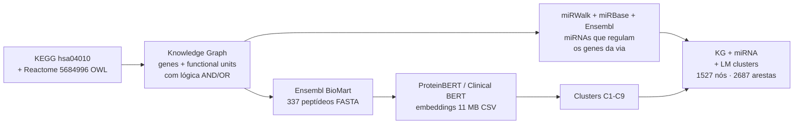

# Exercícios — Omics and Language Models

Os arquivos desta pasta materializam o pipeline da aula: pegar uma via biológica concreta (**MAPK signaling**, hsa04010 do KEGG / R-HSA-5684996 do Reactome) e atravessar todas as camadas vistas em sala — KEGG/Reactome → grafo de conhecimento no Cytoscape → miRNAs que regulam os genes da via → embeddings de proteínas via Ensembl BioMart + ProteinBERT → clusters no espaço vetorial.

## Pipeline geral



## Dois conjuntos de artefatos

### `pathway-mir-mrna/` — workflow de embedding gene→cluster

Versão "enxuta" focada na geração e visualização dos embeddings de proteínas:

| Arquivo | Conteúdo |
| --- | --- |
| `mir-mrna-embed.ows` | Workflow Orange (304 KB) que carrega o FASTA, gera embeddings e plota o resultado. |
| `mart_export.fasta` | Export do **Ensembl BioMart** (217 KB) — **337 peptídeos** com cabeçalho pelo nome do gene (`>RELB`, `>MAPK1`, `>BRAF`...). Genes da via MAPK signaling. |
| `mapk-gene-embeddings.csv` | **11 MB** — saída do Clinical BERT / ProteinBERT, um vetor de embedding por gene. Cada linha é uma proteína; colunas são dimensões do embedding (centenas). |
| `genes-pathway-to-mirwalk.csv` | **300 genes** da via MAPK (uma coluna `label`) — lista usada como entrada para o miRWalk. |

### `mapk/` — pipeline completo Knowledge Graph + miRNA + LM

Versão expandida que combina **estrutura de via** (KEGG/Reactome) com **regulação por miRNAs** e **camada semântica de embeddings**.

```
mapk/
├── 5684996.owl                       # 4,1 MB - Reactome BioPAX L3 da via MAPK1/MAPK3 (R-HSA-5684996)
├── kegg/
│   ├── hsa04010.xml                  # 66 KB - KGML da MAPK signaling pathway do KEGG
│   └── hsa_genes.tsv                 # 2,6 MB - mapa KEGG ID → símbolo HGNC para genes humanos
├── ensembl/
│   └── mir-ensembl.csv               # 1.105 miRNAs (nomes hsa-miR-... vindos do Ensembl)
├── miRWalk/
│   ├── genes-pathway-to-mirwalk.csv  # mesma lista de 300 genes do diretório irmão
│   └── miRWalk_miRNA_Targets.csv     # 1,5 MB - alvos preditos pelo miRWalk para esses genes
├── miRBase/
│   └── miRNA.csv                     # 8,3 MB - tabela de-para MIMAT ↔ nome canônico (release 22.1)
├── cytoscape/
│   ├── mapk-kg/                      # 423 nós, 487 arestas — só genes + functional_units
│   │   ├── mapk-kg-nodes.csv
│   │   └── mapk-kg-edges.csv
│   ├── mapk-kg-mir/                  # + miRNAs (1.527 nós)
│   │   ├── nodes-mapk-mir.csv
│   │   └── edges-mapk-mir.csv
│   └── mapk-kg-mir-lm/               # + clusters de language model (1.527 nós, 2.687 arestas)
│       ├── nodes-mapk-mir-lm.csv
│       └── edges-mapk-mir-lm.csv
├── clusters/
│   └── mapk-gene-embeddings.csv      # 338 linhas: gene → cluster (C1..C9)
├── mapk-kg-aggregated.cys            # Sessão Cytoscape pronta com o grafo agregado
├── mapk-to-kg.ows                    # Orange: KGML → grafo (nós/arestas) genes + functional_units
├── mapk-to-kg-mir.ows                # Orange: + miRNAs do miRWalk filtrados por mir-ensembl + miRBase
└── mapk-to-kg-mir-lm.ows             # Orange: + camada de clusters de embedding
```

## Como cada peça encaixa

### 1. KEGG MAPK signaling como grafo (`mapk-kg/`)

O KGML `hsa04010.xml` é processado pelo workflow `mapk-to-kg.ows` para gerar dois CSVs:

- **`mapk-kg-nodes.csv`** — colunas `id, label, full_label, type, logic, pathway`. Tipos: `gene` (ex.: `hsa:5923 / RASGRF1`) e `functional_unit` (ex.: `fu:d9cb13f7` com `logic=OR`).
- **`mapk-kg-edges.csv`** — colunas `source, target, source_label, target_label, type, subtype`. Tipos: `gene_to_fu` (gene alimenta unidade lógica) entre outros.

Functional units codificam **lógica booleana** da via (gene A AND gene B → ativam C; gene D OR gene E → ativam F) — diferente de PPI bruto, é uma representação **mais próxima da semântica da via**.

### 2. Adicionando miRNAs (`mapk-kg-mir/`)

O workflow `mapk-to-kg-mir.ows`:

1. Lê os 300 genes da via.
2. Submete ao **miRWalk** → recebe `miRWalk_miRNA_Targets.csv` (predições com 12 algoritmos).
3. Cruza com **miRBase** (`miRNA.csv`) para resolver MIMAT IDs em nomes oficiais (`hsa-miR-...`).
4. Restringe aos miRNAs que aparecem em **Ensembl** (`mir-ensembl.csv` — 1.105 IDs).
5. Adiciona nós `miRNA` e arestas `miRNA → gene` ao grafo.

Resultado: 1.527 nós e mais arestas.

### 3. Adicionando a camada de Language Model (`mapk-kg-mir-lm/`)

Combina o grafo anterior com os **clusters de embedding** vindos do pipeline `pathway-mir-mrna/`:

1. `mart_export.fasta` → ProteinBERT (no Hugging Face Space *Clinical Embedding*) → `mapk-gene-embeddings.csv` (vetores).
2. Clusterização dos vetores → `clusters/mapk-gene-embeddings.csv` (gene → C1..C9).
3. O workflow `mapk-to-kg-mir-lm.ows` anexa o rótulo de cluster como **propriedade dos nós-gene** ou cria **nós-cluster** conectados aos genes correspondentes.

A sessão `mapk-kg-aggregated.cys` é o resultado visual final no Cytoscape.

## Como abrir

| Ferramenta | Arquivos |
| --- | --- |
| **Orange Data Mining** | `*.ows` — abrir pelo menu `File → Open` |
| **Cytoscape** | `*.cys` (sessão completa) ou importar `nodes-*.csv` + `edges-*.csv` via `File → Import → Network from File` |
| **Hugging Face** | enviar `mart_export.fasta` ao Space `santanche/Clinical Embedding` com modelo ProteinBERT e pooling Mean |
| **Editor de texto** | `*.csv`, `*.tsv`, `*.fasta`, `*.xml` (KGML), `*.owl` (BioPAX) |

## Conexões

- O dataset MAPK (`hsa04010.xml` + `hsa_genes.tsv`) já apareceu na aula de [13/05](../../2026-05-13%20-%20Motifs%20e%20Link%20Prediction/exercicios/microRNA/kegg/) — aqui é reaproveitado, agora servindo como **substrato semântico** para o pipeline de embeddings.
- A lista `mir-ensembl.csv` continua a linha do trabalho com miRBase e miRWalk feito em [15/04](../../2026-04-15%20-%20microRNAs/README.md) e [29/04](../../2026-04-29%20-%20miRNA-mRNA%20Network/README.md).
- O passo `mart_export.fasta → ProteinBERT → embeddings` é exatamente o pipeline ilustrado nos slides em [`../README.md` — seção "Prática proposta — Ensembl BioMart + Clinical BERT"](../README.md).
