# Transformers e Embeddings

[slides: Transformers & Embeddings](slides-llm.pdf) | [slides: Omics and Language Models](slides-omics.pdf)

Aula de André Santanchè (Laboratory of Information Systems — LIS, IC/UNICAMP) — 25 de maio de 2026

> Sem gravação. Aula dupla com **dois decks**:
>
> - **`slides-llm.pdf`** — *NLP Basics: Transformers & Embeddings* (118 slides). Reapresenta a torre conceitual de NLP de [2026-05-20](../2026-05-20%20-%20Omics%20and%20Language%20Models/README.md) e expande para **árvore evolutiva dos LLMs**, **tamanhos de modelos**, **fine-tuning**, **BERTs especializados por domínio** (BioBERT, ClinicalBERT, LegalBERT, FinBERT) e **cenários de uso de embeddings** (busca semântica, RAG, recomendação, detecção de anomalia).
> - **`slides-omics.pdf`** — *Omics and Language Models* (80 slides, versão atualizada). Aplica a Parte II de 20/05 a problemas biológicos — metabolômica (EMBL-EBI), redes de reações químicas (Grzybowski 2009), embeddings hierárquicos pathway-composto-enzima (Basher & Hallam 2021), tradução de SMILES (Schwaller 2018, Strieth-Kalthoff 2020), proteínas como linguagem (**ProGen**, Madani 2023), pipeline **Ensembl BioMart → ProteinBERT → Orange**, estudo de caso **melanoma BRAF V600E + vemurafenibe** com Cypher + GitHub Copilot, e — novidades em relação a 20/05 — o modelo **CARBON** (HuggingFaceBio/carbon-demo, foundation model genômico autorregressivo com 393.216 BP de contexto), a referência canônica de **Graph Attention Networks** (Vrahatis, Lazaros & Kotsiantis 2024) e o **GAT Attention Explorer** que renderiza a saída do exercício no navegador.
>
> **Exercícios:** a pasta [`exercicios/gat/`](exercicios/gat/) traz a **saída de um Graph Attention Network treinado sobre a via MAPK (hsa04010) em câncer de tireoide (TCGA-THCA)** — 562 nós (300 genes, 244 unidades funcionais lógicas, 18 miRNAs) com **embeddings de 64 dimensões em 3 camadas**, **pesos de atenção** de 4 cabeças em 1101 arestas, e metadados. É o produto final do pipeline que vem sendo construído desde 29/04 (miRNA-mRNA THCA) e 20/05 (KEGG/Reactome + ProteinBERT), e pode ser explorado interativamente no [GAT Attention Explorer](https://datasci4health.github.io/language-model/gat/visualizer/).

---

## Em uma frase

Um **modelo de linguagem** transforma **palavras em vetores** num espaço onde palavras com contextos parecidos ficam próximas — e a partir dessa ideia surgem três famílias arquiteturais (Transformer encoder-decoder, **BERT** encoder-only, **GPT/Llama** decoder-only) cuja escala explodiu de 90 milhões para mais de 500 bilhões de parâmetros entre 2018 e 2024.

---

## Roteiro da aula

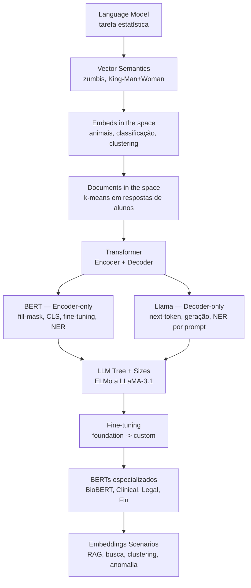

---

## Parte I — Construindo a intuição de Language Model

A aula reabre a discussão da semana anterior **devagar**: começa em "o que é uma palavra como vetor" antes de chegar em Transformer.

### 1. Modelo de linguagem como tarefa estatística

A definição operacional permanece a de **Jurafsky & Martin (2025)**:

> Um modelo de linguagem estima `p(próxima palavra | palavras anteriores)`.

A frase médica do slide — `pain radiating to the abdomen` — é destacada palavra a palavra em cores diferentes para enfatizar que cada token influencia a distribuição da próxima.

### 2. Vector semantics — a analogia dos zumbis

A mesma tabela de 5 zumbis ([altura × peso](../2026-05-20%20-%20Omics%20and%20Language%20Models/README.md#3-semântica-vetorial--analogia-dos-zumbis)) reaparece, agora com três operações sobre o plano `(peso, altura)`:

| Operação | O que mostra |
| --- | --- |
| **Comparar zumbis** | Doriana (1,87 × 60) está acima e à esquerda de Quincas (1,81 × 110) |
| **Calcular distância** | Triângulo Lucinda↔Doriana↔Dulcinéia mostra que duas distâncias quaisquer podem ser comparadas |
| **Classificar** | Círculo azul (`female`) contém Lucinda/Doriana/Dulcinéia; círculo vermelho (`male`) contém Asdrúbal/Quincas |

### 3. King − Man + Woman = Queen

A tabela `(female, royalty)` para Queen/King/Maid/Servant e as **operações com vetores** seguem idênticas à aula passada — mas agora o exercício do slide é **calcular à mão** que `Royalty + Female = Queen` e `King − Male + Female = Queen`.

A figura clássica de **Mikolov, Yih & Zweig (2013)** (`MAN → WOMAN`, `UNCLE → AUNT`, `KING → QUEEN` como translações paralelas no espaço) fecha o argumento de que o espaço aprendido captura **regularidades semânticas**.

### 4. Embeds e Learning Embeds — exemplo dos animais

A pergunta operacional: **e se o modelo descobrir as dimensões sozinho?** Cinco animais — **pterodáctilo, pato, águia, ornitorrinco, castor** — viram cinco vetores binários com colunas inferidas pelas frases que cabem para cada um:

```
                 fly  eggs  feathers  fur   milk
pterodáctilo      1    1     1        0     0
pato              1    1     1        0     0
águia             1    1     1        0     0
ornitorrinco      0    1     0        1     1
castor            0    0     0        1     1
```

Plotados num scatter com **densidade de cinza no eixo X** (cor do pelo / penas) e **densidade de cinza no eixo Y** (porte), o espaço **separa naturalmente** os clusters:

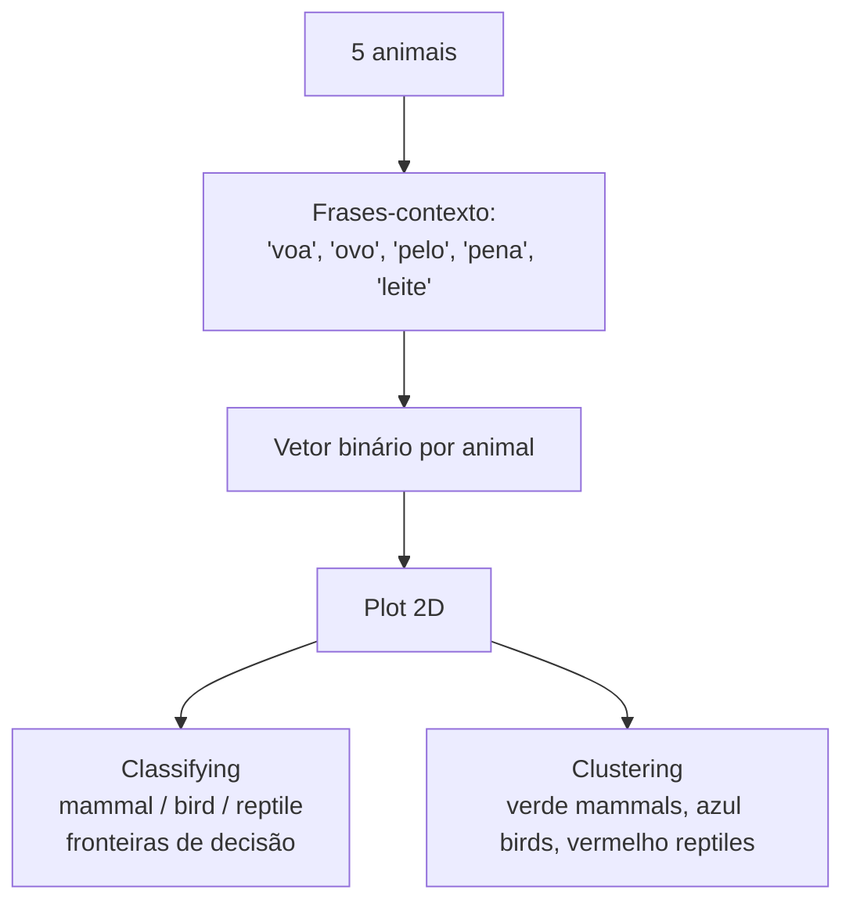

A aula mostra duas versões de clustering:
- **Bem separado** — três círculos quase disjuntos (cenário ideal).
- **Sobreposto** — três círculos com intersecções (cenário real, onde o ornitorrinco fica no overlap de mammals e birds).

### 5. Documents in the space

Mesma ideia, mas para **documentos inteiros**: cada documento vira um ponto, e o espaço suporta:

| Tarefa | O que mostra |
| --- | --- |
| **Clustering** | Dois grandes grupos (azul e vermelho) emergem sem rótulos |
| **Classification** | Três zonas — `Negative`, `Neutral`, `Positive` — separadas por linhas tracejadas (sentiment analysis) |
| **K-means em respostas de alunos** | Cinco clusters reais (C1–C5) plotados sobre 800+ pontos coloridos — uma aplicação real de embedding + k-means usado pelo grupo do professor |

---

## Parte II — Transformer, Encoder, Decoder

### 6. Encoder-decoder — exemplo de tradução

Inspirado no clássico **Jay Alammar** (*Visualizing A Neural Machine Translation Model*), a aula desenha o seq2seq em três telas sucessivas:

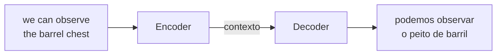

Pontos didáticos:
- **Encoder** recebe a sequência de tokens (com embeddings *individuais*) e produz uma **sequência de embeddings contextuais** — cada token agora "sabe" sobre os outros.
- **Contexto** = essa pilha de vetores é passada ao decoder.
- **Decoder** gera a sequência de saída token por token, consultando o contexto.

### 7. As três famílias arquiteturais

O slide mais denso da aula é o **trio comparativo**:

| Arquitetura | Componentes | Exemplos | Bom para |
| --- | --- | --- | --- |
| **Transformer original** | Encoder + Decoder | T5, BART | tradução, sumarização (seq2seq) |
| **GPT / Llama** | Decoder-only<br/>(Masked Multi-Head Attention) | GPT-1/2/3/4, Llama, PaLM | geração, chat, completar texto |
| **BERT** | Encoder-only<br/>(Multi-Head Attention bidirecional) | BERT, RoBERTa, ELECTRA, DistilBERT, DeBERTa | classificação, NER, similaridade, embeddings |

A diferença visual essencial:

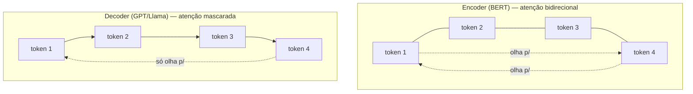

### 8. BERT — fill-mask training

Tarefa de treinamento (sem necessidade de anotação humana):

1. Frase original: `examination we can observe the barrel chest`.
2. Mascarar um token: `examination we can observe the <?> chest`.
3. BERT chuta uma palavra-candidato — `barrel`, `bus`, `ear`, ...
4. Comparar o embedding produzido com o embedding alvo (`barrel`).
5. Se errou (`bus`), ajustar pesos para diminuir a similaridade com o errado e aumentar com o certo.
6. Repetir bilhões de vezes em corpus livre.

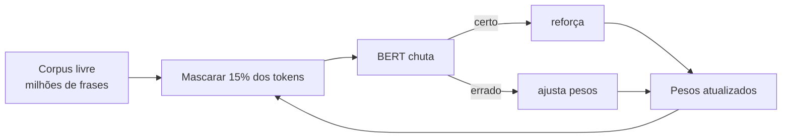

A propriedade emergente: o embedding de `barrel` em `barrel chest` (médico) diverge do embedding de `barrel` em `wine barrel`.

### 9. BERT — atenção visualizada com BertViz

Para tornar concreta a "atenção", a aula recomenda dois recursos:

| Ferramenta | URL | Para que serve |
| --- | --- | --- |
| **BertViz** | https://github.com/jessevig/bertviz | Notebook interativo para ver quais tokens "olham para" quais |
| **The Illustrated Transformer** (Jay Alammar) | https://jalammar.github.io/illustrated-gpt2/ | Tutorial visual completo de self-attention e masked self-attention |

A figura do slide mostra a frase `[CLS] the rabbit quickly hopped [SEP] the turtle slowly crawled` — ao pousar o cursor em `quickly`, linhas de intensidade variável se conectam a `rabbit`, `hopped`, `[SEP]`, etc.

### 10. BERT — Encoder + Classification

O token especial `[CLS]` é prefixado à sentença. Seu embedding final agrega informação da frase inteira. Conectando-o a um **classificador externo** (camada linear + softmax) BERT vira um motor de classificação genérico:

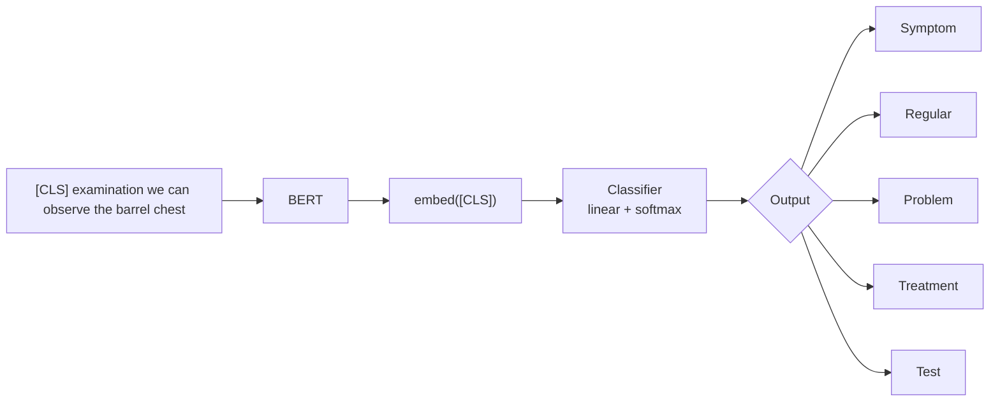

Aplicações canônicas: triagem de prontuários, análise de sentimento, detecção do tipo de seção em texto médico.

### 11. BERT — Entity Recognition com Fine-Tuning

Para **anotar entidades por token** (NER), em vez de só classificar a frase, BERT recebe um pequeno dataset anotado por especialista:

```
Doença pulmonar obstrutiva crônica é uma condição pulmonar de elevada
^^^^^^^^^^^^^^^^^^^^^^^^^^^^^^^^^^                 ^^^^^^^
<physical>                                         <epidemiology>
```

Fine-tuning faz BERT ajustar os pesos para que o embedding final de `barrel chest` (ou `hypoxemia`) projete no token-rótulo `<physical>`. Depois de treinado, qualquer texto novo (`chronic cough and barrel chest`) é anotado automaticamente.

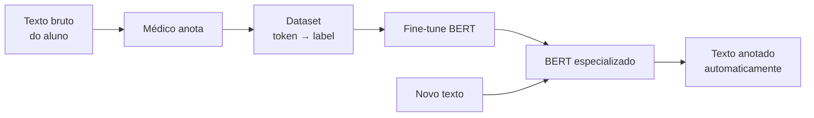

### 12. Decoder — Llama e geração token a token

O treinamento do decoder usa **next-token prediction**:

```
[pain] → Llama → "radiating"
[pain, radiating] → Llama → "to"
[pain, radiating, to] → Llama → "the"
[pain, radiating, to, the] → Llama → "chest"
```

Mesma lógica de erro/acerto do BERT, mas a "máscara" é o **futuro** — o modelo só vê o que veio antes, jamais o que virá depois (por isso a atenção é **mascarada**).

NER com Llama é feita **sem fine-tuning**, apenas por **prompting**:

```
System: "Annotate medical texts according to <labels: epidemiology, pathophysiology, physical exam>..."
User:   "Airway obstruction, commonly associated with smoking..."
Llama:  "Airway obstruction <pathophysiology>; associated with smoking <epidemiology>"
```

---

## Parte III — Famílias, tamanhos e fine-tuning

### 13. LLM Tree — árvore evolutiva 2018–2023

A figura **"LLM Evolutionary Tree"** mostra três grandes ramos:

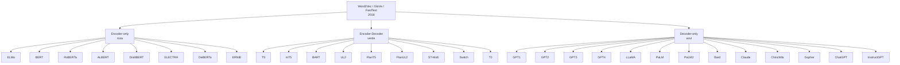

Pontos didáticos:
- O ramo **encoder-only** (rosa) **estagnou** após DeBERTa/ELECTRA (~2020). BERT continua dominante para classificação/embeddings.
- O ramo **encoder-decoder** (verde) é menor, ocupado por T5/BART/UL2 e variantes instruct.
- O ramo **decoder-only** (azul) explodiu — GPT-3 (2020), LLaMA (2023), GPT-4 (2023), Claude, Bard, ChatGPT.

A legenda colorida distingue **Open-Source** (cinza claro) de **Closed-Source** (cinza escuro). Anthropic, Google e OpenAI dominam fechados; Meta (LLaMA) e BigScience (BLOOM) lideram abertos.

### 14. LLM Sizes — a corrida do tamanho

O gráfico **"PLM × LLM"** mostra o tamanho dos modelos em bilhões de parâmetros entre 2017 e 2025:

| Era | Modelos representativos | Tamanho |
| --- | --- | --- |
| **PLM** (Pre-trained LM, até 2020) | ELMo 0.009B, GPT 0.11B, **BERT 0.34B**, XLM 0.65B, GPT-2 1.5B, Megatron 8.3B, T5 11B, Turing-NLG 17B | < 20 B |
| **LLM** (2021 →) | **GPT-3 175B**, OPT 175B, BLOOM 176B, Galactica 120B, Chinchilla 70B, LLaMA 65B, LLaMA-2 70B, **LLaMA-3.1 405B**, PaLM 540B, PaLM-2 340B, Megatron-Turing 530B, QWen-1.5 110B, QWen-2 72B | > 70 B |

A linha tracejada vertical em 2020/2021 marca a fronteira **PLM → LLM** — o salto qualitativo de "modelo treinado, pode adaptar" para "modelo que faz quase tudo só com prompt".

### 15. Encoder Sizes — multimodal e crescimento dos encoders

Um segundo gráfico (gerado pelo ChatGPT) mostra a evolução dos **text encoders BERT-like** entre 2018 e 2024:

- **BERT 0.34B** → **RoBERTa 0.35B** → **XLM-R 5.5B** → **BigBird 1.3B** → **MacBERT 1.5B** → **LaBSE-2 7B** → **XLM-V 12.2B**
- A linha cresce devagar até 2022 e dispara em 2023 com encoders multimodais (texto + visão).

A virada multimodal é onde os encoders voltam ao palco — **CLIP**, **XLM-V** e variantes usam o mesmo princípio do BERT, mas alinham texto e imagem no mesmo espaço.

### 16. Practice on Hugging Face

A aula referencia o **espaço pessoal do professor** em https://huggingface.co/santanche com seis spaces ativos:

| Space | Função | Status |
| --- | --- | --- |
| **Clinical NER Pipeline Comparison** | comparar estratégias de NER clínica | Running |
| **Clinical Ner** | NER clínica simples | Running |
| **Clinical Embedding** | gerar embeddings clínicos para frases | Running |
| **Sentiment Analysis Oid** | sentiment analysis com OID/FastAPI | Sleeping |
| **Factory ML** | factory client/server OID/FastAPI | Sleeping |
| **Cancer Predictor** | diagnóstico de câncer de mama via FastAPI | Sleeping |

### 17. Fine-tuning de um modelo neural

Esquema canônico em duas etapas:

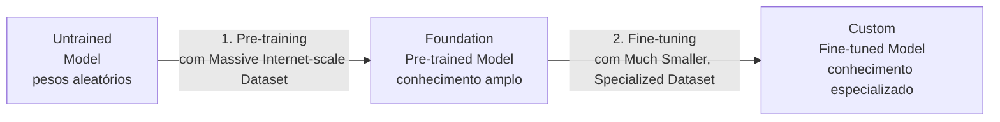

Variante mais detalhada (figura gerada pelo **Gemini**): o **Foundation Model** tem **Frozen Generic Layers** (extração de features genéricas) + **Generic Task Layers**. No fine-tuning, congela-se as primeiras e **ajusta-se apenas as últimas** com um dataset especializado (saúde, no exemplo), produzindo um **Custom Fine-tuned Model**.

### 18. BERTs especializados por domínio

A figura mostra cinco famílias de BERTs adaptados:

| Domínio | Modelos | Onde usar |
| --- | --- | --- |
| **Biomedical & Clinical** | **BioBERT**, **ClinicalBERT**, **SciBERT**, **PubMedBERT**, **BioXLM** | extração de entidades médicas, similaridade de prontuários |
| **Legal Domain** | **LegalBERT**, **CaseLawBERT** | contratos, jurisprudência |
| **Social Media & Multilingual** | **BERTweet**, **CamemBERT** (francês), **GermanBERT**, **BETO** (espanhol) | tweets, redes sociais |
| **Finance & Economics** | **FinBERT**, **FinBERT-Tone** | análise de relatórios financeiros |
| **Science & Tech** | **ChemBERTa**, **MatSciBERT**, **PatentBERT** | química, materiais, patentes |

Ponto da aula: **se o domínio existe e tem corpus, alguém já fez BERT-X**.

### 19. Clinical Embedding em ação

O space `santanche/Clinical Embedding` é demonstrado vivo com duas duplas de frases-teste:

#### Caso 1 — `cold` polissêmico

```
1. The patient has a [cold] and mild fever.
2. The room was [cold] overnight.
```

| Modelo | O que mostra |
| --- | --- |
| **Clinical BERT** | Heatmaps **diferentes** para as duas frases → reconhece `cold` médico vs. temperatura |
| **Standard BERT** | Heatmaps razoavelmente diferentes, mas com menos contraste |
| **Word2Vec** | Heatmaps **idênticos** — Word2Vec não tem contexto, então `cold` é sempre o mesmo vetor |

#### Caso 2 — `depression` polissêmico

```
1. She has a history of [depression].
2. The road has a [depression] near the bridge.
```

Mesma conclusão: Clinical BERT consegue separar `depression` clínico (transtorno) de `depression` geográfico (depressão do terreno). Word2Vec colapsa os dois.

A demonstração é o argumento operacional para usar **BERTs especializados** em vez de embeddings clássicos quando o domínio é o foco.

---

## Parte IV — Cenários de uso de embeddings

A aula encerra com um mapa do que **dá pra fazer** depois de ter embeddings:

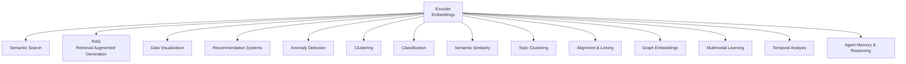

Lista canonical do slide final:

1. **Semantic Similarity** — quão próximo `headache` está de `migraine`?
2. **Semantic Search** — buscar artigo médico por significado, não palavra-chave.
3. **Text Classification** — sentimento, tipo de seção, triagem.
4. **Topic Clustering** — descobrir tópicos sem rótulos.
5. **Recommendation Systems** — "outras pessoas que leram X também leram Y".
6. **Alignment & Linking** — ligar `BRAF` em texto a `P15056` em UniProt[^URI].
7. **Graph Embeddings** — embutir nós de grafos (PPI, KEGG) no mesmo espaço — é o ponto onde o exercício desta aula se conecta.
8. **Multimodal Learning** — texto + imagem (CLIP, XLM-V).
9. **Temporal Analysis** — séries temporais (sinais clínicos, monitoramento).
10. **Agent Memory & Reasoning** — memória de LLM agentes para tarefas longas.

---

## Parte V — Omics e Modelos de Linguagem (segundo deck)

O segundo deck (`slides-omics.pdf`) revisita a Parte II de 20/05 com **três adições importantes** e fecha o ciclo apresentando o GAT que produziu os arquivos do exercício.

### 20. CARBON — foundation model genômico

> **HuggingFaceBio/carbon-demo** — https://huggingface.co/spaces/HuggingFaceBio/carbon-demo

**CARBON** (CAREs for Genomes) é um **modelo de linguagem autorregressivo** treinado **diretamente sobre DNA**:

| Característica | Valor |
| --- | --- |
| Arquitetura | Decoder-only (estilo GPT/Llama) |
| Contexto | **393.216 BP** (~393 kb — comparável a um cromossomo bacteriano pequeno) |
| Tokenização | **6-mers** (cada token = 6 bases consecutivas) |
| Tokens de treino | **1 trilhão** |
| Aba | DNA Lab, Carbon Recipe, Sandbox (Hugging Face Space) |

A consequência prática: se Llama prevê próxima palavra em inglês, **CARBON prevê próximo 6-mer no genoma** — mesma arquitetura, "linguagem" diferente. Pode gerar sequências artificiais, anotar regiões, classificar variantes — sempre via prompt + completion no espaço de DNA.

### 21. Graph Attention Networks — fechando a sequência

> **Vrahatis, A. G., Lazaros, K., & Kotsiantis, S. (2024).** Graph Attention Networks: A Comprehensive Review of Methods and Applications. *Future Internet*, 16(9), 318. https://doi.org/10.3390/FI16090318

O slide-chave da aula é o **diagrama do GAT**: um nó central `h₁` recebendo atenção `α₁₂`, `α₁₃`, `α₁₄`, `α₁₅`, `α₁₆` dos vizinhos `h₂`...`h₆`, agregando-os com média ponderada para produzir o novo estado `h₁'`:

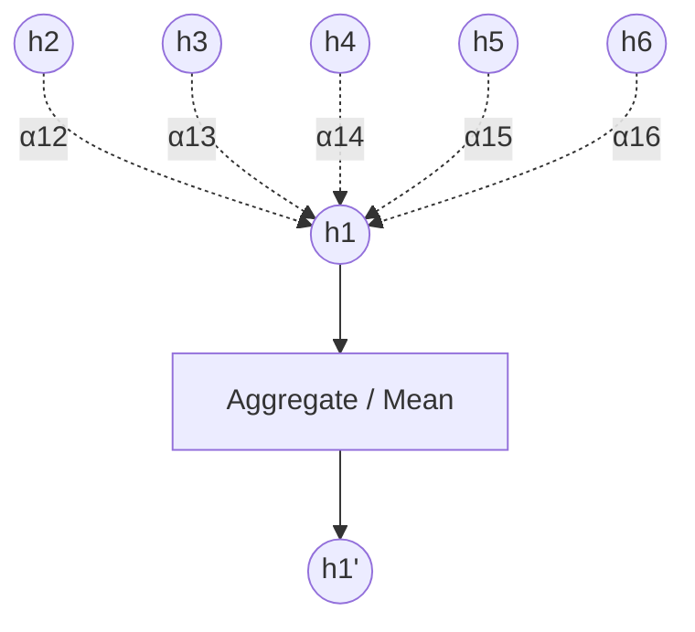

A virada conceitual da aula: **mecanismo de atenção é o mesmo do Transformer**, mas em vez de cada token olhar para todos os outros tokens, **cada nó do grafo olha apenas para seus vizinhos**. Isso é o que permite usar GAT em redes biológicas (PPI, KEGG, miRNA-target) sem explodir o custo computacional.

### 22. GAT Attention Explorer — visualizando o exercício

> https://datasci4health.github.io/language-model/gat/visualizer/

A ferramenta web carrega exatamente os quatro CSVs da pasta [`exercicios/gat/`](exercicios/gat/) e permite:

- Filtrar por **camada** (Layer 1 / 2 / 3) e **número de hops** (1 / 2 / 3) a partir de um nó-foco.
- Filtrar por **edge type** (PPI, mir-to-gene, gene-to-fu, self-loop).
- Escolher **attention head** (1–4 ou média).
- Selecionar um nó (ex.: `MAPK9`) e ver no painel direito: **outgoing attention** (com porcentagens por head), **incoming attention**, e **nós alcançáveis em N hops** com a probabilidade acumulada (ex.: `MAPK9 → MAP3K2 (33.2%) → MAP3K4 (35.2%) → ...`).

Cor dos nós: verde = gene, vermelho/laranja = miRNA, azul/roxo = unidade funcional (AND/OR). Cor das arestas: intensidade pela atenção (escuro = alta, claro = baixa). É exatamente a **interface de leitura dos arquivos do exercício**.

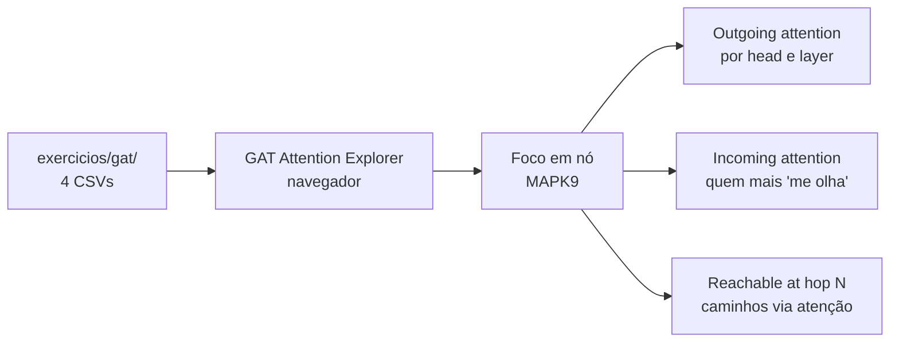

### 23. Outras retomadas

O resto do deck recapitula material de 20/05 (já documentado lá): metabolômica EMBL-EBI, redes de reações químicas (Grzybowski 2009), embeddings hierárquicos (Basher & Hallam 2021), tradução de SMILES no encoder-decoder (Schwaller 2018, Strieth-Kalthoff 2020), embeddings de solventes (Gao 2018), ProGen (Madani 2023) e os três cenários Cypher + GitHub Copilot da via MAPK (com contexto, sem contexto, caminho reverso).

A **prática proposta** repete o pipeline `Ensembl BioMart → Clinical BERT Embeddings → Orange` para gerar embeddings de proteínas/miRNAs, e o exercício de **pathway as document embedding** sobre WikiPathways GMT (`wikipathways-20251010-gmt-Homo_sapiens.gmt`, 332 KB).

---

## Conexões com aulas anteriores

- **2026-05-20 — Omics and Language Models**: esta aula reapresenta e expande **a Parte I** (Fundamentos de LMs) com novo enquadramento de famílias arquiteturais, árvore evolutiva, tamanhos e fine-tuning. Os exemplos médicos (`barrel chest`, `cold`, `depression`) e a tabela `(female, royalty)` são os mesmos.
- **2026-05-11 — Representação de Conhecimento**: o slide de **Embedding Scenarios** retoma **alignment & linking** (URIs, surrogates) e **graph embeddings** como aplicação direta de encoders.
- **2026-05-13 — Motifs e Link Prediction**: a noção de que **similaridade no espaço vetorial = predição de aresta** dialoga com Common Neighbors / Jaccard / Katz — agora com features semânticas em vez de só topológicas.
- **2026-04-29 — miRNA-mRNA Network (THCA)**: o exercício desta aula é a **continuação direta** do pipeline TCGA-THCA — agora com saída de **GAT** treinado sobre a via MAPK.

---

## Conexões com o projeto semestral

O exercício é diretamente aproveitável no componente **Graph Attention Network** do projeto de câncer de pele:

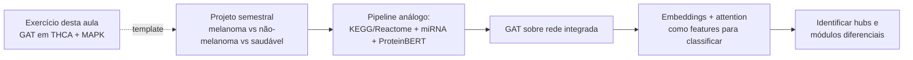

O exercício é uma **prova de conceito completa** do pipeline que vai rodar no projeto, com tudo já pronto para reproduzir: pesos de atenção das 4 cabeças, embeddings em 3 camadas, metadados de nó (logFC, pathway, encoder) e de aresta (tipo da interação, atenção média/máxima).

---

## Referências mencionadas em aula

1. **Bengio, Y., Ducharme, R., Vincent, P., Jauvin, C. et al. (2003).** A Neural Probabilistic Language Model. *Journal of Machine Learning Research*, 3, 1137–1155.
2. **Conway, D., & White, J. M. (2012).** *Machine Learning for Hackers*. O'Reilly.
3. **Jurafsky, D., & Martin, J. H. (2025).** *Speech and Language Processing*. 3rd ed.
4. **Keogh, E. J. (2003).** A Gentle Introduction to Machine Learning and Data Mining for the Database Community. *Proc. XVIII Brazilian Symposium on Databases*.
5. **Mikolov, T., Yih, W., & Zweig, G. (2013).** Linguistic Regularities in Continuous Space Word Representations. *Proc. NAACL-HLT*, 746–751. https://aclanthology.org/N13-1090
6. **Alamro, H., Gojobori, T., Essack, M., & Gao, X. (2024).** BioBBC: a multi-feature model that enhances the detection of biomedical entities. *Scientific Reports*, 14. https://doi.org/10.1038/s41598-024-58334-x
7. **Benton, M. J., Forth, J., & Langer, M. C. (2014).** Models for the rise of the dinosaurs. *Current Biology*, 24(2), R87–R95.
8. **Halabisky, B. (2020).** Classification of Neuronal Data. https://hlab.stanford.edu/brian/cluster_analysis.html
9. **Kumar, R., Srivastava, R., & Srivastava, S. (2015).** Detection and Classification of Cancer from Microscopic Biopsy Images. *J. Medical Engineering*, 2015, 457906.
10. **Street, W. N., Wolberg, W. H., & Mangasarian, O. L. (1993).** Nuclear feature extraction for breast tumor diagnosis. *Electronic Imaging*, 1905.
11. **Wolberg, W. H., Street, W. N., & Mangasarian, O. L. (1994/1995).** Machine learning techniques to diagnose breast cancer. *Cancer Letters* 77(2–3), 163–171; *Human Pathology* 26(7), 792–796.
12. **He, K., Mao, R., Lin, Q., Ruan, Y., Lan, X., Feng, M., & Cambria, E. (2025).** A survey of large language models for healthcare: from data, technology, and applications to accountability and ethics. *Information Fusion*, 118, 102963.
13. **Grzybowski, B. A., Bishop, K. J. M., Kowalczyk, B., & Wilmer, C. E. (2009).** The 'wired' universe of organic chemistry. *Nature Chemistry*, 1(1), 31–36.
14. **Basher, A. R. M. A., & Hallam, S. J. (2021).** Leveraging heterogeneous network embedding for metabolic pathway prediction. *Bioinformatics*, 37(6), 822–829. https://doi.org/10.1093/BIOINFORMATICS/BTAA906
15. **Schwaller, P., Gaudin, T., Lányi, D., Bekas, C., & Laino, T. (2018).** "Found in Translation": predicting outcomes of complex organic chemistry reactions using neural sequence-to-sequence models. *Chemical Science*, 9(28), 6091–6098. https://doi.org/10.1039/C8SC02339E
16. **Strieth-Kalthoff, F., Sandfort, F., Segler, M. H. S., & Glorius, F. (2020).** Machine learning the ropes: principles, applications and directions in synthetic chemistry. *Chemical Society Reviews*, 49(17), 6154–6168. https://doi.org/10.1039/C9CS00786E
17. **Madani, A., Krause, B., Greene, E. R., Subramanian, S., Mohr, B. P., Holton, J. M., Olmos, J. L., Xiong, C., Sun, Z. Z., Socher, R., Fraser, J. S., & Naik, N. (2023).** Large language models generate functional protein sequences across diverse families. *Nature Biotechnology*, 41(8), 1099–1106. https://doi.org/10.1038/S41587-022-01618-2
18. **Wagle, N. et al. (2011).** Dissecting Therapeutic Resistance to RAF Inhibition in Melanoma by Tumor Genomic Profiling. *J. Clinical Oncology*, 29(22), 3085. https://doi.org/10.1200/JCO.2010.33.2312
19. **Vrahatis, A. G., Lazaros, K., & Kotsiantis, S. (2024).** Graph Attention Networks: A Comprehensive Review of Methods and Applications. *Future Internet*, 16(9), 318. https://doi.org/10.3390/FI16090318

**Recursos didáticos externos:**

- **Jay Alammar** — *Visualizing A Neural Machine Translation Model* (https://jalammar.github.io/visualizing-neural-machine-translation-mechanics-of-seq2seq-models-with-attention/) e *The Illustrated GPT-2* (https://jalammar.github.io/illustrated-gpt2/).
- **BertViz** — https://github.com/jessevig/bertviz
- **A Complete Guide to BERT with Code** — https://medium.com/data-science/a-complete-guide-to-bert-with-code-9f87602e4a11
- **Exploring the Landscape of LLMs** (dnacap.fund) — https://dnacap.fund/insights/exploring-the-landscape-of-large-language-models
- **Jay's Intro to AI** — https://jalammar.github.io/jays-intro-to-ai/
- **AI is Eating The World** (Jay Alammar / Cohere) — https://cohere.com/blog/ai-is-eating-the-world
- **GAT Attention Explorer** (turma) — https://datasci4health.github.io/language-model/gat/visualizer/
- **GAT GitHub** (turma) — https://github.com/datasci4health/datasci4health.github.io/tree/master/language-model/gat
- **CARBON Hugging Face Space** — https://huggingface.co/spaces/HuggingFaceBio/carbon-demo

---

## Notas

[^URI]: **URI** (Uniform Resource Identifier) — string que identifica **univocamente** um recurso. Em bioinformática, `https://www.uniprot.org/uniprot/P15056` identifica a proteína B-RAF, sem ambiguidade. É a base do mecanismo de "alignment & linking": ligar uma menção em texto ao recurso correto na base de dados. Conceito tratado em detalhe em [2026-05-11](../2026-05-11%20-%20Representação%20de%20Conhecimento%20e%20Grafos/README.md).
