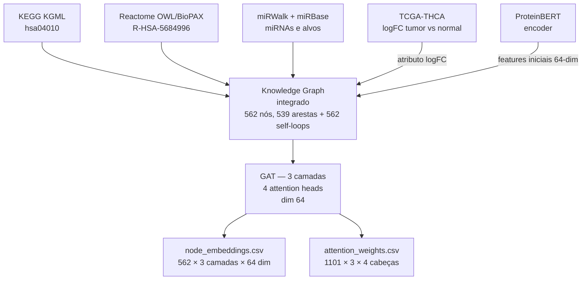
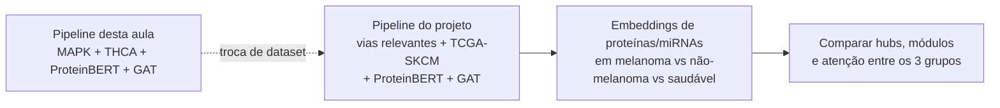

# Exercícios — GAT sobre MAPK em câncer de tireoide (THCA)

Saída completa de um **Graph Attention Network (GAT)** treinado sobre a via **MAPK signaling (KEGG hsa04010)** em câncer papilífero de tireoide (**TCGA-THCA**). É a fechadura prática do pipeline construído ao longo de:

- [2026-04-29 — miRNA-mRNA Network](../../2026-04-29%20-%20miRNA-mRNA%20Network/README.md) — dados TCGA-THCA, miRWalk, miRBase.
- [2026-05-20 — Omics and Language Models](../../2026-05-20%20-%20Omics%20and%20Language%20Models/README.md) — knowledge graph MAPK (KEGG KGML + Reactome OWL/BioPAX + miRWalk + Ensembl), embeddings de proteínas com **ProteinBERT**.
- [2026-05-25 — Transformers e Embeddings](../README.md) — esta aula: arquitetura encoder-only + atenção.

---

## Em uma frase

O GAT consome o **knowledge graph integrado da via MAPK em THCA** (genes + unidades funcionais lógicas KEGG + miRNAs) com **features iniciais de ProteinBERT** e produz **embeddings contextuais por nó em 3 camadas** + **pesos de atenção por aresta em 4 cabeças**, que podem ser usados para ranquear hubs, encontrar módulos e prever interações.

## Explorador interativo

Os mesmos 4 CSVs desta pasta são consumidos pelo **GAT Attention Explorer** (web, no navegador):

🔗 **https://datasci4health.github.io/language-model/gat/visualizer/**

Permite filtrar por camada (1/2/3), número de hops (1/2/3), tipo de aresta e *attention head*, e selecionar um nó-foco (ex.: `MAPK9`) para ver outgoing/incoming attention e nós alcançáveis. Código-fonte: https://github.com/datasci4health/datasci4health.github.io/tree/master/language-model/gat.

---

## Estrutura da pasta

```
gat/
├── node_metadata.csv       (562 nós × 8 colunas)
├── node_embeddings.csv     (1686 linhas = 562 × 3 camadas × 64 dim)
├── edge_metadata.csv       (1101 arestas × 6 colunas)
└── attention_weights.csv   (3303 linhas = 1101 × 3 camadas × 4 cabeças + mean)
```

### `node_metadata.csv`

| coluna | tipo | exemplo | significado |
| --- | --- | --- | --- |
| `node_index` | int | 0 | índice 0-based |
| `id` | string | `BRAF`, `MIMAT0000430`, `fu:f41186cd` | identificador (gene symbol HGNC / miRBase MIMAT / hash de functional unit) |
| `type` | enum | `gene` (300), `functional_unit` (244), `miR` (18) | tipo do nó |
| `logic` | enum | `AND`, `OR`, ` ` | operador lógico (só para unidades funcionais) |
| `pathway` | string | `path:hsa04010` | via KEGG |
| `logFC` | float | `4.11654` | log-fold-change tumor vs. normal (só para genes) |
| `embedding_l2_norm` | float | `0.291` | norma L2 do embedding inicial (ProteinBERT) |
| `encoder` | string | `proteinbert` | encoder de features iniciais |

### `node_embeddings.csv`

Wide format: cada linha é **um nó em uma camada do GAT**. Colunas: `node_id`, `layer` (1–3), `dim_0` ... `dim_63`. São **três snapshots** do mesmo nó conforme ele passa pelas três camadas de atenção:

```
layer 1: features iniciais (ProteinBERT projetadas para 64 dim)
layer 2: após uma rodada de agregação por atenção
layer 3: após segunda rodada (representação final)
```

### `edge_metadata.csv`

Resumo das 1101 arestas do grafo final:

| `subtype` | quantidade | significado |
| --- | --- | --- |
| `self_loop` | 562 | identidade (padrão em GAT — cada nó "olha pra si") |
| `gene_to_fu` | 322 | gene participa de uma unidade funcional lógica KEGG (input de AND/OR) |
| `protein_protein_interaction` | 163 | PPI direta entre genes |
| `mir_to_gene` | 53 | miRNA → alvo gênico (miRWalk + miRTarBase) |
| `gene_expression_regulation` | 1 | regulação de expressão direta |

Cada aresta tem **`final_layer_mean_attn`** e **`final_layer_max_attn`** — média e máximo da atenção atribuída pelas 4 cabeças na **última camada**.

### `attention_weights.csv`

Granular: uma linha por **(aresta × camada)**. Colunas:

| coluna | exemplo | significado |
| --- | --- | --- |
| `layer` | 1, 2, 3 | camada do GAT |
| `source` → `target` | `MIMAT0000430` → `NFKB1` | aresta |
| `edge_type` | `mir_to_gene` | tipo |
| `mean_attention` | 0.497 | média das 4 cabeças |
| `head_1_attention` ... `head_4_attention` | 0.509, 0.483, 0.497, 0.501 | atenção atribuída por cada cabeça |

---

## Pipeline conceitual



---

## Ideias de exploração

| Tarefa | Como atacar |
| --- | --- |
| **Rankear hubs por atenção** | Somar `final_layer_max_attn` por nó destino (in-attention agregada) e plotar top-20 |
| **Identificar miRNAs influentes** | Filtrar `edge_type == 'mir_to_gene'` em `attention_weights.csv` na camada 3 e olhar os com `mean_attention` mais alto |
| **Clusterizar nós** | UMAP / t-SNE sobre `dim_0..dim_63` da camada 3 → colorir por `type` (gene/miRNA/fu) ou `logFC` |
| **Comparar cabeças** | Heatmap 4×N das atenções por cabeça — cabeças que "convergem" vs. cabeças que pegam padrões diferentes |
| **Predição de aresta** | Treinar um classificador binário sobre pares de embeddings para predizer PPI ausentes |
| **Comparar camadas** | Distância L2 entre embedding do nó na camada 1 e na camada 3 — quanto cada nó "se move" com a atenção |

Notebook sugerido (rascunho em Marimo):

```python
import pandas as pd
import numpy as np

nodes = pd.read_csv("gat/node_metadata.csv")
edges = pd.read_csv("gat/edge_metadata.csv")
emb   = pd.read_csv("gat/node_embeddings.csv")
attn  = pd.read_csv("gat/attention_weights.csv")

# Embeddings finais (camada 3) como matriz 562 × 64
final = emb[emb.layer == 3].set_index("node_id").drop(columns="layer")

# Top hubs por atenção entrante
hubs = (attn.query("layer == 3")
            .groupby("target")["mean_attention"].sum()
            .sort_values(ascending=False)
            .head(20))
print(hubs)
```

---

## Conexão com o projeto semestral

Este é literalmente o **template do que vai virar o componente GAT** do projeto de câncer de pele:



O grupo só precisa repetir o pipeline com:
1. **Dataset** — TCGA-SKCM (melanoma) + amostras de não-melanoma + saudável.
2. **Vias** — escolher as relevantes (provavelmente MAPK, p53, WNT, PI3K-AKT).
3. **Encoder** — manter ProteinBERT (já provado neste exercício).
4. **GAT** — mesma arquitetura, treinada nos novos dados.

---

## Notas

- Os arquivos somam **~2,7 MB descompactados**, todos em CSV plano — leem direto em Pandas, Orange ou Cytoscape.
- O exercício **não inclui o código de treino do GAT** — só os artefatos finais. O foco didático é **interpretar** atenção e embeddings, não re-treinar.
- IDs `MIMAT*` são identificadores **miRBase** dos miRNAs maduros (ex.: `MIMAT0000430` = hsa-miR-1-3p). A conversão MIMAT ↔ nome humano-legível usa o mapeamento miRBase visto em [2026-04-29](../../2026-04-29%20-%20miRNA-mRNA%20Network/README.md).
- IDs `fu:HASH` são **unidades funcionais lógicas** extraídas do KGML do KEGG — representam pontos do mapa onde múltiplos genes formam um complexo (AND) ou são alternativos (OR) antes de ativar o próximo nó.
