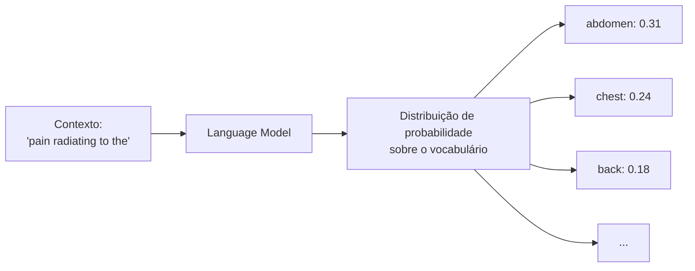
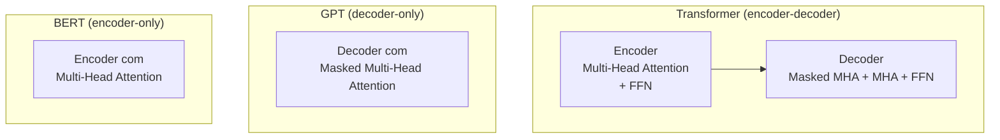
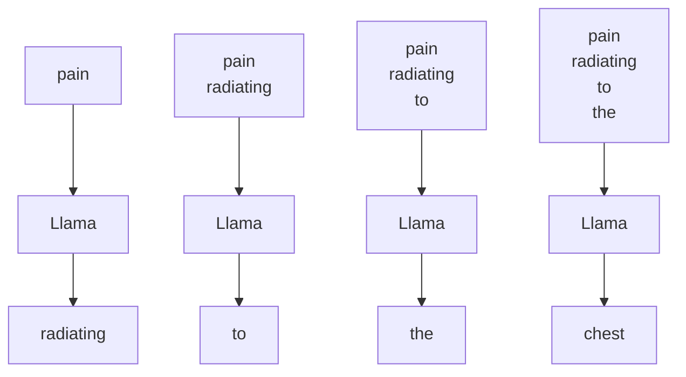
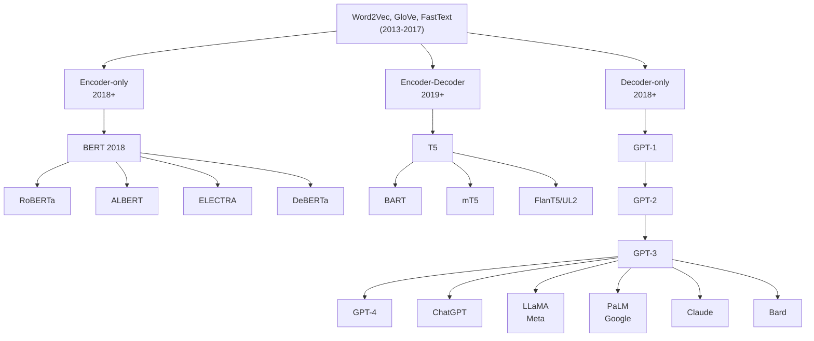
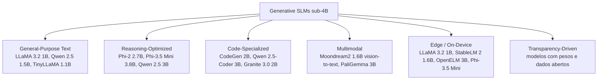
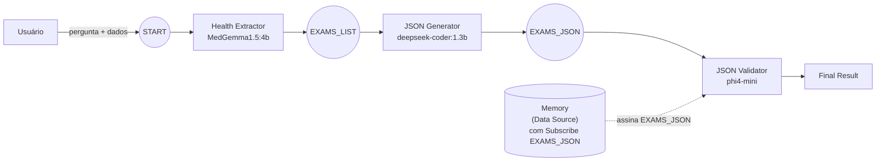

# Decoders, Modelos Generativos e SLMs

[slides](slides.pdf) | [exercícios](exercicios/)

Aula de André Santanchè (UNICAMP) — 1 de junho de 2026

*Sem gravação no momento da publicação deste resumo.*

---

## Em uma frase

A aula fecha a sequência de "NLP Basics" estudando **a outra metade do Transformer** — o **decoder**, responsável por gerar texto token a token (Llama, GPT, Phi); apresenta o universo dos **Small Language Models (SLMs)** sub-4B parâmetros que rodam em laptop; e mostra **duas abordagens para orquestrar múltiplos SLMs**: *workflow* (Flowise, tldraw computer, Orange LMSci) e *publish/subscribe* (sistema multi-agentes em Hugging Face Spaces).

---

## Parte I — Language Model como tarefa estatística

### O que é um *language model*?

Um **modelo de linguagem** é um sistema que aprende **a distribuição de probabilidade sobre sequências de palavras** numa língua. Dado um pedaço de texto, ele estima qual token (palavra ou pedaço de palavra) é mais provável vir em seguida.

Exemplo clínico da aula:

> "**pain radiating to the** ___"

O modelo aprende, vendo milhões de prontuários e textos médicos, que depois de "pain radiating to the" os tokens mais prováveis são `abdomen`, `back`, `chest`, `arm`, `jaw` — todos órgãos para onde dor pode irradiar. O treinamento consiste em **mostrar pedaços do texto com a próxima palavra escondida** (notação `<p>` nos slides) e ajustar o modelo até ele acertar o token correto.



A frase "**Learning Language Models is a Statistical Task**" resume tudo: não há regras gramaticais codificadas, há apenas contagens e generalizações sobre o que aparece junto.

---

## Parte II — Arquitetura Encoder-Decoder

### Tradução como exemplo intuitivo

O **Transformer original** (Vaswani 2017) foi projetado para tradução automática. Ele tem duas partes:

```mermaid
flowchart LR
    EN["Frase em inglês:<br/>we can observe the barrel chest"] --> ENC[Encoder]
    ENC -->|vetores contextuais<br/>(um por token)| DEC[Decoder]
    DEC --> PT["Frase em português:<br/>podemos observar o peito de barril"]
```

- **Encoder**: lê a frase inteira em inglês de uma vez e produz, para cada token, um **vetor que codifica seu significado no contexto**.
- **Decoder**: lê os vetores do encoder + os tokens em português que já gerou, e produz o próximo token em português.

> **Glossário rápido:**
> - **Token**: um pedaço de palavra. "barrel" pode ser 1 token; "barreling" pode virar `barrel` + `ing`.
> - **Vetor contextual**: lista de números (tipicamente 256–1024) que representa o significado daquele token *naquele contexto específico*. Diferente de embedding estático (Word2Vec): "cold" como temperatura e "cold" como doença viram vetores diferentes.

### As três variantes da família Transformer

A partir do Transformer encoder-decoder original, surgiram duas simplificações:

| Variante | Estrutura | Treinamento | Tarefas típicas | Exemplos |
| --- | --- | --- | --- | --- |
| **Encoder-only** | só Encoder | *masked language modeling* — esconde 15% dos tokens e tenta adivinhar | classificação, NER, embeddings, busca semântica | **BERT**, RoBERTa, ELECTRA, DeBERTa, BioBERT, ClinicalBERT, PubMedBERT |
| **Decoder-only** | só Decoder | *next-token prediction* — prevê sempre o próximo token | geração de texto, chat, código | **GPT-1/2/3/4**, LLaMA, Llama-2/3, PaLM, Phi, Gemma, Mistral |
| **Encoder-Decoder** | ambos | *seq2seq* — entrada e saída são sequências distintas | tradução, sumarização, T5-style "everything is text-to-text" | **Transformer original**, T5, BART, mT5, UL2 |

Diagrama comparativo (slide):



> **"Masked" Multi-Head Attention** no decoder: durante o cálculo da atenção, cada token só pode ver os tokens **anteriores** — não os futuros. Isso força o modelo a gerar autorregressivamente. No encoder, ao contrário, cada token vê toda a frase.

A aula anterior (2026-05-25) cobriu BERT em detalhe; aqui o foco vai para o **decoder**.

---

## Parte III — Decoder e modelo generativo

### Geração autorregressiva passo a passo

Um decoder-only (Llama, GPT, Phi) gera texto **um token de cada vez**, sempre alimentando o que já gerou de volta como entrada. Exemplo da aula com Llama gerando "pain radiating to the chest":

```
passo 1: input  = ["pain", <?>]                          → prevê "radiating"
passo 2: input  = ["pain", "radiating", <?>]             → prevê "to"
passo 3: input  = ["pain", "radiating", "to", <?>]       → prevê "the"
passo 4: input  = ["pain", "radiating", "to", "the", <?>] → prevê "chest"
```



A cada passo, a saída do modelo é uma distribuição sobre todo o vocabulário; um **sampler** (greedy, top-k, top-p, com temperatura) escolhe o token efetivo. O modelo é o mesmo a cada passo — apenas o tamanho do contexto cresce.

### Por que isso importa para o nosso projeto?

No projeto semestral, queremos descrever **redes gênicas** de câncer de pele. Modelos generativos podem ser usados para:

- **Anotar** automaticamente listas de genes ("o que essas 12 proteínas fazem em comum?"),
- **Resumir** literatura,
- **Gerar JSON estruturado** a partir de texto livre clínico (uma das tarefas desta aula),
- **Sintetizar relatórios** a partir de resultados numéricos.

> **Gene**: receita guardada no DNA da célula. A célula lê essa receita para fabricar uma proteína.
> **Proteína**: máquina molecular que executa o trabalho codificado pelo gene.

---

## Parte IV — Famílias, tamanhos e o nascimento dos SLMs

### Árvore evolutiva (até 2023)

A linhagem se ramifica a partir de **embeddings estáticos** (Word2Vec, GloVe, FastText, 2013–2017):



### A explosão de tamanho (PLM → LLM)

```
ELMo 2018:    0.009 B (9 milhões)        ← PLM (Pre-trained Language Model)
BERT 2018:    0.340 B
GPT-2 2019:   1.5 B
T5 2020:      11 B
GPT-3 2020:   175 B                       ← divisor PLM/LLM
PaLM 2022:    540 B
LLaMA-3.1 2024: 405 B
```

A linha tracejada nos slides é o **limiar 2020** quando "Large" deixou de ser metáfora — modelos saltaram de bilhões para centenas de bilhões de parâmetros.

### Encoders também cresceram (mas devagar)

Encoders tipo BERT permaneceram menores. O slide mostra trajetória até 2024 com:
- Encoders puros: até ~7B (LaBSE-2 2023)
- **Encoders multimodais** (texto + visão): XLM-V chega a 12.2 B em 2024

### O contramovimento — Small Language Models (SLMs) sub-4B

**Após** a corrida pelo gigantismo, surgiu o movimento oposto: modelos pequenos, eficientes, que rodam em CPU/laptop. Slide "Generative SLMs sub-4B":

| Modelo | Tamanho | Ano | Fabricante |
| --- | --- | --- | --- |
| TinyLLaMA | 1.1B | 2022 | comunidade |
| StableLM 2 | 1.6B | 2023 | Stability |
| LLaMA 3.2 | 1B / 3B | 2024 | Meta |
| Qwen 2.5 | 1.5B / 3B | 2024 | Alibaba |
| SmolLM 2 | 1.7B | 2024 | HuggingFace |
| Gemma 2 / 3 | 2B / 4B | 2024 | Google |
| Granite 3.0 Instruct | 2B | 2023 | IBM |
| OpenELM | 3B | 2024 | Apple |
| **Phi-3.5 Mini / Phi-4 Mini** | **3.8B** | 2024–25 | **Microsoft** |
| CodeGen | 2B | 2023 | Salesforce |
| Qwen 2.5-Coder | 3B | 2025 | Alibaba |
| Moondream2 | 1.6B | 2024 | comunidade (vision) |
| PaliGemma | 3B | 2024 | Google (vision) |

### Categorias funcionais de SLMs

O slide divide os SLMs em seis nichos:



### Por que SLM importa nesta disciplina?

1. **Roda local** — sem mandar dados de paciente para nuvem (LGPD, HIPAA).
2. **Custo zero** — Ollama + laptop com 8 GB de RAM.
3. **Especialização** — MedGemma 4B foi finetunado para texto médico; bate LLMs muito maiores no domínio.
4. **Composição** — usar vários SLMs especializados em pipeline costuma vencer 1 LLM gigante (filosofia desta aula: **orquestração > escala**).

---

## Parte V — Orquestração por *workflow*

A primeira abordagem para coordenar múltiplos modelos: **conectar caixas num grafo direcionado** onde cada caixa é uma chamada a um modelo/ferramenta.

### Computer tldraw — https://computer.tldraw.com/

Ferramenta visual em que você desenha caixas e conexões; cada caixa pode ser:
- **Frame** (imagem de entrada),
- **Instruction** ("write me a story"),
- **Text** (saída textual),
- **Speech** (áudio gerado), etc.

Foi o exemplo da aula de uma borboleta gerada → história "Heart-winged Flutterby" → review jornalístico → áudio falando essa review. **Cada arrow é uma chamada a um modelo**.

### Flowise — https://flowiseai.com/

Plataforma open-source de **agentic workflow** com nós tipados:
- Detect User Intention (gpt-4.1) → roteia para
  - Technical Agent (gemini-2.0-flash), ou
  - Sales Agent (claude-3-7-sonnet-latest), ou
  - Agent 2 (gpt-4o-mini)

É um **orquestrador no-code** popular para protótipos de chatbot empresarial. Suporta dezenas de modelos comerciais e open-source.

### Orange LMSci

Plugin do Orange (usado nas aulas anteriores) que adiciona o widget **LM Task**:

- Configura URL de Ollama (`http://localhost:11434`) e modelo (`phi4-mini:latest`).
- Tem `Prompt Template` com placeholders `{column_name}` para colunas da tabela de entrada.
- Saída pode ser texto ou tabela com coluna nova.
- Exemplo no slide: pedir ao SLM para sugerir um acrônimo para um conjunto de genes que executam a mesma função numa via metabólica.

```
Input:
Gene Symbols: {Gene Symbols}

Task:
1. Briefly identify the shared biological function...
2. Propose a single, generic acronym (2 to 4 letters)...

Output:
Row 112: 1. The shared biological function is involved in
cellular respiration and energy production.
2. Proposed acronym: CRP
```

> **Via metabólica**: cadeia de reações químicas que a célula usa para transformar matéria/energia. Pense num linha de montagem onde várias proteínas (cada uma codificada por um gene) trabalham em sequência.

---

## Parte VI — Orquestração por *publish/subscribe*

A segunda abordagem — central na aula — é **broadcast por tópicos** em vez de grafos direcionados.

### A ideia em uma frase

Cada agente é uma combinação de:
- **um SLM** (escolhido entre os disponíveis no Ollama),
- **um *prompt template*** (texto com placeholders),
- **um tópico de subscribe** (recebe a mensagem),
- **um tópico de publish** (envia o resultado),
- (opcional) acesso a um **Data Source** ou a uma **Memory**.

Quando o usuário aperta "Execute Pipeline", o tópico inicial `START` é publicado com a pergunta do usuário e os data sources. Cada agente que assina `START` dispara; ao terminar, publica seu resultado num tópico próprio (`EXAMS_LIST`, `EXAMS_JSON`, …), o que pode acordar outros agentes.



### O Space oficial — Pub/Sub Multi-Agent System

🔗 https://huggingface.co/spaces/santanche/sml-agents-publish-subscribe

Interface dividida em 5 áreas:
- **User Question** — pergunta livre.
- **Data Sources** — textos (e arquivos opcionais) com nome e tópico de assinatura. Ex.: `Case` contendo o caso clínico.
- **Agents** — lista de agentes (prompt template, modelo, sub/pub topics, checkbox "Show result in Final Result box").
- **NER Result / Final Result / Execution Log** — caixas de saída.

### Modelos backend usados na aula

Todos via Ollama local:

| Modelo | Tamanho | URL Ollama | Função na aula |
| --- | --- | --- | --- |
| **MedGemma 1.5** | 4B | https://ollama.com/MedAIBase/MedGemma1.5 | extração de exames clínicos (texto médico) |
| **DeepSeek Coder** | 1.3B | https://ollama.com/library/deepseek-coder | transformar lista textual em JSON |
| **Phi-4 Mini** | 3.8B | https://ollama.com/library/phi4-mini | propósito geral, validação, comparação |

### MedGemma — https://deepmind.google/models/gemma/medgemma/

"A collection of open models optimized for medical text and image comprehension." Versão 4B aceita texto e imagem 2D (raio-X, biópsia). Fine-tuning do Gemma para domínio médico. **Aviso explícito no slide do Ollama**: a versão `4b-it-q4_0` apresenta overfitting — usar `4b` (quantização padrão).

### DeepSeek Coder — https://deepseekcoder.github.io/

Família de modelos para código, treinada em **87% código + 13% NL** com 2T tokens. Tamanhos: 1.3B / 6.7B / 33B. Aqui o 1.3B é suficiente porque a tarefa de "lista → JSON" é mecânica.

### Phi-4 / Phi Family — https://github.com/microsoft/PhiCookBook

"Phi is currently the most powerful and cost-effective small language model (SLM)". A família Phi tem 6 trilhas: Language, Coding, Vision, Audio, Advanced Reasoning, MoE. Disponível em HF, Ollama, NVIDIA NIM, AITK, LM Studio, GitHub Models. Licença MIT.

Para esta aula: **`phi4-mini`** (3.8B, function calling, multilíngue).

### Os agentes da aula

#### Health Extractor Agent

```
Prompt Template:
  Given this clinical case of a person:
  ---
  {Case}
  ---
  Briefly answer the question:
  {Question}
  Answer:

Model: MedAIBase/MedGemma1.5:4b
Subscribe Topic: START
Publish Topic: (vazio ou EXAMS_LIST)
```

#### JSON Generator Agent

```
Prompt Template:
  {Input}
  ---
  Given the previous list, transform it in a JSON format.
  JSON:

Model: deepseek-coder:1.3b
Subscribe Topic: EXAMS_LIST
Publish Topic: (opcional)
```

#### JSON Validator Agent

```
Prompt Template:
  Evaluate if this JSON:
  ---
  {Input}
  ---
  Reflects this list:
  ---
  {Exams}
  ---

Model: phi4-mini
Subscribe Topic: EXAMS_JSON
```

O `{Exams}` vem de uma **Memory** (Data Source com Subscribe = `EXAMS_LIST`) — ou seja, esse data source não é estático: ele se preenche dinamicamente com o output de um agente anterior.

---

## Parte VII — Coordenando agentes (multi-agent pipelines)

### Memory: Data Source com Subscription

A novidade conceitual: **um Data Source pode ter um Subscribe Topic**. Quando alguém publica nesse tópico, o conteúdo do Data Source é sobrescrito (ou usado por agentes que referenciam aquele data source pelo nome via `{NomeDoDataSource}`).

Isso transforma o Data Source de "input fixo" em **memória compartilhada** — o usuário pode inclusive editar manualmente o conteúdo antes que ele seja consumido pelo próximo agente, criando um *human-in-the-loop*.

### A tarefa final — Task 2 (pipeline em 5 agentes)

Comparar **duas extrações independentes** do mesmo caso clínico:

```mermaid
flowchart TB
    S[START + {Case}] --> A1[Agente 1<br/>MedGemma1.5:4b<br/>extrai exames]
    A1 -->|EXAMS_LIST_1| A2[Agente 2<br/>deepseek-coder:1.3b<br/>lista → JSON]
    A2 -->|EXAMS_JSON_1| MEM[("Memory<br/>{Exams}")]
    A2 -->|EXAMS_JSON_1| A3[Agente 3<br/>phi4-mini<br/>extrai exames novamente]
    A3 -->|EXAMS_LIST_2| A4[Agente 4<br/>deepseek-coder:1.3b<br/>lista → JSON]
    A4 -->|EXAMS_JSON_2| A5[Agente 5<br/>phi4-mini<br/>compara JSON_1 vs JSON_2]
    MEM -.{Exams}.-> A5
    A5 --> OUT[Relatório de diferenças]
```

A motivação didática: mostrar que **modelos pequenos diferentes erram em lugares diferentes**, e que o ensemble revela onde o pipeline é frágil. O quinto agente — o comparador — funciona como **árbitro automático**.

---

## Conexões com aulas anteriores

| Aula | Como esta aula reaproveita |
| --- | --- |
| [2026-05-25 — Transformers e Embeddings](../2026-05-25%20-%20Transformers%20e%20Embeddings/README.md) | mostrou os Spaces da Santanchê e a diferença encoder vs decoder; aqui mergulhamos no decoder e num Space novo (Pub/Sub Multi-Agent) |
| [2026-05-20 — Omics and Language Models](../2026-05-20%20-%20Omics%20and%20Language%20Models/README.md) | Orange LMSci aparecia como ferramenta de batch; aqui é uma das três abordagens de orquestração (workflow), agora confrontada com pub/sub |
| [2026-05-13 — Modelagem de Tópicos e Embeddings](../2026-05-13%20-%20Modelagem%20de%20Topicos%20e%20Embeddings/README.md) | embeddings estáticos (Word2Vec) são a raiz da árvore evolutiva apresentada aqui |
| [2026-04-29 — miRNA-mRNA Network](../2026-04-29%20-%20miRNA-mRNA%20Network/README.md) | caso clínico tipo dataset textual — a tarefa de "extrair exames" replica a lógica de extrair entidades estruturadas de texto livre |

---

## Referências citadas nos slides

- **Bengio, Y. et al. (2003).** *A Neural Probabilistic Language Model*. JMLR 3, 1137–1155.
- **Conway, D. & White, J. M. (2012).** *Machine Learning for Hackers*. O'Reilly.
- **He, K. et al. (2025).** *A survey of large language models for healthcare: from data, technology, and applications to accountability and ethics*. Information Fusion 118, 102963. https://doi.org/10.1016/J.INFFUS.2025.102963
- **Jurafsky, D. & Martin, J. H. (2025).** *Speech and Language Processing*. 3rd ed., manuscript Jan 12 2025.
- **Keogh, E. J. (2003).** *A Gentle Introduction to Machine Learning and Data Mining for the Database Community*. SBBD XVIII. https://dblp.org/rec/conf/sbbd/Keogh03
- **Mikolov, T. et al. (2013).** *Linguistic Regularities in Continuous Space Word Representations*. NAACL-HLT, 746–751. https://aclanthology.org/N13-1090
- **Benton, Forth & Langer (2014).** *Models for the rise of the dinosaurs*. Current Biology 24(2), R87–R95.
- **Halabisky (2020).** *Classification of Neuronal Data*. https://hlab.stanford.edu/brian/cluster_analysis.html
- **Kumar, Srivastava & Srivastava (2015).** *Detection and Classification of Cancer from Microscopic Biopsy Images*. J. Medical Engineering 2015, 457906. https://doi.org/10.1155/2015/457906
- **Street, Wolberg & Mangasarian (1993).** *Nuclear feature extraction for breast tumor diagnosis*. Electronic Imaging 1905. https://doi.org/10.1117/12.148698
- **Wolberg, Street & Mangasarian (1994).** *Machine learning techniques to diagnose breast cancer from image-processed nuclear features of fine needle aspirates*. Cancer Letters 77(2–3), 163–171.
- **Wolberg et al. (1995).** *Computer-derived nuclear features distinguish malignant from benign breast cytology*. Human Pathology 26(7), 792–796.

### Recursos externos referenciados

- **LLM landscape blog**: https://dnacap.fund/insights/exploring-the-landscape-of-large-language-models
- **A Complete Guide to BERT with Code**: https://medium.com/data-science/a-complete-guide-to-bert-with-code-9f87602e4a11
- **HuggingFace santanchè**: https://huggingface.co/santanche/spaces
- **Pub/Sub Multi-Agent System**: https://huggingface.co/spaces/santanche/sml-agents-publish-subscribe
- **Backup do Pub/Sub**: https://santanche.github.io/lab2learn/machine-learning/agents/
- **MedGemma**: https://deepmind.google/models/gemma/medgemma/
- **DeepSeek Coder**: https://deepseekcoder.github.io/
- **Phi CookBook (Microsoft)**: https://github.com/microsoft/PhiCookBook
- **Ollama**: https://ollama.com/
- **Computer tldraw**: https://computer.tldraw.com/
- **Flowise**: https://flowiseai.com/

---

## Licença dos slides

Creative Commons BY-NC-SA 3.0 — http://creativecommons.org/licenses/by-nc-sa/3.0/

---

## Notas

- **SLM** = *Small Language Model*. Convenção informal: até ~4B parâmetros. Diferente de **PLM** (*Pre-trained Language Model*, termo histórico para a era pré-GPT-3 quando "pré-treinado" era a novidade) e **LLM** (*Large Language Model*, >10B). A linha entre SLM e LLM é movediça mas a comunidade vem usando "sub-4B" como referência.
- **MoE** = *Mixture of Experts*. Arquitetura em que só um subconjunto dos parâmetros é ativado por inferência. Ex.: Phi-3.5-MoE-42B tem 42B parâmetros totais mas só 6.6B ativos por token.
- **Function calling**: capacidade do modelo de retornar não texto livre mas uma chamada estruturada a uma função (JSON com nome e argumentos). Habilita uso como "agente".
- **Quantização** (notação `q4_0`, `q8_0`): comprimir pesos do modelo (originalmente float16/32) para inteiros de 4 ou 8 bits — modelo perde ~3% de qualidade mas roda 2–4× mais rápido e cabe na RAM.
- **NER** = *Named Entity Recognition*. Identificar e classificar entidades (pessoa, lugar, doença, gene) em texto. A caixa "NER Result" no Space é remanescente de um pipeline anterior do mesmo autor.
