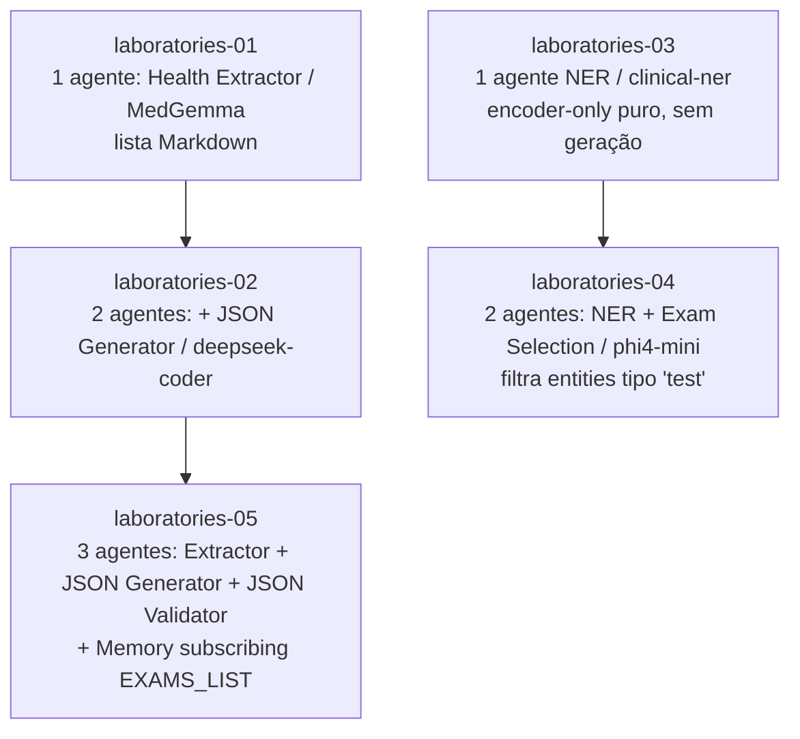
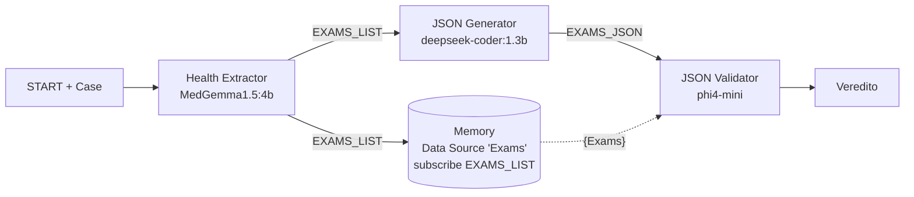
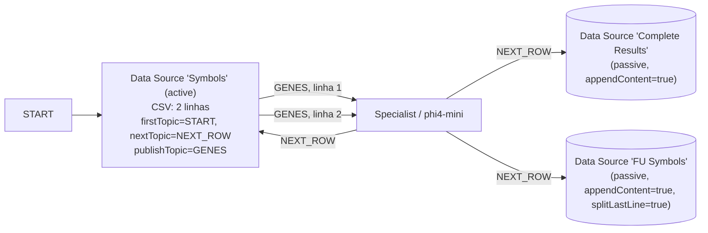

# Exercícios — Decoders, Modelos Generativos e SLMs

Arquivos de configuração e resultados do **Pub/Sub Multi-Agent System** rodando sobre [Ollama](https://ollama.com/) local. Cada `.json` é uma configuração salva pela interface web (botão *Save Config* / *Load Config* no Space):

🔗 **https://huggingface.co/spaces/santanche/sml-agents-publish-subscribe**
🔗 Backup: https://santanche.github.io/lab2learn/machine-learning/agents/

Para reproduzir: abrir o Space, clicar em **Load Config**, escolher o `.json` desejado, ativar Ollama local (`ollama serve`) com os modelos puxados, apertar *Execute Pipeline*.

---

## Modelos usados

| Tag Ollama | Tamanho | Papel |
| --- | --- | --- |
| `MedAIBase/MedGemma1.5:4b` | 4B | extrator clínico (texto médico) |
| `deepseek-coder:1.3b` | 1.3B | gerador de JSON (lista → JSON) |
| `phi4-mini` | 3.8B | uso geral, raciocínio, validação |
| `samrawal/bert-base-uncased_clinical-ner` | 110M (BERT) | NER clínico (encoder-only, via HF Transformers, não Ollama) |

---

## Conteúdo da pasta `agents/`

### Caso clínico de referência

**`cabot-case01.txt`** — caso histórico de Richard Cabot (1904): comerciante de bebidas de 47 anos, histórico de etilismo, dor epigástrica, hematêmese, fezes escuras, palidez, pulso 100. Exame de urina: sp.gr. 1020, ácido, sem açúcar, sem albumen, Hg 50%, hemácias 3.172.000, sem células nucleadas, leucócitos 9200. É o caso embutido em todas as configurações `laboratories-*`.

### Trilha 1 — Pipeline de extração de exames (5 etapas progressivas)

Cada `laboratories-NN-config.json` é importável no Space; o `-results.json` correspondente é a **mesma configuração já executada uma vez**, com os campos `results.finalResult`, `results.nerResult` e `results.executionLog` preenchidos para conferência sem precisar rodar Ollama.



#### `laboratories-01` — extração solo

1 agente (`Health Extractor Agent` / `MedGemma1.5:4b`) subscrito em `START`. Output: lista Markdown dos exames de urina.

```
START → [Health Extractor / MedGemma] → texto livre
```

#### `laboratories-02` — pipeline de duas etapas

Encadeia o extrator clínico com um gerador de JSON especializado em código:

```
START → [Health Extractor / MedGemma]
            ↓ EXAMS_LIST
        [JSON Generator / deepseek-coder:1.3b]
```

O resultado salvo no `-results.json` mostra o deepseek convertendo a lista em JSON com chaves `urinal_specific_gravity`, `urinal_pH`, etc. (note: o modelo escreve `urinal_*` em vez de `urine_*` — fica como pequeno bug para discutir).

#### `laboratories-03` — NER solo (encoder-only)

1 agente único usando o modelo **`samrawal/bert-base-uncased_clinical-ner`** — um BERT (encoder-only, 110M parâmetros) fine-tunado para reconhecimento de entidades clínicas (problemas, tratamentos, testes). **Não passa por Ollama** — o Space chama direto a Inference API do Hugging Face.

```
START → [NER Extractor / clinical-ner] → lista de entidades anotadas
```

O resultado serve para discutir o contraste **encoder-only (BERT)** vs **decoder-only (Llama, MedGemma, Phi)** já visto nos slides desta aula e em [2026-05-25](../../2026-05-25%20-%20Transformers%20e%20Embeddings/README.md).

#### `laboratories-04` — NER + filtro generativo

Combina os dois mundos: BERT classificador + SLM generativo que pós-processa.

```
START → [NER Extractor / clinical-ner]
            ↓ CLINICAL_NER
        [Exam Selection / phi4-mini]
```

O `Exam Selection Agent` recebe o JSON do NER e mantém só os itens com `entity_type == "test"`. Resultado: lista filtrada com `physical examination`, `pulse`, `temperature`, `urine`, `sp`, `gr` — mostra que o NER é mais granular (e ruidoso: separa `sp.` de `gr.`) que o extrator MedGemma.

#### `laboratories-05` — pipeline completo com Memory

Adiciona o **JSON Validator** (phi4-mini) ao pipeline `02` e — crucialmente — um **segundo Data Source `Exams` com `subscribeTopic: EXAMS_LIST`** que captura o output do Health Extractor para uso explícito no template de validação via `{Exams}`.



É a materialização do conceito **Memory: Data Source com Subscription** da Parte VII dos slides — o data source não é estático, ele é alimentado por um tópico, podendo inclusive ser editado manualmente entre o passo de geração e o de validação (*human-in-the-loop*).

---

### Trilha 2 — Geração de símbolos para grupos de genes (MAPK / KEGG hsa04010)

Quatro variantes que atacam o mesmo problema do slide **"Orange LMSci"**: dado um conjunto de genes que executam a *mesma função* num ponto da via MAPK signaling, propor um **acrônimo genérico curto** para representá-los no diagrama.

Todos usam a User Question:

> "Consider the MAPK signaling pathway (path:hsa04010) from KEGG (https://www.kegg.jp/kegg-bin/show_pathway?hsa04010)."

| Arquivo | Grupo de genes | Modelo | Acrônimo proposto |
| --- | --- | --- | --- |
| `gene-pathway-mapk-cacn.json` | 26 canais de cálcio voltagem-dependentes (CACNG1-8, CACNA1A-S, CACNA2D1-4, CACNB1-4) | `phi4-mini` | **CACN** |
| `gene-pathway-mapk-rtk.json` | 25 receptores tirosina-quinase (EGFR, ERBB2-4, FGFR1-4, IGF1R, INSR, KIT, MET, NTRK1-2, PDGFRα/β, RET, VEGFR2/KDR, …) | `MedAIBase/MedGemma1.5:4b` | **RTK** |
| `gene-pathways-mapk-gf.json` | 53 fatores de crescimento (FGF1-23, EGF, VEGFA-D, PDGFA-D, IGF1-2, NGF, BDNF, HGF, …) | `MedAIBase/MedGemma1.5:4b` | **Growth Factors** |
| `gene-pathway-mapk-csv_two-genes.json` | 2 *functional units* em CSV: `fu:282f2b98` (DUSP10, DUSP2, DUSP4, …) e `fu:de327064` (HRAS, KRAS, NRAS, …) | `phi4-mini` | **DYSPS** e **RAS** |

> **Termos biológicos rápidos:**
> - **Via MAPK (hsa04010)**: rota de sinalização que leva um sinal externo (fator de crescimento) até dentro do núcleo da célula, fazendo a célula se dividir, sobreviver ou se mover. Pense numa cadeia de domino.
> - **Functional unit (`fu:HASH`)**: nó "lógico" extraído do KGML do KEGG. Vários genes podem ocupar o mesmo ponto da via (alternativos — operador OR) ou formar um complexo necessário (operador AND).
> - **Receptor Tirosina-Quinase (RTK)**: proteína na membrana da célula que, ao receber um sinal externo, fosforila resíduos de tirosina e dispara a cascata MAPK. EGFR é o mais famoso (alvo do gefitinibe em câncer de pulmão).
> - **DUSP**: *dual-specificity phosphatase*. Tira fosfato das MAPKs — "freio" da via.
> - **RAS**: GTPase pequena. O *gatilho* da via, hub de muitos cânceres (KRAS em pâncreas/cólon).

#### Variante avançada: `csv_two-genes.json`

Esta é a única que usa **iteração linha-a-linha sobre um CSV** e **data sources passivos como acumuladores** — o padrão pub/sub mais sofisticado mostrado em sala:



Conceitos novos que aparecem nessa configuração:

- **Data Source `type: active`** — itera sobre suas próprias linhas, despachando uma de cada vez quando recebe `nextTopic`.
- **Data Source `type: passive` com `appendContent: true`** — acumula tudo que recebe no campo de conteúdo (em vez de sobrescrever).
- **`splitLastLine: true`** — guarda só a última linha de cada mensagem (truque para reter só o `Identifier,SYMBOL` que o prompt força no final).

O *prompt* força o modelo a terminar com `fu:HASH,SYMBOL` numa linha isolada — exatamente para que o `FU Symbols` (com `splitLastLine`) acumule um CSV limpo de mapeamento.

---

## Conexões com aulas e atividades anteriores

- **Slides desta aula** ([README](../README.md)) — Parte VI cobre a interface em detalhe; Tasks 1 e 2 propostas em aula correspondem a `laboratories-{02,05}-config.json`.
- [2026-05-25 — Transformers e Embeddings](../../2026-05-25%20-%20Transformers%20e%20Embeddings/README.md) — apresentou o ecossistema de Spaces da Santanchè e a distinção encoder-only (BERT) vs decoder-only (Llama); o `laboratories-03/04` cruza os dois (clinical-ner + phi4-mini).
- [2026-05-20 — Omics and Language Models](../../2026-05-20%20-%20Omics%20and%20Language%20Models/README.md) — pipeline KEGG hsa04010 + MAPK que serve de base para a Trilha 2; o slide do *Orange LMSci* daquela aula propunha exatamente a tarefa de "gerar acrônimo para functional unit".

---

## Notas de execução

- **Pré-requisitos:** [Ollama](https://ollama.com/download) rodando localmente em `http://localhost:11434` e os três modelos baixados — `ollama pull MedAIBase/MedGemma1.5:4b`, `ollama pull deepseek-coder:1.3b`, `ollama pull phi4-mini`. O modelo `samrawal/bert-base-uncased_clinical-ner` é puxado automaticamente pela Inference API do HF.
- **Reproduzir um experimento:** clicar em *Load Config* no Space, abrir o `.json`, *Execute Pipeline*. Os arquivos `-results.json` já contêm o output que o autor obteve — útil para conferência mesmo sem GPU.
- **Salvar variações:** o botão *Save Config* exporta um JSON novo. Convenção sugerida para o aluno: criar `laboratories-06-meu-experimento.json` em vez de sobrescrever os originais.
- Os arquivos `-config.json` **não contêm `results`**; os `-results.json` contêm o mesmo `config` + as caixas `finalResult` e `executionLog` preenchidas.
