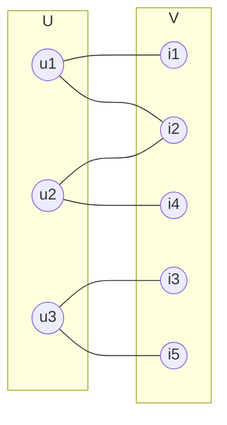
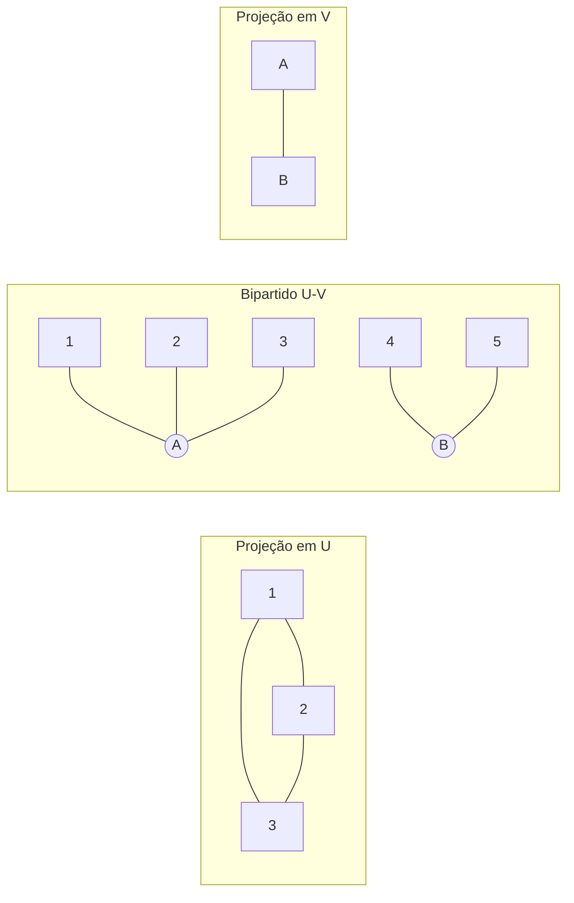
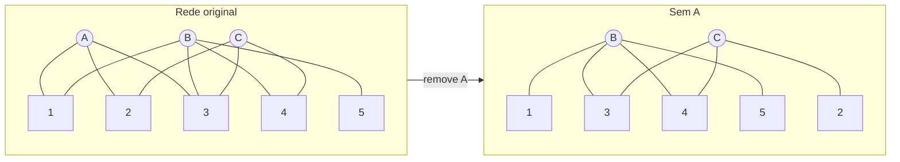
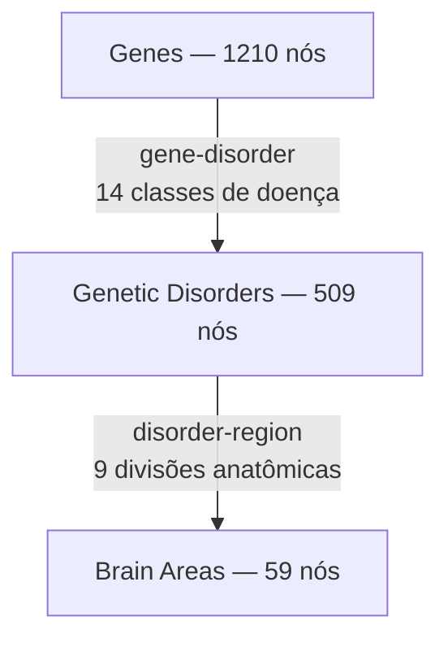
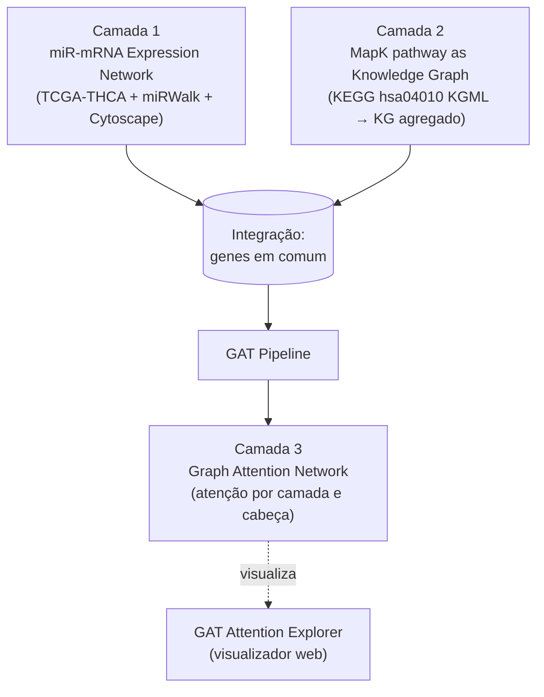

# Redes Multipartidas

[slides — Redes Multipartidas](slides.pdf) | [slides — THCA Integrated Study (junho 2026)](slides-thca-integrated.pdf)

Aula dupla — 3 de junho de 2026:

1. **Deck I — Redes Multipartidas:** apresentação dos alunos **Cristiano Sampaio** e **Mylena Roberta** (LIS/IC-UNICAMP) sobre redes bipartidas e *k*-partidas — definição, projeções, métricas, aplicações.
2. **Deck II — THCA Integrated Study (junho 2026):** **André Santanchè** reapresenta o caso integrado de **Thyroid Carcinoma (THCA)**[^thca] — uma versão atualizada do deck de 29/04 que agora consolida **três camadas** (rede miRNA-mRNA, MapK como Knowledge Graph e Graph Attention Network) e adiciona o **GAT Attention Visualizer** e o novo Space **`sml-agents-publish-subscribe-dbvec`** (Pub/Sub com Vector DB).

> Sem gravação.

---

## Em uma frase

A primeira metade da aula é uma **palestra dos alunos** sobre redes multipartidas — o que são, por que importam, que métricas existem além das clássicas (centralidades) — usando como exemplos uma rede bipartida miRNA-mRNA de câncer de mama e a rede gene-doença-área cerebral de Hayasaka (2011). A segunda metade é o **fechamento prático** do professor: aplicar essas ideias ao pipeline real do THCA, integrando rede de expressão (miR-mRNA) + via MAPK como grafo de conhecimento + GAT como camada de aprendizagem.

---

# Parte I — Redes Multipartidas (Cristiano & Mylena)

## 1. Definições

### Grafo bipartido

Um **grafo bipartido**[^bipartido] *G = (U, V, E)* é aquele em que o conjunto de vértices se divide em **dois subconjuntos disjuntos** *U* e *V*, e toda aresta liga um vértice de *U* a um vértice de *V*. **Não existem arestas dentro do mesmo subconjunto.**

> **Analogia do dia a dia:** uma rede bipartida é um *organograma* com duas linhas — por exemplo, "alunos × disciplinas matriculadas". Não faz sentido ligar aluno-aluno nem disciplina-disciplina dentro desse grafo; só aluno-disciplina.

### Grafo multipartido (*k*-partido)

Um **grafo multipartido (k-partido)** é a generalização: os vértices se dividem em ***k* subconjuntos disjuntos** *V₁, V₂, …, Vₖ*, e **nenhuma aresta** liga vértices do mesmo subconjunto.

Exemplo clássico (slide 4): rede `User – Movie – Genre – Director – Actor`. Cinco tipos de entidade, cada aresta conectando *tipos diferentes*.

---

## 2. Por que importam?

Muitos fenômenos reais têm **natureza multipartida intrínseca**:

| Domínio                  | Exemplo                                          |
| ------------------------ | ------------------------------------------------ |
| Ecológico                | predador ↔ presa, inseto ↔ planta                |
| Biomédico                | doença ↔ lncRNA, fármaco ↔ alvo                  |
| Biomolecular             | gene ↔ via, gene ↔ fator de transcrição          |
| Epidemiológico           | paciente ↔ localização                           |
| Social / linguístico     | usuário ↔ produto, palavra ↔ documento           |

### Exemplo 1 — Rede bipartida miRNA-mRNA em câncer de mama (slide 6)

Os miRNAs[^mirna] (em vermelho) ficam de um lado; os mRNAs[^mrna] alvo (em azul) ficam do outro. Cada aresta = "este miRNA regula este mRNA". É exatamente o tipo de rede que será discutido em detalhe na Parte II.

### Exemplo 2 — Rede multipartida de ativações de LLM por nível de expertise (slide 7–9)

Pergunta-guia do projeto dos próprios alunos:

> *"Há diferenças significativas em métricas extraídas da rede das regiões de ativação de LLMs, quando comparadas entradas com distintos níveis de expertise?"*

Cada **camada do Transformer** (0 a 12) vira um nível da rede multipartida. As ativações de um mesmo prompt percorrem as camadas; entradas de **especialistas** (IAM) vs. **leigos** (DPOC) geram redes multipartidas com topologias mensuravelmente distintas. Gráfico do slide 9 mostra que a primeira camada *colapsa* a representação (~40 nós ativos) e depois ela cresce até estabilizar em ~55 nós.

---

## 3. O problema da literatura tradicional

Livros canônicos (Barabási, *Network Science*; Newman, *Networks*) **focam em redes monopartidas** (todos os nós do mesmo tipo). Redes multipartidas aparecem brevemente.

A solução clássica é **projetar**: dado um grafo bipartido, derivar duas redes monopartidas, cada uma sobre um dos subconjuntos.

> **Como funciona a projeção?** No exemplo do slide 11, *U₁, U₂, U₃* todos se conectam a *A*. Então, na projeção sobre *U*, criamos arestas entre todos esses três (eles "compartilham" *A*). É um produto cartesiano local.

### Outros exemplos de projeção (Barabási 2014)

Slide 12-13: receitas (**recipes**) × ingredientes (**ingredients**) × compostos químicos (**compounds**) — rede tripartida culinária. Projetando-se receita↔receita por ingredientes compartilhados gera-se uma rede de "receitas similares".

### Os três problemas da projeção (Latapy et al., 2008 — slide 14)

1. **Perda de informações** codificadas na estrutura multipartida (saber *qual* ingrediente foi compartilhado some na projeção).
2. **Inflação artificial do número de arestas**: cada nó da camada projetada que tinha muitas conexões na bipartida vira um clique gigante.
3. Algumas propriedades emergem do **processo de projeção**, não dos dados subjacentes — métricas como clustering podem ficar artificialmente altas.

> **Metáfora do Mito da Caverna (slide 15-16):** projetar uma rede multipartida em monopartida é como olhar para as **sombras na parede**. As sombras existem, mas a realidade tridimensional (a rede multipartida real) foi achatada. Pavlopoulos et al. (2018) explicitamente recomendam **abandonar a projeção** e desenvolver ferramentas que **operem direto sobre o grafo multipartido**.

---

## 4. Métricas em redes multipartidas

Existem dois tipos:

1. **Extensão** das métricas tradicionais (centralidades) com adaptações para bipartido.
2. **Métricas exclusivas** (nestedness, coeficiente de redundância).

> ⚠️ Latapy et al. (2008) avisa: muitas extensões são *ad hoc* — soluções pontuais sem rigor geral. Avaliar a relevância dos resultados é difícil.

### 4.1 Centralidade de Grau (Degree Centrality)

**Grau** = número de arestas incidentes em um nó. Funciona quase igual no bipartido — só convém **normalizar separadamente em cada parte**, porque os tamanhos de *U* e *V* podem ser muito diferentes.

### 4.2 Centralidade de Proximidade (Closeness)

Mede se um nó **se comunica facilmente** com os outros (inverso da média das distâncias). O slide 21 mostra três versões da mesma rede bipartida — fechamentos diferentes (0.26 vs 0.47 vs 0.64) conforme a topologia muda.

### 4.3 Centralidade de Intermediação (Betweenness)

Nós com alta betweenness são **pontes** entre comunidades — uma estação de transferência crítica. Em bipartido, **um clique completo zera a betweenness de tudo** (slide 24: complete bipartite → 0.00 para todos), porque há sempre rota alternativa direta.

### 4.4 Centralidade de Autovetor (Eigenvector)

> "Um nó é central quando está ligado a outros nós centrais."

Daugulis (2011) propõe uma generalização específica para bipartidos: dois subsistemas de equações lineares, um por partição.

### 4.5 Modularity (Modularidade)

Mede a tendência da rede em **se dividir em módulos/grupos/comunidades**. Permite **detecção de módulos**: blocos de nós densamente conectados dentro e esparsamente entre.

### 4.6 Nestedness (Aninhamento)

Métrica **exclusiva de redes bipartidas**. Padrão de interação em que:

- **Especialistas** (poucas conexões) interagem com um **subconjunto** das parceiras dos **generalistas** (muitas conexões).

Visualmente: matriz de incidência ordenada vira uma estrutura "triangular" — quem está em cima cobre tudo que quem está embaixo cobre. Vem da ecologia: borboletas especialistas só polinizam flores que as generalistas também polinizam.

### 4.7 Modularity + Nestedness (slide 28)

Uma rede pode ser simultaneamente **muito aninhada** *e* **muito modular** — não são propriedades excludentes. Isso é importante: durante a análise, faz sentido medir as duas.

### 4.8 Clustering Coefficient (Coeficiente de Clusterização)

- **Global:** tendência da rede formar **módulos coesos**.
- **Local:** tendência de **um nó** pertencer a um módulo.

### 4.9 Redundancy Coefficient (Coeficiente de Redundância)

Métrica nova e *bipartida-nativa* (de Anda-Jáuregui et al., 2018): mede a **importância de um nó numa camada para a conexão dos nós da outra camada**.

Intuição: se eu **remover** o nó A da camada de cima, a camada de baixo *perde projeções compartilhadas*? Se sim, A é **redundante** (a rede ainda funciona sem ele); se não, A é **único** e portanto crucial.

---

## 5. Aplicações em Biologia

### 5.1 Hayasaka, Hugenschmidt & Laurienti (2011) — Genes × Disorders × Brain Areas

**Rede tripartida** (3 camadas) construída a partir da literatura:

Resultados:

- **Distribuição de grau** analisada por camada.
- **Projeções**: a Rede de Doença Comum (dois cérebros conectados se compartilham doenças) e a Rede de Gene Comum (dois cérebros conectados se compartilham genes).
- *Pruning*: aplicar threshold no peso das arestas para obter **Redes Centrais** (core), revelando que um pequeno conjunto de áreas cerebrais aparece em **muitas** doenças e **muitos** genes.
- Validação: as áreas-núcleo coincidem com áreas identificadas em estudos **GWAS**[^gwas] independentes.

> **Por que isso importa?** A topologia da rede multipartida revela hubs *funcionais* (cérebro–gene–doença) que análises monopartidas de cada camada não conseguiriam ver.

### 5.2 de Anda-Jáuregui et al. (2018) — Commodore-miRs em Câncer de Mama

> **Comparação topológica direta**: rede bipartida `miRNA × mRNA` em **tecido saudável** vs **tecido tumoral**, ambos do TCGA-BRCA.

| Parâmetro                       | Saudável | Câncer  |
| ------------------------------- | -------- | ------- |
| Nós (miRNA)                     | 97       | 414     |
| Nós (gene)                      | 2.967    | 3.240   |
| Arestas                         | 16.589   | 14.063  |
| Grau médio (miRNA)              | 171.02   | 33.97   |
| Grau médio (gene)               | 5.59     | 4.34    |
| Coef. clusterização (miRNA)     | 0.28     | 0.18    |
| Coef. clusterização (gene)      | 0.24     | 0.27    |

**Observação-chave:** o tecido saudável é **mais conectado** apesar de ter **muito menos miRNAs** ativos. No câncer, a rede está **fragmentada**.

**Conceito novo — Commodore-miRs:** microRNAs com **alto grau** *e* **baixa redundância** — controlam funções biológicas críticas que **nenhum outro miRNA** consegue suprir. Os autores destacam:

- **let-7i** — adesão leucocitária, ativação imune.
- **miR-141** — motilidade, migração, organização da matriz extracelular[^ecm].
- **miR-190b** — montagem de dineína, metabolismo de vitaminas, proliferação epitelial mamária.
- **miR-29b-2** — transporte de melanócitos, angiogênese[^angio], migração epitelial.
- **miR-511** — produção de citocinas, ativação celular (imunidade inata).

O plot do slide 42 traça **grau** × **redundância**: os Commodore-miRs ficam num quadrante específico (alto grau, baixa redundância) — destacados em vermelho.

> **Conexão com o projeto semestral:** essa exatamente é a abordagem que pode ser aplicada à comparação **melanoma vs pele saudável** — buscar miRNAs (ou genes) com perfil "commodore" que estão presentes num tecido e ausentes no outro.

---

## 6. Conclusões / Reflexões da Parte I

Slide 46:

- **Conhecimento profundo do problema** e respeito à natureza dos dados.
- Conhecer **limites e benefícios das projeções** — quando vale projetar e quando vale ficar no multipartido.
- **Interpretabilidade**: o que há por trás dos números das métricas?
- **Sair da caverna** — descobrir que o mundo real é multipartido, mesmo que a maioria das ferramentas seja monopartida.

---

# Parte II — THCA Integrated Study (Santanchè, junho 2026)

> Esta é uma **versão atualizada** do deck de [29/04/2026](../2026-04-29%20-%20miRNA-mRNA%20Network/README.md). O cerne (Firehose → miRWalk → KEGG MAPK como KG) permanece, mas a aula de hoje adiciona:
>
> 1. Uma **terceira camada** explícita — **GAT** (Graph Attention Network) sobre as outras duas.
> 2. O **GAT Attention Visualizer** (https://datasci4health.github.io/language-model/gat/visualizer/) — visualizador web interativo.
> 3. O novo Space **`sml-agents-publish-subscribe-dbvec`** com **Vector DB** integrado.
> 4. Os scripts Python que produzem os CSVs do GAT.

## 1. Modelo de três camadas (slide 17 do deck)

A grande síntese da aula de hoje é juntar tudo:

Cada camada é um **grafo distinto**, mas elas **compartilham nós** (os mesmos símbolos de gene). O resultado é um grafo multipartido onde:

- *U* = miRNAs (vindos do TCGA + miRWalk).
- *V* = genes/mRNAs (vindos do TCGA, anotados com a via MAPK).
- *W* = unidades funcionais lógicas da via MAPK (functional units com operadores AND/OR — vindos do KGML do KEGG).

## 2. Conexão direta com a Parte I

A aula de Cristiano e Mylena dá o **arcabouço teórico**; a parte do Santanchè é o **exemplar concreto**:

| Conceito da Parte I              | Como aparece em THCA                              |
| -------------------------------- | -------------------------------------------------- |
| Grafo bipartido `U-V`            | rede miR↔mRNA do `thca-mirna-mrna.cys`             |
| Projeção em *V*                  | rede mRNA↔mRNA do `limma-backbone.csv` (aula 06/05) |
| Grafo multipartido (3 camadas)   | GAT integrado mostrado no slide                    |
| Nestedness / Commodore-miRs       | possível análise sobre o `thca-mirna-mrna_limma.cys` |
| Redundância (de Anda-Jáuregui)   | exatamente o paper aplicado a câncer de **mama** — em THCA seria a réplica natural |

## 3. SLM Agents com Vector DB (novidade da aula)

Slide 11 do deck integrado mostra um **novo Space** da Santanchè:

🔗 **https://huggingface.co/spaces/santanche/sml-agents-publish-subscribe-dbvec**

A diferença em relação ao Space usado na aula de [01/06](../2026-06-01%20-%20Decoders%2C%20Modelos%20Generativos%20e%20SLMs/README.md) (`sml-agents-publish-subscribe`) é a adição de **`-dbvec` = Vector DB** — um banco vetorial integrado que armazena os embeddings dos resultados intermediários dos agentes para consulta semântica posterior. Útil quando o pipeline produz muitos textos e queremos **recuperação por similaridade** (RAG-style) entre os passos.

### Repetição do exercício de acrônimos para Functional Units

O slide 12 retoma a tarefa já vista em [01/06 — Trilha 2](../2026-06-01%20-%20Decoders%2C%20Modelos%20Generativos%20e%20SLMs/exercicios/README.md): dado um conjunto de genes que formam uma functional unit (47/MYC MAX; 113/FOS JUN; 114/MAX MAX...), pedir ao SLM para propor um **acrônimo curto** representativo. Agora num pipeline com Vector DB para indexar resultados.

## 4. GAT Pipeline e Scripts (slides 18-20 do deck integrado)

Três scripts Python que produzem os CSVs já existentes na pasta de exercícios da aula de [25/05](../2026-05-25%20-%20Transformers%20e%20Embeddings/exercicios/README.md):

| Script              | Função                                                            |
| ------------------- | ----------------------------------------------------------------- |
| `fasta_to_csv.py`   | Converte FASTA de mRNA do Ensembl em CSV para o GAT.              |
| `parse_mirwalk.py`  | Converte saída do miRWalk no formato esperado pelo GAT.           |
| `gat_pipeline.py`   | Constrói o GAT — entrada: rede integrada (nodes + edges) + mRNA-seq + miR-seq. Saída: GAT treinado. |

**Saídas do GAT** (já no repo desde 25/05):

- `node_metadata.csv`
- `edge_metadata.csv`
- `attention_weights.csv`
- `node_embeddings.csv`

URL do código: https://datasci4health.github.io/language-model/gat/

## 5. GAT Attention Network Visualizer

Slides 19-20 do deck integrado mostram o **visualizador web** (https://datasci4health.github.io/language-model/gat/visualizer/) que carrega os quatro CSVs e permite:

- Selecionar **camada** (1, 2 ou 3) e número de **hops** a explorar (1, 2 ou 3).
- Distinguir nós por **tipo** (gene/mRNA = verde, miRNA = vermelho, functional unit = roxo).
- Filtrar **alta vs baixa atenção** entre nós.
- Clicar em um nó (ex.: `MIMAT0003322`) e ver suas conexões prioritárias na camada selecionada.

> **Conexão didática com a Parte I:** este visualizador é **literalmente** um navegador interativo sobre um grafo **multipartido** com **três camadas** — a teoria de Cristiano e Mylena tem aqui um instrumento prático que respeita as três naturezas distintas dos nós.

## 6. KEGG Subtypes (slide 14-15 do deck)

O slide reapresenta a tabela de **subtipos de KGML** usada no Cytoscape para estilizar arestas distintas:

| Subtipo KGML            | Estilo no Cytoscape                  |
| ----------------------- | ------------------------------------ |
| activation              | Delta (seta cheia)                   |
| inhibition              | T (barra)                            |
| phosphorylation         | Círculo                              |
| dephosphorylation       | Círculo aberto                       |
| expression              | Delta curto                          |
| indirect effect         | Delta curto pontilhado               |
| binding/association     | (sem ponta)                          |

E **tipos de linha** para a interação composta:

| Atributo interação              | Linha          |
| ------------------------------- | -------------- |
| `gene_expression_regulation`    | Marquee Dash Dot |
| `gene_to_fu`                    | Equal Dash     |
| `mir_to_gene`                   | Parallel Lines |
| `protein_protein_interaction`   | Solid          |

E os tipos de relação KEGG: `ECrel` (enzima-enzima), `PPrel` (proteína-proteína), `GErel` (expressão gênica), `PCrel` (proteína-composto), `maplink` (link entre mapas).

---

## Referências (decks combinados)

### Parte I (Cristiano & Mylena)

1. **Barabási, A.-L.** (2014). *Network Science Book*. Network Science, 625.
2. **Daugulis, P.** (2011). A note on a generalization of eigenvector centrality for bipartite graphs and applications. *Networks*, 59(2), 261-264. https://doi.org/10.1002/net.20442
3. **de Anda-Jáuregui, G., Espinal-Enríquez, J., Drago-García, D., & Hernández-Lemus, E.** (2018). Nonredundant, Highly Connected MicroRNAs Control Functionality in Breast Cancer Networks. *International Journal of Genomics*, 2018(1), 1-10. https://doi.org/10.1155/2018/9585383
4. **Hayasaka, S., Hugenschmidt, C. E., & Laurienti, P. J.** (2011). A network of genes, genetic disorders, and brain areas. *PLOS ONE*, 6(6), e20907. https://doi.org/10.1371/journal.pone.0020907
5. **Latapy, M., Magnien, C., & Vecchio, N. del** (2008). Basic notions for the analysis of large two-mode networks. *Social Networks*, 30(1), 31-48. https://doi.org/10.1016/j.socnet.2007.04.006
6. **Pavlopoulos, G. A., Kontou, P. I., Pavlopoulou, A., Bouyioukos, C., Markou, E., & Bagos, P. G.** (2018). Bipartite graphs in systems biology and medicine: A survey of methods and applications. *GigaScience*, 7(4), giy014. https://doi.org/10.1093/gigascience/giy014
7. **Zhang, L., Liu, P., & Gulla, J.** (2023). Recommending on graphs: A comprehensive review from a data perspective. *User Modeling and User-Adapted Interaction*, 33, 1-86. https://doi.org/10.1007/s11257-023-09359-w

### Parte II (Santanchè) — ver também as referências em [2026-04-29](../2026-04-29%20-%20miRNA-mRNA%20Network/README.md)

- Página do palestrante: https://www.ic.unicamp.br/~santanche/
- Repositório integrado: https://datasci4health.github.io/integrated.html (também https://github.com/datasci4health/datasci4health.github.io/blob/master/integrated.md)

---

## Por que esta aula importa para o projeto de câncer de pele

1. **Modelagem multipartida explícita** abre uma frente de análise diferente da PPI clássica. Em vez de só "PPI do melanoma", podemos ter o grafo tripartido `miRNA × mRNA × pathway` separando os três tipos de nó.
2. **Métricas exclusivas de bipartido** (nestedness, redundância) são novos parâmetros para comparar **melanoma vs não-melanoma vs pele saudável** — não necessariamente derivam das centralidades clássicas que já usamos no L3.
3. O paper **de Anda-Jáuregui 2018** é o template natural para replicar em pele: rede bipartida miR↔mRNA com **TCGA-SKCM saudável vs tumoral**, e busca por "Commodore-miRs" cutâneos.
4. O **GAT Visualizer** dá uma forma direta de **inspecionar os outputs do GAT** que vamos rodar sobre SKCM — sem precisar abrir Cytoscape, e respeitando os três tipos de nó (gene, miRNA, functional unit).
5. **Limite das projeções** (Latapy 2008): ao construir nossas redes PPI projetadas a partir de coexpressão, devemos lembrar que **algumas propriedades emergem do processo de projeção**, não dos dados.

---

## Notas

[^bipartido]: **Grafo bipartido** — grafo cujos vértices se dividem em dois conjuntos disjuntos *U* e *V* sem arestas internas a cada conjunto. Toda aresta vai de *U* a *V*.
[^thca]: **THCA** — *Thyroid Carcinoma*. Código da coorte do TCGA para câncer de tireoide; 503 pacientes (majoritariamente carcinoma papilífero, PTC).
[^mirna]: **miRNA (microRNA)** — RNA pequeno (19-25 nucleotídeos) que silencia mRNAs ligando-se a regiões 3' UTR. Não codifica proteína; regula a produção de outras.
[^mrna]: **mRNA (RNA mensageiro)** — RNA que carrega a "receita" de um gene do núcleo até os ribossomos, onde ela é traduzida em proteína.
[^gwas]: **GWAS** — *Genome-Wide Association Study*. Varredura estatística do genoma inteiro buscando variantes (SNPs) associadas a um traço/doença. Identifica regiões candidatas a estarem ligadas a um fenótipo.
[^ecm]: **ECM** — *Extracellular Matrix* (matriz extracelular). Estrutura de proteínas (colágeno, fibronectina, MMPs, ADAMTS) que segura as células no lugar. Câncer reorganiza ativamente a ECM para invadir tecidos vizinhos.
[^angio]: **Angiogênese** — formação de novos vasos sanguíneos. Tumores precisam induzir angiogênese para se alimentar e crescer; é um dos *hallmarks* do câncer.
