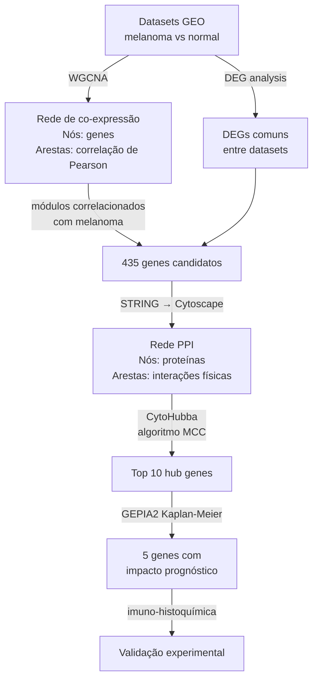

# Resumo: Identification of Hub Genes Associated With Melanoma Development by Comprehensive Bioinformatics Analysis

[PDF](paper.pdf)

---

## Metadados

| Campo         | Informação                                                                                                                                             |
| ------------- | ------------------------------------------------------------------------------------------------------------------------------------------------------ |
| **Título**    | Identification of Hub Genes Associated With Melanoma Development by Comprehensive Bioinformatics Analysis                                              |
| **Autores**   | Jie Jiang, Chong Liu, Guoyong Xu, Tuo Liang, Chaojie Yu, Shian Liao, Zide Zhang, Zhaojun Lu, Zequn Wang, Jiarui Chen, Tianyou Chen, Hao Li, Xinli Zhan |
| **Filiação**  | Spinal Orthopedic Ward, The First Clinical Affiliated Hospital of Guangxi Medical University, Nanning, China                                           |
| **Revista**   | _Frontiers in Oncology_                                                                                                                                |
| **Ano**       | 2021                                                                                                                                                   |
| **Volume**    | 11:621430                                                                                                                                              |
| **DOI**       | https://doi.org/10.3389/fonc.2021.621430                                                                                                               |
| **Publicado** | 12 de abril de 2021                                                                                                                                    |
| **Acesso**    | Acesso aberto (Open Access)                                                                                                                            |

---

## Bases de Dados Utilizadas

| Banco               | URL                               | Conteúdo                                                 |
| ------------------- | --------------------------------- | -------------------------------------------------------- |
| UCSC Xena[^ucsc]    | http://xena.ucsc.edu/             | 471 amostras de melanoma + 813 de tecido normal          |
| GTEx                | https://www.gtexportal.org/       | 813 amostras de pele normal (expressão em tecido normal) |
| GEO[^geo] (GSE3189) | https://www.ncbi.nlm.nih.gov/geo/ | 45 melanomas + 18 nevus + 7 pele normal                  |
| STRING[^string]     | https://string-db.org/            | Interações proteína-proteína                             |

---

## Pipeline / Metodologia

```
╔══════════════════════════════════════════════════════════════════════════╗
║         PIPELINE DO ARTIGO (Jiang et al., Front. Oncol. 2021)            ║
╚══════════════════════════════════════════════════════════════════════════╝

  ┌──────────────────────────────────────────────────────────────────────┐
  │  PASSO 1: DOWNLOAD DOS DADOS                                         │
  │                                                                      │
  │  UCSC Xena: 471 melanomas + 813 pele normal (55.188 genes)          │
  │  GEO GSE3189: 45 melanomas + 18 nevus + 7 pele normal               │
  │  Pré-processamento: log2, remoção de duplicatas, padronização        │
  │  → 12.549 genes para análise                                         │
  └───────────────────────────────┬──────────────────────────────────────┘
                                  │
                                  ▼
  ┌──────────────────────────────────────────────────────────────────────┐
  │  PASSO 2: WGCNA[^wgcna] — MÓDULOS DE CO-EXPRESSÃO                           │
  │                                                                      │
  │  UCSC Xena: 6 módulos identificados                                 │
  │  GEO GSE3189: 7 módulos identificados                                │
  │  Módulos mais correlacionados com melanoma vs. normal:               │
  │    • UCSC Xena: módulo magenta (r = −0,96; p<1e-200)               │
  │    • GEO: módulo azul (r = −0,96; p<1e-200)                        │
  └───────────────────────────────┬──────────────────────────────────────┘
                                  │
                                  ▼
  ┌──────────────────────────────────────────────────────────────────────┐
  │  PASSO 3: ANÁLISE DE EXPRESSÃO DIFERENCIAL (DEGs[^deg])                    │
  │                                                                      │
  │  Limma[^limma] (R): |logFC| ≥ 1, adj. p < 0,05                             │
  │  UCSC Xena: 6.609 DEGs                                              │
  │  GEO GSE3189: 6.223 DEGs                                            │
  └───────────────────────────────┬──────────────────────────────────────┘
                                  │
                                  ▼
  ┌──────────────────────────────────────────────────────────────────────┐
  │  PASSO 4: INTERSEÇÃO (DIAGRAMA DE VENN)                              │
  │                                                                      │
  │  Genes nos módulos significativos ∩ DEGs de ambas as bases          │
  │  → 435 genes candidatos sobrepostos                                  │
  └───────────────────────────────┬──────────────────────────────────────┘
                                  │
                                  ▼
  ┌──────────────────────────────────────────────────────────────────────┐
  │  PASSO 5: ENRIQUECIMENTO GO E KEGG[^kegg]                                   │
  │                                                                      │
  │  clusterProfiler (R) nos 435 genes                                  │
  │  GO-BP: degranulação de neutrófilos, ativação imune                 │
  │  GO-CC: membranas vacuolares e lisossômicas                         │
  │  GO-MF: ligação a histona deacetilase e integrina                   │
  │  KEGG: melanoma, desregulação transcricional em câncer, reparo     │
  └───────────────────────────────┬──────────────────────────────────────┘
                                  │
                                  ▼
  ┌──────────────────────────────────────────────────────────────────────┐
  │  PASSO 6: CONSTRUÇÃO DA REDE PPI[^ppi] (STRING + CYTOSCAPE)                │
  │                                                                      │
  │  435 genes → STRING → rede PPI                                      │
  │  Importação no Cytoscape[^cytoscape] (v3.8.0)                                   │
  │  Plugin CytoHubba[^cytohubba] → algoritmo MCC[^mcc] → Top 10 hub genes[^hub]               │
  └───────────────────────────────┬──────────────────────────────────────┘
                                  │
                                  ▼
  ┌──────────────────────────────────────────────────────────────────────┐
  │  PASSO 7: ANÁLISE DE PROGNÓSTICO                                     │
  │                                                                      │
  │  GEPIA2[^gepia2]: curvas de Kaplan-Meier para os 10 hub genes                │
  │  5 dos 10 genes com OS significativamente reduzida:                 │
  │    FOXM1, EXO1, KIF20A, TPX2, CDC20                                 │
  │  Regressão COX multivariada: modelo prognóstico combinado           │
  └───────────────────────────────┬──────────────────────────────────────┘
                                  │
                                  ▼
  ┌──────────────────────────────────────────────────────────────────────┐
  │  PASSO 8: VALIDAÇÃO EXPERIMENTAL (IMUNO-HISTOQUÍMICA[^ihc])                │
  │                                                                      │
  │  6 pares de tecido (melanoma + pele normal) por gene                │
  │  Anticorpos específicos para FOXM1, TPX2, KIF20A, CDC20, EXO1      │
  │  Resultado: todos os 5 genes têm expressão proteica mais alta       │
  │  no melanoma do que em tecido paracanceroso (normal adjacente)      │
  └──────────────────────────────────────────────────────────────────────┘
```

---

## Estratégia de Grafo Utilizada

### Modelo de grafo

O artigo utiliza **dois tipos complementares de rede**:

#### 1. Rede de co-expressão pesada (WGCNA)

- **Nós:** genes (até 12.549)
- **Arestas:** correlação de Pearson entre pares de genes, elevada ao soft threshold (potência)
- **Peso das arestas:** valor de correlação transformado (entre 0 e 1)
- **Não-direcionada**

#### 2. Rede de interação proteína-proteína (STRING/Cytoscape)

- **Nós:** proteínas correspondentes aos 435 genes candidatos
- **Arestas:** interações proteína-proteína conhecidas (com score de confiança)
- **Não-direcionada**

### Estratégia central: identificação de hubs via CytoHubba (MCC)

O passo mais crucial do artigo é a identificação dos **hub genes** na rede PPI:

1. Os 435 genes candidatos são inseridos no STRING → gera rede PPI.
2. A rede é importada no Cytoscape para visualização.
3. O plugin **CytoHubba** calcula o score MCC para cada gene.
4. Os **10 genes com maior MCC** são os hub genes — os nós mais centrais da rede.
5. Desses 10, os **5 com associação prognóstica** são priorizados.

O algoritmo **MCC** identifica genes que participam de muitos _cliques_ (subgrafos completos) na rede. Isso significa que o gene não apenas tem muitas conexões, mas que seus vizinhos também são muito conectados entre si — indicando um papel estruturalmente central e biologicamente crítico.



---

## Resultados Principais

### Hub genes identificados (Top 5 com significância prognóstica)

| Gene       | Função Principal                    | Associação com Prognóstico |
| ---------- | ----------------------------------- | -------------------------- |
| **FOXM1**  | Regulador mestre da divisão celular | Alta expressão → menor OS  |
| **EXO1**   | Reparo do DNA                       | Alta expressão → menor OS  |
| **KIF20A** | Proteína motora (divisão celular)   | Alta expressão → menor OS  |
| **TPX2**   | Formação do fuso mitótico           | Alta expressão → menor OS  |
| **CDC20**  | Regulador do ciclo celular          | Alta expressão → menor OS  |

### Enriquecimento funcional dos 435 genes candidatos

| Categoria    | Vias mais enriquecidas                                              |
| ------------ | ------------------------------------------------------------------- |
| GO Biológico | Degranulação de neutrófilos, ativação imune                         |
| GO Celular   | Membranas vacuolares e lisossômicas                                 |
| GO Molecular | Ligação a histona deacetilase, integrina                            |
| KEGG         | Melanoma, desregulação transcricional em câncer, reparo de mismatch |

### Validação experimental

Todos os 5 hub genes apresentaram **expressão proteica significativamente maior** em tecido tumoral do que em tecido normal adjacente, confirmada por imuno-histoquímica.

---

## Por que é Relevante para o Projeto sobre Câncer de Pele

### 1. Pipeline diretamente aplicável

O pipeline WGCNA → DEGs → Interseção → STRING → CytoHubba é **idêntico à metodologia central** planejada no projeto da equipe ALFAK. Este artigo é essencialmente uma aplicação de referência da metodologia.

### 2. Hub genes como biomarcadores

Os 5 hub genes identificados (FOXM1, EXO1, KIF20A, TPX2, CDC20) são candidatos a biomarcadores de melanoma — exatamente o tipo de descoberta que o projeto busca.

### 3. Integração de múltiplas fontes de dados

O artigo demonstra como integrar dados de múltiplos bancos (UCSC Xena, GTEx, GEO) para aumentar a robustez dos resultados — estratégia aplicável ao projeto com os datasets GEO listados.

### 4. Validação cruzada entre bancos

Usar dois bancos independentes (UCSC Xena + GEO GSE3189) e pegar apenas a interseção dos resultados é uma forma eficaz de reduzir falsos positivos — método que o projeto pode adotar.

### 5. Enriquecimento funcional como interpretação biológica

A análise GO e KEGG transforma listas de genes em interpretação biológica — essencial para responder às perguntas de pesquisa do projeto sobre mecanismos moleculares.

---

## Referência Completa

**ABNT:**
JIANG, Jie et al. Identification of Hub Genes Associated With Melanoma Development by Comprehensive Bioinformatics Analysis. **Frontiers in Oncology**, v. 11, p. 621430, 12 abr. 2021. DOI: https://doi.org/10.3389/fonc.2021.621430.

**Vancouver:**
Jiang J, Liu C, Xu G, Liang T, Yu C, Liao S, Zhang Z, Lu Z, Wang Z, Chen J, Chen T, Li H, Zhan X. Identification of Hub Genes Associated With Melanoma Development by Comprehensive Bioinformatics Analysis. Front Oncol. 2021 Apr 12;11:621430. doi: 10.3389/fonc.2021.621430.

**APA:**
Jiang, J., Liu, C., Xu, G., Liang, T., Yu, C., Liao, S., Zhang, Z., Lu, Z., Wang, Z., Chen, J., Chen, T., Li, H., & Zhan, X. (2021). Identification of Hub Genes Associated With Melanoma Development by Comprehensive Bioinformatics Analysis. _Frontiers in Oncology_, _11_, 621430. https://doi.org/10.3389/fonc.2021.621430

---

## Notas

[^ucsc]: _UCSC Xena_ — Plataforma online do Genomics Institute da UCSC que hospeda dados de expressão gênica de grandes consórcios (TCGA, GTEx), usada aqui para obter os dados de melanoma e pele normal.

[^geo]: _GEO (Gene Expression Omnibus)_ — Repositório público do NCBI que armazena dados de expressão gênica de experimentos depositados por pesquisadores do mundo todo.

[^string]: _STRING_ — Banco de dados online que agrega interações proteína-proteína conhecidas de experimentos e predições computacionais, usado para construir a rede PPI dos genes candidatos.

[^wgcna]: _WGCNA (Weighted Gene Co-expression Network Analysis)_ — Método computacional para construir redes de co-expressão pesadas e identificar módulos de genes com expressão coordenada.

[^deg]: _DEG (Differentially Expressed Gene)_ — Gene cujo nível de atividade difere significativamente entre duas condições (ex: tumor vs. tecido normal).

[^limma]: _Limma_ — Pacote R que usa modelos lineares e estatística Bayesiana para identificar genes diferencialmente expressos em dados de microarray ou RNA-seq.

[^kegg]: _KEGG (Kyoto Encyclopedia of Genes and Genomes)_ — Banco de dados de vias metabólicas e moleculares, usado para identificar em quais processos biológicos os genes candidatos estão concentrados.

[^ppi]: _PPI (Protein-Protein Interaction)_ — Rede que conecta proteínas que interagem fisicamente entre si, permitindo identificar genes funcionalmente centrais.

[^cytoscape]: _Cytoscape_ — Software gratuito de visualização e análise de redes biológicas, amplamente usado em bioinformática para calcular métricas de centralidade e identificar módulos.

[^cytohubba]: _CytoHubba_ — Plugin do Cytoscape que calcula múltiplas métricas de centralidade para cada nó da rede PPI e ranqueia os genes pela sua importância topológica.

[^mcc]: _MCC (Maximal Clique Centrality)_ — Algoritmo do CytoHubba que identifica os nós mais centrais da rede com base na participação em cliques maximais (subgrafos onde todos os nós estão conectados entre si).

[^hub]: _Gene hub (gene central)_ — Gene que ocupa posição estratégica em uma rede, conectado a muitos outros genes, coordenando processos celulares críticos — como uma estação central de metrô.

[^gepia2]: _GEPIA2_ — Plataforma online para análise de expressão e sobrevivência usando dados do TCGA e GTEx, usada para gerar curvas de Kaplan-Meier dos hub genes.

[^ihc]: _Imuno-histoquímica (IHC)_ — Técnica laboratorial que detecta proteínas específicas em cortes de tecido usando anticorpos marcados, usada para validar experimentalmente a superexpressão dos hub genes no melanoma.

---

_Resumo elaborado em: 2026-03-29_
_PDF disponível em: artigos/A/huang2021-hub-genes-melanoma-bioinformatics.pdf_
