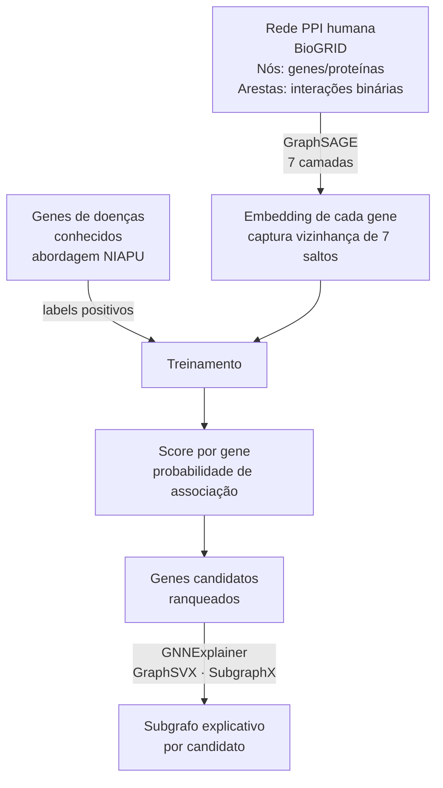

# Resumo: XGDAG — Explainable Gene-Disease Associations via Graph Neural Networks

---

## Metadados

| Campo        | Informação                                                             |
| ------------ | ---------------------------------------------------------------------- |
| **Título**   | XGDAG: explainable gene-disease associations via graph neural networks |
| **Autores**  | Andrea Mastropietro, Gianluca De Carlo, Aris Anagnostopoulos           |
| **Filiação** | Sapienza University of Rome, Itália                                    |
| **Revista**  | _Bioinformatics_ (Oxford Academic)                                     |
| **Ano**      | 2023                                                                   |
| **DOI**      | https://doi.org/10.1093/bioinformatics/btad482                         |
| **PMID**     | 37531293                                                               |
| **Acesso**   | Disponível no Oxford Academic e PubMed                                 |

---

## Problema Investigado

### Contexto

Descobrir quais genes estão associados a doenças é fundamental para desenvolver tratamentos, mas os experimentos laboratoriais são caros e lentos. Há bilhões de pares gene-doença possíveis — a grande maioria nunca foi testada.

Modelos computacionais de GNN[^gnn] já foram usados para prever GDAs[^gda], mas têm dois problemas:

1. **Aprendizado negativo inadequado**: tratam todos os pares sem evidência como "negativos" (não associados), quando na realidade muitos são simplesmente _desconhecidos_.
2. **Caixa preta**: não explicam quais estruturas da rede motivam a previsão, dificultando a confiança dos pesquisadores nos resultados.

### A Solução Proposta (XGDAG)

> **"Usar GraphSAGE[^graphsage] com aprendizado positivo-não rotulado (NIAPU[^niapu]) para priorizar genes candidatos, combinado com métodos de explicabilidade (GNNExplainer[^gnnexplainer], GraphSVX[^graphsvx], SubgraphX[^subgraphx]) para revelar os subgrafos da rede PPI[^ppi] que justificam cada previsão."**

O nome XGDAG vem de: **X**plainable **G**raph-based **D**isease-**A**ssociated **G**enes.

---

## Dados Utilizados

| Fonte                                         | Conteúdo                                       | Papel no Estudo                                    |
| --------------------------------------------- | ---------------------------------------------- | -------------------------------------------------- |
| **BioGRID**[^biogrid]                         | Rede PPI humana (interações proteína-proteína) | Estrutura do grafo — arestas entre genes           |
| **Associações gene-doença** (diversas fontes) | GDAs confirmadas                               | Exemplos positivos para treinamento                |
| **Pares sem evidência**                       | Pares gene-doença não documentados             | Tratados como "desconhecidos" (não como negativos) |

---

## Pipeline / Metodologia

```
╔══════════════════════════════════════════════════════════════════════════╗
║              PIPELINE DO ARTIGO (Mastropietro et al., 2023)              ║
╚══════════════════════════════════════════════════════════════════════════╝

  ┌──────────────────────────────────────────────────────────────────────┐
  │  PASSO 1: CONSTRUÇÃO DO GRAFO PPI                                    │
  │                                                                      │
  │  BioGRID → rede de interação proteína-proteína (PPI)                │
  │  Nós: proteínas/genes humanos                                        │
  │  Arestas: interações documentadas                                    │
  └───────────────────────────────┬──────────────────────────────────────┘
                                  │
                                  ▼
  ┌──────────────────────────────────────────────────────────────────────┐
  │  PASSO 2: DEFINIÇÃO DAS CLASSES (NIAPU)                              │
  │                                                                      │
  │  Positivos (P): genes confirmados como associados à doença          │
  │  Desconhecidos (U): todos os outros (NÃO tratados como negativos)   │
  │  → Aprendizado Positivo-Não Rotulado                                 │
  └───────────────────────────────┬──────────────────────────────────────┘
                                  │
                                  ▼
  ┌──────────────────────────────────────────────────────────────────────┐
  │  PASSO 3: MODELO GNN — GraphSAGE (7 camadas)                        │
  │                                                                      │
  │  Cada gene recebe embedding inicial                                  │
  │  Camada 1: agrega vizinhos diretos (1 salto)                        │
  │  Camada 2: agrega vizinhos de 2 saltos                              │
  │  ...                                                                 │
  │  Camada 7: agrega contexto de 7 saltos de distância                 │
  │  → Embedding final captura contexto amplo da rede PPI               │
  └───────────────────────────────┬──────────────────────────────────────┘
                                  │
                                  ▼
  ┌──────────────────────────────────────────────────────────────────────┐
  │  PASSO 4: CLASSIFICAÇÃO E RANQUEAMENTO                               │
  │                                                                      │
  │  Para cada gene: score de probabilidade de associação à doença      │
  │  Ranquear todos os genes desconhecidos pelo score                   │
  │  Retornar lista priorizada de candidatos                             │
  └───────────────────────────────┬──────────────────────────────────────┘
                                  │
                                  ▼
  ┌──────────────────────────────────────────────────────────────────────┐
  │  PASSO 5: EXPLICABILIDADE (XAI[^xai])                                │
  │                                                                      │
  │  Para cada gene candidato:                                           │
  │    GNNExplainer → arestas mais importantes para a previsão         │
  │    GraphSVX → contribuição de cada vizinho (Shapley)                │
  │    SubgraphX → subgrafo da PPI que justifica a classificação        │
  │                                                                      │
  │  Resultado: "Por que este gene é candidato?"                         │
  │  → subgrafo explicativo mostrando as interações relevantes          │
  └──────────────────────────────────────────────────────────────────────┘
```

---

## Estratégia de Grafo Utilizada

### Modelo de grafo

**Grafo PPI não-direcionado (proteína-proteína)**:

- **Nós:** genes/proteínas humanos (do BioGRID)
- **Arestas:** interações proteína-proteína conhecidas
- **Não tem pesos** — a presença/ausência da interação é binária

### Estratégia central: GraphSAGE com 7 camadas

A chave técnica do artigo é usar **GraphSAGE** (em vez de GCN simples) porque:

1. **Escalabilidade:** GraphSAGE funciona bem em redes grandes como a PPI humana completa, pois amostra vizinhos em vez de processar todos.
2. **Generalização:** É projetado para generalizar para nós novos (genes não vistos durante o treinamento).
3. **Profundidade:** Com 7 camadas, captura o contexto de vizinhanças extensas — biologicamente relevante, pois genes distantes na rede PPI podem compartilhar funções.

### Estratégia secundária: Explicabilidade com subgrafos

O diferencial principal é que cada previsão vem acompanhada de um **subgrafo explicativo** — um subconjunto da rede PPI que "justifica" a classificação. Isso permite que um pesquisador entenda: "Este gene foi classificado como candidato porque interage com os genes X, Y e Z, que já são conhecidos como envolvidos na doença."



---

## Resultados Principais

- XGDAG **supera métodos existentes** de priorização de genes em benchmarks padrão
- A abordagem NIAPU (positivo-não rotulado) é superior ao uso de negativos aleatórios
- Os **subgrafos explicativos** revelam mecanismos biológicos plausíveis para cada candidato
- O modelo é eficaz mesmo ao recuperar grandes números de genes candidatos — onde métodos tradicionais falham
- Combinar 3 métodos de XAI (GNNExplainer, GraphSVX, SubgraphX) dá maior robustez às explicações

---

## Por que é Relevante para o Projeto sobre Câncer de Pele

### 1. Priorização de genes de melanoma

O framework XGDAG pode ser aplicado especificamente para priorizar genes candidatos em melanoma — inserindo as GDAs conhecidas do melanoma como positivos e usando a rede PPI do STRING/BioGRID.

### 2. Explicabilidade como validação

Em um projeto de análise de redes gênicas, saber _por que_ um gene é um hub[^hub] é tão importante quanto saber _que_ ele é um hub. Os subgrafos explicativos do XGDAG complementam métricas de centralidade como betweenness e eigenvector centrality.

### 3. Aprendizado com dados incompletos

Os dados de câncer de pele são incompletos: muitas associações ainda não foram documentadas. O NIAPU é ideal para esse cenário — evita penalizar o modelo por "não associações" que podem ser simplesmente desconhecidas.

### 4. Integração com redes PPI (STRING)

O projeto usa STRING para construir redes PPI. O XGDAG opera sobre esse mesmo tipo de rede, tornando os dois trabalhos diretamente comparáveis e complementares.

### 5. Deep learning sobre grafos

O projeto planeja usar Graph Attention Networks (GAT). XGDAG usa GraphSAGE — ambas são arquiteturas de GNN. O artigo fornece um modelo de como aplicar GNNs a dados de doenças genéticas, incluindo estratégias de validação e interpretação.

---

## Referência Completa

**ABNT:**
MASTROPIETRO, Andrea; DE CARLO, Gianluca; ANAGNOSTOPOULOS, Aris. XGDAG: explainable gene-disease associations via graph neural networks. **Bioinformatics**, v. 39, n. 8, p. btad482, 2023. DOI: https://doi.org/10.1093/bioinformatics/btad482. PMID: 37531293.

**Vancouver:**
Mastropietro A, De Carlo G, Anagnostopoulos A. XGDAG: explainable gene-disease associations via graph neural networks. Bioinformatics. 2023;39(8):btad482. doi: 10.1093/bioinformatics/btad482. PMID: 37531293.

**APA:**
Mastropietro, A., De Carlo, G., & Anagnostopoulos, A. (2023). XGDAG: explainable gene-disease associations via graph neural networks. _Bioinformatics_, _39_(8), btad482. https://doi.org/10.1093/bioinformatics/btad482

---

## Notas

[^gnn]: _GNN (Graph Neural Network)_ — Tipo de inteligência artificial projetado para operar sobre dados em forma de grafo, aprendendo padrões nas conexões entre nós.

[^gda]: _GDA (Gene-Disease Association)_ — Ligação documentada entre um gene e uma doença; o objetivo do artigo é descobrir novas GDAs não documentadas.

[^graphsage]: _GraphSAGE (Graph Sample and Aggregate)_ — Arquitetura de GNN que aprende representações de nós amostrando e agregando informações dos vizinhos em múltiplas camadas.

[^niapu]: _NIAPU (Non-IsolAted Positive-Unlabeled learning)_ — Framework de aprendizado proposto no artigo que implementa o aprendizado positivo-não rotulado considerando a estrutura de vizinhança dos genes na rede PPI.

[^gnnexplainer]: _GNNExplainer_ — Método de explicabilidade para GNNs que identifica quais arestas e features do grafo foram mais importantes para a previsão de um nó específico.

[^graphsvx]: _GraphSVX_ — Método de explicabilidade baseado em valores de Shapley adaptado para GNNs, atribuindo uma "contribuição" a cada nó vizinho para a previsão final.

[^subgraphx]: _SubgraphX_ — Método de explicabilidade que identifica o subgrafo (subconjunto de nós e arestas) mais relevante para justificar a classificação de um gene.

[^ppi]: _PPI (Protein-Protein Interaction — Rede de interação proteína-proteína)_ — Grafo onde cada nó é uma proteína e cada aresta representa uma interação física ou funcional entre duas proteínas.

[^biogrid]: _BioGRID_ — Banco de dados público que cataloga interações proteína-proteína e gene-gene documentadas em experimentos, usado como fonte da rede PPI no artigo.

[^xai]: _XAI (Explainable AI — IA Explicável)_ — Área da IA que desenvolve métodos para entender por que um modelo faz uma previsão específica, abrindo a "caixa preta" das GNNs.

[^hub]: _Hub_ — Gene ou proteína muito conectado na rede, analogamente a uma estação central de metrô; indica alta relevância funcional na rede PPI.

---

_Resumo elaborado em: 2026-03-29_
_Fonte: PubMed PMID 37531293, Oxford Bioinformatics_
