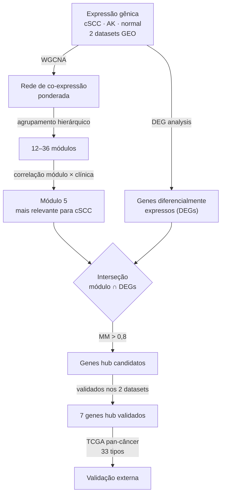

# Resumo: Chen et al. (2021)

[PDF](paper.pdf)

---

## Metadados

| Campo       | Informação                                                                                        |
| ----------- | ------------------------------------------------------------------------------------------------- |
| **Título**  | Seven key hub genes identified by gene co-expression network in cutaneous squamous cell carcinoma |
| **Autores** | Huizhen Chen, Jiankang Yang, Wenjuan Wu                                                           |
| **Revista** | _BMC Cancer_                                                                                      |
| **Ano**     | 2021                                                                                              |
| **Volume**  | 21, artigo 852                                                                                    |
| **DOI**     | https://doi.org/10.1186/s12885-021-08604-y                                                        |
| **Acesso**  | Acesso aberto (Open Access)                                                                       |

> **Nota:** O artigo é frequentemente citado como "Zhang et al." por engano; os autores corretos são Chen, Yang e Wu.

---

## Problema Investigado

O Carcinoma Espinocelular Cutâneo (cSCC[^cscc]) é o segundo câncer de pele mais comum e pode se espalhar para outros órgãos (metástase) em ~10% dos casos. Não existem biomarcadores clínicos confiáveis para diagnosticar e tratar o cSCC precocemente. Os autores queriam identificar genes-chave (hubs[^hub]) envolvidos no desenvolvimento do cSCC e da queratose actínica (AK[^ak]), sua lesão precursora.

---

## Dados Utilizados

Todos os dados foram obtidos do banco público **GEO**[^geo]:

| Dataset   | Amostras de cSCC | Amostras de AK | Amostras normais | Descrição                                                            |
| --------- | ---------------- | -------------- | ---------------- | -------------------------------------------------------------------- |
| GSE45216  | 30               | 10             | —                | Microarray de pele (cSCC e AK); plataforma Affymetrix HG-U133 Plus 2 |
| GSE98774  | —                | 28             | 36               | Microarray de AK vs. pele normal; plataforma Affymetrix HG-U133A 2.0 |
| GSE108008 | 10               | 10             | 10               | RNA-seq de cSCC, AK e pele normal pareada do mesmo paciente          |

Os datasets GSE45216 e GSE98774 foram combinados num único dataset (GSE45216–98774) para aumentar o poder estatístico. Isso foi possível porque ambos usam a mesma tecnologia (microarray Affymetrix HG-U133), tornando os valores de expressão diretamente comparáveis. GSE108008, por ser RNA-seq, produz valores em escala e distribuição completamente distintas do microarray — combiná-lo com os outros introduziria ruído técnico que mascararia o sinal biológico, mesmo com correção de batch. Por isso o WGCNA[^wgcna] foi rodado separadamente para GSE108008, e os resultados foram comparados ao final para identificar genes consistentes em ambas as análises.

---

## O Que Foi Feito

### 1. Construção da Rede de Co-expressão (WGCNA)

Para cada par de genes, calculou-se a correlação entre seus níveis de expressão em todas as amostras. Quanto mais dois genes "se comportam juntos" (sobem e descem juntos entre os pacientes), mais forte é a aresta entre eles na rede.

Os pesos das arestas foram definidos como |r|^β — a correlação elevada à potência β — de forma que a distribuição de graus da rede se aproxime de uma lei de potência (propriedade **scale-free**[^scalefree], comum em redes biológicas reais). O valor de β foi escolhido como o menor inteiro para o qual R² ≥ 0.8 no ajuste linear entre log(grau) e log(frequência do grau), resultando em β = 5 para o dataset combinado e β = 6 para GSE108008.

Vale notar que redes biológicas reais (como redes de interação proteína-proteína medidas em laboratório) já são naturalmente scale-free. A rede do WGCNA, porém, é construída artificialmente a partir de correlações — e correlações brutas produzem uma distribuição de graus aproximadamente normal, não uma lei de potência. O β é portanto um artifício para forçar a rede construída a se comportar como uma rede biológica real. Embora o WGCNA teste por convenção apenas valores inteiros de β, isso é uma escolha de implementação: valores não-inteiros são matematicamente válidos, mas raramente necessários na prática, pois o critério R² ≥ 0.8 costuma ser atingido em algum inteiro pequeno.

### 2. Identificação de Módulos

O algoritmo agrupou os genes em módulos[^modulo]. Foram encontrados:

- **26 módulos** no dataset GSE45216–98774
- **12 módulos** no dataset GSE108008

Cada módulo recebeu uma cor como identificador (MEblue, MEred, MEcyan, etc.).

### 3. Correlação dos Módulos com Características Clínicas

Para cada módulo, calculou-se a correlação entre seu ME[^me] (representante do módulo) e as características das amostras: cSCC, AK ou normal.

- **Módulo 5** foi o mais correlacionado com cSCC (1.742 genes)
- **Módulo 23** foi o mais correlacionado com AK (31 genes)

### 4. Enriquecimento Funcional (GO[^go] e KEGG[^kegg])

Os genes do módulo 5 (relevante para cSCC) foram associados a funções como:

- Colágeno e matriz extracelular (estrutura de suporte dos tecidos)
- Via de sinalização TNF (inflamação)
- Interação citocina-citocina (comunicação entre células imunes)
- Adesão focal (como as células se prendem aos tecidos)

### 5. Identificação dos Genes Hub

Genes presentes no módulo mais relevante **e** significativamente diferencialmente expressos (DEGs[^deg]) foram candidatos a hub. Genes hub foram definidos como aqueles com alta "pertinência ao módulo" (correlação > 0,8 com o ME). Apenas os genes hub encontrados nos **dois datasets** foram considerados validados.

### 6. Validação em Pan-câncer

Os 7 genes hub validados foram testados em 33 tipos de câncer usando dados do **TCGA**[^tcga], verificando se sua expressão se correlaciona com sobrevida dos pacientes.

---

## Estratégia de Grafo Utilizada

**Detecção de módulos por co-expressão ponderada (WGCNA) + identificação de hubs**

```
Expressão gênica (amostras de cSCC, AK e normal)
                    ↓
        Rede de co-expressão ponderada (WGCNA)
        (aresta = correlação de expressão entre genes)
                    ↓
        Agrupamento hierárquico → Módulos (comunidades)
                    ↓
        Correlação módulo × característica clínica
        (qual módulo representa melhor o cSCC?)
                    ↓
        Módulo 5 (mais relevante para cSCC)
                    ↓
        Interseção: genes do módulo 5 ∩ DEGs
                    ↓
        Genes hub (alta pertinência ao módulo, MM > 0,8)
        validados nos dois datasets
                    ↓
        7 genes hub identificados
```




---

## Resultados

Os **7 genes hub** validados para cSCC foram:

| Gene         | O que se sabe sobre ele                                                               |
| ------------ | ------------------------------------------------------------------------------------- |
| **GATM**     | Envolvido no metabolismo de aminoácidos                                               |
| **ARHGEF26** | Regula a forma e movimento das células                                                |
| **PTHLH**    | Relacionado ao crescimento celular e diferenciação                                    |
| **MMP1**     | Enzima que degrada colágeno — importante na invasão tumoral                           |
| **POU2F3**   | Fator de transcrição (controla a ativação de outros genes)                            |
| **MMP10**    | Outra enzima de degradação de matriz — também ligada à invasão                        |
| **GATA3**    | Fator de transcrição; o único dos 7 associado à sobrevida especificamente em melanoma |

Todos os 7 genes tiveram expressão significativamente diferente entre tecido normal e cSCC, e cada um foi associado à sobrevida em pelo menos algum tipo de câncer no pan-câncer TCGA.

---

## Por Que Este Artigo É Relevante para o Nosso Projeto

Nosso projeto analisa câncer de pele não-melanoma (que inclui cSCC) usando exatamente os datasets do GEO **GSE45216** e **GSE53462** — o mesmo tipo de dado usado neste artigo. A metodologia de WGCNA para encontrar módulos e genes hub em cSCC é diretamente comparável à nossa abordagem com Cytoscape/MCODE, e os genes hub identificados (especialmente MMP1, MMP10) são candidatos naturais a aparecerem como nós centrais nas nossas redes de interação proteica via STRING.

---

## Referência Completa

**ABNT:**
CHEN, Huizhen; YANG, Jiankang; WU, Wenjuan. Seven key hub genes identified by gene co-expression network in cutaneous squamous cell carcinoma. **BMC Cancer**, v. 21, artigo 852, 2021. DOI: https://doi.org/10.1186/s12885-021-08604-y.

**Vancouver:**
Chen H, Yang J, Wu W. Seven key hub genes identified by gene co-expression network in cutaneous squamous cell carcinoma. BMC Cancer. 2021;21:852. doi: 10.1186/s12885-021-08604-y.

**APA:**
Chen, H., Yang, J., & Wu, W. (2021). Seven key hub genes identified by gene co-expression network in cutaneous squamous cell carcinoma. _BMC Cancer_, _21_, 852. https://doi.org/10.1186/s12885-021-08604-y

---

## Notas

[^cscc]: _cSCC (Cutaneous Squamous Cell Carcinoma)_ — Carcinoma Espinocelular Cutâneo: o segundo tipo de câncer de pele mais comum, originado nas células escamosas da camada externa da pele.

[^hub]: _Gene hub_ — Gene altamente conectado dentro de uma rede biológica, funcionando como um "nó central" que se comunica com muitos outros genes e tende a ser crucial para o sistema.

[^ak]: _AK (Actinic Keratosis)_ — Queratose Actínica: lesão pré-cancerosa da pele causada por exposição crônica ao sol, considerada o estágio precursor do cSCC.

[^geo]: _GEO (Gene Expression Omnibus)_ — Banco de dados público do NCBI onde pesquisadores depositam dados de expressão gênica para que outros possam reutilizá-los.

[^wgcna]: _WGCNA (Weighted Gene Co-expression Network Analysis)_ — Método que constrói uma rede de genes onde a força da conexão entre dois genes é proporcional ao quanto suas expressões se correlacionam entre as amostras.

[^scalefree]: _Escala livre (scale-free)_ — Propriedade de redes em que poucos nós têm muitas conexões (hubs) e muitos nós têm poucas, seguindo uma distribuição em lei de potência comum em redes biológicas reais.

[^modulo]: _Módulo_ — Grupo de genes altamente co-expressos entre si dentro de uma rede, tendendo a representar um processo biológico específico.

[^me]: _ME (Module Eigengene)_ — Resumo matemático do comportamento de expressão de todos os genes de um módulo, funcionando como um "representante único" do módulo para análises de correlação.

[^go]: _GO (Gene Ontology)_ — Sistema de classificação que descreve as funções dos genes em três categorias: processo biológico, função molecular e componente celular.

[^kegg]: _KEGG (Kyoto Encyclopedia of Genes and Genomes)_ — Banco de dados de vias moleculares que permite descobrir em qual "circuito" celular um gene está envolvido.

[^deg]: _DEG (Differentially Expressed Gene)_ — Gene diferencialmente expresso: gene com expressão significativamente maior ou menor em células cancerosas comparado a células normais.

[^tcga]: _TCGA (The Cancer Genome Atlas)_ — Projeto que sequenciou o genoma de amostras de 33 tipos de câncer de milhares de pacientes, um dos maiores bancos de dados genômicos de câncer.
