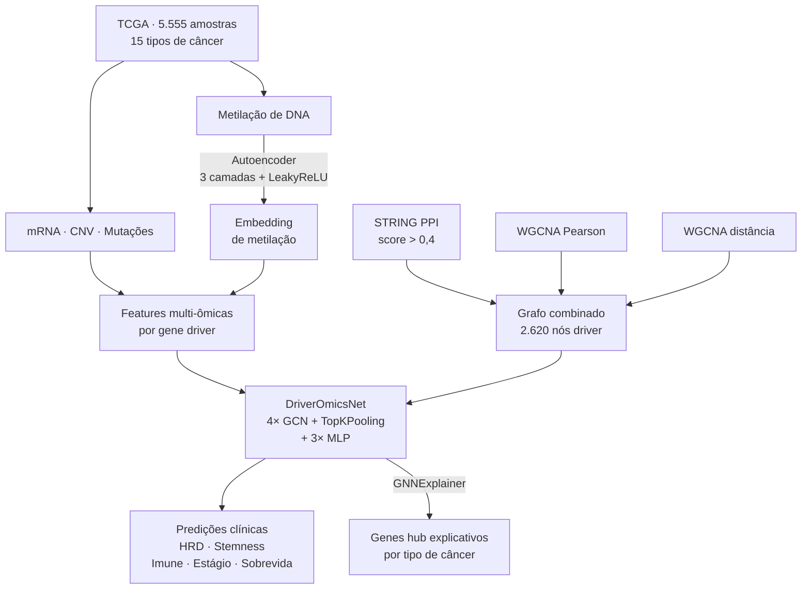
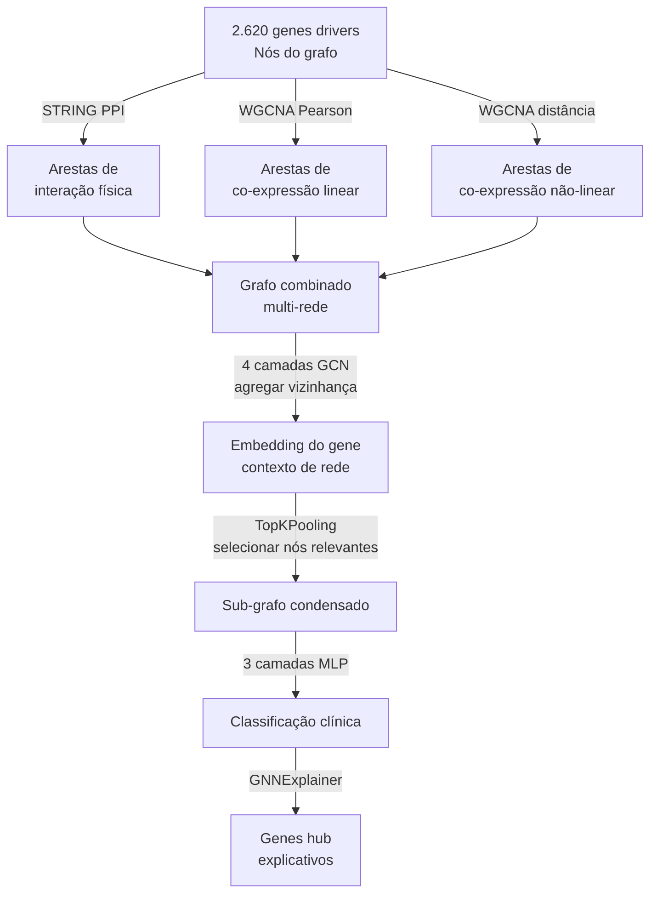

# dai2025 — Driver Genes via Multi-Omics GCN (DriverOmicsNet)

| Campo       | Informação |
| ----------- | ---------- |
| **Título**  | DriverOmicsNet: an integrated graph convolutional network for multi-omics exploration of cancer driver genes |
| **Autores** | Yang-Hong Dai, Chia-Jung Chang, Po-Chien Shen, Wun-Long Jheng, Ding-Jie Lee, Yu-Guang Chen |
| **Revista** | _Briefings in Bioinformatics_ |
| **Ano**     | 2025 |
| **DOI**     | https://doi.org/10.1093/bib/bbaf412 |
| **Acesso**  | Acesso aberto (PMC: PMC12354958) |

---

## Problema Investigado

Identificar **genes drivers**[^driver] de câncer é uma tarefa central em oncologia: são esses genes que, quando mutados ou desregulados, "empurram" a célula em direção ao câncer. Porém, a maioria dos métodos existentes usa apenas um tipo de dado (ex.: mutações) ou apenas uma fonte de rede (ex.: PPI[^ppi]). O artigo pergunta: é possível combinar **múltiplos tipos de dados moleculares** e **múltiplos tipos de rede** num único modelo de aprendizado em grafos para prever melhor as características clínicas do tumor?

---

## Dados Utilizados

| Fonte | Conteúdo |
| ----- | -------- |
| UCSC Xena / TCGA[^tcga] | Expressão de mRNA[^mrna], variações de número de cópias (CNV[^cnv]), mutações somáticas, metilação de DNA[^metilacao] — 5.555 amostras tumorais, 15 tipos de câncer |
| GTEx | Tecidos normais como controle |
| DriverDBv3 | Banco de 2.620 genes candidatos a driver de câncer |
| CPTAC PAAD | Dataset externo de câncer de pâncreas para validação |

Os 15 tipos de câncer incluem **SKCM** (*Skin Cutaneous Melanoma* — melanoma cutâneo de pele), de interesse direto para o projeto.

---

## Pipeline/Metodologia

```
TCGA (mRNA, CNV, mutações, metilação)
              │
              ▼
┌─────────────────────────────────────┐
│  PRÉ-PROCESSAMENTO                  │
│  mRNA: normalização voom (RSEM)     │
│  CNV: GISTIC2                       │
│  Mutações: MC3 project              │
│  Metilação: Autoencoder (3 camadas) │
│             → redução dimensional   │
└───────────────┬─────────────────────┘
                │
                ▼
┌─────────────────────────────────────┐
│  CONSTRUÇÃO DAS REDES               │
│  STRING PPI (score > 0,4)           │
│  WGCNA correlação de Pearson        │
│  WGCNA correlação de distância      │
│  → 3 grafos combinados              │
└───────────────┬─────────────────────┘
                │
                ▼
┌─────────────────────────────────────┐
│  DriverOmicsNet (GCN)               │
│  4 camadas GCN + TopKPooling        │
│  + 3 camadas MLP (classificação)    │
│  Validação cruzada 5-fold           │
└───────────────┬─────────────────────┘
                │
                ▼
┌─────────────────────────────────────┐
│  PREDIÇÃO DE CARACTERÍSTICAS        │
│  - Deficiência de recombinação      │
│    homóloga (HRD)                   │
│  - Stemness (célula-tronco tumoral) │
│  - Cluster imune                    │
│  - Estágio do tumor                 │
│  - Sobrevida                        │
└───────────────┬─────────────────────┘
                │
                ▼
┌─────────────────────────────────────┐
│  EXPLICABILIDADE: GNNExplainer       │
│  → genes hub mais influentes        │
│    para cada previsão               │
└─────────────────────────────────────┘
```



---

## Estratégia de Grafo Utilizada

**Grafo multi-rede não-direcionado com GCN[^gcn] + TopKPooling**

- **Nós:** 2.620 genes drivers candidatos (subconjunto específico por tipo de câncer)
- **Arestas:** combinação de 3 fontes — STRING PPI (interações proteína-proteína físicas), WGCNA[^wgcna] Pearson (co-expressão) e WGCNA distância (correlação não-linear)
- **Features dos nós:** vetor multi-ômico por gene (expressão, CNV, mutação, metilação comprimida)

A inovação está em **combinar 3 grafos** diferentes no mesmo modelo: a rede PPI captura interações físicas conhecidas; as redes WGCNA capturam co-expressão funcional que pode não ter interação física confirmada. Juntos, eles fornecem uma visão mais completa das relações entre genes.



---

## Resultados Principais

| Tarefa de predição | Tipo de câncer | Acurácia / AUC |
| --- | --- | --- |
| Cluster imune | SKCM (melanoma) | Precisão = 0,91; F1 = 0,87 |
| Deficiência de recombinação homóloga (HRD) | STAD | AUC = 0,96 |
| Cluster imune | múltiplos | 89,5%–95,2% |
| Melhoria vs. rede única | todos | +0,1% a +15,2% |

**Para melanoma (SKCM):** o gene **ACTB** foi identificado como hub, associado à infiltração de células imunes em múltiplos tipos de câncer. A metilação de DNA no SKCM formou clusters distintos visíveis no t-SNE[^tsne], sugerindo subtipos epigenéticos[^epigenetica].

**Característica mais importante:** expressão de mRNA foi o dado mais preditivo em todos os modelos, seguido por CNV. Mutações contribuíram menos.

---

## Relevância para o Projeto

Este artigo é altamente relevante porque:

1. **Usa SKCM (melanoma)** como um dos 15 tipos de câncer analisados — resultados diretamente aplicáveis ao nosso projeto.
2. **Combina PPI + WGCNA** — exatamente as ferramentas que usamos (STRING, Cytoscape), mas em um framework de deep learning.
3. **GCN sobre redes de genes** — complementa nossa análise topológica clássica com uma abordagem de aprendizado de máquina em grafos.
4. **Multi-ômico** — aponta que expressão gênica (nosso dado principal) é a feature mais relevante, validando nossa escolha de focar em expressão.
5. **GNNExplainer** — modelo de explicabilidade semelhante ao XGDAG (mastropietro2023), reforçando a tendência de XAI[^xai] em redes biológicas.

---

## Referência Completa

**ABNT:**
DAI, Yang-Hong et al. DriverOmicsNet: an integrated graph convolutional network for multi-omics exploration of cancer driver genes. *Briefings in Bioinformatics*, v. 26, n. 4, p. bbaf412, 2025. DOI: 10.1093/bib/bbaf412.

**Vancouver:**
Dai YH, Chang CJ, Shen PC, Jheng WL, Lee DJ, Chen YG. DriverOmicsNet: an integrated graph convolutional network for multi-omics exploration of cancer driver genes. Brief Bioinform. 2025;26(4):bbaf412. doi:10.1093/bib/bbaf412.

**APA:**
Dai, Y.-H., Chang, C.-J., Shen, P.-C., Jheng, W.-L., Lee, D.-J., & Chen, Y.-G. (2025). DriverOmicsNet: an integrated graph convolutional network for multi-omics exploration of cancer driver genes. *Briefings in Bioinformatics*, *26*(4), bbaf412. https://doi.org/10.1093/bib/bbaf412

---

[^driver]: **Gene driver**: gene cuja alteração (mutação, amplificação, silenciamento) dá vantagem de crescimento à célula tumoral e impulsiona o desenvolvimento do câncer. Diferente de gene *passenger*, que apenas acumula mutações sem causar o câncer.
[^ppi]: **PPI** — *Protein-Protein Interaction*, interação proteína-proteína. Mapa de quais proteínas trabalham juntas fisicamente na célula.
[^tcga]: **TCGA** — *The Cancer Genome Atlas*, maior banco público de dados genômicos de câncer, com amostras de mais de 30 tipos de tumor.
[^mrna]: **mRNA** — *messenger RNA*, molécula intermediária entre o DNA e a proteína. Medir mRNA é medir o quanto um gene está sendo "lido" (expresso) naquele momento.
[^cnv]: **CNV** — *Copy Number Variation*, variação no número de cópias de um trecho do DNA. Um gene com muitas cópias extras tende a ser muito ativo; com poucas cópias, tende a ser silenciado.
[^metilacao]: **Metilação de DNA**: modificação química (adição de um grupo metil) em regiões do DNA que geralmente silencia genes próximos — como "etiquetar" uma página do livro de receitas para que a célula a ignore.
[^gcn]: **GCN** — *Graph Convolutional Network*, rede neural que opera diretamente sobre grafos, agregando informações dos vizinhos de cada nó em múltiplas camadas.
[^wgcna]: **WGCNA** — *Weighted Gene Co-expression Network Analysis*, método estatístico que constrói redes de co-expressão pesadas e identifica módulos de genes que variam juntos.
[^tsne]: **t-SNE** — *t-distributed Stochastic Neighbor Embedding*, técnica de redução de dimensionalidade para visualizar dados de alta dimensão em 2D, agrupando amostras similares.
[^epigenetica]: **Epigenética**: modificações no DNA ou nas proteínas que empacotam o DNA que afetam a expressão gênica *sem* alterar a sequência do DNA em si. Metilação é um exemplo.
[^xai]: **XAI** — *Explainable Artificial Intelligence*, área de IA que desenvolve métodos para tornar as decisões de modelos de machine learning interpretáveis por humanos.
