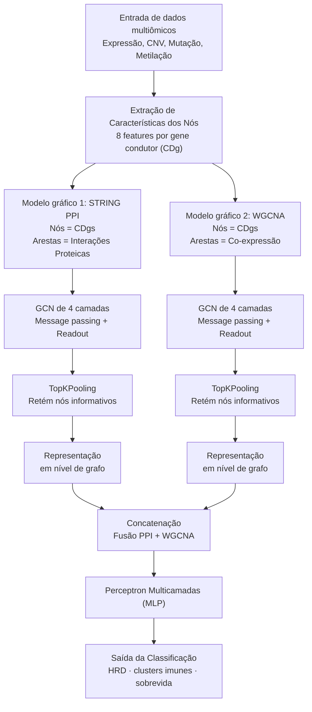

### **Visão geral**

Para compreender o comportamento e as interações dos genes condutores do câncer (CDgs) é vital para o avanço da oncologia de precisão. Para tanto, os autores desenvolveram o **DriverOmicsNetDriverOmicsNet** que é uma nova estrutura de aprendizado profundo baseada em Redes Neurais Convolucionais Gráficas (GCNs). Seu objetivo é integrar dados multiômicos de 15 tipos diferentes de câncer (analisando 5.555 amostras tumorais) para prever com precisão propriedades tumorais críticas, como Deficiência de Recombinação Homóloga (HRD), características de células-tronco cancerígenas, agrupamentos imunológicos, estágio tumoral e prognóstico de sobrevida.

### **Ilustração da abordagem e do modelo gráfico**

A ilustração a seguir descreve a arquitetura e o modelo gráfico adotados no DriverOmicsNet:

> **Nota:** O diagrama enviado originalmente chegou corrompido (escapes de Markdown e setas `v` trocadas pela palavra "em"). Versão recuperada abaixo — ASCII (bloco de código) e Mermaid equivalente.

```text
========================================================================
                [Entrada de dados multiômicos]
      (Expressão Gênica, CNV, Mutação, Perfis de Metilação)
                             |
                             v
               [Extração de Características dos Nós]
          (8 características distintas por gene condutor)
                             |
               +-------------+-------------+
               |                           |
               v                           v
   [Modelo gráfico 1: STRING PPI]    [Modelo gráfico 2: WGCNA]
        (Nós = CDgs)                      (Nós = CDgs)
   (Arestas = Interações Proteicas   (Arestas = Similaridade
          Conhecidas)                     de Coexpressão)
               |                           |
               v                           v
        [GCN de 4 camadas]           [GCN de 4 camadas]
    (Transmissão de mensagens     (Transmissão de mensagens
            + Releitura)                 + Releitura)
               |                           |
               v                           v
         [TopKPooling]                 [TopKPooling]
    (Retém nós informativos)      (Retém nós informativos)
               |                           |
               v                           v
  [Representação em nível de       [Representação em nível de
            grafo]                          grafo]
               |                           |
               +-------------+-------------+
                             |
                             v
                      [Concatenação]
             (Fusão de caminhos PPI e WGCNA)
                             |
                             v
               [Perceptron Multicamadas (MLP)]
                             |
                             v
                  [Saída da Classificação]
     (ex.: status HRD, clusters imunológicos, sobrevida)
========================================================================
```



### **Detalhes da estratégia e do modelo de grafo**

Para modelar de forma robusta os mecanismos celulares que impulsionam o câncer, os pesquisadores evitaram depender de apenas uma rede topológica. Em vez disso, utilizaram uma **estratégia de grafo duplo** utilizando dois modelos gráficos distintos:

1. **O gráfico STRING PPI:** Um grafo baseado em conhecimento, onde os nós são genes condutores do câncer e as arestas não direcionadas representam interações proteína-proteína verificadas experimentalmente (pontuação combinada \> 0,4).  
2. **O gráfico da WGCNA:** Uma rede de coexpressão gênica ponderada orientada por dados. Nela, os nós são conectados com base na similaridade de sua coexpressão transcriptômica (utilizando métricas de correlação) para capturar dependências funcionais específicas do tumor.

**Estratégia de grafos:** Para cada amostra de câncer, as características dos nós são inicializadas como um vetor multiômico de 8 dimensões (incluindo dados de expressão, CNV, mutação, CpG e não-CpG). Os dados são inseridos em paralelo. **Redes Neurais Convolucionais Gráficas (GCNs)** tanto para os grafos STRING quanto para os grafos WGCNA.

A estratégia GCN consiste em quatro camadas de passagem de mensagens para cada grafo, ativadas por funções ReLU. Um componente estratégico chave deste modelo é o uso de **TopKPooling.** Após as convoluções, em vez de tratar todos os genes igualmente, o TopKPooling poda dinamicamente o grafo para filtrar ruídos, retendo apenas os genes-chave mais informativos para a tarefa de predição atual. Os nós restantes são agrupados globalmente para formar uma representação abrangente em nível de grafo. As representações dos ramos STRING e WGCNA são então concatenadas para fundir tanto o conhecimento biológico prévio quanto os dados empíricos de coexpressão. Finalmente, esse vetor combinado é passado por uma MLP para realizar a classificação binária.

Além disso, para interpretar a rede, a estratégia emprega o **Explicador GNN.** Este algoritmo calcula máscaras de importância de características e arestas para extrair subgrafos-chave, mostrando explicitamente quais genes e interações foram os principais responsáveis ​​pelas previsões do modelo.

### **Resultados apoiados pela estratégia**

Ao empregar essa estratégia de agrupamento de grafos duplos, o DriverOmicsNet alcançou consistentemente precisão preditiva e pontuações F1 superiores em todos os rótulos avaliados, quando comparado a modelos de referência (incluindo GCNs de grafo único). O modelo demonstrou que a expressão gênica é a característica funcional mais significativa que guia a atividade dos genes condutores. Além disso, ao analisar os subgrafos extraídos via GNNExplainer, o estudo comprovou com sucesso que a fusão da rede STRING PPI, biologicamente estabelecida, com a rede WGCNA, baseada em dados, proporciona uma visão muito mais rica e precisa das interações entre genes condutores do câncer, abrindo um caminho promissor para a oncologia de precisão direcionada.

