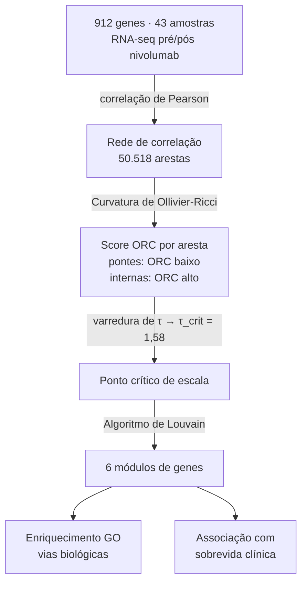

# Resumo: Murgas et al. (2024)

---

## Metadados

| Campo       | Informação                                                                                     |
| ----------- | ---------------------------------------------------------------------------------------------- |
| **Título**  | Multi-scale geometric network analysis identifies melanoma immunotherapy response gene modules |
| **Autores** | Kevin A. Murgas, Rena Elkin, Nadeem Riaz, Emil Saucan, Joseph O. Deasy, Allen R. Tannenbaum    |
| **Revista** | _Scientific Reports_                                                                           |
| **Ano**     | 2024                                                                                           |
| **Volume**  | 14, artigo 6082                                                                                |
| **DOI**     | https://doi.org/10.1038/s41598-024-56459-7                                                     |
| **Acesso**  | Acesso aberto (Open Access)                                                                    |

---

## Problema Investigado

O melanoma[^melanoma] é um câncer de pele muito agressivo. Embora imunoterapias[^imunoterapia] como o nivolumab[^nivolumab] funcionem em alguns pacientes, não sabemos bem por que funcionam em uns e não em outros — e quais genes estão por trás dessa resposta.

---

## O Que Foi Feito

Os autores coletaram amostras de tumor de **43 pacientes com melanoma** antes e depois do tratamento com nivolumab e mediram a expressão de **912 genes** usando RNA-seq[^rnaseq].

Com esses dados, construíram uma **rede de correlação**[^redecorrelacao]: cada gene é um nó, e dois genes são conectados por uma aresta se suas expressões mudam de forma coordenada em resposta ao tratamento. No total, a rede tinha **50.518 arestas**.

Em vez de usar métodos tradicionais de agrupamento (que exigem definir manualmente um limiar de correlação), os autores aplicaram a **curvatura de Ollivier-Ricci (ORC)**[^orc] — uma propriedade geométrica da rede que identifica naturalmente quais arestas são "pontes" entre comunidades e quais estão dentro de comunidades.

A rede foi analisada em múltiplas escalas (o parâmetro τ na Figura 1A do artigo) para encontrar o ponto em que as comunidades ficam mais bem definidas (τ_crit = 1,58). Com isso, aplicaram o **algoritmo de Louvain**[^louvain] para dividir a rede em grupos.

---

## Estratégia de Grafo Utilizada

**Detecção de comunidades por curvatura geométrica (ORC + Louvain)**

```
Genes (nós) → Rede de correlação (arestas = correlação de expressão)
                    ↓
         Curvatura de Ollivier-Ricci
         (identifica arestas dentro vs. entre comunidades)
                    ↓
         Clustering de Louvain
                    ↓
         6 módulos (comunidades de genes)
                    ↓
         Análise de enriquecimento de vias biológicas (GO)
                    ↓
         Associação com sobrevida e resposta clínica
```



---

## Resultados

Foram identificados **6 módulos**[^modulo] de genes que respondem juntos à imunoterapia:

| Módulo | Nº de genes | Processo biológico associado                       |
| ------ | ----------- | -------------------------------------------------- |
| 1      | 116         | Endocitose e transporte vesicular                  |
| 2      | 79          | Migração e quimiotaxia de leucócitos               |
| 3      | 204         | Modificação de histonas e remodelação da cromatina |
| 4      | 342         | Adesão celular e proliferação de leucócitos        |
| 5      | 113         | Catabolismo proteossomal e ubiquitinação           |
| **6**  | **58**      | **Via NF-κB[^nfkb], sinalização de citocinas**     |

O **Módulo 6** foi o único associado significativamente à **melhor sobrevida** dos pacientes e à **resposta positiva ao tratamento** (p = 0,029). Dois genes deste módulo tiveram efeitos individuais significativos: **IL18R1** (mais ativo em quem respondeu bem) e **IL1RAP** (menos ativo em quem respondeu bem).


---

## Por Que Este Artigo É Relevante para o Nosso Projeto

Nosso projeto compara redes gênicas de melanoma, não-melanoma e tecido saudável usando ferramentas como STRING e Cytoscape. Este artigo demonstra exatamente como a **detecção de comunidades em redes gênicas** pode revelar grupos de genes funcionalmente relevantes em melanoma — a mesma lógica que aplicaremos, mas com outra abordagem técnica (curvatura geométrica vs. MCODE).

---

## Referência Completa

**ABNT:**
MURGAS, Kevin A. et al. Multi-scale geometric network analysis identifies melanoma immunotherapy response gene modules. **Scientific Reports**, v. 14, artigo 6082, 2024. DOI: https://doi.org/10.1038/s41598-024-56459-7.

**Vancouver:**
Murgas KA, Elkin R, Riaz N, Saucan E, Deasy JO, Tannenbaum AR. Multi-scale geometric network analysis identifies melanoma immunotherapy response gene modules. Sci Rep. 2024;14:6082. doi: 10.1038/s41598-024-56459-7.

**APA:**
Murgas, K. A., Elkin, R., Riaz, N., Saucan, E., Deasy, J. O., & Tannenbaum, A. R. (2024). Multi-scale geometric network analysis identifies melanoma immunotherapy response gene modules. _Scientific Reports_, _14_, 6082. https://doi.org/10.1038/s41598-024-56459-7

---

## Notas

[^melanoma]: _Melanoma_ — tipo mais agressivo de câncer de pele, originado nos melanócitos (células que produzem a pigmentação da pele).

[^imunoterapia]: _Imunoterapia_ — tratamento que "ensina" o sistema imunológico do paciente a reconhecer e combater as células cancerosas, em vez de atacar o tumor diretamente.

[^nivolumab]: _Nivolumab_ — medicamento de imunoterapia que bloqueia a proteína PD-1, reativando o sistema imune para atacar o tumor.

[^rnaseq]: _RNA-seq_ — técnica laboratorial para medir a expressão de milhares de genes ao mesmo tempo, funcionando como um "censo" de atividade gênica numa amostra de tecido.

[^redecorrelacao]: _Rede de correlação_ — grafo em que cada nó é um gene e cada aresta representa o quanto a expressão de dois genes "anda junto" (sobe ou desce ao mesmo tempo).

[^orc]: _Curvatura de Ollivier-Ricci (ORC)_ — medida geométrica que avalia o quão bem conectados são os vizinhos de dois nós; valores positivos indicam que ambos pertencem à mesma comunidade, valores negativos indicam que fazem a ponte entre comunidades.

[^louvain]: _Clustering de Louvain_ — algoritmo que agrupa automaticamente os nós de uma rede em comunidades, maximizando conexões internas e minimizando conexões entre grupos.

[^modulo]: _Módulo gênico_ — grupo de genes com expressão coordenada que tendem a ser ativados ou silenciados juntos, geralmente por participarem do mesmo processo biológico.

[^nfkb]: _Via NF-κB_ — conjunto de proteínas que funciona como um "interruptor" molecular que comanda inflamação, resposta imunológica e crescimento tumoral.
