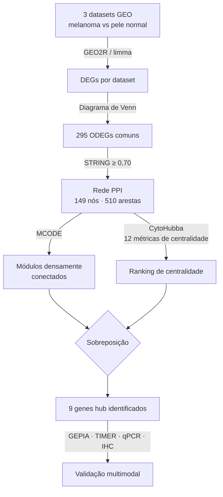

# Resumo: Xuan et al. (2021)

---

## Metadados

| Campo       | Informação                                                                                                        |
| ----------- | ----------------------------------------------------------------------------------------------------------------- |
| **Título**  | Identification of Genes Potentially Associated with Melanoma Tumorigenesis Through Co-Expression Network Analysis |
| **Autores** | Xiuyun Xuan, Yuqi Wang, Yanhong Sun, Changzheng Huang                                                             |
| **Revista** | _International Journal of General Medicine_                                                                       |
| **Ano**     | 2021                                                                                                              |
| **Volume**  | 14, pp. 8495–8508                                                                                                 |
| **DOI**     | https://doi.org/10.2147/IJGM.S336295                                                                              |
| **Acesso**  | Acesso aberto (Open Access)                                                                                       |

---

## Problema Investigado

Melanoma[^melanoma] é responsável por 75% das mortes por câncer de pele, apesar de representar apenas 4% dos casos. A maioria dos estudos foca em melanoma avançado ou metastático. Este trabalho investiga o processo menos estudado de **transição de pele normal para melanoma primário** — ou seja, o que acontece geneticamente no início do desenvolvimento do tumor.

---

## Dados Utilizados

Três datasets de microarray[^microarray] obtidos do banco público **GEO**[^geo], todos comparando melanoma primário vs. pele normal saudável:

| Dataset   | Amostras de Melanoma | Amostras Normais | Plataforma               |
| --------- | -------------------- | ---------------- | ------------------------ |
| GSE15605  | 46                   | 16               | Affymetrix U133 PLUS 2.0 |
| GSE46517  | 31                   | 7                | Affymetrix U133A         |
| GSE114445 | 16                   | 6                | Affymetrix U133 PLUS 2.0 |
| **Total** | **93**               | **29**           | —                        |

---

## Pipeline de Análise

```
3 datasets GEO (93 melanomas + 29 normais)
          ↓
  Identificação de DEGs em cada dataset
  (GEO2R / limma: |logFC| > 1, p < 0,05)
          ↓
  Diagrama de Venn → 295 ODEGs comuns
  (157 superexpressos + 138 subexpressos)
          ↓
  Anotação funcional (GO + KEGG via DAVID)
          ↓
  Rede PPI (STRING, confiança ≥ 0,70)
  149 nós, 510 arestas
          ↓
  Visualização no Cytoscape
          ↓
  Detecção de módulos: MCODE
  → Módulo 1 (score=9, 9 nós)
  → Módulo 2 (score=8, 8 nós)
          ↓
  Seleção de hub genes: CytoHubba (12 métodos)
  → 9 genes hub identificados
          ↓
  Validação: expressão (GEPIA), imunidade (TIMER),
  TFs (TRRUST), drogas (DGIdb),
  qPCR e IHC em tecidos humanos
```

O pipeline começa identificando DEGs[^deg] em cada dataset individualmente, aplicando o critério |logFC[^logfc]| > 1 e p < 0,05. Os DEGs comuns aos três datasets formam os ODEGs[^odeg]. Estes são anotados funcionalmente via GO[^go] + KEGG[^kegg] usando o DAVID[^david], depois inseridos numa rede PPI[^ppi] construída com o STRING[^string] (confiança ≥ 0,70). A rede é visualizada no Cytoscape[^cytoscape], com módulos detectados pelo MCODE[^mcode] e hubs ranqueados pelo CytoHubba[^cytohubba]. A validação clínica usa GEPIA[^gepia], TIMER[^timer], TRRUST[^trrust], DGIdb[^dgidb], qPCR[^qpcr] e IHC[^ihc].

---

## Estratégia de Grafo Utilizada

**Rede PPI + detecção de módulos (MCODE) + identificação de hubs (CytoHubba)**

O modelo de grafo é uma **rede de interação proteína-proteína (PPI)**:

- **Nós:** genes/proteínas (149 no total)
- **Arestas:** interações físicas conhecidas entre proteínas (510 no total), com score de confiança ≥ 0,70 no STRING

Sobre essa rede foram aplicadas duas estratégias complementares:

1. **MCODE** — detecta sub-redes densamente conectadas (módulos/comunidades): regiões onde cada nó se conecta a muitos outros nós do mesmo grupo
2. **CytoHubba** — calcula 12 métricas de centralidade para cada nó (grau, betweenness, closeness, etc.) e elege os genes com maior importância estrutural na rede como "hubs"[^hub]



---

## Resultados

### ODEGs identificados

- **295 genes** em comum entre os 3 datasets
- 157 superexpressos no melanoma (mais ativos que na pele normal)
- 138 subexpressos no melanoma (menos ativos que na pele normal)

### Os 9 Genes Hub

| Gene       | Direção         | O que é                                                                                        |
| ---------- | --------------- | ---------------------------------------------------------------------------------------------- |
| **CXCL10** | ↑ superexpresso | Quimiocina[^quimiocinas] que recruta células imunes para o tumor; associada a melhor sobrevida |
| **CXCL9**  | ↑ superexpresso | Quimiocina que inibe o crescimento tumoral por recrutamento linfocítico                        |
| **CCL4**   | ↑ superexpresso | Quimiocina que recruta células NK (assassinas naturais) para o tumor                           |
| **CXCL2**  | ↑ superexpresso | Quimiocina pró-inflamatória                                                                    |
| **CCL5**   | ↑ superexpresso | Quimiocina que recruta linfócitos T e células NK; associada a melhor sobrevida                 |
| **NPY1R**  | ↓ subexpresso   | Receptor de neuropeptídeo Y                                                                    |
| **PTGER3** | ↓ subexpresso   | Receptor de prostaglandina                                                                     |
| **NMU**    | ↓ subexpresso   | Neuromedin U; associada a **pior** sobrevida quando subexpresso                                |
| **CCL27**  | ↓ subexpresso   | Quimiocina da pele                                                                             |

### Achados de Sobrevida

- **CCL4, CCL5, CXCL9, CXCL10** (os 4 superexpressos da família das quimiocinas) — associados a **melhor** OS[^os] / DFS[^dfs] e mais expressos nos estágios iniciais (0 e 1) do melanoma
- **NMU** (subexpresso) — associado a **pior** OS

### Correlação com o Sistema Imunológico (TIMER)

5 genes (CCL5, NPY1R, CXCL10, CXCL9, CCL4) mostraram correlação positiva com a infiltração dos 6 tipos de células imunes:

- Linfócitos B, Linfócitos T CD4⁺, Linfócitos T CD8⁺, Macrófagos, Neutrófilos, Células dendríticas

### Regulação por Fatores de Transcrição

| TF[^tf]                                            | Genes que regula          |
| -------------------------------------------------- | ------------------------- |
| **RELA** e **NFKB1** (componentes do NF-κB[^nfkb]) | CCL4, CCL5, CXCL10, CXCL2 |
| **IRF7, IRF3, IRF1** (fatores de interferon)       | CCL5, CXCL10              |

### Interações Droga-Gene

46 pares droga-gene identificados. Destaques:

- **Oxaliplatina** (interagindo com CXCL10) — já usada em outros cânceres, com evidências de potencializar imunoterapia anti-PD-1
- **Beraprost** (interagindo com PTGER3) — análogo de prostaciclina que reduziu metástase pulmonar de melanoma em camundongos

### Validação Experimental

qPCR e IHC em 10 pares de tecido humano (melanoma + pele normal adjacente) confirmaram que **CCL4, CCL5, CXCL9 e CXCL10** estão mais expressos no melanoma tanto no nível de tecido quanto em linhagens celulares.

---

## Por Que Este Artigo É Relevante para o Nosso Projeto

Este artigo é o mais diretamente alinhado com nossa metodologia: usa **STRING + Cytoscape + MCODE** para construir uma rede PPI e encontrar módulos e hubs em melanoma — exatamente o que faremos no projeto. Os datasets GEO usados (GSE15605, GSE46517) são do mesmo tipo que usaremos. Os 9 genes hub identificados — especialmente **CXCL10, CXCL9, CCL4 e CCL5** — são candidatos fortes a aparecerem como nós centrais nas nossas redes. Além disso, a descoberta de que esses genes estão ligados à via NF-κB conecta diretamente com o Módulo 6 identificado por Murgas et al. (2024), sugerindo que essa via é um marcador robusto de melanoma. A validação via TCGA[^tcga] (pela plataforma GEPIA) reforça que os achados transcendem os datasets GEO originais.

---

## Referência Completa

**ABNT:**
XUAN, Xiuyun; WANG, Yuqi; SUN, Yanhong; HUANG, Changzheng. Identification of Genes Potentially Associated with Melanoma Tumorigenesis Through Co-Expression Network Analysis. **International Journal of General Medicine**, v. 14, p. 8495–8508, 2021. DOI: https://doi.org/10.2147/IJGM.S336295.

**Vancouver:**
Xuan X, Wang Y, Sun Y, Huang C. Identification of Genes Potentially Associated with Melanoma Tumorigenesis Through Co-Expression Network Analysis. Int J Gen Med. 2021;14:8495-8508. doi: 10.2147/IJGM.S336295.

**APA:**
Xuan, X., Wang, Y., Sun, Y., & Huang, C. (2021). Identification of Genes Potentially Associated with Melanoma Tumorigenesis Through Co-Expression Network Analysis. _International Journal of General Medicine_, _14_, 8495–8508. https://doi.org/10.2147/IJGM.S336295

---

## Notas

[^melanoma]: _Melanoma_ — Tipo mais agressivo de câncer de pele, originado nos melanócitos (células de pigmentação); causa ~75% das mortes por câncer de pele apesar de representar ~4% dos casos.

[^microarray]: _Microarray_ — Tecnologia que mede simultaneamente a atividade de milhares de genes numa amostra de tecido, funcionando como um "painel de controle" de quais genes estão ativos.

[^geo]: _GEO (Gene Expression Omnibus)_ — Banco de dados público onde pesquisadores depositam dados de expressão gênica para reutilização livre por outros grupos.

[^deg]: _DEG (Differentially Expressed Gene)_ — Gene diferencialmente expresso: significativamente mais ou menos ativo em tecido canceroso comparado ao tecido normal.

[^logfc]: _logFC (log Fold Change)_ — Medida de quanto a expressão de um gene mudou; |logFC| > 1 significa ao menos 2× mais (ou menos) ativo no tumor.

[^odeg]: _ODEG (Overlapping DEG)_ — Gene diferencialmente expresso que aparece em vários datasets simultaneamente, aumentando a confiabilidade do achado.

[^go]: _GO (Gene Ontology)_ — Sistema padronizado de classificação das funções dos genes: processo biológico, componente celular e função molecular.

[^kegg]: _KEGG (Kyoto Encyclopedia of Genes and Genomes)_ — Banco de dados de vias moleculares que mapeia em quais rotas metabólicas ou de sinalização cada gene está envolvido.

[^david]: _DAVID_ — Ferramenta online de anotação funcional que recebe uma lista de genes e identifica quais processos biológicos estão enriquecidos nessa lista.

[^ppi]: _PPI (Protein-Protein Interaction)_ — Rede de interações físicas entre proteínas dentro da célula; cada proteína é produzida por um gene.

[^string]: _STRING_ — Banco de dados de interações conhecidas entre proteínas, fornecendo pares documentados com score de confiança.

[^cytoscape]: _Cytoscape_ — Software de visualização e análise de redes biológicas que permite desenhar e explorar grafos de interações.

[^mcode]: _MCODE_ — Plugin do Cytoscape que detecta automaticamente regiões densamente conectadas (módulos/comunidades) dentro de uma rede PPI.

[^cytohubba]: _CytoHubba_ — Plugin do Cytoscape que calcula 12 métricas de centralidade para cada nó e identifica os genes de maior importância estrutural na rede.

[^gepia]: _GEPIA_ — Plataforma online que usa dados do TCGA e GTEx para analisar expressão gênica em tumores e sua relação com sobrevida dos pacientes.

[^timer]: _TIMER_ — Banco de dados que avalia a correlação entre expressão gênica e infiltração de células imunológicas no tumor.

[^trrust]: _TRRUST_ — Banco de dados de redes de regulação por fatores de transcrição, indicando quais "interruptores moleculares" controlam quais genes.

[^dgidb]: _DGIdb_ — Banco de dados de interações droga-gene que lista quais medicamentos conhecidos atuam sobre quais genes.

[^qpcr]: _qPCR (Quantitative Polymerase Chain Reaction)_ — Técnica laboratorial que mede com precisão a quantidade de RNA de um gene específico, usada para validar resultados computacionais.

[^ihc]: _IHC (Immunohistochemistry)_ — Imunohistoquímica: técnica que usa anticorpos marcados para visualizar ao microscópio onde e quanto uma proteína está presente em cortes de tecido.

[^hub]: _Gene hub_ — Gene altamente conectado na rede, funcionando como "nó central" (estação de metrô central); tende a ser biologicamente mais importante.

[^quimiocinas]: _Quimiocinas_ — Família de pequenas proteínas que funcionam como "sinais de navegação" para células imunes, recrutando linfócitos e outros leucócitos para o local do tumor.

[^os]: _OS (Overall Survival)_ — Sobrevida global: tempo de vida do paciente após o diagnóstico de câncer.

[^dfs]: _DFS (Disease-Free Survival)_ — Sobrevida livre de doença: tempo sem recorrência do câncer após o tratamento.

[^tf]: _TF (Fator de Transcrição)_ — Proteína que age como "interruptor molecular": ao se ligar ao DNA, ativa ou silencia outros genes.

[^nfkb]: _NF-κB_ — Via de sinalização que regula inflamação, resposta imune, proliferação celular e apoptose (morte celular programada).

[^tcga]: _TCGA (The Cancer Genome Atlas)_ — Projeto que sequenciou o genoma de amostras de 33 tipos de câncer de milhares de pacientes; SKCM corresponde ao melanoma cutâneo.
