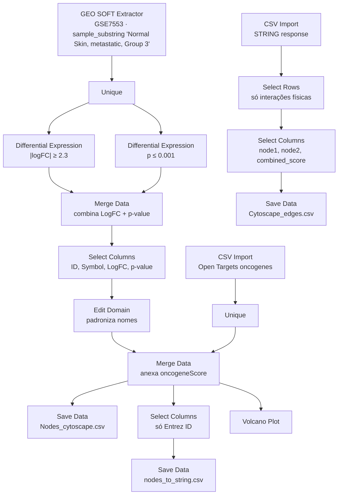

# Workspace — pipelines de análise por subgrupo

Materiais de trabalho da análise, organizados por **subgrupo de amostra**. Cada subpasta contém dados, workflow Orange, rede STRING e sessão Cytoscape que levaram à rede PPI final daquele subgrupo.

Os `.soft.gz` ficam dentro de cada subpasta (Orange aponta para caminho relativo) e são rastreados via **Git LFS** (pattern `*.gz` em `.gitattributes`). Cache paralelo de análise fica em `../data/geo/` (gitignored).

---

## Subgrupos

### [`Metastatic Melanoma/`](Metastatic%20Melanoma/)

Pipeline completo para **melanoma metastático** (subgrupo do GSE7553): vai do `.soft.gz` até a rede PPI renderizada no Cytoscape.

| Arquivo | O que é |
| --- | --- |
| [`GSE7553_family.soft.gz`](Metastatic%20Melanoma/GSE7553_family.soft.gz) | Dump bruto do GSE7553 (52 MB via LFS). |
| [`OT-EFO_0000756-associated-targets-4_20_2026-v26_03.tsv`](Metastatic%20Melanoma/OT-EFO_0000756-associated-targets-4_20_2026-v26_03.tsv) | Alvos de melanoma no Open Targets (EFO_0000756), export de 20/abr/2026. |
| [`Melanoma.ows`](Metastatic%20Melanoma/Melanoma.ows) | Workflow Orange (18 widgets, detalhes abaixo). |
| [`Nodes_cytoscape.csv`](Metastatic%20Melanoma/Nodes_cytoscape.csv) | Tabela final de nós: *Entrez ID · Gene Symbol · LogFC · p-value · oncogeneScore*. |
| [`nodes_to_string.csv`](Metastatic%20Melanoma/nodes_to_string.csv) | Só a coluna *Entrez ID* — entrada para a query do STRING. |
| [`string_interactions_short.tsv`](Metastatic%20Melanoma/string_interactions_short.tsv) | Resposta do STRING — arestas PPI com scores por canal de evidência. |
| [`Cytoscape_edges.csv`](Metastatic%20Melanoma/Cytoscape_edges.csv) | Arestas já filtradas para interações físicas e reduzidas a `node1 · node2 · combined_score`. |
| [`melanoma.cys`](Metastatic%20Melanoma/melanoma.cys) | Sessão Cytoscape com rede PPI construída (via LFS). |
| [`network.png`](Metastatic%20Melanoma/network.png) | Render final da rede (via LFS). |

#### Pipeline dentro de `Melanoma.ows`

#### Diferenças em relação à versão anterior (`skin_cancer.ows`)

- **Escopo reduzido**: 1 ramo (só metastático) em vez de 3 (metastático + in situ + primário).
- **Filtro de logFC adicionado**: `|logFC| ≥ 2.3`, em paralelo ao filtro de p-valor (`p ≤ 0.001`).
- **Ramo STRING incorporado**: o `.ows` agora também pós-processa a resposta do STRING (filtra interações físicas, reduz colunas) e salva `Cytoscape_edges.csv`.
- **Volcano Plot** como widget de inspeção.
- **Nomenclatura padronizada** (`oncogeneScore` em vez de `globalScore`).

---

## Próximo passo — reimplementar em Python

A `Metastatic Melanoma/` funciona como **baseline de validação**. Objetivo do notebook Marimo (`../analise.py`): reproduzir o mesmo `Nodes_cytoscape.csv` a partir do `.soft.gz` e do TSV do Open Targets, batendo valor-a-valor. Depois estender para demais subgrupos (in situ, primário, BCC, SCC).
