# Câncer de Pele e seus Tipos: uma Análise do Perfil de Expressão Gênica em Redes

## MO413A - Ciência e Visualização de Dados em Saúde

Alan Freitas Ribeiro (193400) · Augusto José Peterlevitz (209783)
Felipe Kennedy Carvalho Torquato (174157) · Luis Henrique Angélico (248891)
Naruan Francisco Ferraz e Ferraz (323009) · Paulo Costa (063607)

  
  
  

---

# Resumo

Este projeto visa comparar redes de interação gênica derivadas de amostras de **câncer de pele melanoma, não-melanoma e tecido saudável**. Serão analisadas as diferenças na topologia da rede, nos genes centrais e nos módulos biológicos, com objetivo de observar padrões específicos da doença e mecanismos compartilhados, fornecendo informações sobre a biologia tumoral e potenciais biomarcadores.

---
presenter: Felipe
---

# Fundamentação Teórica

_(slide em branco)_

---
layout: image-right
image: /skin-cancer-types.png
backgroundSize: contain
---

# Tipos de Câncer de Pele

**Classificação**

- Local
- Tipo celular de origem

**Tipos**

- Carcinoma Basocelular
- Carcinoma Espinocelular
- Melanoma

---

# Epidemiologia — Câncer de Pele no Mundo

Imagem do Global Cancer Observatory (Cancer Tomorrow / IARC):

- **2022:** 1,57 milhão de novos casos
- **2045:** 2,96 milhões (estimativa)

Melanoma de pele + Não-melanoma, ambos os sexos, idade 0–85+, mundo.

Fonte: [Globocan 2022 v1.1 — 08.02.2024](https://gco.iarc.who.int/tomorrow/) (IARC / Cancer Tomorrow).

---

# Perguntas a serem respondidas

1. **Separabilidade em rede:** As classes de progressão (Nevo Benigno · Tumor Primário · Metástase) podem ser distinguidas a partir de expressão gênica modelada sobre o grafo PPI?
2. **Genes destacados pela atenção:** Quais genes o GAT considera importantes em cada classe? Eles convergem com biomarcadores conhecidos de melanoma na literatura?
3. **Eixo de progressão tumoral:** Os embeddings aprendidos pelo modelo permitem ordenar amostras ao longo de um pseudotempo Normal → Primário → Metástase?
4. **Reprodutibilidade:** Os achados (atenção, ordem do pseudotempo, vizinhança no espaço de embeddings) são estáveis sob diferentes _seeds_?
5. **Sinal biológico vs composição tecidual:** O modelo está aprendendo biologia do melanócito ou está se apoiando em diferenças de sítio anatômico (pele vs linfonodo)?

---

# 3. Metodologia

1. Obtenção de datasets por meio do Gene Expression Omnibus (GEO)
   - Saudável
   - Melanoma
   - Não-melanoma
2. Obtenção de expressão diferencial:
   - Saudável vs Melanoma
   - Saudável vs Não-melanoma
   - Melanoma vs Não-melanoma
3. Consulta do database STRING
   - Interações entre proteínas
   - Scores de confiança

---

# 3. Metodologia (continuação)

4. Análise no Cytoscape
   - Eigenvector centrality (CytoNCA)
   - Degree e clustering coefficient (NetworkAnalyzer)
5. Comparação entre redes
   - Identificação de genes ganhos/perdidos (saudável vs não saudável)
   - Identificação de genes centrais e arestas exclusivas
   - Métricas (degree, betweenness centrality e closeness centrality)
   - Identificação de semelhanças entre melanoma e saudável

---

# Base de dados PPI

| Base         | Dataset                                                                        | Descrição                                                                                                       |
| ------------ | ------------------------------------------------------------------------------ | --------------------------------------------------------------------------------------------------------------- |
| GEO          | [GSE7553](https://www.ncbi.nlm.nih.gov/geo/query/acc.cgi?acc=GSE7553)           | 87 amostras (Affymetrix GPL570): BCC, Melanoma in situ, Primário, Metastático, SCC e **Pele Normal (controle)** |
| GEO          | [GSE45216](https://www.ncbi.nlm.nih.gov/geo/query/acc.cgi?acc=GSE45216)         | 30 SCC + 10 Queratose Actínica (Affymetrix GPL570). Contraste lesão precursora vs maligna                       |
| Open Targets | [Melanoma (EFO_0000756)](https://platform.opentargets.org/disease/EFO_0000756) | `globalScore` por gene e fase clínica de evidência terapêutica — anotação dos nós com relevância clínica        |
| Open Targets | [BCC (EFO_0004193)](https://platform.opentargets.org/disease/EFO_0004193)       | Anotação análoga para Carcinoma Basocelular                                                                     |
| Open Targets | [SCC (EFO_1001927)](https://platform.opentargets.org/disease/EFO_1001927)       | Anotação análoga para Carcinoma Espinocelular                                                                   |

---

# Análises adicionais — Deep Learning

- Graph Attention Networks — GAT (Baseline)
  - Dataset: TCGA-SKCM (Xena Browser)
  - Modelo: GATv2Conv
  - Distribuição de classes:
    - 472 pacientes
    - 103 Primários, 368 Metástase, 1 normal
  - Filtramos os 500 Top K genes pela variância
  - Usamos um limiar de confiança do STRING (interações) de 50%
  - Treinamos por 5000 épocas

---
presenter: Augusto
---

# Fundamentação Teórica: Graph Neural Network

**Neural Network**

$$H^{(l+1)} = \sigma(H^{(l)} W^{(l)})$$

**Graph Neural Network**

$$H^{(l+1)} = \sigma\!\left(\tilde{D}^{-½} \tilde{A} \tilde{D}^{-½} H^{(l)} W^{(l)}\right)$$

- $H^{(l)}$: embeddings da camada $l$
- $W^{(l)}$: pesos a serem aprendidos no treinamento
- $\tilde{A}$: matriz adjacente
- $\tilde{D}$: matriz diagonal (normalização de dados)
- $\sigma$: função de ativação

---
presenter: Augusto
---

# Fundamentação Teórica: GAT

**1. Score de importância por meio de mecanismo de atenção $a$**

$$e_{ij} = a(W h_i, W h_j)$$

**2. Normalização com Softmax**

$$\alpha_{ij} = \text{Softmax}_j(e_{ij}) = \frac{\exp(\text{LeakyReLU}(e_{ij}))}{\sum_{k \in \mathcal{N}_i} \exp(\text{LeakyReLU}(e_{ik}))}$$

**3. Weighted Aggregation**

$$h_i^{(l+1)} = \sigma\!\left(\sum_{j \in \mathcal{N}_i} \alpha_{ij} W h_j^{(l)}\right)$$

  
  
  
  Fonte: [Velickovi, P. _et al_ (2018)](https://arxiv.org/pdf/1710.10903)

---
presenter: Luis
---

# Base de dados GAT

| Base de dados              | Dataset                                                                          | Descrição                                                                                                                                                                                |
| -------------------------- | -------------------------------------------------------------------------------- | ---------------------------------------------------------------------------------------------------------------------------------------------------------------------------------------- |
| TCGA-SKCM (TOIL recompute) | [UCSC Xena TOIL](https://xenabrowser.net/datapages/?cohort=TCGA%20TARGET%20GTEx) | Reprocessamento harmonizado de TCGA + GTEx (Kallisto + RSEM) para eliminar batch effect entre coortes. Tumor Primário (Class 0) e Metástase (Class 1). Valores em log₂(TPM+0.001).        |
| GSE112509 (GEO)            | [GSE112509](https://www.ncbi.nlm.nih.gov/geo/query/acc.cgi?acc=GSE112509)        | 23 nevos benignos + melanomas (DESeq2 normalized counts, Kunz 2018). **Class 2 do GAT** — usamos só os 23 nevos.                                                                          |
| STRING v12                 | [STRING](https://string-db.org/)                                                 | Interações proteína-proteína físicas, `combined_score ≥ 200`. Define o esqueleto compartilhado entre todas as amostras (`edge_index` único). Atributos da aresta descartados.             |
| GENCODE v23                | [GENCODE](https://www.gencodegenes.org/human/release_23.html)                    | Tabela de equivalência Ensembl ID ↔ símbolo HGNC ↔ tipo de gene. Usada para mapear identificadores do TOIL e filtrar para genes _protein-coding_.                                         |

---
presenter: Luis
---

# Base de dados: Transformações e tratamentos

```mermaid {scale: 0.27}
flowchart LR
    %% ========== Sources ==========
    A1["<b>1.</b> UCSC Xena TOIL<br/>TcgaTargetGtex_rsem_gene_tpm.gz<br/>log2(TPM+0.001)"]:::raw
    A2["<b>2.</b> TcgaTargetGTEX_phenotype.txt.gz<br/>(rótulos de amostra)"]:::raw
    A3["<b>3.</b> GEO GSE112509<br/>DESeq2 normalized counts<br/>(nevos benignos)"]:::raw
    A4["<b>4.</b> gencode.v23.annotation.gene.probemap<br/>(Ensembl ↔ HGNC)"]:::raw
    A5["<b>5.</b> STRING v12 API<br/>(physical PPI)"]:::raw

    %% ========== TCGA branch ==========
    A1 --> B1["<b>6.</b> Filtra TCGA-SKCM<br/>Primary Tumor + Metastatic<br/>(Class 0 / Class 1)"]
    A2 --> B1
    A4 --> B1
    B1 --> B2["<b>7.</b> Mapeia Ensembl → HGNC<br/>via probemap"]

    %% ========== GSE112509 branch ==========
    A3 --> C1["<b>8.</b> Seleciona apenas amostras<br/>de NEVO (Class 2)"]
    C1 --> C2["<b>9.</b> log2(counts + 1)<br/>harmoniza escala com TOIL"]

    %% ========== Merge ==========
    B2 --> D1["<b>10.</b> Concat amostras<br/>TCGA ∪ GSE112509<br/>~492 amostras"]
    C2 --> D1

    D1 --> D2["<b>11.</b> Mantém genes<br/>protein-coding (HGNC)"]
    D2 --> D3["<b>12.</b> split estratificado 70/15/15<br/>(SEED=42)"]
    D3 --> D4["<b>13.</b> Top-variable genes<br/>variância calculada<br/>SOMENTE no train TCGA<br/>NUM_NODES = 1000"]

    %% ========== STRING graph ==========
    A5 --> E1["<b>14.</b> STRING REST<br/>required_score ≥ 200<br/>identifiers = top-1000 genes"]
    D4 --> E1
    E1 --> E2["<b>15.</b> edge_index único<br/>compartilhado por todas<br/>as amostras"]

    %% ========== Per-sample graphs ==========
    D4 --> F1["<b>16.</b> Para cada amostra:<br/>x = vetor de expressão (1000×1)<br/>y = classe ∈ {0,1,2}"]
    E1 --> F1
    F1 --> F2["<b>17.</b> torch_geometric.data.Data<br/>(x, edge_index, y)"]
    F2 --> G["<b>18.</b> skcm_nevi_1000_200.pt<br/>(492 grafos)<br/>+ splits.npz"]:::out

    classDef raw fill:#e8f0fe,stroke:#3367d6,color:#1a3a7a;
    classDef out fill:#e6f4ea,stroke:#137333,color:#0d4d22;
```

<!-- Fonte do diagrama: ./assets/diagrams/pipeline.mmd -->

1. **TOIL TPM** — log₂(TPM+0.001) TCGA + GTEx + TARGET
2. **Phenotype** — rótulos de amostra
3. **GSE112509** — DESeq2 counts (nevos benignos)
4. **GENCODE probemap** — Ensembl ↔ HGNC
5. **STRING API** — interações físicas
6. **Filtra TCGA-SKCM** — Primary (C0) + Metastatic (C1)
7. **Ensembl → HGNC** — substitui IDs
8. **Seleciona nevos** — 23 amostras (C2)
9. **log₂(counts+1)** — harmoniza escala
10. **Concat** — ~492 amostras
11. **Protein-coding** — descarta pseudo/lncRNA
12. **Split 70/15/15** — `splits.npz`
13. **Top-variable** — `NUM_NODES = 1000` (no train)
14. **STRING REST** — `required_score ≥ 200`
15. **edge_index único** — topologia compartilhada
16. **Per-sample x,y** — vetor expressão + classe
17. **Data objects** — `torch_geometric.data.Data`
18. **Saída** — `skcm_nevi_1000_200.pt` + `splits.npz`

---

# Treinamento GAT

**Arquitetura (`GATv2Classifier`)**

| Parâmetro                      | Valor                        |
| ------------------------------ | ---------------------------- |
| Camadas GATv2                  | 3                            |
| `hidden_channels`              | 128                          |
| Cabeças por camada             | 4, 4, 1                      |
| `dropout`                      | 0.4                          |
| Normalização                   | `LayerNorm` após cada camada |
| Pooling                        | `global_mean_pool`           |
| Cabeça de classificação        | `Linear(128 → 3)`            |
| Atributo de nó (`in_channels`) | 1 (expressão log)            |

**Hiperparâmetros de treino (`src/train.py`)**

| Parâmetro             | Valor                                                      |
| --------------------- | ---------------------------------------------------------- |
| Otimizador            | `Adam`                                                     |
| `learning_rate`       | 1e-3                                                       |
| `weight_decay`        | 5e-4                                                       |
| Scheduler             | `ReduceLROnPlateau` (factor 0.5, patience 10, min_lr 1e-6) |
| Loss                  | `CrossEntropyLoss`                                         |
| Balanceamento         | `WeightedRandomSampler` por _batch_ (train only)           |
| `batch_size`          | 32                                                         |
| `num_epochs` (máx)    | 500                                                        |
| `EARLY_STOP_PATIENCE` | 50 (sobre val loss)                                        |
| `SEED` (single-run)   | 42                                                         |
| Split                 | 70/15/15 estratificado, salvo em `splits.npz`              |
| Seleção de modelo     | menor val loss observada                                   |
| Device                | auto: CUDA → MPS → CPU (env `GAT_DEVICE`)                  |

---
presenter: Luis
---

# Resultados classificador

O GATv2 atinge acurácia média de **78,4 ± 5,7 %** sobre 5 seeds. Metástase é a classe mais estável (F1 = 0,87 ± 0,04), Nevo Benigno (0,57 ± 0,12) e Tumor Primário (0,40 ± 0,22) sofrem com o desbalanço (367/102/23).

<ResultsCharts />

---
layout: image-right
image: /attention-explorer.gif
backgroundSize: contain
presenter: Luis
---

# Explorando a atenção

Usando o GAT conseguimos visualizar em quais genes a rede neural estava prestando atenção enquanto aprendia a identificar câncer primário, metástase e pinta benigna.

Um ponto que se destacou foi a atenção em genes **KRT 1, 12, 14** entre outros. Encontramos na literatura que estes genes são apontados como possíveis indicadores de melanoma:

- [Han et al. 2021 — _Transcript levels of keratin 1/5/6/14/15/16/17 as potential prognostic indicators in melanoma patients_](https://pmc.ncbi.nlm.nih.gov/articles/PMC7806772/)

---
presenter: Luis
---

# Análises adicionais GAT

- Embeddings
- Pseudotempo
- Biomarcadores

---
layout: image-right
image: /embeddings-tsne.png
backgroundSize: contain
presenter: Luis
---

# Embeddings — t-SNE e vizinhos próximos

O modelo processa o grafo PPI de cada amostra por três camadas GAT. 

Cada um dos 1000 genes acaba com um vetor de 64 números que mistura sua própria expressão com informação ponderada por atenção de seus vizinhos PPI (e dos  vizinhos deles, e assim por diante — até três hops). 

O modelo então faz a média desses 1000 vetores em um único resumo 64-dimensional da amostra inteira. Esse vetor médio é o embedding. 

---
presenter: Luis
---

# Embeddings — heatmap de atenção entre classes

Cada coluna é uma aresta PPI que o modelo trata com atenção diferente entre as três classes. Cor = atenção média sobre 5 seeds. As arestas são ordenadas por **amplitude entre classes / variabilidade entre seeds** — valores altos indicam que o modelo trata a aresta como informativa de forma consistente e diferencia entre tipos de amostra.

---
layout: image-right
image: /pseudotempo-heatmap.png
backgroundSize: contain
---

# Pseudotempo

Ordenamos toda amostra ao longo de um eixo de "grau de tumor" e observamos em quais genes o modelo se apoia em cada passo. Genes cuja importância cresce conforme as amostras ficam mais parecidas com tumor são candidatos a sinais de progressão de melanoma — como vistos pelo modelo.

Calculamos duas âncoras no espaço de embeddings: o embedding médio das amostras de pele Normal (a "âncora normal") e o embedding médio das amostras de Metástase (a "âncora de metástase"). Em seguida, desenhamos uma reta imaginária entre as duas e projetamos toda amostra sobre essa reta. Cada amostra recebe um número entre 0 e 1:

- **0** = embedding na âncora de pele normal
- **1** = embedding na âncora de metástase
- valores intermediários = "em algum ponto do caminho"

Dividimos esse eixo 0→1 em **10 bins de largura igual** (decis) e, para cada bin, calculamos a média dos escores de atenção do modelo entre todas as amostras que caíram nele. O resultado é um retrato de _quais genes o modelo foca em cada passo ao longo do eixo Normal → Metástase_.

Como ler a figura: uma linha clara à esquerda e escura à direita significa "o modelo prestou atenção neste gene principalmente em amostras parecidas com normais, e deixou de se importar quando elas ficaram mais parecidas com tumor". O padrão inverso aponta para o outro lado.

---

# Ferramentas

- Gene Expression Omnibus (GEO)
- Excel
- STRING
- Cytoscape
  - CytoNCA
  - NetworkAnalyzer
  - MCODE
  - clusterMaker2
- Python
  - PyTorch
  - Pandas
  - Scikit-learn

---

# Resultados — GSE7553

Duas redes lado a lado:

**Melanoma vs Pele Normal** (esquerda) — rede mais densa, com vários clusters incluindo nós como ALOX12, COL12A1, LAMC2, CTNNBP1, ITGB6, mais um cluster central com KRT (KRT1, KRT5, KRT14, KRT15, KRT19, KRT33A, KRT35, KRT68, KRT77, KRT78, KRT2), GSTA, TGM1, LCE1B, SPRR2A, IVL, LOR, PPL, EVPL, DSC3, DSG3, PKP3, PKP2, JUP, DSG1, FLG.

**Carcinoma vs Pele Normal** (direita) — rede esparsa, com clusters menores e dispersos: FOS/CREB5/BACH1/BACH2 (com CREB5 destacado em azul); NRXN3/CRBN/RAMP1/CALCB; SOX13/LEF1; PTCH1/PTCH2; PCNT/PCDH16/PCDH18; PRKN/FAM20C/DMD/TNNI2; KIF12/KIF20A; GPHA2/TSHR; GLI1/GLI2; GFRA3/NRTN; VGAN.

---

# Resultados GSE7553 — close-up do cluster de queratinas

Recorte do cluster KRT — nós principais: DSP (centro), KRT19, KRT15, KRT34/KRT3/KRT14, KRT35/KRT33A, KRT68, KRT80/KRT5, KRT77/KRT78/KRT78, KRT2, GSTA, TGM1, LCE1B, SPRR2A, IVL, LOR, PPL, EVPL, SPRR2A/CDSN, LCE2B, DSC3/DSG3/DSC1, PKP3, PKP2/JUP/DSC2, CTNNBP1/PKP4/DSG1, SDC1/LAMA2/LOX12/KLK5, COL17A1/SPINK5, FLG.

---

# Workflow GSE45216 (Carcinoma vs Queratose actínica)

Diagrama do workflow Orange:

- **GSE45216 — AK vs SCC** → Unique (2) → ramos:
  - _Differential Expression_ com `logFC ≤ −0,15 ou logFC ≥ 0,15`
  - _Differential Expression_ com `p-value ≤ 0,001`
- **Merge Data** combina os dois ramos.
- Em paralelo: **Melanome — Oncogenes** → Unique (3) → Merge Data (1) → Select Columns (1) → Edit Domain → `Nodes Cytoscape`.
- Outro ramo: Select Columns → `Nodes String`.
- **STRING Network** → _Select Physical (Experimental and Databases)_ → _Extract only origin, destination and combined score_ → Save Data.

---

# Resultados GSE45216 (Carcinoma vs Queratose actínica)

Múltiplas pequenas redes resultantes:

Destaque (à esquerda): cluster PLP1 / ITGB5 / FLNB / ITGA5 / CD36 / PPP — todos conectados em pequena sub-rede densa.

Demais clusters menores, alguns com 2–3 nós: vários pares isolados (sem rotulação detalhada), incluindo nodos verdes (CD36, PPP destacados em verde-escuro) e azuis.

---
layout: intro
presenter: Paulo
---

# Discussão

---
presenter: Paulo
---

# O que o modelo aprendeu

- **Atenção destaca KRT 1, 12, 14**, com sinal monotônico forte ao longo do pseudotempo
  - **Convergência com literatura**: KRT como prognóstico em melanoma ([Han et al. 2021](https://pmc.ncbi.nlm.nih.gov/articles/PMC7806772/))
- **Atenção também destaca sinal imune** — imunoglobulinas (IGHV3-15, IGKV2D-40, IGLV10-54) e quimiocinas (PF4/CXCL4, PPBP/CXCL7, CCL11) aparecem nos top-20, com PF4 e CCL11 dominando o contraste Metástase − Primário
  - **Convergência com literatura**: assinatura imune como módulo de resposta a imunoterapia em melanoma ([Murgas 2024](https://doi.org/10.1038/s41598-024-56459-7) — L2-B)
- **Pseudotempo preserva ordem Normal → Primário → Metástase** em 5 _seeds_ independentes — eixo biológico reprodutível
- **GAT bate baseline topológico** 

---
presenter: Paulo
---

# Composição tecidual vs biologia melanocítica

- **Nevo no lugar de pele normal** — nevo é uma pinta benigna, com a mesma matriz de pele do Primário; pele normal tem poucos melanócitos e a composição tecidual seria distante demais
- **Melanócitos não expressam KRT nem geram resposta imune** — seus marcadores são MITF, TYR, PMEL, S100; o sinal de KRT e o sinal imune vêm do **tecido de fundo** da biópsia _bulk_, não do tumor
  - **Nevo / Primário** → biópsia de pele com epiderme → **alto KRT**, baixo imune
  - **Metástase** → ~70% em **linfonodo** → **baixo KRT**, alto imune (linfócitos de fundo)
- Modelo aprende **sinal estatístico real**, mas que serve de proxy do **sítio anatômico** — não é biomarcador do melanócito em si
- Necessidade de **deconvolução celular** e **single-cell** (ver Trabalhos Futuros — Generalização)

---
presenter: Paulo
---

# Limitações e virada de escopo

- **Datasets pequenos** — 492 amostras no total para treinar, validar e testar; nevos são apenas 23
- **Classes desbalanceadas** (367 Metástase / 102 Primário / 23 Nevo) — F1 alto só em Metástase (~0,85); Primário (~0,4) e Nevo (~0,5) sofrem mesmo com _class weights_
- **Drivers mutacionais ausentes** — BRAF, NRAS, TP53 ficam invisíveis: a importância deles vem de **mutação**, não de variação de expressão
- **Primário ↔ Metástase se sobrepõem** transcricionalmente (metástase é primário escapado) — teto biológico de acurácia
- **Atenção é interpretabilidade _post hoc_** — correlação, não causalidade; falta validação por perturbação _in silico_
- **Pivô de escopo P1/P2 → P3** — saímos de 3 tipos de câncer com centralidade clássica para **progressão do melanoma** com GAT

---
layout: intro
presenter: Paulo
---

# Conclusão

---
presenter: Paulo
---

# Conclusão

- **Use filtro solar.** ☀️
- **Construímos um GAT funcional** sobre TCGA-SKCM + GSE112509 — pipeline reprodutível em 5 seeds, acurácia 78 ± 6 %
- **O modelo aprendeu sinais biologicamente coerentes** — KRT e assinatura imune, com convergência em literatura ([Han et al. 2021](https://pmc.ncbi.nlm.nih.gov/articles/PMC7806772/), [Murgas et al. 2024](https://doi.org/10.1038/s41598-024-56459-7))
- **Com ressalvas** — boa parte do sinal é proxy de sítio anatômico (epiderme / linfonodo); F1 desigual entre classes; atenção não é causalidade
- **Pivô P1/P2 → P3 modificou a pergunta** — Ao invés de comparar 3 tipos de câncer com centralidade clássica, analisamos a progressão **dentro do melanoma** com GAT

---
layout: intro
presenter: Paulo
---

# Trabalhos Futuros

---
presenter: Paulo
---

# Enriquecimento do Grafo

<h3 class="text-center">Atributos do Nó</h3>

- Embeddings de proteína — [ESM-2](https://github.com/facebookresearch/esm)
- Embeddings estruturais — [ESM-IF](https://github.com/facebookresearch/esm/tree/main/examples/inverse_folding) / [Foldseek](https://github.com/steineggerlab/foldseek) / [SaProt](https://github.com/westlake-repl/SaProt) sobre estruturas do [AlphaFold DB](https://alphafold.ebi.ac.uk/)
- Mutações somáticas (e.g., BRAF, NRAS, TP53) — [TCGA MC3](https://gdc.cancer.gov/about-data/publications/mc3-2017) — flag categórica ou embedding sobre sequência mutada

<h3 class="text-center">Atributos de Aresta</h3>

- [STRING](https://string-db.org/) completo (7 features por aresta, ao invés de apenas topologia)
- Outras redes mais detalhadas — [KEGG](https://www.kegg.jp/), [Reactome](https://reactome.org/), [SIGNOR](https://signor.uniroma2.it/), [OmniPath](https://omnipathdb.org/)

<h3 class="text-center">Nós Heterogêneos</h3>

- miRNAs — TCGA-SKCM miRSeq ([Firehose](https://gdac.broadinstitute.org/)) + [miRTarBase](https://mirtarbase.cuhk.edu.cn/)
- Functional units — KEGG KGML ([hsa04010](https://www.kegg.jp/pathway/hsa04010), [hsa05218](https://www.kegg.jp/pathway/hsa05218)) + [Reactome](https://reactome.org/)
- Drogas — [DGIdb](https://www.dgidb.org/) + [Open Targets](https://platform.opentargets.org/) + [DrugBank](https://go.drugbank.com/)

⚠ Consideravelmente mais complexo

---
presenter: Paulo
---

# Escala e Pré-treinamento

<h3 class="text-center">Pré-treino auto-supervisionado</h3>

amostras de RNA-seq harmonizadas:

- [ARCHS4](https://maayanlab.cloud/archs4/) (~1.5M)
- [Recount3](https://rna.recount.bio/) (~750k)

<h3 class="text-center">Pré-treino supervisionado</h3>

- [TCGA pan-cancer](https://portal.gdc.cancer.gov/) (~10k amostras, 33 tipos)

<h3 class="text-center">Mais dados de pele</h3>

- Expandir amostras de nevo: combinar [GSE3189](https://www.ncbi.nlm.nih.gov/geo/query/acc.cgi?acc=GSE3189), [GSE15605](https://www.ncbi.nlm.nih.gov/geo/query/acc.cgi?acc=GSE15605), [GSE46517](https://www.ncbi.nlm.nih.gov/geo/query/acc.cgi?acc=GSE46517) ao [GSE112509](https://www.ncbi.nlm.nih.gov/geo/query/acc.cgi?acc=GSE112509)
- Validação externa: [GSE65904](https://www.ncbi.nlm.nih.gov/geo/query/acc.cgi?acc=GSE65904) ([Cirenajwis 2015](https://doi.org/10.18632/oncotarget.4179)) — 214 melanomas suecos com sobrevida, independentes do TCGA; permite testar classificação, pseudotempo vs sobrevida e os 4 subtipos moleculares de Cirenajwis

---
presenter: Paulo
---

# Generalização

<h3 class="text-center">Composição celular</h3>

Controlar viés causado pela composição de cada tecido.

- Deconvolução: estima fração de cada tipo celular (melanócito, TIL, fibroblasto, queratinócito) por amostra e usa para normalizar a análise — [CIBERSORTx](https://cibersortx.stanford.edu/), [MuSiC](https://github.com/xuranw/MuSiC), [EPIC](https://github.com/GfellerLab/EPIC)
- Single-cell ([Tirosh 2016](https://doi.org/10.1126/science.aad0501), [Jerby-Arnon 2018](https://doi.org/10.1016/j.cell.2018.09.006)) — resolução nativa por tipo celular; pseudo-bulk para alinhar com o pipeline atual

<h3 class="text-center">Estender o escopo novamente</h3>

- Incluir Pele Normal, Carcinoma Basocelular (BCC), Carcinoma Espinocelular (SCC) e Queratose Actínica
- Datasets já mapeados: [GSE7553](https://www.ncbi.nlm.nih.gov/geo/query/acc.cgi?acc=GSE7553), [GSE45216](https://www.ncbi.nlm.nih.gov/geo/query/acc.cgi?acc=GSE45216), [GSE53462](https://www.ncbi.nlm.nih.gov/geo/query/acc.cgi?acc=GSE53462)

A partir de uma origem comum (pele normal), o modelo compara dois eixos paralelos de transformação:

- **Melanocítica**: pele normal → nevo → melanoma primário → metástase
- **Queratinocítica**: pele normal → queratose actínica → SCC / BCC

---

# Referências bibliográficas

**Artigos**

- Han, W., Hu, C., Fan, Z.-J., & Shen, G.-L. (2021). Transcript levels of keratin 1/5/6/14/15/16/17 as potential prognostic indicators in melanoma patients. _Scientific Reports_, 11, 1023. <https://doi.org/10.1038/s41598-020-80336-8>
- Murgas, K. A., Elkin, R., Riaz, N., Saucan, E., Deasy, J. O., & Tannenbaum, A. R. (2024). Multi-scale geometric network analysis identifies melanoma immunotherapy response gene modules. _Scientific Reports_, 14, 6082. <https://doi.org/10.1038/s41598-024-56459-7>
- Veličković, P., Cucurull, G., Casanova, A., Romero, A., Liò, P., & Bengio, Y. (2018). Graph attention networks. _ICLR 2018_. <https://arxiv.org/abs/1710.10903>

**Bases de dados**

- Vivian, J. _et al._ (2017). [Toil enables reproducible, open source, big biomedical data analyses](https://doi.org/10.1038/nbt.3772). _Nature Biotechnology_, 35, 314–316 — [UCSC Xena](https://xenabrowser.net/) TCGA-SKCM (TOIL recompute).
- Szklarczyk, D. _et al._ (2023). [The STRING database in 2023](https://doi.org/10.1093/nar/gkac1000). _Nucleic Acids Research_, 51(D1), D638–D646 — [STRING v12](https://string-db.org/).
- Barrett, T. _et al._ (2013). [NCBI GEO: archive for functional genomics data sets](https://doi.org/10.1093/nar/gks1193). _Nucleic Acids Research_, 41(D1), D991–D995 — datasets [GSE7553](https://www.ncbi.nlm.nih.gov/geo/query/acc.cgi?acc=GSE7553), [GSE45216](https://www.ncbi.nlm.nih.gov/geo/query/acc.cgi?acc=GSE45216), [GSE112509](https://www.ncbi.nlm.nih.gov/geo/query/acc.cgi?acc=GSE112509).
- IARC. [_Global Cancer Observatory: Cancer Tomorrow_](https://gco.iarc.who.int/tomorrow/) (Globocan 2022 v1.1, 08.02.2024).

---
layout: end
---

# Obrigado!

Contact us:
Naruan Ferraz, n323009@dac.unicamp.br
